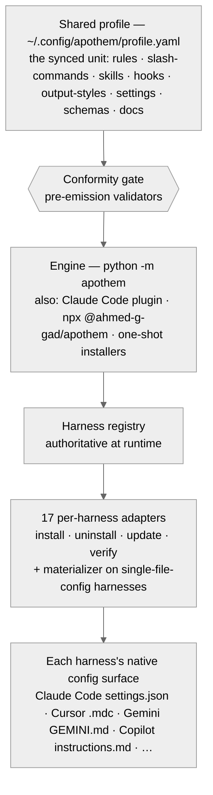

<!-- SPDX-License-Identifier: MIT -->

# Apothem — Claude Code Project Instructions

Project-scoped instructions for Claude Code when working in this repository.
Coherent with `AGENTS.md` and `.github/copilot-instructions.md`; where shared
disciplines overlap, `AGENTS.md` is the canonical project voice and this file
is the Claude Code mirror.

## AI Surface Canon

`AGENTS.md` is the canonical project instruction surface. This `CLAUDE.md`
file mirrors the same operating disciplines for Claude Code, and
`.github/copilot-instructions.md` mirrors them for GitHub Copilot. Shared
claims across these files must stay semantically equivalent: plans locality,
authorship headers, ambiguity handling, naming, release freshness, human-only
authorship, agent-guidance surface locality, session closure, public-surface
plain-language, operating loop, and synthesis posture.

The active maintainer identity is **Ahmed G. Gad**:
[@ahmed-g-gad](https://github.com/ahmed-g-gad), `me@ahmedgad.com`. Do not
derive identity from stale local account names, Git remotes, package-manager
caches, or previous usernames.

Shared claims that every active AI-assistant surface preserves:

- Plans live at `<project-root>/.apothem/plans/` — the sole canonical home. A
  legacy `<project-root>/.plans/` tree is no longer canonical; operators
  upgrade an existing one via `apothem migrate-workspace`. The directory is
  gitignored by the canonical `.gitignore` snippet; plans are never committed
  to git history. Plan state transitions are `draft -> in-progress ->
  converged` (promote to ADR) or `abandoned`.
- Every applicable new file begins with the canonical
  `SPDX-License-Identifier: MIT` header line, in the comment family matching
  the filetype. The byte-exact fixture is
  `src/apothem/schemas/authorship-header.txt`; use `scripts/inject-header.*`.
- Ambiguity is surfaced through structured inquiry or `TODO(clarify)` and is
  never silently invented.
- Release tags follow `vMAJOR.MINOR.PATCH` SemVer.
- Directive prose follows the RFC 2119 hierarchy: MUST, MUST NOT, SHOULD,
  SHOULD NOT, MAY.
- Any change to a documented public surface (a CLI command or flag, a harness
  adapter, a profile field, an installer flag or environment variable, a
  configuration key, or any surface with a page under
  `site/content/docs/`) MUST update that documentation page in the same
  change-set; source-generated reference pages are kept current by re-running
  `node site/scripts/update-reference-inventory.mjs` and committing the
  regenerated pages, and the CI docs-reference-sync drift gate enforces it.
- Agent-facing operating guidance lives in two surfaces: the root `AGENTS.md`
  is the single repo-internal agent-instruction canon, and each folder's
  per-folder operating contract lives in that folder's `README.md` (the README
  serves both the human and the agent reader). Materialized harness-output
  `AGENTS.md` files under `src/apothem/harnesses/*/templates/` are product
  surfaces Apothem generates for downstream tools — they are not repo-internal
  companions and are exempt from this canon.
- Every session — an ad-hoc exchange as much as a plan phase — ends with a
  formal, verifiable close: a Recommended Next Step, a done / deferred ledger,
  and a verification attestation of what was checked and how it came out (see
  `src/apothem/rules/session-closure.md`). A session that trails off mid-thread,
  claims done without a checked outcome, or buries deferred work silently is a
  structural failure.

## Operating Loop & Synthesis Posture

Two shared claims every active AI-assistant surface preserves:

- **Operating loop.** The planning pipeline (`/plan`) flows into the hardening
  pipeline (`/fortress`), which closes at the release gate — plan → harden →
  ship. The planning suite's executed work (the phases `/plan-execute` lands)
  is the surface `/fortress` hardens to a release-gated state.
- **Synthesis posture.** A non-trivial mission SHOULD be accomplished through
  genuinely-independent critique-synthesis multi-agent work that keeps the main
  conversation lean — raw agent output is released after a single-pass
  synthesis — grounded in current authoritative sources, with beyond-mission
  remediation disclosed per the disclosure-ledger discipline. The capability is
  specified at `src/apothem/rules/multi-agent-workflow.md` and reachable via
  `/workflow`; it is opt-in and default-off under the agnostic posture, so a
  clean install never auto-invokes it.

## Project Purpose

Apothem is a host-agnostic AI-harness configuration manager. It reads a
shared profile (`~/.config/apothem/profile.yaml`) and materializes
harness-native config files for the seventeen registered adapters — Antigravity,
Claude Code, CodeBuddy, Codex, Cursor, Gemini CLI, GitHub Copilot, Hermes, Kimi
Code, Kiro, Open-Claw, OpenCode, Qwen Code, Trae, Windsurf, Zed, and GLM (Z.ai).
One profile carries
the synced unit — rules, slash-commands, skills, hooks, output-styles,
settings, schemas, and docs — converted to each harness's native surface,
gated by the conformity validators and shipped through signed releases. The
engine is invoked as `python -m apothem`; the Claude Code plugin, the npm shim
(`npx @ahmed-g-gad/apothem`), and the one-shot installers run the same
module surface.

The shared profile flows through the engine to every harness's native
configuration surface, with the conformity gate validating the synced unit
before materialization:



## Source Layout

```text
src/apothem/
  cli/            — Click CLI (quickstart, install, update, uninstall, verify, status, diff, rollback, backups, migrate-workspace, harnesses, profile, doctor, completion)
  harnesses/      — one sub-package per harness adapter (__init__.py adapter class + install/uninstall/update/verify.py; adapters with rendered single-file config also carry materializer.py)
  conformity/     — pre-emission conformity validators
  lib/            — shared internal helpers reused across the subpackages (harness registry, profile model + projection, materializer building blocks, state stores, atomic IO, parallel sweep, reporting)
  agents/         — sub-agent definitions (.md, frontmatter + system-prompt body)
  commands/       — slash-command definitions (.md)
  skills/         — skills, one folder per skill with a SKILL.md entry point
  hooks/          — shared hook scripts and message contexts
  output-styles/  — output-style markdown definitions
  rules/          — behavioral instruction files (.md)
  statuslines/    — statusline definitions (operating-posture renderer)
  templates/      — plan-suite and ledger templates
  schemas/        — YAML/JSON schemas and fixture files
  audit/          — inventory and drift scanners (build → scan → classify → render)
  benchmarks/     — per-class performance benchmark drivers
  _vendor/        — vendored third-party dependencies (self-contained checkout)
scripts/          — operator / dev / release executables (dev/ holds the audit + validation tooling)
tests/
  unit/           — unit tests (pytest, no network, no filesystem side-effects)
  integration/    — integration tests (full adapter round-trip)
  conformity/     — conformity-gate fixture tests
```

## Development Commands

```bash
# Run the engine from the checkout. The entry point puts the vendored
# dependencies (src/apothem/_vendor) on sys.path; the host interpreter must
# provide click and rich; without them it prints the exact pip command.
PYTHONPATH=src python -m apothem --help

# Lint and auto-fix
python -m ruff check . --fix && python -m ruff format .

# Type-check (strict; scope = the [tool.mypy] files key in pyproject.toml: cli, harnesses, lib, conformity)
python -m mypy

# Tests
python -m pytest

# Docs (POSIX shell; on PowerShell use `Push-Location site; npm ci; npm run build; Pop-Location`)
cd site && npm ci && npm run build

# Conformity gate (all standalone validators). Advisory by default: findings
# are reported and the command exits 0. Add --strict (or set
# APOTHEM_CONFORMITY_STRICT=1) to exit non-zero on a blocking finding so a CI /
# pre-commit step fails; a CLI-usage error (unknown validator name) exits 3,
# distinct from the strict findings-block code 2.
python -m apothem.conformity.gate --all .
python -m apothem.conformity.gate --all --strict .

# Pre-commit (all hooks)
pre-commit run --all-files
```

## Plans Discipline

Planning artifacts are written to <project-root>/.apothem/plans/ — the sole canonical plans home. A legacy <project-root>/.plans/ tree is no longer canonical; operators upgrade an existing one via `apothem migrate-workspace`. They are never written to any harness configuration directory (for example `~/.codex/` or `~/.claude/`) and never to a global location. This rule is non-negotiable; cite §3 of the project spec on every related decision.

## Release Facade

Public release surfaces must remain fresh and current-version-only: one
visible release tag, one GitHub Release, and one Pages deployment, with no
public-facing narrative that references internal planning history or earlier
launch work. Apothem distributes through several install paths — tool-native
plugins and extensions (the Claude Code plugin via
`/plugin marketplace add ahmed-g-gad/apothem`, a Gemini CLI extension via
`gemini extensions install`, a Qwen Code extension via
`qwen extensions install`, a Codex plugin via `codex plugin marketplace add`,
and a VS Code-family extension packaged as `apothem.vsix`, which the release
workflow attaches to each new GitHub Release), the npm shim
(`npx @ahmed-g-gad/apothem` — also the install path for OpenCode and every
other adapter-only tool, which expose no harness-native plugin surface), and
the one-shot script installers (`install.sh`
/ `install.ps1`) — and each tagged release attaches its signed artifacts
(sdist + wheel + SBOM + cosign signature + SLSA provenance) to the single
GitHub Release page as verification evidence. Publish the GitHub Release only
after local gates and the CI, Clean Install Gate, Harness Matrix, and
Conformity workflows are green.

Public repositories must not expose plan-internal launch identifiers, stale
release stories, stale usernames, stale package coordinates, or historical
cleanup narratives. When a platform preserves immutable history (package
filenames, pull-request records, audit trails), document the platform limit
plainly rather than inventing a fresh-state claim.

## File Headers

Every applicable new file **MUST** begin with the canonical
`SPDX-License-Identifier: MIT` header line, written in the comment family
matching the filetype. There is one line per file — the bordered branded
banner box (copyright / website / email / GitHub / license-pointer lines) is
retired; the root `LICENSE` carries the full copyright instrument. The
byte-exact fixture is at `src/apothem/schemas/authorship-header.txt`. Per
comment family:

- hash files (`.py`, `.sh`, `.yaml`, `.toml`, …): `# SPDX-License-Identifier: MIT`
- double-slash (`.js`, `.ts`, `.mjs`): `// SPDX-License-Identifier: MIT`
- markdown / HTML: `<!-- SPDX-License-Identifier: MIT -->`
- C-block (`.css`, `.c`): `/* SPDX-License-Identifier: MIT */`
- semicolon (`.ini`): `; SPDX-License-Identifier: MIT`
- double-dash (`.sql`): `-- SPDX-License-Identifier: MIT`

Use the injector:

```bash
python scripts/inject-header.py --mode fix-in-place <path>
```

The SPDX line is exempt for: `LICENSE`, JSON config files, lockfiles,
generated assets, vendored trees, `.audit/` ephemera, `.apothem/` and
`.plans/` ephemera,
`.keep` markers, binaries. Full list: `src/apothem/schemas/header-exceptions.txt`.

## Ambiguity Handling

Never fabricate identity, scope, preference, security posture, naming,
infrastructure, or version-pin data. When Claude Code exposes a structured
inquiry channel, use it. When it does not, leave a clearly marked
`TODO(clarify): ...` comment or surface-equivalent question that records the
missing decision without guessing.

## Generated State

Preserve substantive source files such as `.well-known/security.txt` because
they serve public standards. Treat `.coverage`, `.audit/`, `.hypothesis/`,
`.mypy_cache/`, `.pytest_cache/`, `.ruff_cache/`, `dist/`, and `site/dist/` as
generated local state unless a task explicitly asks to inspect them. Never
commit those generated folders.

## Harness Installation Discipline

Adapters install Apothem cohorts through each harness's documented native
surface. A cohort may be converted when the native format differs, such as
Codex TOML agents or Gemini TOML commands. When a harness has no matching
native primitive for rules, hooks, templates, skills, or agents, the files land
under an Apothem-owned support subtree and are referenced from the native
instruction anchor; they are not forced into vendor-reserved directories.

## Forbidden Patterns

- Marketing adjectives such as `powerful`, `seamless`, and `robust` are
  forbidden in user-facing copy unless supported by adjacent evidence.
- Hedging filler such as `basically`, `kind of`, and `in some sense` is
  forbidden in directive text.
- Git authorship surfaces name human contributors only; do not add AI tools,
  assistants, models, IDE extensions, or runtimes as co-authors.

## Coding Conventions

- Python 3.10+; `list[T]` / `dict[K, V]` / `X | None` union syntax.
- `typing.Protocol` for structural adapter typing; `typing.cast()` to narrow `Any`.
- `pathlib.Path` over `os.path`; `dataclasses` for value containers.
- `ruff check` and `mypy --strict` (scoped) must pass before every commit.
- Conventional Commits: `type(scope): subject` under 72 chars, imperative mood.
- Kebab-case for files and folders; see [Apothem naming conventions](https://apothem.ahmedgad.com/docs/reference/naming-conventions/).

## Harness Adapter Pattern

Each adapter sub-package under `src/apothem/harnesses/<name>/` exposes:

- `__init__.py` — `class <Name>Adapter` implementing the `HarnessAdapter`
  protocol with `name`, `output_path`, `install`, `update`, `uninstall`,
  `is_installed`, `verify`. The class delegates to the sibling action modules
  below.
- `install.py` / `uninstall.py` / `update.py` / `verify.py` — the per-action
  implementations the adapter class imports and delegates to.
- `materializer.py` — optional `materialize_native_config(profile) -> str`
  for adapters that render a native configuration file from the shared
  profile. Template-propagation adapters instead consume
  `src/apothem/lib/propagation-manifest.yaml` and may convert cohorts into the
  harness-native format declared there.

Adapters are cataloged in the harness registry
(`src/apothem/lib/harness_registry.py`), which is **authoritative at runtime**:
the engine resolves every adapter from the static registry, so it loads from a
plain checkout. Filesystem-convention discovery (`discover_adapters` under
`src/apothem/harnesses/`) is a **conformance parity check**, not the runtime
resolver — a test asserts the discovered adapter set equals the static registry,
so a convention-correct but unregistered adapter is caught as a coverage
regression rather than silently resolved.
