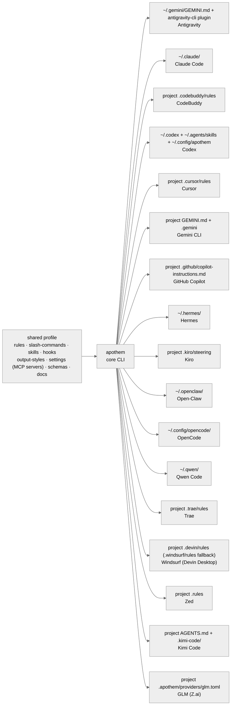
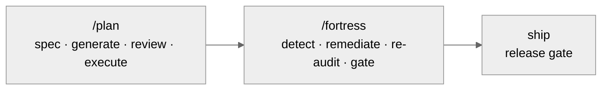

<!-- SPDX-License-Identifier: MIT -->

<p align="center">
  <a href="https://github.com/ahmed-g-gad/apothem/blob/main/assets/DESIGN-SYSTEM.md">
    <picture>
      <source media="(prefers-color-scheme: dark)" srcset="https://raw.githubusercontent.com/ahmed-g-gad/apothem/main/assets/logo-dark.svg">
      
    </picture>
  </a>
</p>

<h1 align="center">Apothem</h1>

<p align="center">
  <em>Author one shared profile · materialize it into seventeen tools' native configs.</em>
</p>

<p align="center">
  <a href="https://github.com/ahmed-g-gad/apothem/releases"></a>
  <a href="https://github.com/ahmed-g-gad/apothem/actions/workflows/ci.yml"></a>
  <a href="https://github.com/ahmed-g-gad/apothem/blob/main/LICENSE"></a>
  <a href="https://www.npmjs.com/package/@ahmed-g-gad/apothem"></a>
  <a href="https://github.com/ahmed-g-gad/apothem/blob/main/pyproject.toml"></a>
  <a href="https://securityscorecards.dev/viewer/?uri=github.com/ahmed-g-gad/apothem"></a>
  <a href="https://github.com/ahmed-g-gad/apothem/issues"></a>
  <a href="https://apothem.ahmedgad.com/"></a>
  <a href="https://www.npmjs.com/package/@ahmed-g-gad/apothem"></a>
</p>

<p align="center">
  <a href="https://github.com/ahmed-g-gad/apothem#why-apothem">Why Apothem</a>
  &nbsp;·&nbsp;
  <a href="https://github.com/ahmed-g-gad/apothem#install">Install</a>
  &nbsp;·&nbsp;
  <a href="https://github.com/ahmed-g-gad/apothem#quick-start">Quick Start</a>
  &nbsp;·&nbsp;
  <a href="https://github.com/ahmed-g-gad/apothem#how-it-works">How it works</a>
  &nbsp;·&nbsp;
  <a href="https://github.com/ahmed-g-gad/apothem#supported-harnesses">Supported harnesses</a>
  &nbsp;·&nbsp;
  <a href="https://apothem.ahmedgad.com/">Documentation</a>
  &nbsp;·&nbsp;
  <a href="https://github.com/ahmed-g-gad/apothem/blob/main/CHANGELOG.md">Changelog</a>
  &nbsp;·&nbsp;
  <a href="https://github.com/ahmed-g-gad/apothem/blob/main/CONTRIBUTING.md">Contributing</a>
  &nbsp;·&nbsp;
  <a href="https://apothem.ahmedgad.com/docs/community/">Community</a>
</p>

---

<p align="center">
  <a href="https://apothem.ahmedgad.com/docs/architecture/">
    
  </a>
</p>

**Apothem** authors one shared profile — rules, slash-commands, skills, hooks, output-styles, settings (including MCP servers), schemas, and docs — and materializes that *whole synced unit* into all seventeen supported harnesses' native configuration directories through per-harness adapters. Edit the profile once; every tool picks up the change from a single command. One source of truth, seventeen destinations, zero hand-maintained drift — with a mechanized conformity gate keeping every materialized surface in line.

<details>
<summary><b>Table of contents</b></summary>

- [Why Apothem](#why-apothem)
- [Features](#features)
- [How Apothem compares](#how-apothem-compares)
- [Quick Start](#quick-start)
- [Install](#install)
- [How it works](#how-it-works)
- [Supported harnesses](#supported-harnesses)
- [Updating](#updating)
- [Uninstalling](#uninstalling)
- [Website](#website)
- [Release posture](#release-posture)
- [Contributing](#contributing)
- [Community](#community)
- [License & Authors](#license--authors)

</details>

## Why Apothem

Supported harnesses proliferate; each one parks its configuration in a different directory, reads a different schema, and accepts a different vocabulary for the same primitives. Operators who use more than one tool today maintain parallel copies of nearly-identical configuration by hand, with all the divergence, dead-link, and "fix-in-one-place-missed-in-ten" pathologies that implies.

Apothem cuts the drift at the root, and goes wider than file-copying or rules-only sync:

- **One profile, seventeen destinations.** Author your rules, slash-commands, skills, hooks, output-styles, settings (MCP servers included), schemas, and docs once. Push the whole unit to every harness with one command.
- **A wide synced unit, not rules alone.** Every primitive travels as a first-class citizen — translated into each harness's native schema, never flattened to a lowest common denominator.
- **A mechanized governance gate.** `python -m apothem.conformity.gate` runs multi-bar pre-emission checks — authorship headers, naming, code-craft, hedging, binding reciprocity — so every materialized surface stays conformant.
- **Deterministic pipelines.** A review pipeline (`/plan-spec → /plan-generate → /plan-review → /plan-design → /plan-execute`, where `/plan-design` runs only for architecture-bearing suites), a thirteen-stage `/research` pipeline, and an eleven-command audit fortress apply to every change to the profile itself.
- **Reversible, verified lifecycle.** Every install is undone by the matching uninstall — timestamped backups, zero orphans; `apothem verify --harness <name>` answers "is the profile faithfully installed here?" with a structured JSON drift report.
- **Durable memory + opt-in learning.** A persistent memory tier and an opt-in continuous-learning loop carry confirmed conventions forward across sessions.
- **Work that survives session, account, and machine boundaries.** Long-running work externalizes its full state to a project-local `.apothem/plans/` suite — a resumption contract plus a cold-start protocol. Because the state lives in your project's files, not locked inside one cloud chat history, a fresh session on any account or machine pointed at the project picks the work back up in place. See [Resumable planning](https://apothem.ahmedgad.com/docs/concepts/resumable-planning/).

## Features

| | Capability | What it gives you |
|---|---|---|
| 🎯 | **One profile → seventeen native configs** | Author once; install everywhere. Each harness receives the profile translated into its own native schema — no lowest-common-denominator flattening. |
| 🧩 | **A wide synced unit** | Rules · slash-commands · skills · hooks · output-styles · settings (with MCP servers) · schemas · docs travel together as first-class primitives — not rules alone. |
| 🛡️ | **Mechanized governance gate** | `python -m apothem.conformity.gate` runs multi-bar pre-emission checks — authorship headers, naming, code-craft, hedging, binding reciprocity — across every materialized surface; a behavior-diff golden corpus regression-locks each adapter's output, so any unintended change to what a harness receives is caught. |
| 🧭 | **Deterministic pipelines** | A staged `/plan` review pipeline and a thirteen-stage `/research` pipeline apply the same discipline to every change to the profile itself. |
| 🏰 | **Eleven-command audit fortress** | Security · code · accessibility · performance · dependency · supply-chain · threat-model · architecture · code-review · docs-review · UX audits on demand. |
| 🧠 | **Durable memory + opt-in learning** | A persistent memory tier and an opt-in continuous-learning loop carry confirmed conventions forward across sessions. |
| 👁️ | **Preview before write** | `apothem diff --harness <name>` shows every pending change to a harness's native config before anything lands — inspect the full diff, then install. |
| 🔍 | **Verifiable state** | `apothem verify --harness <name>` reports drift between source profile and harness destination — structured JSON with `--format json` for CI. |
| ↩️ | **Reversible lifecycle** | Every install is matched by a clean uninstall — timestamped backups at `~/.apothem/backups/`, zero orphans, confirmation-gated removal (`--yes` for batch). |
| 🗂️ | **Multi-scope adapters** | User-scope and project-scope targets; `--project .` directs project-scope harnesses such as Cursor, Gemini CLI, GitHub Copilot, and Windsurf. |
| 🔐 | **Supply-chain hardened releases** | SLSA-3 build provenance · Sigstore signatures · CycloneDX SBOM · npm provenance · OpenSSF Scorecard tracked. |
| 📦 | **Self-contained runtime** | Runs from a checkout on system Python 3.10+ with vendored dependencies — only `click` and `rich` need to be importable. |

## How Apothem compares

Other tools solve adjacent slices of this problem. File-based config managers like **chezmoi** and **GNU Stow** place or template files but never translate one source into each harness's *native* configuration schema. Cross-tool rule-sync CLIs like **rulesync** do generate per-tool native files across many tools — a broader tool count than Apothem's seventeen, and a comparably wide synced unit. Apothem's distinction is the **governance and lifecycle discipline shipped around the sync** — a mechanized conformity gate, deterministic pipelines, an audit fortress, and a reversible verified lifecycle:

| Capability | Apothem | File config managers<br>(chezmoi, Stow) | Cross-tool rule sync<br>(rulesync) | Per-tool native config |
|---|:---:|:---:|:---:|:---:|
| One source → many tools' native schemas | ✅ seventeen harness adapters | ❌ copy / symlink, no translation | ✅ | ❌ single tool |
| Synced unit | rules · slash-commands · skills · hooks · output-styles · settings (MCP) · schemas · docs | arbitrary files | rules · ignore · MCP · commands · subagents · skills · hooks · permissions | — |
| Mechanized governance gate | ✅ `python -m apothem.conformity.gate` | ❌ | ❌ | ❌ |
| Deterministic `/plan` + thirteen-stage `/research` pipelines | ✅ | ❌ | ❌ | ❌ |
| Eleven-command audit fortress | ✅ security · perf · a11y · supply-chain · … | ❌ | ❌ | ❌ |
| Durable memory + opt-in learning loop | ✅ | ❌ | ❌ | ❌ |
| Reversible, verified lifecycle | ✅ backup + `apothem verify` + zero-orphan uninstall | varies | varies | — |

Where a peer is stronger, it is named: **rulesync** reaches more tools and carries a comparably wide synced unit, and several sync tools materialize native schemas. Apothem trades raw tool count for the governance, audit, and lifecycle discipline shipped around the sync — a conformity gate, deterministic `/plan` and `/research` pipelines, an eleven-command audit fortress, durable memory, and a reversible verified lifecycle — that a rule-sync tool does not carry.

## Quick Start

### Fastest start

**Prerequisite:** [Node.js](https://nodejs.org/) and system Python 3.10 or newer
on your `PATH`. Then two commands take you from nothing to a verified install:

```shell
# 1 — create a profile (if needed), preview, confirm, and install — one guided step
npx @ahmed-g-gad/apothem quickstart --yes

# 2 — confirm the configuration landed correctly
npx @ahmed-g-gad/apothem verify --harness claude-code
```

That is the whole path: `quickstart` scaffolds a shared profile when none
exists, previews every file it will write, installs, and names the next
commands; `verify` reports whether the profile is faithfully installed. What
follows is the longer tour — the same one command explained in full, then the
explicit step-by-step alternative.

### Other ways to install

Apothem installs several ways — full detail (including the VS Code, Gemini CLI,
and Codex extensions) under [Install](#install):

```text
# 1 — Claude Code plugin (inside Claude Code)
/plugin marketplace add ahmed-g-gad/apothem
/plugin install apothem@apothem

# 2 — npx (any machine with Node and Python 3.10+)
npx @ahmed-g-gad/apothem install --harness claude-code

# 3 — one-shot installer (resolves and verifies the latest signed release tag)
curl -fsSL https://apothem.ahmedgad.com/install.sh | sh    # POSIX
irm https://apothem.ahmedgad.com/install.ps1 | iex         # Windows

# 3b — prefer to inspect the bootstrap script first? download, review, run —
#      the fetched source is signature-verified either way
curl -fsSL -o install.sh https://apothem.ahmedgad.com/install.sh && sh install.sh
irm https://apothem.ahmedgad.com/install.ps1 -OutFile install.ps1; pwsh -NoProfile -File install.ps1
```

The `quickstart` command walks the whole canonical path in one guided step:

```shell
npx @ahmed-g-gad/apothem quickstart
```

It ensures a profile (scaffolding one with a personalize nudge if it is
missing), previews the writes grouped by project root versus your home
directory, asks before writing outside the project, installs with the grouped
capability-note output, and ends by naming the next commands. `--yes` runs it
non-interactively; `--format json` emits one structured summary.

Prefer the explicit steps? Run them directly. The `--project` flag is required
when `all` includes project-scope adapters such as Cursor, Gemini CLI, GitHub
Copilot, and Windsurf.

```shell
npx @ahmed-g-gad/apothem profile init
npx @ahmed-g-gad/apothem install --harness all --project .
npx @ahmed-g-gad/apothem verify --harness all --project .
```

`profile init` writes a scaffold with placeholder identity fields and prints a
personalize nudge — replace `Example User` and the placeholder email and GitHub
handle (edit the profile, or run `apothem profile set identity.name "Your
Name"`) before you install. If a still-placeholder identity reaches `install` or
`update`, the command prints one advisory note and proceeds: Apothem never
fabricates an identity, and never blocks on a placeholder one. `install
--harness all` also previews the files it will write — grouped by project root
versus your home directory — and asks before writing outside the project.

Lifecycle commands exit 0 on success, print a structured JSON summary with
`--format json`, and support `--dry-run` where a write would otherwise occur.
Narrower scopes (`--harness claude-code`, `--harness cursor`, etc.) target a
single harness when you need it; project-scope harnesses still require
`--project PATH`.

## Install

Every install path runs the same self-contained engine: the source tree
carries its vendored dependencies and runs from a checkout on system Python
3.10 or newer (see
[the self-contained runtime](https://apothem.ahmedgad.com/docs/architecture/self-contained-runtime/)).
Two prerequisites are shared by every path — **system Python 3.10 or newer** on
`PATH`, with the `click` and `rich` packages importable under it; the npm-shim
and tool-plugin paths additionally need **Node.js 18 or newer** to run `npx`.

Eight install channels are available. Pick by how you already work; each
channel's own subsection below gives its prerequisites, one copy-ready command,
and a verification step.

| # | Channel | Delivers | Prerequisites |
|---|---|---|---|
| 1 | [Claude Code plugin](#1--claude-code-plugin) | Full harness in Claude Code | Claude Code · Python 3.10+ |
| 2 | [npm shim (`npx`)](#2--npm-shim-npx) | Full harness, any tool | Node 18+ · Python 3.10+ |
| 3 | [One-shot installers](#3--one-shot-installers) | Full harness + an `apothem` command | Python 3.10+ (`git` for a network install) |
| 4 | [VS Code family extension](#4--vs-code-family-extension) | Full harness from the editor | VS Code · Node 18+ · Python 3.10+ |
| 5 | [Gemini CLI extension](#5--gemini-cli-extension) | Bootstrap that runs the engine | Gemini CLI · Node 18+ · Python 3.10+ |
| 6 | [Qwen Code extension](#6--qwen-code-extension) | Bootstrap that runs the engine | Qwen Code · Node 18+ · Python 3.10+ |
| 7 | [Codex plugin](#7--codex-plugin) | Bootstrap that runs the engine | Codex · Node 18+ · Python 3.10+ |
| 8 | [Direct engine (`python -m apothem`)](#8--direct-engine-python--m-apothem) | Full harness from a checkout | Python 3.10+ (`click`, `rich`) |

The npm shim (2), the one-shot installers (3), and the direct engine (8)
deliver the whole synced unit for any harness. The Gemini CLI, Qwen Code, and
Codex extensions (5–7) install a small bootstrap that shells out to the engine
(`npx @ahmed-g-gad/apothem install`) to materialize the full harness — they are
the entry point, not the full delivery on their own.

Every path is idempotent: re-running is safe and converges to the same state.

### 1 — Claude Code plugin

**Prerequisites:** Claude Code, and system Python 3.10+ on `PATH`.

Inside Claude Code:

```text
/plugin marketplace add ahmed-g-gad/apothem
/plugin install apothem@apothem
```

**Verify:** run `/help` inside Claude Code and confirm the Apothem commands are
listed, or check the drift report with:

```shell
npx @ahmed-g-gad/apothem verify --harness claude-code
```

### 2 — npm shim (`npx`)

**Prerequisites:** Node.js 18+ (for `npx`) and system Python 3.10+ on `PATH`.
The shim locates the interpreter and forwards every CLI command to the bundled
engine.

```shell
npx @ahmed-g-gad/apothem install --harness claude-code
```

It also runs straight from the repository:

```shell
npx github:ahmed-g-gad/apothem install --harness claude-code
```

**Verify:**

```shell
npx @ahmed-g-gad/apothem --version
npx @ahmed-g-gad/apothem verify --harness claude-code
```

### 3 — One-shot installers

**Prerequisites:** system Python 3.10+ on `PATH` (the installer offers to add
the `click` / `rich` prerequisites for you); `git` is needed only for a network
install that clones the source.

The one-shot installer resolves the latest signed release tag, verifies its
signature, fetches the Apothem source tree at that tag, runs the engine
directly from it, and materializes your harness configuration. The
tag-pinned verified install is the default and recommended path.

| One-shot installer | Command (latest signed tag, verified) |
|---|---|
| **POSIX** (macOS / Linux / WSL) | `curl -fsSL https://apothem.ahmedgad.com/install.sh \| sh` |
| **Windows** (PowerShell) | `irm https://apothem.ahmedgad.com/install.ps1 \| iex` |

The same scripts ship in a checkout under
[`scripts/installer/`](scripts/installer/) — `install`, `uninstall`, and
`update` in `.sh`, `.ps1`, and `.bat` forms — so you can run them directly
after cloning:

```shell
APOTHEM_HARNESS=claude-code sh scripts/installer/install.sh                                 # POSIX
$env:APOTHEM_HARNESS = 'claude-code'; pwsh -NoProfile -File scripts/installer/install.ps1   # Windows
```

**Trust model (tag-pinned, verified by default).** With no `APOTHEM_REF` set,
the installer resolves the highest `vMAJOR.MINOR.PATCH` release tag and checks
*that* out — never the moving `main` branch. Before any configuration is
materialized, the fetched tag's signature is verified with `git verify-tag`;
an unsigned, tampered, or unverifiable tag aborts the install before anything
is written. To pin a specific release explicitly:

```bash title="Pinned, verified install (POSIX)"
APOTHEM_REF=vMAJOR.MINOR.PATCH sh -c "$(curl -fsSL https://apothem.ahmedgad.com/install.sh)"
```

```powershell title="Pinned, verified install (Windows)"
$env:APOTHEM_REF = 'vMAJOR.MINOR.PATCH'; irm https://apothem.ahmedgad.com/install.ps1 | iex
```

Replace `vMAJOR.MINOR.PATCH` with the release tag you want from the
[releases page](https://github.com/ahmed-g-gad/apothem/releases).

Two explicit overrides relax the default: `APOTHEM_REF=main` checks out the
moving branch (unverified), and `APOTHEM_ALLOW_UNVERIFIED=1` downgrades a
verification failure from a fatal abort to a warning and proceeds — intended
for air-gapped, local, or pre-signed-release use. The `APOTHEM_SOURCE`
local-checkout path fetches nothing, so it skips tag resolution and
verification and runs the checkout you point it at.

**Requirements.** A system Python 3.10 or newer must be on PATH, and the
`click` and `rich` packages must be importable under that interpreter; the
installer checks for each, names anything missing, and offers to install the
missing prerequisites for you — with your confirmation, or automatically under
`--yes` (`-Yes` on PowerShell) or `APOTHEM_AUTO_INSTALL_DEPS=1`. Every other
runtime dependency is vendored into the source tree. Apart from that opt-in
prerequisite install, the installer never modifies your Python environment.

**What it does.** Prerequisite-check (Python ≥ 3.10, `click`, `rich`) →
locate the source (a surrounding checkout, or — for a network install —
resolve the latest signed tag and clone the repository at it) → verify the
tag signature (fail-closed) → run `python -m apothem install --harness
<name>` from that source → verify → place an `apothem` command on PATH → print
the next-step banner. Re-running is idempotent: an existing clone is
re-checked-out to the resolved tag and the harness is re-materialized.

**The `apothem` command.** After a successful install, the installer writes an
`apothem` shim that forwards to the bundled engine (with its vendored
dependencies) — POSIX into `$HOME/.local/bin`, Windows into
`%LOCALAPPDATA%\Microsoft\WindowsApps` (a user directory already on the default
Windows PATH). The installer never edits your PATH. Once the directory is on
PATH you run `apothem <command>` directly, with no manual `PYTHONPATH`. If the
directory is not on PATH (or the shim was not placed), the banner prints how
to add it and falls back to the self-contained `PYTHONPATH=… python -m apothem`
form — it never advertises a bare `apothem` command the run did not resolve.

**Configuration (environment variables).** Both installers read the same names:

| Variable | Default | Purpose |
|---|---|---|
| `APOTHEM_HOME` | `$HOME/.apothem` | Install destination for the cloned source |
| `APOTHEM_REPO` | `https://github.com/ahmed-g-gad/apothem` | Git remote to clone |
| `APOTHEM_REF` | _(latest signed tag)_ | Git ref to check out; unset resolves the latest release tag, or set a tag to pin / `main` for the moving branch |
| `APOTHEM_ALLOW_UNVERIFIED` | _(unset)_ | Set to `1` to downgrade a tag-verification failure to a warning and proceed |
| `APOTHEM_SOURCE` | _(unset)_ | Explicit local source tree to use instead of cloning (skips tag resolution and verification) |
| `APOTHEM_HARNESS` | `claude-code` | Harness to materialize |
| `APOTHEM_PROFILE` | `$HOME/.config/apothem/profile.yaml` | Shared profile path |
| `APOTHEM_BIN_DIR` | POSIX `$HOME/.local/bin`, Windows `%LOCALAPPDATA%\Microsoft\WindowsApps` | Directory the `apothem` shim is written into |
| `APOTHEM_SKIP_VERIFY` | _(unset)_ | Set to `1` to skip post-install verification |
| `APOTHEM_AUTO_INSTALL_DEPS` | _(unset)_ | Set to `1` to install the missing `click` / `rich` prerequisites automatically, without prompting |

**Updating.** Re-run the installer, or run `scripts/installer/update.sh` /
`scripts/installer/update.ps1` to re-check-out the latest signed tag (verified)
and re-materialize.

**Uninstalling.** `scripts/installer/uninstall.sh` /
`scripts/installer/uninstall.ps1` removes the materialized harness
configuration (it prompts unless `--yes` / `-Yes`); pass `--remove-source` /
`-RemoveSource` to also remove the managed clone at `APOTHEM_HOME`.

**Verify:**

```shell
apothem verify --harness claude-code

# or, before the shim is on PATH, from the bundled source:
PYTHONPATH="$HOME/.apothem/src" python -m apothem verify --harness claude-code
```

### 4 — VS Code family extension

**Prerequisites:** VS Code, Node.js 18+, and system Python 3.10+ on `PATH`.

The **Apothem** extension ships as the signed `apothem.vsix` artifact attached
to each GitHub Release — install it with `code --install-extension apothem.vsix`
or through the editor's *Install from VSIX…* command. One extension covers VS
Code and GitHub Copilot. A
[Visual Studio Marketplace](https://marketplace.visualstudio.com/) listing is
not yet published: the `apothem` name is held by another publisher, so the
identifier is still unresolved. Its commands (`Apothem:
Install`, `Verify`, `Update`, `Uninstall`, `Doctor`) run the same engine
through the configured runner (`npx @ahmed-g-gad/apothem` by default). Source
lives under [`vscode-extension/`](vscode-extension/).

**Verify:** run the **Apothem: Verify** command from the editor's command
palette, or from a terminal:

```shell
npx @ahmed-g-gad/apothem verify --harness claude-code
```

### 5 — Gemini CLI extension

**Prerequisites:** Gemini CLI, Node.js 18+, and system Python 3.10+ on `PATH`.

Install Apothem as a Gemini CLI extension straight from the repository:

```shell
gemini extensions install https://github.com/ahmed-g-gad/apothem
```

This extension is a bootstrap, not the full install on its own: it loads an
Apothem context file and adds a `/apothem` command that shells out to the
engine (`npx @ahmed-g-gad/apothem`). Materialize the full harness by running
the install through it:

```shell
npx @ahmed-g-gad/apothem install --harness gemini-cli --project .
```

**Verify:**

```shell
npx @ahmed-g-gad/apothem verify --harness gemini-cli --project .
```

### 6 — Qwen Code extension

**Prerequisites:** Qwen Code, Node.js 18+, and system Python 3.10+ on `PATH`.

Install Apothem as a Qwen Code extension straight from the repository:

```shell
qwen extensions install ahmed-g-gad/apothem
```

The repository is also a Claude Code plugin marketplace, so Qwen Code asks
which plugin to install; choose `apothem`. To install without the prompt, for
example in a script, name the plugin and accept the install notice up front:
`qwen extensions install ahmed-g-gad/apothem:apothem --consent`.

Like the Gemini CLI extension, this is a bootstrap: it loads an Apothem context
file (`QWEN.md`) and shells out to the engine; materialize the full harness by
running the install through it. Qwen Code also installs Gemini CLI extensions
and Claude Code marketplace plugins directly, so those entries work as well.

```shell
npx @ahmed-g-gad/apothem install --harness qwen-code
```

**Verify:**

```shell
npx @ahmed-g-gad/apothem verify --harness qwen-code
```

### 7 — Codex plugin

**Prerequisites:** Codex, Node.js 18+, and system Python 3.10+ on `PATH`.

Add the repository as a Codex plugin marketplace, then install the plugin:

```shell
codex plugin marketplace add ahmed-g-gad/apothem
codex plugin add apothem@apothem
```

Like the Gemini CLI and Qwen Code extensions, this is a bootstrap that shells
out to the engine; materialize the full harness by running the install through
it:

```shell
npx @ahmed-g-gad/apothem install --harness codex
```

**Verify:**

```shell
npx @ahmed-g-gad/apothem verify --harness codex
```

### 8 — Direct engine (`python -m apothem`)

**Prerequisites:** system Python 3.10+ with the `click` and `rich` packages
importable; a checkout of the repository. No Node.js required.

Run the self-contained engine straight from a clone — the source tree carries
its vendored dependencies, so `PYTHONPATH=src` is the whole setup:

```shell
git clone https://github.com/ahmed-g-gad/apothem
cd apothem
PYTHONPATH=src python -m apothem install --harness claude-code
```

**Verify:**

```shell
PYTHONPATH=src python -m apothem verify --harness claude-code
```

### Every other tool (OpenCode and adapter-only harnesses)

Some tools — OpenCode among them — expose no separate plugin or extension
registry for a configuration manager; their native surface is their own config
directory. Apothem syncs those directly through the npm shim (channel 2), the
one-shot installers (channel 3), or the direct engine (channel 8):

```shell
npx @ahmed-g-gad/apothem install --harness opencode
```

Swap `--harness opencode` for any supported tool — add `--project PATH` for
project-scope tools such as Cursor and Windsurf — or `--harness all` to sync
every one at once.

Detailed install walkthroughs live on the project website at [apothem.ahmedgad.com/docs/install/](https://apothem.ahmedgad.com/docs/install/).

## How it works

Apothem decouples *what* you want every supported tool to do (your shared profile) from *where* each tool reads its configuration (seventeen different filesystem destinations with seventeen different schemas).



Each harness has its own per-harness adapter that:

- **Maps** profile elements (rules, skills, helpers, hooks) onto harness-native primitives where they exist and Apothem-owned support paths where they do not.
- **Translates** between the shared schema and the harness's expected filesystem layout.
- **Reverses cleanly** on uninstall — no orphaned files, no manual cleanup.
- **Verifies** at install time, update time, and on demand.

Read the [architecture overview](https://apothem.ahmedgad.com/docs/architecture/) for the deep walkthrough.

### The operating loop: plan → harden → ship

Beyond syncing config, Apothem ships a disciplined loop for the changes you make *to* the profile itself. The planning pipeline (`/plan`) carries a change from a spec through generation, review, and execution; the hardening pipeline (`/fortress`) takes that executed work and drives it to a release-gated state; and the release gate closes the loop.



For a non-trivial mission, an opt-in `/workflow` capability dispatches genuinely-independent critique-synthesis workers that keep the main conversation lean — each finding is verified before it survives, and beyond-mission fixes are disclosed. It is **default-off**: a clean install never auto-invokes it; you turn it on when you want it.

> **Asset palette.** Apothem's mark is a regular flat-top hexagon — the polygon whose apothem the project is named for — anchored by a slate center node and an emerald terminus node. The full design rationale, including the per-harness brand-color palette and accessibility posture, is published at [Brand](https://apothem.ahmedgad.com/docs/brand/).

## Supported harnesses

The seventeen adapters, their install scope (**User** = your home configuration directory; **Project** = the current project directory), and their materialization roots:

| Harness | Scope | Materialization root |
|---|---|---|
| Antigravity | User | `~/.gemini/GEMINI.md` + `~/.gemini/antigravity-cli/plugins/apothem/` |
| Claude Code | User | `~/.claude/` + `~/.claude/.apothem/support/{templates,hooks}/` |
| CodeBuddy | Project | `<project>/.codebuddy/rules/apothem-rules.md` |
| Codex | User | `~/.codex/` + `~/.agents/skills/` + `~/.config/apothem/{rules,templates}/` |
| Cursor | Project | `<project>/.cursor/rules/` |
| Gemini CLI | Project | `<project>/GEMINI.md` + `<project>/.gemini/` |
| GitHub Copilot | Project | `<project>/.github/copilot-instructions.md` |
| Hermes | User | `~/.hermes/` |
| Kimi Code | Project | `<project>/AGENTS.md` + `<project>/.kimi-code/.apothem/support/` |
| Kiro | Project | `<project>/.kiro/steering/apothem-rules.md` |
| Open-Claw | User | `~/.openclaw/` |
| OpenCode | User | `~/.config/opencode/` |
| Qwen Code | User | `~/.qwen/` |
| Trae | Project | `<project>/.trae/rules/apothem-rules.md` |
| Windsurf | Project | `<project>/.devin/rules/apothem-rules.md` (Devin Desktop; `.windsurf/rules/` fallback) |
| Zed | Project | `<project>/.rules` |
| GLM (Z.ai) | Project | `<project>/.apothem/providers/glm.toml` |

Adapters live at [`src/apothem/harnesses/`](https://github.com/ahmed-g-gad/apothem/tree/main/src/apothem/harnesses). Authoring a new adapter? See the [new-harness-adapter authoring runbook](https://apothem.ahmedgad.com/docs/runbooks/new-harness-adapter-authoring/).

## Updating

```shell
# Fast-forward the bundled source and re-materialize:
sh scripts/installer/update.sh                  # POSIX
pwsh -NoProfile -File scripts/installer/update.ps1   # Windows

# Or re-materialize a specific harness from the current source:
npx @ahmed-g-gad/apothem update --harness all --project . --dry-run
npx @ahmed-g-gad/apothem update --harness all --project .
PYTHONPATH="$HOME/.apothem/src" python -m apothem update --harness cursor --project .
```

The update script fast-forwards the source tree at `APOTHEM_HOME` and re-runs
materialization. `apothem update` re-materializes harness configuration from
the current shared profile; it is not a CLI self-updater, and the current
command surface does not include `update --self`, `update --check`, or
`update --apply`.

| Platform | Scheduler integration |
|---|---|
| **macOS / Linux** | `cron`, `systemd-timer`, `launchd` — update scheduling guidance at [Updating](https://apothem.ahmedgad.com/docs/install/updating/) |
| **Windows** | Task Scheduler — update scheduling guidance at [Updating](https://apothem.ahmedgad.com/docs/install/updating/) |

Updates never silently discard operator edits: matching managed targets are
backed up before replacement, shared directories are merged child-by-child, and
unchanged generated content is left untouched.

## Uninstalling

```shell
sh scripts/installer/uninstall.sh --harness all                 # POSIX
pwsh -NoProfile -File scripts/installer/uninstall.ps1 -Harness all   # Windows
```

The uninstall script removes the materialized harness configuration and prompts
before removal unless `--yes` / `-Yes` is supplied. Install and update backups
land at `~/.apothem/backups/YYYYMMDDTHHMMSSZ/`.

To remove the bundled source tree as well, pass `--remove-source` (POSIX) or
`-RemoveSource` (Windows); the managed clone at `APOTHEM_HOME` is removed after
a confirmation prompt. An explicit `APOTHEM_SOURCE` (your own checkout) is never
deleted.

## Website

The Apothem project website at [**apothem.ahmedgad.com**](https://apothem.ahmedgad.com/) is the canonical operator guide. It keeps installation choices, harness walkthroughs, CLI reference, architecture notes, pipeline documentation, brand assets, security posture, and release runbooks in the site instead of expanding the root README into a full documentation portal.

| Section | What you'll find |
|---|---|
| [Home](https://apothem.ahmedgad.com/) | Product summary, harness overview, feature pillars, and start links |
| [Get started](https://apothem.ahmedgad.com/docs/install/) | Installation, quick start, harness setup, updating, uninstalling, concepts, troubleshooting, FAQ, glossary |
| [Documentation](https://apothem.ahmedgad.com/docs/usage/) | Day-to-day workflows — writing rules, authoring plans, using helpers, hook development, running the conformity gate, worked examples |
| [Harnesses](https://apothem.ahmedgad.com/docs/harnesses/) | Per-harness pages for all seventeen supported adapters (see the Supported harnesses table above for the full list) |
| [CLI & reference](https://apothem.ahmedgad.com/docs/reference/) | Every subcommand · per-artifact-class reference · frontmatter / artifact / settings schemas · registries · conventions |
| [Architecture](https://apothem.ahmedgad.com/docs/architecture/) | Adapter contract, profile schema, source layout, installation workflow, helpers, concepts, positioning, directory tree |
| [Pipelines & audits](https://apothem.ahmedgad.com/docs/pipeline/) | The architecture-aware `/plan` pipeline and the eleven-command audit fortress, plus the fifteen-bar pre-emission gate |
| [Project](https://apothem.ahmedgad.com/docs/security/) | Security posture (Scorecard, webhooks, branch protection, binary-artifacts sweep), brand assets, operational runbooks, engineering policies |
| [Community](https://apothem.ahmedgad.com/docs/community/) | Roadmap, discussions, code of conduct, contributing guide, changelog |

## Release posture

The current public release line is documented in
[`CHANGELOG.md`](https://github.com/ahmed-g-gad/apothem/blob/main/CHANGELOG.md);
the README stays focused on what the tool does, how to install it, and where to
find deeper documentation.

Release artifacts are tied to the signed release tag and include an sdist and
wheel, platform runtime archives, SHA-256 checksums, Sigstore cosign
signatures, SLSA-3 build provenance, and a CycloneDX SBOM as verification
evidence. The npm package is published with npm provenance.

## Contributing

Contributions are welcomed. The short version:

1. Read [`CONTRIBUTING.md`](https://github.com/ahmed-g-gad/apothem/blob/main/CONTRIBUTING.md).
2. Open a discussion or issue describing your proposed change before sinking time into a PR.
3. Follow the codebase's established conventions — every change ships with tests, docs, a CHANGELOG entry, and passes CI in the same PR.
4. New harness adapters follow the [adapter authoring runbook](https://apothem.ahmedgad.com/docs/runbooks/new-harness-adapter-authoring/).

Reporting a security vulnerability? See [`SECURITY.md`](https://github.com/ahmed-g-gad/apothem/blob/main/SECURITY.md) for the coordinated-disclosure protocol.

## Community

| Channel | Purpose |
|---|---|
| [GitHub Discussions](https://github.com/ahmed-g-gad/apothem/discussions) | Open-ended questions, workflow patterns, proposal socialization |
| [GitHub Issues](https://github.com/ahmed-g-gad/apothem/issues) | Defects, concrete feature requests, anchored clarification questions |
| [Security](https://github.com/ahmed-g-gad/apothem/security) | Private Vulnerability Reporting (see [`SECURITY.md`](https://github.com/ahmed-g-gad/apothem/blob/main/SECURITY.md)) |
| [Project website](https://apothem.ahmedgad.com/) | Comprehensive nine-section facade — landing page, get started, documentation, reference, harnesses, architecture, pipelines, project, community |

Full channel-routing guidance at [`SUPPORT.md`](https://github.com/ahmed-g-gad/apothem/blob/main/SUPPORT.md).

## License & Authors

[MIT](https://github.com/ahmed-g-gad/apothem/blob/main/LICENSE) © [Ahmed G. Gad](https://ahmedgad.com).

The canonical contributor list is at [`AUTHORS`](https://github.com/ahmed-g-gad/apothem/blob/main/AUTHORS). Third-party licenses are cataloged at [`LICENSES/`](https://github.com/ahmed-g-gad/apothem/tree/main/LICENSES) under the [REUSE](https://reuse.software/) specification.

Apothem stands on the harness ecosystem's open foundation: every supported harness is an independent project authored and maintained by its respective creators. The adapter layer translates between schemas; the harnesses themselves are credit to their authors.

Product names, logos and brand colors of the supported harnesses are trademarks of their respective owners. Apothem uses the names only to identify the tools it configures. Apothem is an independent project and is not affiliated with, sponsored by or endorsed by any of them.
