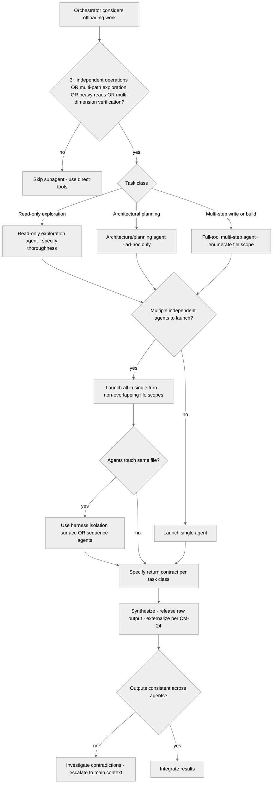

<!-- SPDX-License-Identifier: MIT -->

# Rule: Agent Orchestration Patterns (Companion Sub-Rule)

## Purpose

Carry the operational detail of agent and agent-team orchestration the parent `rules/agent-orchestration.md` rule's anchors point to. Demand-loaded when the assistant edits agent definitions, plan-pipeline commands, skills, or the parent rule. The parent retains the standing directive, the heuristic summary, the return-contract invariant, and the seriousness-scaling table; this companion carries the six team patterns, the agent-type-selection menu, the launch-protocol detail, return-contract enforcement, isolation/non-duplication detail, error handling, the decision-tree diagram, and the anti-pattern list.

## Obligations

### 1. Agent Team Patterns

Six canonical team patterns — match the pattern to the job. The **Agent Class** column names the harness-neutral agent capability the pattern needs; §2.2 maps each class to a concrete per-harness realization.

| Team Pattern | Purpose | Agent Class | Parallelism | Return Contract |
| ------------ | ------- | ----------- | ----------- | --------------- |
| **Research Team** | Information gathering, codebase exploration, skill scanning | read-only exploration agent | Full parallel | Structured summary, max 500 tokens per agent |
| **Audit Team** | Consistency checks, traceability, verification, spot-checks | full-tool multi-step agent | Full parallel | Pass/fail verdict + evidence citations |
| **Implementation Team** | Parallel non-overlapping code changes, file writes | full-tool multi-step agent | Parallel (non-overlapping files only) | Confirmation + file list + diff summary |
| **Generation Team** | Parallel file creation (plan artifacts, docs, reports) | full-tool multi-step agent | Full parallel (one file per agent) | Confirmation + generated file path |
| **Quality Team** | Parallel quality gates (lint, test, type-check, security) | full-tool multi-step agent | Full parallel | Pass/fail + failure details |
| **Documentation Team** | Parallel doc/guide updates | full-tool multi-step agent | Full parallel (non-overlapping files) | Confirmation + updated file path |

### 2. Deployment Decision Framework

**2.1 — Deployment Decision.** **Deploy** when ANY holds: 3+ independent parallel operations, multi-path exploration, heavy reads that bloat the main context, multi-dimension verification, or multi-file generation. **Skip** when ANY holds: <3 total operations, tightly-coupled sequential steps, coordination overhead exceeds the parallelism benefit, or the main context already holds the needed information.

**2.1.1 — Spawn-Overhead Threshold (measurement insight).** Per-task agent spawn (a separate harness session) costs ~5-30s of latency on most hosts; in-process parallelism via `src/apothem/lib/parallel_sweep.py` ProcessPoolExecutor costs ~50-300ms per worker on Windows (~10-50ms on POSIX). Both carry non-trivial fixed costs that dominate when per-task work is small. Concrete dispatch decisions:

- **Research Team (parallel exploration).** Deploy when each agent reads 5+ files or pursues a distinct thread — per-agent work (reads + pattern matching + summary synthesis) takes seconds, amortizing spawn overhead. **Skip** when one Read or Grep answers the question — direct dispatch beats spawn.
- **Quality Team (parallel lint/test/type-check).** Deploy when the host has 3+ independent gates each taking seconds-to-minutes (full pytest, full ruff scan, full `mypy --strict`) — spawn overhead is dwarfed by gate runtime. **Skip** for sub-second linters or single-file checks.
- **Generation Team (parallel non-overlapping authorship).** Deploy when generating 3+ artifacts each needing substantial composition (a fresh skill, rule, or ADR). **Skip** for small-scope edits, or when artifacts carry substantive cross-references needing post-spawn reconciliation.
- **In-process parallelism via `src/apothem/lib/parallel_sweep.py`** fits cross-file sweeps where per-file work is **substantial** (≥ 50ms/file, ≥ 20 files). Measured: at 0.67ms-per-matcher on the conformity-gate orchestrator, ProcessPoolExecutor would slow the work 150-450× rather than speed it up. The module documents its when-to-use-vs-avoid criteria.

**2.1.2 — Standing Delegation Default (lean-context posture).** Beyond the §2.1 deploy/skip thresholds, a **standing routing default** governs *where* delegable work runs once the host exposes agent / subagent dispatch: broad reads, large-corpus consumption, and heavy single-thread workloads SHOULD route to a spawned agent **by default** rather than executing in the main context, so the main conversation stays lean and the synthesized result — not the raw corpus — returns. This is a SHOULD posture on routing, not a third deploy trigger and not an obligation: it neither lowers the §2.1 deploy thresholds for *parallel team* dispatch nor makes the heavy multi-agent apparatus a clean-install default. The apparatus stays default-off per `rules/agnostic-posture.md` §1; this default reads alongside it as advisory guidance that activates only when (a) dispatch is reachable and (b) the workload is broad/heavy enough that keeping it out of the main context is the lean choice. Where no dispatch surface exists, the work runs in the main context with the size-aware read discipline of `rules/large-file-reading.md`. The parent rule (`rules/agent-orchestration.md` §2) carries the one-line standing-default summary; this subsection is its operational backing.

**2.2 — Agent Class Selection.** Each class names a harness-neutral capability; select by the work the subtask needs, then map the class to whatever the active harness exposes. Where the harness offers no matching agent surface, fall back to direct in-context tools.

- **Read-only exploration agent.** Codebase exploration, file discovery, pattern searching. Where the harness supports a thoroughness knob, scale it to the scope (targeted lookup, moderate sweep, exhaustive analysis). *Per-harness mapping (one of many):* on the claude_code harness, dispatch a `subagent_type: Explore` agent and set its thoroughness parameter.
- **Full-tool multi-step agent.** Tasks needing full tool access (reads, writes, shell). The prompt states the deliverable explicitly. *Per-harness mapping (one of many):* on the claude_code harness, dispatch a `subagent_type: general-purpose` agent.
- **Architecture/planning agent.** Implementation planning and design evaluation. Read-only; returns plans, not modifications. Ad-hoc deployment only (no team pattern). *Per-harness mapping (one of many):* on the claude_code harness, dispatch a `subagent_type: Plan` agent.
- **Lightweight tier — host low-cost model.** Quick straightforward subtasks (token counting, simple formatting, straightforward checks).
- **Balanced tier — host general-purpose model.** Moderate-complexity subtasks (code analysis, structured generation, standard verification).
- **Deep-reasoning tier — explicitly-requested high-capability model.** High-complexity subtasks (architectural decisions, forensic audits, nuanced analysis), only where the host exposes model selection and the extra cost is justified.

### 3. Launch Protocol

**3.1 — Prompt Engineering.** Every agent prompt MUST carry six elements:

- **Mission** — a clear, specific statement of what the agent must accomplish.
- **Deliverable** — the exact format and content of the expected return (e.g., "Return a JSON object with keys: status, findings, evidence").
- **Constraints** — boundaries on what the agent MUST NOT do (e.g., "Do NOT modify any files", "Do NOT read more than 10 files").
- **Context** — essential context not available in the codebase (decisions made earlier in the conversation, user preferences).
- **Return contract** — the maximum token budget for the return payload. Defaults: 500 (research), 200 (audit/quality), 500 (implementation/documentation), 1000 (generation). Persistent agent definitions (`agents/*.md`) MAY override these defaults.
- **File scope (Implementation Teams only)** — the exclusive file set the agent MAY modify. No two parallel agents share a file in their scope; verify non-overlap before launch.

**3.2 — Parallel Launch.** Launch all independent agents in a SINGLE turn using the harness's agent-dispatch surface (one dispatch per agent). Never launch independent agents sequentially. Group dependent agents into waves: Wave 1 (independent) → collect results → Wave 2 (dependent on Wave 1). *Per-harness mapping (one of many):* on the claude_code harness, emit multiple Agent tool calls in one message.

**3.3 — Background vs. Foreground.**

- **Foreground (default)** — when results are needed before proceeding; the norm for research, audit, and quality teams.
- **Background — where the harness exposes a detached-dispatch mode.** When genuinely-independent work runs concurrently (comprehensive test suites, large-scale generation, deep exploration), dispatch the agent in the background and do NOT poll or sleep — completion notifies you. *Per-harness mapping (one of many):* on the claude_code harness, pass `run_in_background: true`. Where the harness has no detached mode, run the work in the foreground or sequence it.

### 4. Return Contract Enforcement

**4.1 — Contract Specification.** Every launch MUST specify the contract in the prompt: expected format, maximum size, required fields, and the fallback shape when the agent cannot fulfill it (e.g., "If no matching files found, return `{status: 'empty', reason: '...'}`").

**4.2 — Result Processing.** Process all parallel results in a single pass, never piecemeal. Verify each against its contract. A result over budget: extract only the critical fields, discard the verbose output. A malformed or incomplete result: log the failure, then retry once or proceed without that agent's contribution.

**4.3 — Context Integration.** Synthesize a compact summary and release the raw results from active context. Externalize per `rules/context-management.md` §2.1 when results contain decisions; otherwise externalize synthesized results with lasting value. Never hold raw agent output beyond the turn it is processed.

### 5. Isolation and Non-Duplication

**5.1 — Work Isolation.** Each agent operates on a defined, non-overlapping scope. Two agents touching the same file MUST NOT run in parallel — sequence them. When agents make independent changes that share write paths, use the harness's per-agent isolation surface where one exists (a temporary git worktree per agent so parallel writes do not collide). Verify the harness exposes such a surface before relying on it; if absent, sequence the agents. *Per-harness mapping (one of many):* on the claude_code harness, set the Agent tool's `isolation: "worktree"` parameter.

**5.2 — Non-Duplication.** The main context MUST NOT perform research an agent is performing, nor re-read files an agent is reading unless the results are insufficient. Track which agents do what; prevent redundant work.

**5.3 — Coherence Verification.** After parallel agents complete, verify their outputs are mutually consistent. Contradictory findings are investigated and resolved before proceeding. For Implementation Teams: verify parallel code changes integrate — run tests/builds after merging.

### 6. Error Handling and Recovery

- **Agent timeout.** Continue other work — completion notifies you. Do NOT spawn a duplicate.
- **Agent failure.** Log it; retry once with a refined prompt; on a second failure, proceed without that agent's contribution and document the gap.
- **Parallel team failure threshold.** When 2+ agents in the same team fail (including retries), treat the team result as degraded — inform the user of the coverage gap before proceeding. CM-18 escalation (3 cumulative failures) applies across all teams in the session, not per-team.
- **Result conflict.** Escalate contradictory results to the main context; never silently pick one.
- **Context pressure from results.** Process in batches — synthesize batch 1, externalize, release, then batch 2.

## Decision Tree

## Anti-Patterns

- **DON'T** launch a single agent for a task that a direct tool call can handle — **BECAUSE** agent overhead (prompt, launch, result processing) exceeds the benefit for single-operation tasks.
- **DON'T** launch agents sequentially when they have no dependencies between them — **BECAUSE** sequential launch wastes time proportional to the number of agents.
- **DON'T** duplicate work between the main context and agents — **BECAUSE** it wastes tokens and risks contradictory results.
- **DON'T** hold raw agent results in context after processing — **BECAUSE** verbose results consume context budget without ongoing value.
- **DON'T** launch agents without explicit return contracts — **BECAUSE** unbounded returns bloat the main context and create unpredictable token consumption.
- **DON'T** use the deep-reasoning tier for simple verification tasks — **BECAUSE** the lightweight or balanced tier accomplishes the same result at lower cost and latency.

## Enforcement

Path-filtered (the four glob patterns in this rule's `pathFilter` field), always-on at every seriousness level when in scope. Demand-loaded companion to `rules/agent-orchestration.md`. The parent rule carries the standing directive, the deployment-heuristic summary, the return-contract invariant statement, and the seriousness-scaling table; this companion carries the team-pattern catalog, the agent-type-selection menu, the launch-protocol detail, return-contract enforcement bodies, isolation/non-duplication detail, error-handling detail, the decision-tree diagram, and the anti-pattern list.

## Bindings (§0.j five-direction)

- **Drives →** ● Every agent deployment decision's pattern selection (§1 team-pattern catalog). ● Every parallel agent team launch (§3.2 single-message parallel-launch invariant). ● Every agent prompt's six-element shape (§3.1 prompt engineering). ● Every return-contract enforcement loop (§4 contract specification + result processing + context integration). ● The Implementation Team file-scope-non-overlap invariant (§3.1 file scope; §5.1 isolation worktree).
- **Satisfies →** ● CM-17 (Agent Teams) and CM-25 (Agent Orchestration; rule-delegated). ● the rules registry row "Agent Orchestration" (companion-tier specification). ● `rules/agent-orchestration.md` Companion Sub-Rule Anchor (the parent rule's pointer to this companion's full specification).
- **Established by ↑** ● `rules/agent-orchestration.md` (parent-rule anchor). ● CM-17 + CM-25. ● the agents registry (the persistent agent definitions consume this companion's deployment patterns).
- **Gated by ←** ● The path-filter (`**/agents/**/*.md`, `**/commands/plan-*.md`, `**/skills/**/SKILL.md`, `**/rules/agent-orchestration*.md`) — this rule demand-loads only on agent-orchestration-touching artifact edits. ● `rules/agent-orchestration.md` always-on baseline (parent rule must be live for the companion anchor to surface).
- **Cross-bound with ↔** ↔ `rules/agent-orchestration.md` (parent rule; the Companion Sub-Rule Anchor binds this companion). ↔ `agents/codebase-explorer.md` + `agents/convention-auditor.md` + `agents/quality-gate.md` + `agents/memory-auditor.md` (the four persistent flat agent definitions this companion's §1 team patterns dispatch to). ↔ `rules/agent-orchestration-patterns.md` §Decision Tree (the in-rule per-agent dispatch tree the §2.2 agent-class-selection cross-references). ↔ `rules/context-management.md` (post-multi-agent compaction trigger; §6 result-processing externalizes agent results per CM-24). ↔ `rules/operational-mandates.md` (CM-17 + CM-25 inline-defined there).
