<!-- SPDX-License-Identifier: MIT -->

# Rule: Plan-Workflow Scratch Convention (Companion Sub-Rule)

## Purpose

Specify the file-naming, directory-placement, and lifecycle convention for the plan-workflow scratch, authored-specification, and durable-output artifacts that the parent rule's `rules/context-management.md` §2.6 anchor declares. This companion is path-filtered: it loads when the assistant edits any of the per-suite plan artifacts (any file under `<project-root>/.apothem/plans/**`, `_inputs/**`, `_outputs/**`, or `_spec/**`), keeping the parent rule's always-on payload lean while preserving full convention fidelity at the demand-load surface. The parent rule remains the canonical home for context-health monitoring, externalization, compaction, blind execution, and budget discipline; this companion carries the §2.6 + §2.6.1 plan-workflow directory convention.

## Obligations

### 1. Scratch File Conventions

Working-scratch content lives exclusively in each plan suite's own `<project-root>/.apothem/plans/{suite}/_inputs/` directory — the sole scratch home, convergent with §2's suite-locality invariant. The sibling `{suite}/_spec/` holds the same suite's authored specification and is a principled sibling, not an alternative scratch home. Scratch is session-local working storage for multi-thread context that does not fit PROGRESS.md or PLAN-NOTES.md.

**Naming.** Filenames inside each `_inputs/` directory follow one of two patterns — neither carries a suite-name prefix, since the enclosing `.apothem/plans/{suite}/_inputs/` path already encodes the suite:

- **Canonical-purpose** `{purpose}.md`, where `{purpose}` is drawn from the closed vocabulary `{forge, notes, triage, draft, decisions, prose, requirements}` — exhaustive, scoped exclusively to `_inputs/` scratch (never `_spec/`, which uses the singleton `spec.md` per §2), extensible only by rule revision, never by ad-hoc naming.
- **Free-form** `{kebab-case-topic}.md` for topic-scoped working notes outside that vocabulary.

**Lifecycle.** Each file follows a creation → reference → graduation arc: written into `{suite}/_inputs/` at need, referenced within the active session, then resolved along exactly one of four terminal paths:

1. **Promoted** intra-suite from `{suite}/_inputs/forge.md` to `{suite}/_spec/spec.md` once the content reaches specification quality (the §2 forge→spec lifecycle — the canonical arc for prose elicitation).
2. **Distilled** into memory per `rules/auto-memory.md` when it captures long-lived knowledge worth preserving across sessions.
3. **Captured** into PLAN-NOTES.md when it is a plan-relevant decision requiring durable record.
4. **Deleted** at closure when session-complete and no graduation path applies.

Cross-session persistence requires a reason documented inside the file itself; unexplained carry-over is a convention violation. Examples — canonical-purpose: `forge.md` in `.apothem/plans/agent-home-hardening/_inputs/` holds in-progress prose elicitation until it promotes to `.apothem/plans/agent-home-hardening/_spec/spec.md`. Free-form: `review-findings.md` in the same directory holds topic-scoped review triage until its findings distill to memory or graduate to PLAN-NOTES.md.

### 2. Plan-Workflow Directories (`_spec/`, `_inputs/`, and `_outputs/`, per suite)

The planning workflow writes three semantically distinct artifact classes, each with its own sibling directory **inside every plan-suite folder**. The underscore prefix signals ecosystem-internal state and sorts these folders before plan-product folders (`phases/`, etc.) within the suite. The distinction between the three classes is **semantic**, not merely organizational — correctly placing an artifact depends on whether it is a committed specification, working scratch, or durable generated output. All three directories are **suite-local**: each plan suite owns its own `_spec/`, `_inputs/`, and `_outputs/`, and no instance of any of these directories exists outside a suite folder.

**Three artifact classes:**

- **Authored specifications** — stable, committed prose that the planning workflow consumes as authoritative input. Home: `<project-root>/.apothem/plans/{suite}/_spec/`.
- **Workflow scratch** — volatile, session-local working state produced during plan elicitation, review, and execution on that suite. Home: `<project-root>/.apothem/plans/{suite}/_inputs/`.
- **Durable generated outputs** — bounded operator-facing reports, audit artifacts, rollups, metrics, exports, and phase-output mirrors emitted by writeful planning commands. Home: `<project-root>/.apothem/plans/{suite}/_outputs/`.

**Directory specification — `<project-root>/.apothem/plans/{suite}/_spec/`:**

- **Role:** Sole canonical home for the authored prose specification feeding its enclosing plan suite. Consumed by `/plan-spec` (during elicitation finalization) and `/plan-generate` (as authoritative input).
- **Closed purpose set:** `{spec}` (singleton at the directory root). Per Q-016 the directory admits three optional structural subdirectories — `supporting/` (long-form supporting prose that the singleton `spec.md` cross-references but does not inline), `diagrams/` (Mermaid / image / SVG assets the spec embeds via relative path), `citations/` (sourced excerpts and reference snippets the spec quotes). The singleton `spec.md` remains the authoritative entry point; subdirectory contents are read by humans and `/plan-generate` only when the spec's prose explicitly cites them.
- **Filename pattern:** `spec.md` at the directory root (singleton — the suite name is encoded by the enclosing folder path, not by the filename). Files inside `supporting/`, `diagrams/`, `citations/` use kebab-case topic names.
- **Writers:** Humans and the `/plan-spec` workflow (during finalization).
- **Readers:** `/plan-generate` reads `spec.md` as the authoritative input for plan-suite generation; humans read for audit and revision.
- **Contract status:** Committed. A file in `{suite}/_spec/` is authoritative — downstream phases trace requirements back to it.
- **Longevity:** Persistent across sessions until the enclosing suite is retired. Retirement is atomic with the suite — deleting the suite folder deletes the spec.

**Directory specification — `<project-root>/.apothem/plans/{suite}/_inputs/`:**

- **Role:** Sole canonical home for session-scratch produced during planning workflows on its enclosing suite. All multi-thread working context that does not fit PROGRESS.md or PLAN-NOTES.md lives here.
- **Closed purpose set:** `{forge, notes, triage, draft, decisions, prose, requirements}` with per-purpose semantics:
  - `forge` — draft-in-progress of a prose specification before promotion to `_spec/`.
  - `notes` — free-form working notes accumulated during a phase or investigation.
  - `triage` — cross-topic diagnostic surveys scoped to this suite.
  - `draft` — draft work products (intermediate artifacts), NOT draft prose.
  - `decisions` — in-flight decision capture before graduation to PLAN-NOTES.md.
  - `prose` — free-form prose elicitation captured before forge consolidation; the lighter-weight sibling of `forge.md` for short-form drafts that have not yet earned the forge promotion arc.
  - `requirements` — explicit operator-supplied requirements list captured during elicitation; pairs with `forge.md` when the forge content needs an authoritative requirements anchor distinct from the prose narrative.
- **Filename pattern:** `{purpose}.md` (e.g., `forge.md`, `notes.md`, `decisions.md`) or `{kebab-case-topic}.md` (e.g., `review-findings.md`, `triage-phase-04.md`). No suite-name prefix — the enclosing folder path already encodes the suite.
- **Writers:** Any planning-workflow actor scoped to the enclosing suite — humans, `/plan-spec`, `/plan-generate`, `/plan-review`, `/plan-audit`, `/plan-execute`, subagents.
- **Readers:** Same set, as session context requires.
- **Contract status:** Working state. Files in `{suite}/_inputs/` are volatile — downstream artifacts MUST NOT trace requirements back to them directly; content graduates (to `{suite}/_spec/spec.md`, PLAN-NOTES.md, or memory) or is deleted.
- **Longevity:** Session-local unless explicitly promoted. Files persisting beyond their session require a documented reason in the suite's PROGRESS.md or PLAN-NOTES.md.

**Directory specification — `<project-root>/.apothem/plans/{suite}/_outputs/`:**

- **Role:** Sole canonical home for durable generated emissions that are too detailed for PROGRESS.md or PLAN-NOTES.md but remain part of the suite's audit trail. This includes audit reports, execution report mirrors, rollups, metrics, exports, and bounded operator-facing summaries.
- **Closed purpose set:** `{report, audit, rollup, metrics, export}` as top-level file or directory purposes, plus free-form kebab-case topic names when a generated output has a precise domain subject. Free-form topics must cite their producer in frontmatter, header, or the phase report's Outputs emitted section.
- **Filename pattern:** `{purpose}-{YYYY-MM-DD}.md`, `{kebab-case-topic}.md`, or `{phase-slug}/REPORT.md` for phase mirrors. No suite-name prefix — the enclosing folder path already encodes the suite.
- **Writers:** Writeful planning workflows scoped to the enclosing suite — `/plan-audit`, `/plan-execute`, `/plan-review` when materializing durable review reports, `/plan-status` only when another orchestrator explicitly converts its prose output into a file, and subagents acting under those commands.
- **Readers:** Humans, `/plan-status`, downstream `/plan-execute` phases, review/audit cycles, and any maintenance suite that consumes the output as evidence.
- **Contract status:** Durable generated output. Files in `{suite}/_outputs/` are not authoritative requirements, but they are committed evidence of what the workflow emitted and verified.
- **Longevity:** Persistent across sessions until the enclosing suite is retired. A stale output is superseded by a newer output and index/provenance entry; it is not silently overwritten unless the producer's contract says the path is a stable singleton.

**Lifecycle — forge → spec promotion (always intra-suite):**

```mermaid
%%{ init: { "theme": "neutral" } }%%
%% verified: 2026-04-27 %%
%% provenance: rules/context-management-scratch.md §1 (scratch file conventions) %%
%% cross-reference: rules/context-management.md §2.6 (parent rule anchor) %%
flowchart LR
    SESS["Session start<br/>(suite folder established first)"]
    SESS --> FORGE_W["{suite}/_inputs/forge.md<br/>(prose elicitation begins here)"]
    FORGE_W --> ITER["Iterative authoring<br/>(/plan-spec refinement passes)"]
    ITER --> FORGE_R["{suite}/_inputs/forge.md<br/>(reaches specification quality)"]
    FORGE_R --> PROM["Copy+rename promotion<br/>(forge retired)"]
    PROM --> SPEC["{suite}/_spec/spec.md<br/>(authoritative spec · feeds /plan-generate)"]
```

No simultaneous authoritative copies — the forge file is **deleted** (or emptied) once the spec is promoted. The promotion act is the contract-status transition from working state to committed. Both sides of the transition are siblings in the same suite folder — promotion is always intra-suite, never cross-suite.

**Pre-suite bootstrap:** `/plan-spec` MUST establish the enclosing suite folder (`<project-root>/.apothem/plans/{suite}/`) as its first action, before any forge write. Two sub-cases:

- **Suite name known up front:** create `{suite}/_inputs/forge.md` directly.
- **Suite name derived during elicitation:** collect a provisional kebab-case suite name at `/plan-spec` Step 1 (before any forge content is written). Refinement is permitted — renaming the suite folder is a single `mv`. No state ever exists outside a suite folder; there is no root-level bootstrap location.

If a `/plan-spec` session is abandoned before promotion, the orphan suite folder (containing only `_inputs/forge.md`) is subject to the session-end retirement policy: either deleted, or marked with a longevity reason in a placeholder PLAN-NOTES.md.

**Invariants:**

- **Suite-locality:** Every `_spec/`, `_inputs/`, and `_outputs/` directory MUST be a direct child of a plan-suite folder (`<project-root>/.apothem/plans/{suite}/`). Root-level instances at `<project-root>/.apothem/plans/_spec/`, `<project-root>/.apothem/plans/_inputs/`, or `<project-root>/.apothem/plans/_outputs/`, or instances nested anywhere other than directly under a suite folder, are convention violations requiring migration.
- **Disjoint purpose vocabularies:** `{spec}` (root singleton) plus `{supporting, diagrams, citations}` (optional subdirectory names) is exclusive to `_spec/`; `{forge, notes, triage, draft, decisions, prose, requirements}` is exclusive to `_inputs/`. Cross-contamination (e.g., a `spec.md` in `_inputs/` or a `forge.md` in `_spec/`) is a convention violation.
- **Directional promotion:** Files graduate `{suite}/_inputs/ → {suite}/_spec/` within the same suite; never the reverse, never cross-suite. A spec that needs further elicitation is amended in place in `_spec/`, not demoted back to `_inputs/`.
- **Authoritative-input asymmetry:** `/plan-generate` reads only `{suite}/_spec/spec.md` as spec input for its target suite. It never treats an `_inputs/` file as authoritative, and never consumes another suite's `_spec/`.
- **Output non-authority:** `_outputs/` files are evidence and durable emissions, not requirement sources. Downstream work may consume them as verified-output evidence, but requirement traceability still resolves to `_spec/spec.md`, MASTER-PLAN.md, PHASE.md, and operator-ratified decisions.
- **Single home per artifact class per suite:** For a given suite, exactly one `_spec/` folder, one `_inputs/` folder, and one `_outputs/` folder exist, all direct children of the suite folder. No other directory within the suite (e.g., `{suite}/phases/`, `{suite}/scratch/`) may host artifacts of these classes.
- **Atomic retirement:** Deleting a plan suite is a single `rm -rf {suite}/` — removes specification, scratch, phases, and plan infrastructure atomically. No cross-directory cleanup is required. Cross-suite references to a retired suite's spec or scratch are the responsibility of the referring artifact and MUST be rewritten before retirement.

## Enforcement

Path-filtered (the five glob patterns in this rule's `pathFilter` field — `**/.apothem/plans/**/*.md`, `**/.plans/**/*.md`, `**/_inputs/**/*.md`, `**/_outputs/**/*.md`, `**/_spec/**/*.md`), always-on at every seriousness level when in scope. Demand-loaded companion to `rules/context-management.md` §2.6. The parent rule carries the proactive externalization protocol's other sub-clauses (§2.1 externalize-on-decide through §2.5 externalize-on-phase-exit), the compaction discipline, the long-conversation resilience protocol, the graceful-degradation policy, the blind-execution protocol, and the context-budget discipline; this companion carries the §2.6 plan-workflow directory convention.

## Bindings (§0.j five-direction)

- **Drives →** ● Every plan-workflow scratch file placement (the closed-purpose vocabulary `{forge, notes, triage, draft, decisions, prose, requirements}` for `_inputs/`; the singleton `spec.md` for `_spec/`; the generated-output purposes `{report, audit, rollup, metrics, export}` for `_outputs/`). ● The forge→spec promotion lifecycle (§2 — `{suite}/_inputs/forge.md` → `{suite}/_spec/spec.md`). ● The suite-locality invariant (every `_inputs/`, `_outputs/`, and `_spec/` is a direct child of a plan-suite folder). ◐ The PreToolUse Write/Edit hooks' real-time path-shape enforcement.
- **Satisfies →** ● CM-12 / CM-24 (rule-delegated mandates; this companion is the path-filtered subset). ● the rules registry row "Context Management Scratch". ● `rules/context-management.md` §2.6 anchor (the parent rule's pointer to this companion's full specification).
- **Established by ↑** ● `rules/context-management.md` §2.6 (parent-rule anchor). ● CM-12 + CM-24 inline definitions. ● the artifact directories (.apothem/plans/ + legacy .plans/ directory class).
- **Gated by ←** ● The path-filter (`**/.apothem/plans/**/*.md`, `**/.plans/**/*.md`, `**/_inputs/**/*.md`, `**/_outputs/**/*.md`, `**/_spec/**/*.md`) — this rule demand-loads only on plan-workflow artifact touches. ● `rules/context-management.md` always-on baseline (parent rule's §2.6 anchor must be live for the companion to demand-load coherently).
- **Cross-bound with ↔** ↔ `rules/context-management.md` (parent rule; §2.6 anchor binds this companion). ↔ `rules/context-management-budget.md` (sibling companion carrying the §7 Context Budget Discipline operational bodies — §7.1 budget awareness, §7.2 demand loading, §7.3 pressure signals, §7.4 per-task effort calibration / CM-12d). ↔ `commands/plan-spec.md` (Forge command's first action establishes the suite folder; §2 forge→spec promotion is operationalized at `/plan-spec` Step 1). ↔ `commands/plan-generate.md` (consumes `{suite}/_spec/spec.md` as authoritative input per the §2 authoritative-input-asymmetry invariant). ↔ `commands/plan-audit.md` + `commands/plan-execute.md` (write durable generated emissions under `{suite}/_outputs/`). ↔ `hooks/messages/pretooluse-write.md` + `hooks/messages/pretooluse-edit.md` (the hook contexts that enforce the path-shape invariants in real time). ↔ `rules/context-management-protocol.md` (sibling companion carrying the §2.6 plan-workflow scratch convention; both companions demand-load on overlapping plan-suite paths).
