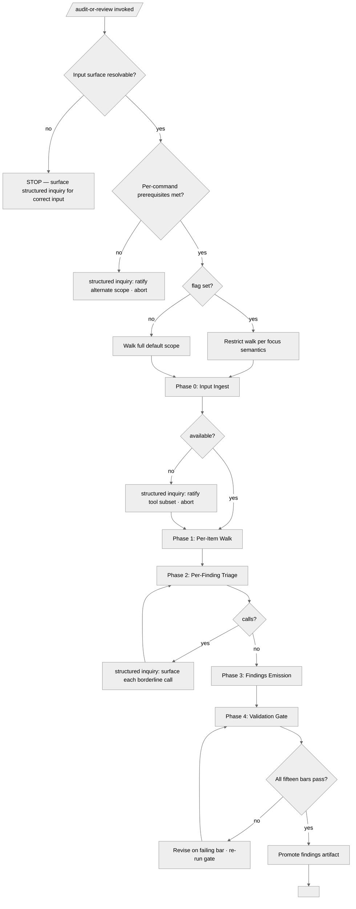

<!-- SPDX-License-Identifier: MIT -->

# Ecosystem-Audit References — Audit-Fortress Phase Skeleton

Reference surface for the [`ecosystem-audit`](../SKILL.md) skill. This file is the
canonical home for the decision-tree skeleton shared by the eleven
audit-fortress commands (`/code-review`, `/code-audit`, `/security-audit`,
`/perf-audit`, `/architecture-review`, `/ux-review`, `/a11y-audit`,
`/docs-review`, `/dependency-audit`, `/supply-chain-audit`,
`/threat-model-audit`). Each command's `## Decision Tree` section cites this
skeleton and supplies its row from the parameter table below; the per-command
delta is captured by `tools-probed`, `borderline-classes`, `focus-semantics`,
and `pipeline-tail-handoff`.

The skeleton lives here, under the skill's bundled `references/` directory, so
it loads selectively when a consuming command resolves it — keeping the skill's
entry-point procedure tight.

## Canonical Flowchart

The tree distinguishes three fork classes: **deterministic forks**
(input-surface resolution, prerequisite presence, flag presence,
tool-availability, gate-bar verdicts), **structured-inquiry forks**
(alternate-scope ratification, prerequisite-disposition ratification,
tool-subset ratification, borderline severity calls), and **iteration forks**
(the Phase 2 borderline-triage loop, the Phase 4 gate-bar loop). Commands may
add command-specific intermediate phases between Phase 1 and the final emission
phase; the parameter table's `tools-probed` and `borderline-classes` rows name
each command's substantive deltas, and the `pipeline-tail-handoff` row names the
terminal node that replaces the generic `<pipeline-tail-handoff>` placeholder.

## Per-Command Parameter Table

| Command | `tools-probed` | `borderline-classes` | `focus-semantics` | `pipeline-tail-handoff` |
|---------|----------------|----------------------|-------------------|-------------------------|
| `/code-review` | host manifests (`pyproject.toml` / `package.json` / sibling) for convention defaults | borderline severity calls on per-file craft findings | `--focus` restricts walk to focus subtree (default: `src/` + `scripts/` + `tools/`) | Pipeline terminates — findings ready for remediation |
| `/code-audit` | `mypy --strict` · `vulture` · `pylint --disable=all --enable=duplicate-code` · coverage report | public-API dead-code disambiguation · open layer-assignment questions · gate-bar `n/a` rationales | `--focus AREA` ∈ `{type-hints, coverage, dead-code, duplicates, architecture, all}` skips irrelevant phases | Terminal — review-fortress consumer reads |
| `/security-audit` | secrets sweep · injection-surface walk · deserialization / path-traversal / RCE detectors · CodeQL · CVE feeds | false-positive vs. accepted-risk triage | `--focus` restricts to a single category (secrets / permissions / input-validation / injection / deserialization / RCE / CVE) | Audit handoff to operator / fortress-phase triage |
| `/perf-audit` | per-class benchmark drivers under `src/apothem/benchmarks/` · USE-method hot-path identifier | operator-override ratification (per-class budget amendments) | `--focus CLASS` scopes to a single performance class (hooks · validate-ecosystem · tests · agents · shell) | Audit complete · handoff to performance remediation |
| `/architecture-review` | `_inputs/design.md` upstream artifact · layer-traceability walker · cycle detector | undesigned-component vs. design-gap vs. code-undiscipline vs. future-delivery classification | `--focus LAYER` restricts audit to a single layer (Domain / Application / Infrastructure / Presentation) | Pipeline handoff to remediation phases |
| `/ux-review` | CLI-ergonomics walker · installation flow probe · error-recovery harness · documentation discoverability sweep | surface-gap disposition (inventory completeness) | `--focus SURFACE` restricts walk to a single named surface (CLI / install / errors / docs) | Pipeline handoff to fortress review |
| `/a11y-audit` | ax-core · Pa11y · Lighthouse | borderline a11y severity calls (WCAG level interpretation, AT-impact disambiguation) | `--focus` restricts crawl to focus subtree (default: all reachable pages up to host ceiling) | Pipeline terminates — findings ready for remediation |
| `/docs-review` | host's docs-site generator (Fumadocs / Docusaurus / Sphinx / sibling) for convention defaults | borderline severity calls on per-page documentation findings | `--focus` restricts walk to focus subtree (default: `docs/` + root singletons) | Pipeline terminates — findings ready for remediation |
| `/dependency-audit` | `pip-audit` · `safety` · `osv-scanner` · lockfile resolvers | borderline CVE severity calls · lockfile-generation ratification | `--focus` restricts walk to a single manifest or package (default: full dependency graph) | Pipeline terminates — findings ready for remediation |
| `/supply-chain-audit` | host-ratified targets across seven release-engineering axs (signing · provenance · SBOM · pinning · CI permissions · publish flow · attestation) | borderline severity calls on per-axis findings | `--focus AXIS` restricts walk to a single axis (default: all seven axs) | Pipeline terminates — findings ready for remediation |
| `/threat-model-audit` | STRIDE per-element walker · PASTA per-tier walker · threat-actor taxonomy · upstream architecture and security artifacts | boundary-set ratification · upstream-first vs. proceed-without ratification · borderline severity / actor calls | `--focus` restricts walk to a single trust boundary or threat actor (default: full architectural surface) | TIER 3 convergence attestation ready |

## Bindings (§0.j five-direction)

- **Drives →** ● The `## Decision Tree` section of each of the eleven audit-fortress commands (each cites this canonical skeleton + supplies its parameter-table row).
- **Satisfies →** ● The [`ecosystem-audit`](../SKILL.md) skill's reference-surface obligation (the skeleton loads selectively, beside the skill's entry-point procedure).
- **Established by ↑** ● [`ecosystem-audit/SKILL.md`](../SKILL.md) (the audit skill this reference extends).
- **Cross-bound with ↔** ↔ `commands/code-review.md` + `commands/code-audit.md` + `commands/security-audit.md` + `commands/perf-audit.md` + `commands/architecture-review.md` + `commands/ux-review.md` + `commands/a11y-audit.md` + `commands/docs-review.md` + `commands/dependency-audit.md` + `commands/supply-chain-audit.md` + `commands/threat-model-audit.md` (the eleven consuming audit-fortress commands).
