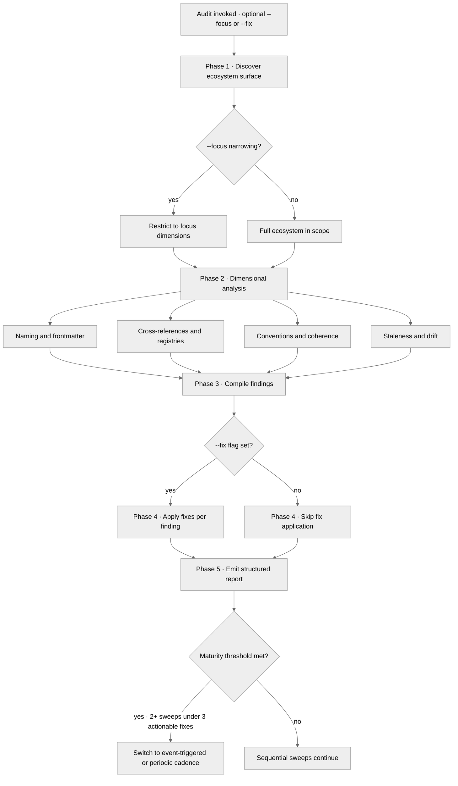

<!-- SPDX-License-Identifier: MIT -->

# Ecosystem-Audit Procedure, Classification, Recovery & Cadence

Reference surface for the [`ecosystem-audit`](../SKILL.md) skill. Houses the
fixed five-phase audit procedure, the improvement-classification taxonomy, the
failure-recovery table, the cadence guidance, and the phase-thread diagram —
the operational detail a consuming context loads when it executes the audit,
kept out of the skill's entry-point router so the router stays tight.

## Procedure

A fixed five-phase cadence — sequential at the phase level, parallelizable at
the dimensional level when an audit team is deployed.

### 1. Census

Glob all ecosystem files. Count rules, commands, skills, agents, hooks. Verify counts match `CLAUDE.md` registries and `MEMORY.md` claims.

### 2. Cross-Reference Audit (parallel)

Deploy three parallel agents (use the persistent agent definitions from `agents/` where available: `convention-auditor.md` for Agent A, `memory-auditor.md` for Agent C):

- **Agent A (Structure)** — Verify `CLAUDE.md` registries: every listed file exists, every file on disk is listed. Check scope labels against actual frontmatter. Verify the Rule-Delegated Mandates table against rule file contents. Check CM-N / TM-N / CP-N reference integrity.
- **Agent B (Artifacts)** — Verify commands, skills, agents, hooks: frontmatter validity, internal cross-references, pipeline-ordering consistency, hook CM-N alignment with CM-14. Apply the Harness-Component Alignment Dimension below to every shipped harness component (skill, command, agent, hook, MCP surface).
- **Agent C (Memory + Quality)** — Verify `MEMORY.md` accuracy against filesystem state. Spot-check rules for required sections. Identify stale references. Brainstorm improvement opportunities classified FIX / ENHANCE / CONSIDER / DEFER.

### 3. Synthesis

Collect agent results. Verify mutual consistency. Resolve contradictions per the result-conflict clause in Failure Recovery.

### 4. Report

Emit the structured audit report:

- pass / fail per check with evidence;
- fixes needed (exact file, location, old / new text);
- enhancement opportunities with classification.

### 5. Apply (if `--fix`)

Apply FIX-classified items **only**. Report changes with before / after line counts. ENHANCE / CONSIDER / DEFER are reported but never auto-applied — each requires operator judgment, solicited via the structured-inquiry channel per `rules/interactive-questions.md`.

### 6. Pre-Emission Self-Check

Before emitting the report (and before applying any `--fix` change), run the fifteen-bar pre-emission gate per `rules/pre-emission-gate.md` against the audit's own outputs as the artifact under review. Each bar is marked `pass` or `n/a` (with reason); the attestation is recorded in the report's closing section. Mechanical-fraction bars (M2 disclosure, M5 authority placeholders, M7 option annotation, M8 hedging vocabulary, M10 binding reciprocity, M13 code craft, M15 production readiness) are operationalized by the per-bar matchers at `conformity/*-grep.py`; reasoned bars (M1 host agnosticism, M3 ten dimensions, M6 expertise, M9 visual leverage, M11 agile sprints, M12 phase layout, M14 systemicity) are evaluated inline. A failing bar blocks emission until the defect is corrected — the audit's own emission honors the discipline it audits in the host.

## Improvement Classification

Every improvement opportunity surfaced by Agent C is assigned exactly one of four classes:

- **FIX** — Defect: a claim is false, a cross-reference is broken, a file is missing, a frontmatter field is invalid. Mechanically applicable; auto-applied under `--fix`.
- **ENHANCE** — Missing-but-valuable addition: a rule lacks a section other rules carry; an agent lacks a token-budget override note. Requires operator approval via the structured-inquiry channel; small change, high value.
- **CONSIDER** — Trade-off pending: two valid designs exist (e.g., split a 200-line topic file vs. keep it). Surface the trade-off; the operator decides.
- **DEFER** — Out of current scope: requires a separate workstream (new skill, new rule, ecosystem restructure). Logged for the future, not actioned now.

## Harness-Component Alignment Dimension

Every shipped harness component — skill, command, agent, hook, MCP surface —
is audited against this dimension during Step 2 (Agent B). The dimension owns
no rule content of its own; it verifies the component against the disciplines
already ratified upstream, and routes each finding through the FIX / ENHANCE /
CONSIDER / DEFER classification. Four facets, each anchored to its governing
rule:

- **Per-harness contemporary alignment.** Each component stays aligned with its
  per-harness latest official documentation and best-practices, surfaced
  through the adapter's `STANDARD-CONVENTION-PIN.md` discovery walk per
  `rules/harness-adapter-shape.md`. A pin whose snapshot has gone stale, or a
  component built against a superseded vendor surface, is a finding.
  Re-verification sweeps each vendor's FULL current doc surface
  vendor-by-vendor — not only the single page the pin cited — because a pin
  commonly under-documents surfaces the vendor has since added (e.g. a
  rules-only pin that frames the vendor's skill / sub-agent / command surface as
  "absent" when the vendor documents it); a pin that frames a present vendor
  surface as absent is a staleness finding distinct from date-staleness, and the
  correction reframes the adapter's narrow delivery as a deliberate posture
  rather than an absence-of-surface claim. Pins authored in one batch from a
  shared doc-reading tend to share the same staleness, so re-verification groups
  pins by authoring batch and re-checks the cohort-batch together. Per-harness
  agentic-capability coverage (MCP support, sub-agent dispatch, tool-surface
  restriction, hooks pipeline, skills directory) is verified against the
  matrix per `rules/agent-capability-discipline.md`; an advertised capability
  with no covering evidence is a finding.
- **Durable structure, cross-linking, reusability.** Each component carries
  intact reciprocal cross-references (no half-edge bindings, no dead paths),
  belongs to the reference graph with a consumer and an index entry (no orphan),
  and is shaped for reuse rather than duplicated across the cohort — verified
  against `rules/systemic-participation.md` and `rules/propagation.md`. Recurring
  near-duplicate logic across three or more components is a consolidation finding.
- **MAXIMAL agnosticism.** No shipped component presets a model tier, an effort
  level, or a permission mode, and none privileges a single harness by tailored
  default, brand phrasing, or assumed runtime — verified against
  `rules/agnostic-posture.md`. A component that renders differently across the
  registered cohort without a declared, justified divergence is a finding.
- **Determinism across all harnesses.** Each component's output / message
  structure is expected and stable across any session, and that stability
  generalizes across the whole registered harness cohort rather than being
  claude-code-specific — verified against `rules/determinism.md`. A
  signature that drifts between identical reads, or a structure that holds for
  one harness but not its siblings, is a finding.

The dimension is the canonical home for the harness-component-alignment audit;
`/elevate` and `/freshify` reference it rather than re-derive it.

## Failure Recovery

- **Agent failure** (one of the three Step-2 agents cannot complete): record which dimensions are unaudited; proceed to Step 3 with partial coverage flagged in the report. At PUBLIC_LAUNCH, a single-agent failure blocks `--fix` (auto-application requires complete coverage); at lower seriousness, surface the gap and continue.
- **MEMORY.md missing or corrupt** (Agent C cannot start): treat as a FIX-classified finding. Reconstruct `MEMORY.md` as a minimal index of any topic files found on disk; if none exist, create an empty index. Notify the user explicitly — Agent C's audit is reduced to "MEMORY.md was missing; reconstructed empty".
- **CLAUDE.md missing or corrupt** (Agents A and B both depend on it): STOP. Without `CLAUDE.md` the registry has no source of truth; auto-recovery is unsafe. Recommend version-control restoration via the structured-inquiry channel.
- **Result conflict** (two agents produce contradictory findings on the same dimension): surface BOTH findings to the operator with evidence; never silently pick one. This is a Critical finding by definition.

## Cadence Guidance

Sequential sweeps exhibit diminishing returns as the ecosystem converges. Signal maturity when findings drop below 3 actionable fixes per sweep for 2+ consecutive sweeps. Once mature:

- **Event-triggered sweeps** after significant changes (new rules, template refinements, command additions, hook restructuring).
- **Periodic sweeps** at most monthly, or when `MEMORY.md`'s last-sweep date exceeds 30 days.
- **Focus sweeps** (via `--focus`) for targeted verification after localized edits, in place of a full-ecosystem re-audit.

Each sweep introduces at least one novel audit dimension (a new agent prompt angle, a different cross-reference path, an unexplored edge case) to avoid pattern-blindness from repeated identical audits.

## Phase Thread

The audit's internal execution thread proceeds as a fixed cadence — discovery, dimensional analysis, consistency check, fix application (when `--fix` is set), and report emission. The thread is sequential at the phase level and parallelizable at the dimensional level when an audit team is deployed.

## Bindings (§0.j five-direction)

- **Drives →** ● Every blind-audit execution's five-phase cadence + classification + recovery routing (this reference is the operational procedure).
- **Satisfies →** ● The [`ecosystem-audit`](../SKILL.md) skill's reference-surface obligation (the procedure loads selectively, beside the router).
- **Established by ↑** ● [`ecosystem-audit/SKILL.md`](../SKILL.md) (the audit skill this reference extends).
- **Cross-bound with ↔** ↔ `rules/agent-orchestration.md` §1 (the Audit Team pattern the Step-2 parallel agents dispatch under). ↔ `rules/pre-emission-gate.md` (the fifteen-bar gate the Step-6 self-check runs). ↔ `agents/convention-auditor.md` + `agents/memory-auditor.md` (the persistent agents Step-2 dispatches). ↔ `rules/harness-adapter-shape.md` + `rules/agent-capability-discipline.md` + `rules/agnostic-posture.md` + `rules/determinism.md` (the four disciplines the Harness-Component Alignment Dimension verifies against, never re-derives). ↔ `rules/systemic-participation.md` + `rules/propagation.md` (the cross-linking / reusability / anti-orphanism surface the dimension's second facet checks). ↔ `commands/elevate.md` + `commands/freshify.md` (the two surfaces that reference this dimension rather than re-derive it).
