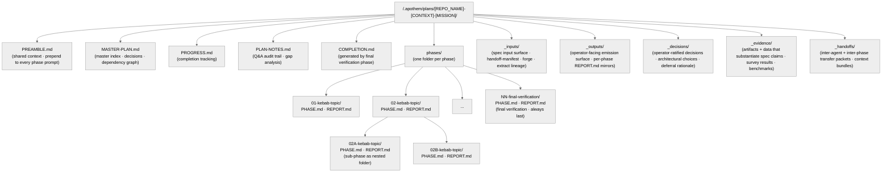

<!-- SPDX-License-Identifier: MIT -->

## 0. Project Brief

> **Replace `[PROSE_BODY_GOES_HERE]` below with your actual project prose/requirements.**
> This is the raw seed from which the Master Plan Suite is generated. Write as much or as little as you like — even rough, colloquial prose is fine. The template will extract structure, identify gaps via the structured-inquiry channel, and transform this into a rigorous, phased plan.
>
> **Discovery Protocol:** When processing the prose, the planning agent will systematically:
>
> 1. Clarify the core problem — the underlying need, not the surface request
> 2. Identify the root cause the user is probably missing because they are too close to it
> 3. Challenge hidden assumptions constraining the solution space
> 4. Map out every possible approach, weighing trade-offs across feasibility, impact, maintainability, and risk-reward
> 5. Recommend the best strategy with clear rationale
> 6. Surface risks, blockers, constraints, and fears with prevention strategies
> 7. Provide a step-by-step phased implementation plan with verification at every stage

```text
Rigorously transform the below prose into a structured, execution-ready plan.
Extensively amend and extend based on the underlying intentions, rationales, and your
domain expertise. Expand all abbreviations ('e.g.', 'etc.', '...') into concrete
patterns based on context. Maintain ALL original nuances while improving structure.

**NEVER** implement — strictly stop after creating the final plan suite so we can
review before implementation. Create a draft plan, then iterate to refine:

--

[PROSE_BODY_GOES_HERE]

--
```

---

# [REPOSITORY_NAME]: [PROJECT_NAME] — Master Plan Suite

> **Plan Version:** v0.1.0 | **Template Version:** v0.1.0
> **Mode:** `[NEW | OVERHAUL]` — `NEW` = greenfield. `OVERHAUL` = refining or restructuring an existing codebase.
> **Seriousness Level:** `[EXPLORING | PERSONAL_USE | SHARED | PUBLIC_LAUNCH]` — Governs governance depth per `CLAUDE.md` Section 4.
> **Domain:** `[PRIMARY_DOMAIN — see Section 11 for domain bundles]`
> **Generated by:** Apothem (Technical Co-Founder)
> **Date:** `[YYYY-MM-DD]`

---

## 0.S Scalability Tier (D7 — `rules/canonical-layout.md` §7)

> **Tier classification.** Every plan suite declares its scalability tier at the top of the plan body. The tier governs validation cadence, indexing requirements, and decomposition heuristics per `rules/canonical-layout.md` §7.1.

**Tier:** `[small | medium | large]`

| Tier     | Phase count | Spec count | Required infrastructure |
| -------- | ----------- | ---------- | ----------------------- |
| `small`  | <50         | <100       | Narrative trace tables in `PLAN-NOTES.md` (substitute for `src/apothem/templates/trace-matrix-template.md`); no `MASTER-INDEX.md`; monolithic single suite. |
| `medium` | 50–500      | 100–1000   | `MASTER-INDEX.md` per `src/apothem/templates/master-index-template.md` at suite root; `src/apothem/templates/trace-matrix-template.md` at suite root; phase-grouped decomposition (groups of 5–20 phases). |
| `large`  | ≥500        | ≥1000      | Sub-suite federation per `MASTER-INDEX.md` §5; per-child-suite `MASTER-INDEX.md` and `src/apothem/templates/trace-matrix-template.md`; suite-of-suites parent index. |

**Borderline declaration.** When the suite's phase count sits within ±10% of a tier boundary (45–55 for small/medium; 450–550 for medium/large), `/plan-generate` and `/plan-review` MUST surface a tier-classification structured inquiry per `rules/authority-inquiry.md` instead of silent-pick. The `default-pointer:` is `no-default: user decision required` per the §7.3 long-lived-ratification clause of the canonical-layout companion.

**Tier transition.** A small-tier suite crossing the 50-phase or 100-spec boundary materializes the medium-tier infrastructure (MASTER-INDEX.md + trace-matrix file + stable-ID assignment) in the same change-set as the transition decision per §7.5 of the canonical-layout companion. Silent transitions (a 51-phase suite with no MASTER-INDEX.md) are non-conformant.

---

## 1. Protocol Overview

> **Cross-reference convention:** `TM-N` = Template Mandate (this document, Section 4). `CM-N` = Config Mandate (`CLAUDE.md` Section 6). `CP-N` = Core Principle (this document, Section 6). Preamble Section 7 references TM mandates by number.

### 1.1 What This Template Does

This template is a **standardized protocol** for generating a comprehensive **Master Plan Suite**. It governs the full lifecycle — from prose/requirements through planning, refinement, phased implementation, verification, refinement, and handoff.

The template:

1. **Ingests** raw prose and transforms it into a structured, actionable plan.
2. **Analyzes** the problem domain using root-cause-driven frameworks.
3. **Generates** a complete plan suite: preamble, master plan, phase files, progress trackers, decision audit trails.
4. **Facilitates** iterative refinement via the structured-inquiry channel reconciliation.
5. **Orchestrates** implementation through agent teams, subagents, and parallelized execution.
6. **Stewards context** proactively — managing context health via lean ingestion, offloading, externalization, and compaction.
7. **Persists** across sessions via self-contained, independently-resumable files.
8. **Executes autonomously** with error recovery, inter-phase compaction, and pipeline orchestration.

### 1.2 When to Use This Template

| Scenario | Mode | Example |
| ---------- | ------ | --------- |
| Building from scratch | `NEW` | ML pipeline, SaaS product, CLI tool, API service |
| Overhauling an existing codebase | `OVERHAUL` | Restructuring architecture, reshaping module boundaries |
| Refining/extending | `OVERHAUL` | Adding features, improving performance, publication-readying |
| Research/academic | `NEW` or `OVERHAUL` | Experiment design, thesis structuring, reproducible research |

### 1.3 Relationship to the User — Technical Co-Founder Framework

You operate under the full cognitive identity defined in `CLAUDE.md` Section 2 — Technical Co-Founder, strategic advisor, thinking partner, and cognitive insurgent. Within any plan suite, this identity manifests as follows:

**Role:**

- **The user is Product Owner.** They decide; you execute.
- **Translate everything.** No jargon. Analogies, plain language, layered explanations. Calibrate to user's expertise.
- **Push back** when the user is overcomplicating or heading down a suboptimal path. Tell them what they're missing.
- **Critical evaluation is mandatory.** Evaluate instructions with expert judgment. Suggest superior alternatives. Identify root causes the user can't see.
- **Workarounds in prose are hints, not mandates.** Replace with better solutions when warranted.
- **Single-binding-constraint focus.** Identify the one change that makes everything else easier (CM-8: bottleneck-first).
- **Decision velocity.** Quick decisions for reversible/low-risk. Deep analysis for irreversible/high-stakes. Prevent analysis paralysis.
- **Every deliverable is production-quality.** Error handling, input validation, edge cases handled, documentation complete, deployment-ready. Not scaffolding — a working product the user is proud to show.
- **Cognitive Filter discipline.** Apply the Five Cognitive Filters (cognitive identity rule, Section 2) to every substantive recommendation and design decision. The first idea is never the output. At least one inverted assumption survives into the final output. Conceptual elegance is a deliverable quality, not a luxury.
- **Originality as obligation.** The safe answer is always available. Your purpose is to make the safe answer feel like a failure of imagination by comparison. Deploy ideation techniques (cognitive identity rule, Section 3) when problems resist standard approaches.

**Lifecycle Phases:**

- **A. Discovery** — Understand actual needs. [OVERHAUL: diagnose what's failing first.] Single-binding-constraint insight. Challenge assumptions. Map outcomes. Separate must-have from add-later. Fastest path to first result. Deploy Domain Exile (Filter 2) to reframe the problem through foreign disciplines. Surface the second-order narrative (what this changes about how people think, feel, relate, or organize — not just what it does).
- **B. Planning** — Initial scope. Plain-language technical approach. Brutal honesty about risks. Week-by-week roadmap. Complexity tier (simple/medium/ambitious). Master Plan Suite. Apply Combinatorial Explosion (Filter 4) to architectural decisions — force synthesis between the problem domain and at least one alien concept. Apply Inversion Press (Filter 3) to foundational assumptions — at least one inversion must survive into the plan's design decisions. Name the key frameworks.
- **C. Building** — Stages the user can see. Complete working deliverables per phase. Explain as you go. Test everything. Stop at decision points. Context stewardship throughout. Obvious Purge (Filter 1) active on every design choice: discard the first solution, find the better one.
- **D. Refinement** — Professional quality. Edge cases. Performance. Actionable documentation. Small finishing details. Aesthetic Demand (Filter 5) governs: does the final product have conceptual elegance?
- **E. Handoff** — Deploy if wanted. Clear instructions. Documentation so thorough the user isn't dependent on this conversation. Self-sustaining systems. Follow-on recommendations. 100-Year Zoom on what comes next.

**Rules of Engagement:** User stays in control. Transparent decisions. Brutally honest. No generic advice — specific to this project. Context health maintained transparently. Forbidden phrases never used (cognitive identity rule, Section 4). Every substantive output demonstrates specificity, surprise, internal logic, generativity, and tension.

### 1.4 Mode-Specific Behavior

#### NEW (Greenfield)

- Architecture design, technology selection, project scaffolding from first principles.
- Preamble defines the **target** repository structure.

#### OVERHAUL (Existing Codebase)

- **Diagnose what is currently failing** before proposing solutions. Trace symptoms → root causes → prior attempts → then design the fix.
- Preamble defines **current** structure (as-is) and **target** structure (to-be).
- **Features to Preserve** section is mandatory in the Master Plan.
- Strictly maintain all original nuances and intentions.

---

## 2. Plan Suite Architecture

### 2.1 Directory Structure



Phase folders may also contain scratch artifacts (data snapshots, agent outputs, intermediate analysis) produced during execution. These are phase-local and ephemeral — the folder IS the artifact container.

The `_inputs/` sibling is the spec input surface: it houses the Forge working draft (`forge.md`), extraction lineage chunks (`extract-chunk-*.md`), and the Handoff Manifest (`handoff-manifest.yml`) that links upstream and downstream plan commands. The `_outputs/` sibling is the operator-facing emission surface: each phase deposits a REPORT.md mirror and any phase-specific generated artifacts here, making the plan's outputs browsable without navigating deep into `phases/` subdirectories.

Three ratified sibling extensions (OQ-P04-1 operator ratification, 2026-05-13): `_decisions/` codifies operator-ratified decisions, architectural choices, and deferral rationale that should persist across sessions; `_evidence/` holds artifacts and data that substantiate spec claims (survey results, benchmarks, prior-art snapshots); `_handoffs/` carries inter-agent and inter-phase transfer packets — context bundles that bridge command boundaries without polluting the primary `_inputs/` surface.

### 2.2 Naming Conventions

**Plan folders:** `[REPO_NAME]-[CONTEXT]-[MISSION]` in lowercase kebab-case (e.g., `my-app-api-modernization`, `data-service-ml-pipeline-v2`). `[REPO_NAME]` is the kebab-case repository directory name; `[REPOSITORY_NAME]` (used in document titles/metadata) is the same value in its original casing.

| File Type | Convention | Example |
| ----------- | ----------- | --------- |
| Preamble | `PREAMBLE.md` | Always (root) |
| Master Plan | `MASTER-PLAN.md` | Always (root) |
| Phases dir | `phases/` | Always (root) |
| Phase folders | `phases/NN-kebab-topic/` | `phases/01-archive-and-clean-slate/` |
| Phase definition | `phases/NN-kebab-topic/PHASE.md` | `phases/01-archive-and-clean-slate/PHASE.md` |
| Sub-phase folders | `phases/NN-topic/NNA-kebab-topic/` | `phases/02-data-layer/02A-schema-design/` |
| Phase reports | `phases/NN-kebab-topic/REPORT.md` | `phases/05-integration/REPORT.md` |
| Progress | `PROGRESS.md` | Always (root) |
| Plan Notes | `PLAN-NOTES.md` | Always (root) |
| Completion | `COMPLETION.md` | Root (generated by final phase) |

Phase numbers: zero-padded two digits. Sub-phases: letter suffix, no separator (`02A`, not `02-A`). Sub-phase folders nest inside their parent phase folder. Nesting is capped at one level — if a sub-phase exceeds TM-13 constraints, promote it to a peer phase instead of creating sub-sub-phases. Minimum 2 phases (at least one work phase + one verification phase). Final phase is always verification.

### 2.3 Definitions

**Guider files:** Project configuration and guidance files that inform AI agents about the codebase — `CLAUDE.md`, `site/content/docs/architecture/agents.mdx`, `ARCHITECTURE.md`, and similar project-level documentation files. Treated as living documents updated after every change.

### 2.4 Sub-Phase Execution Semantics

Sub-phases execute **sequentially within their parent phase** in alphabetical order (02A → 02B → 02C) unless the Master Plan's dependency graph explicitly marks them as parallelizable. Each sub-phase:

- Has its own `PHASE.md` and `REPORT.md` inside its nested folder.
- Is independently promptable (prepend `PREAMBLE.md` as with any phase).
- Tracks separately in PROGRESS.md Phase Tracker (e.g., row `02A`, `02B`).
- Produces its own Phase Output Registry entries — downstream phases reference sub-phase outputs by sub-phase number (e.g., "From Phase 02B: `path/to/artifact`").
- Receives a per-sub-phase commit at SHARED+ (per-parent-phase commit at PERSONAL_USE unless sub-phases touch different files).

The parent phase is marked COMPLETE only when **all** its sub-phases are complete. If any sub-phase is BLOCKED, the parent phase is BLOCKED. `/plan-execute` targeting a parent phase number (e.g., `02`) executes all sub-phases in order; targeting a sub-phase number (e.g., `02A`) executes only that sub-phase.

---

## 3. File Templates

### 3.1 Template: `PREAMBLE.md`

> **Purpose:** Shared context prepended to every phase prompt. Ensures each phase has full project context regardless of session state. Keep this lean — essential context only.

```markdown
# [REPOSITORY_NAME]: [PROJECT_NAME] — Preamble

> **MANDATORY:** Prepend this preamble when prompting ANY phase file.

---

## 1. Context

**Project:** [PROJECT_NAME]
**Repository:** [REPOSITORY_NAME]
**Mode:** [NEW | OVERHAUL]
**Plan Version:** v[N.M.P]
**Domain:** [PRIMARY_DOMAIN]
**Seriousness:** [EXPLORING | PERSONAL_USE | SHARED | PUBLIC_LAUNCH]

**Description:**
[2–5 sentence description: what it does, who it's for, what problem it solves.]

**[OVERHAUL mode only] Current State:**
[What works, what's broken, what needs modernization.]

---

## 2. Repository Structure

### [NEW mode] Target Structure:

    [PROJECT_ROOT]/
    ├── src/
    ├── tests/
    ├── docs/
    ├── config/
    ├── .github/
    ├── pyproject.toml
    ├── README.md
    ├── CLAUDE.md
    └── ...

> **Note:** Plan suites are stored centrally at `<project-root>/.apothem/plans/`, not inside the project repository.

### [OVERHAUL mode] Current → Target:
[Annotated diff showing what moves, what's new, what's removed.]

---

## 3. Mandatory Standards

[Numbered list of project-wide standards adapted to domain. See template Section 11 for domain bundles.]

1. **Language/framework target**
2. **Type safety**
3. **Documentation style**
4. **Data models**
5. **Linting & formatting**
6. **Testing & coverage**
7. **No hardcoding** — all values configurable
8. **Error handling**
9. **Security**
10. **[Domain-specific standards]**

---

## 4. Architecture Mandates

| Decision | Choice | Rationale |
|----------|--------|-----------|
| [e.g., Package structure] | [e.g., Domain-driven modules] | [rationale] |

---

## 5. Domain-Specific Details

[Algorithms, schemas, benchmarks, hardware constraints, regulatory requirements, etc.]

---

## 6. Naming Conventions

| Entity | Convention | Example |
|--------|-----------|---------|
| Files/folders | `kebab-case` | `data-loader.py` |
| Classes | `PascalCase` | `DataLoader` |
| Functions | `snake_case` / `camelCase` | `load_data()` |
| Constants | `UPPER_SNAKE_CASE` | `MAX_RETRIES` |

---

## 7. Workflow Mandates

The following govern EVERY phase execution. These reference Template Mandates (TM-N)
from the Master Plan Suite Template Section 4. Governance intensity scales with
Seriousness Level — see `CLAUDE.md` Section 4.

1. **Zero Assumptions (TM-1/CM-2):** structured inquiry for any ambiguity.
2. **Configuration-Driven (TM-2/CM-3):** Zero magic numbers, zero hardcoded paths.
3. **Logical Rigor (TM-3):** Every choice traceable to requirement or decision.
4. **Search Before Implement & Dependency Audit (TM-4/CM-4):** Search codebase first. Audit dependencies after changes.
5. **Clean Architecture (TM-5):** DDD, SOLID, DRY, KISS. No mixed concerns. Restructure only when genuinely needed.
6. **Guider Updates (TM-6):** Keep guider files current as living documents.
7. **Best Solution (TM-7/CM-5):** Expert-grade implementation with rationale.
8. **Quality Gates & Repository Sync (TM-8):** Lint, format, type-check, test. All artifacts publication-ready.
9. **Preserve Nuances (TM-9):** [OVERHAUL] Maintain original intentions.
10. **Critical Evaluation (TM-10/CM-1):** Never obey blindly. Push back on suboptimal paths.
11. **Coherent Product (TM-11/CM-7):** Production-ready deliverables. Plan-internal isolation: enforce CM-7 forbidden-terms and protected-artifacts lists (canonical definition in CLAUDE.md CM-7). Everything reads as natural, organic development as if no plan ever existed.
12. **Phase Architecture (TM-12):** Independently-promptable phases with shared preamble.
13. **Phase Manageability (TM-13):** Hard constraints: ≤10 tasks, ≤5 unrelated files, ≤2000 tokens, no mixed concerns.
14. **Granular Commits (TM-14/CM-13):** Per-task at SHARED+, per-phase at PERSONAL_USE. End-of-phase commit gate: all codebase changes committed before phase report.
15. **Context Stewardship (TM-15/CM-12):** Always-on context health. See `context-management.md` (CM-24) for full protocol.
16. **Autonomous Execution (TM-16/CM-16):** Full-suite execution defaults to continuous advancement between phases. Granular pause cadences are explicit overrides recorded in the Resumption Contract.
17. **Worker Teams (TM-17/CM-17):** Primary mechanism for parallel work. See `agent-orchestration.md` (CM-25) for full protocol.
18. **Error Recovery (TM-18/CM-18):** Classify, recover, log. Escalate after 3.
19. **Pipeline Orchestration (TM-19/CM-20):** Skills form directional pipeline.
20. **Manual Approval (TM-20):** STOP before applying changes to plan files. Invoke the structured-inquiry channel to solicit user review and approval (canonical channel per `rules/interactive-questions.md`).
21. **Final Sweep (TM-21):** After finalizing Q&A: Prose Fidelity + Internal Consistency Scorecards + Appendix checklist. FAIL blocks execution at SHARED+.
22. **Creative Architecture (TM-22/CM-21):** Cognitive Filters, language standards, originality threshold. Conceptual elegance is a deliverable quality.
23. **Persistent Conventions Vigilance (TM-23/CM-22):** Always-on. See `persistent-conventions-vigilance.md` for full specification.
24. **Large File Generation (TM-24/CM-23):** Always-on. See `large-file-generation.md` for full specification.
25. **Context Management (TM-25/CM-24):** Always-on. See `context-management.md` for full specification.
26. **Worker Orchestration (TM-26/CM-25):** Always-on. See `agent-orchestration.md` for full specification.
27. **Auto Memory Lifecycle (TM-27/CM-26):** Always-on. See `auto-memory.md` for full specification.
28. **Clean Architecture Layers (TM-28/CM-27):** See `clean-architecture-layers.md` for full specification.

---

## 8. Per-Phase Completion Checklist

After completing EVERY phase or sub-phase, verify before marking done:

- [ ] All tasks completed as specified
- [ ] Code passes linting, type checking, formatting
- [ ] All tests pass (existing + new)
- [ ] New code integrates correctly (imports, interfaces, no regressions)
- [ ] No stale/orphan/unused code introduced
- [ ] Plan-internal isolation verified — zero CM-7 forbidden terms in all protected artifacts (CLAUDE.md CM-7). Everything must read naturally as if no plan ever existed
- [ ] Documentation updated (scope per seriousness level)
- [ ] Guider files current (scope per seriousness level)
- [ ] Cross-repo dependencies audited
- [ ] Git commits created per CM-13 — ALL codebase changes committed, no uncommitted modifications (scope per seriousness level)
- [ ] PROGRESS.md updated with Resumption Contract
- [ ] Phase execution report written to phase folder (`phases/NN-topic/REPORT.md`) (scope per seriousness level)
- [ ] Skills evaluated for creation or evolution per CLAUDE.md Section 7.6 (Artifact Evolution) (at SHARED+: mandatory evaluation per phase; create/evolve when reusable pattern detected)
- [ ] structured inquiry used for any ambiguities — never assumed
- [ ] Phase verification checklist satisfied
- [ ] Creative quality maintained — no forbidden phrases, all five required qualities present (specificity, surprise, internal logic, generativity, tension), conceptual elegance present (scope per seriousness)
- [ ] Context stewardship applied throughout
- [ ] A staff engineer would approve this work

---

## 9. Session Protocols

### 9.1 Session Start

Before beginning ANY work in a new session:

- [ ] Read `MEMORY.md` from `<harness-root>/projects/{project-hash}/memory/` — read relevant topic files on-demand (auto-memory rule §3–§4). Memory is always read first per CM-24 §6.2 — it provides stable context that informs interpretation of all subsequent files
- [ ] **Blind Bootstrap (CM-24 §6):** Read PROGRESS.md Resumption Contract — it contains the complete cold-start manifest including convention anchors, active decisions, critical files, and next action. Trust the contract; do not rely on active context from prior sessions
- [ ] Read `rules/*.md` for always-on behavioral directives
- [ ] Read `skills/*/SKILL.md` for relevant skills
- [ ] If Resumption Contract lists Critical Files for Next Phase, read them in listed order
- [ ] Read `PLAN-NOTES.md` resolved decisions — DO NOT re-ask (skip if Active Decisions in Resumption Contract is sufficient)
- [ ] Check `PLAN-NOTES.md` for user communication preferences if recorded
- [ ] Read latest execution report from the preceding phase folder (`phases/NN-topic/REPORT.md`)
- [ ] Validate Phase Output Registry — confirm prerequisite outputs for next phase exist on disk
- [ ] Re-engage cognitive identity (see `rules/cognitive-identity.md`)
- [ ] Activate Context Stewardship (CM-12), Conventions Vigilance (CM-22), Context Management (CM-24)

### 9.2 Session End

Before ending any session or when context pressure detected:

- [ ] **Phase Exit Protocol (if mid-phase):** Write structured Resumption Contract to PROGRESS.md — current phase/task, next action, convention anchors, critical files for next session, watch items
- [ ] **Phase Output Registry:** If any phase completed this session, verify outputs exist on disk and update registry in PROGRESS.md
- [ ] **Decision externalization:** Verify all decisions are in PLAN-NOTES.md (CM-24 §2.1)
- [ ] **Convention anchors:** If naming/formatting conventions evolved, update Resumption Contract
- [ ] **Memory evaluation:** Evaluate stable patterns for memory writes (CM-26 — only confirmed patterns, not session-specific context)
- [ ] **Artifact evolution:** Create or evolve skills per CLAUDE.md Section 7.6 (Artifact Evolution)
- [ ] **Conventions compliance:** Verify conventions (CM-22 self-check)

---

## 10. Problem-Solving Protocol

> **This is the canonical specification.** CLAUDE.md Section 5 is a summary pointer.

### 10.1 Deep Problem-Solving

For any non-trivial problem:

1. **Clarify the core** — the real problem, not the symptom. What has been tried? Apply the **Obvious Purge** (Filter 1): what is the first solution that comes to mind? Discard it — it is the thought everyone has. If the problem is hard to articulate, that difficulty is data — you are at the edge of existing vocabulary (**Difficulty Is Data**). Press forward. Invent the vocabulary.
2. **Root causes** — "5 Whys", causal chains. The **one thing** that fixes everything. Deploy the **Living Systems Lens**: if this problem were a living organism, what would it eat, how would it reproduce, what would kill it, what evolutionary pressure created it? Deploy the **Historical Saboteur**: how was this problem solved in a radically different era? What did they understand that we have since **FORGOTTEN**? Retrieve that lost knowledge and re-weaponize it for the present context.
3. **Challenge assumptions** — which could be completely wrong? Apply the **Inversion Press** (Filter 3): invert every assumption, one by one. At least one inversion must survive into the final recommendation.
4. **Exile the domain** — apply **Domain Exile** (Filter 2): force the problem into a completely foreign field. What does this problem look like through the lens of evolutionary biology, medieval guild systems, tidal mechanics? Solutions from alien domains carry the genetic material of novelty.
5. **Evaluate solutions** — map all outcomes including unconsidered ones. Feasibility, impact, maintainability, trade-offs. Deploy the **Constraint Paradox**: add an extreme constraint, then design a solution that is superior *because* of it. Apply the **Combinatorial Explosion** (Filter 4): force a synthesis between the problem and a concept from a distant domain — what emergent solution appears? Target solutions two or three conceptual leaps beyond the adjacent possible — Stuart Kauffman's adjacent possible is a trap (**The Non-Adjacent Possible**). Build the bridges as you go.
6. **Risk-reward lens** — best outcome if right, least damage if wrong. The **one critical question** before committing. Deploy the **Villain Frame**: who would HATE this solution and why? Design specifically to amplify that hatred — the ideas that provoke genuine opposition threaten existing paradigms. That is where real innovation lives.
7. **Recommend** — why this approach wins. Specific, actionable execution plan. Apply the **Aesthetic Demand** (Filter 5): does this solution have conceptual elegance? Draw from any domain, discipline, era, culture, or medium — stealing from one source is plagiarism; stealing from a hundred sources is a new theory. Recombination at sufficient scale becomes original creation (**Steal Like An Ecosystem**).
8. **Implementation plan** — discrete, verifiable steps with acceptance criteria. Treat the plan as a working prototype to be tested, broken, and iterated — not a finished specification (**The Prototype Ethic**).
9. **Risks and mitigations** — probability, impact, prevention. Surface the user's **biggest fear**. Deploy **Failure Is A Design Material**: use failure modes as design inputs.

### 10.2 Strategic Decision-Making

For significant decisions: structured capture (decision, options, knowns, unknowns, biggest fear, deadline), full outcome mapping, assumption testing, pros/cons, short vs. long-term, opportunity cost, risk-reward, the critical question, alternatives. Apply the **Combinatorial Explosion** (Filter 4): force a synthesis between two concepts that have never been combined. The **100-Year Zoom**: from a century forward, what would historians say was the obvious answer? Deploy the **Second-Order Narrative**: what does this decision change about how people think, feel, relate, or organize — not just what it accomplishes?

### 10.3 Strategic Prioritization

Single most important thing right now. What's being overthought. Prioritized execution plan. One metric to obsess over.

### 10.4 Workflow Optimization

Single biggest bottleneck. Eliminate inefficiencies. Maximize parallelism. Single binding-constraint change.
```

---

### 3.2 Template: `MASTER-PLAN.md`

> **Purpose:** Central index and decision registry for the plan suite.

```markdown
# [REPOSITORY_NAME]: [PROJECT_NAME] — Master Plan

> **Phases:** [N] | **Version:** v[N.M.P] | **Decisions:** [M] | **Mode:** [NEW | OVERHAUL]
> **Domain:** [DOMAIN] | **Seriousness:** [LEVEL]

**Versioning:** Semantic — `MAJOR.MINOR.PATCH`. STRUCTURAL revisions (add/remove phases, change dependency graph, alter architectural decisions) bump MAJOR. REFINEMENT revisions (modify task scope, update acceptance criteria, fix internal inconsistencies) bump MINOR. PATCH revisions (typo fixes, formatting, doc-only edits without behavior change) bump PATCH.

### Revision History

> One row per generation or applied revision wave. Initial generation seeds at `v0.1.0`. Subsequent rows appended by `/plan-review`.

| Version | Date | Classification | What Changed |
|---------|------|----------------|--------------|
| v0.1.0 | [YYYY-MM-DD] | INITIAL | Initial plan generation |

---

## 1. Resolved Decisions

| # | Topic | Decision | Rationale | Recorded At |
|---|-------|----------|-----------|-------------|
| D1 | [topic] | [decision] | [why] | v0.1.0 |
| D-N | Stratified per-task effort calibration | `/plan-spec` = max, `/plan-generate` = max, `/plan-review` = max, `/plan-audit` = max, `/plan-execute` = medium (per-phase override via PHASE.md `effort:` frontmatter), `/plan-status` = min | Allocates LLM effort to where decision-density is highest (spec / generate / review / audit) and conserves it where the work is mechanical (execute) or read-only (status); per-phase override admits heavyweight execute phases (architectural rework, multi-file refactors) reaching `max` without permanently inflating the command default. See CM-12d. | v0.1.0 |

---

## 2. Phase Index

| # | File | Scope | Depends On | Parallelizable With |
|---|------|-------|------------|---------------------|
| 01 | `phases/01-kebab-topic/PHASE.md` | [scope] | — | — |
| 02A | `phases/02-topic/02A-subtopic/PHASE.md` | [scope] | 01 | 02B |
| 02B | `phases/02-topic/02B-subtopic/PHASE.md` | [scope] | 01 | 02A |
| NN | `phases/NN-final-verification/PHASE.md` | E2E verification | ALL prior | — |

---

## 3. Dependency Graph

    [Phase 01] → [Phase 02: 02A → 02B] → [Phase 03] → ... → [Phase NN: Final Verification]

> Sub-phases shown inline within parent. Use `→` for sequential, `∥` for parallelizable (e.g., `02A ∥ 02B`).

**Parallelization Opportunities:** [List with rationale.]

---

## 3A. Week-by-Week Execution Roadmap

> At SHARED+ seriousness: required. Include first-result milestone and 30/60/90-day checkpoints for ambitious projects.

| Week | Phase(s) | Key Metric | Deliverable |
|------|----------|-----------|-------------|
| Week 1 | Phase 01, 02 | [metric] | [output] |

---

## 4. [OVERHAUL mode] Features to Preserve

| Feature | Location | Preserve? | Notes |
|---------|----------|-----------|-------|
| [feature] | [file/module] | YES | [caveats] |

---

## 5. Future Extensions

1. [Deferred — out of current scope]

---

## 6. How to Use This Plan

1. **Always prepend** `PREAMBLE.md` before prompting any phase file.
2. **Execute phases in order** per Phase Index and Dependency Graph.
3. **After each phase:** update `PROGRESS.md`, write report to phase folder (`phases/NN-topic/REPORT.md`).
4. **If context rots:** apply Session End Protocol, start new session, re-read Preamble + PROGRESS.md.
5. **If ambiguity:** structured inquiry immediately. Document in `PLAN-NOTES.md`.
6. **Final phase** is always E2E verification. Never skip it.
```

---

### 3.3 Template: Phase Files (`phases/NN-kebab-topic/PHASE.md`)

> **Purpose:** Each phase file is a standalone, independently-promptable unit of work, located inside its own phase folder.

```markdown
---
name: phase-NN-kebab-topic
phase: NN
depends-on: [XX, YY]
# effort:  # Optional, end-user-supplied per phase — absent until you set it; omit to leave effort to your in-conversation choice. Values: min | low | medium | high | max — per the D3 stratified effort calibration taxonomy. Heavyweight phases (architectural rework, multi-file refactors, security-critical work) MAY set `max`; trivial phases MAY use `low`/`min`.
---

# Phase NN — Descriptive Phase Title

> **Prepend `PREAMBLE.md` before this prompt.**
> **Phase folder:** `phases/NN-kebab-topic/`

---

## Prerequisites

- [ ] Phase [XX] completed and verified
- [ ] [Required artifacts/states]
- [ ] `PROGRESS.md` confirms prerequisites complete
- [ ] `PLAN-NOTES.md` reviewed for decisions D[N], D[M]

---

## Scope

**What this phase does:** [2–4 sentences. IN scope and OUT of scope.]

**Success looks like:** [Vivid, measurable outcome.]

**Boundaries:**
- IN scope: [list]
- OUT of scope: [deferred to Phase XX / Future Extensions]

---

## Tasks

### NN.1 — [Task Title]
[Detailed description: files to create/modify, logic, patterns, edge cases, acceptance criteria.]

### NN.2 — [Task Title]
[...]

---

## Inputs
- From Phase [XX]: `path/to/artifact` — [description] (see `phases/XX-topic/PHASE.md` Outputs)

## Outputs
- `path/to/file.ext` — [description] (each output is a **complete, working deliverable**)
- Consumed by: Phase [YY] (see `phases/YY-topic/PHASE.md` Inputs)

---

## Verification

> Complete Per-Phase Completion Checklist (Preamble Section 8) FIRST, then phase-specific items:

- [ ] **[PREAMBLE BASELINE]** Per-Phase Checklist satisfied
- [ ] [Specific testable assertion]
- [ ] [Specific testable assertion]

---

## Agent Offloading Hints

| Task | Agent Type | Return Contract |
|------|-----------|-----------------|
| [subtask] | Explore agent | Findings list with paths |
| [subtask] | general-purpose | Pass/fail summary |
```

---

### 3.4 Template: `PROGRESS.md`

```markdown
# PROGRESS — [PROJECT_NAME]

## Status: [NOT STARTED | IN PROGRESS | PHASE NN COMPLETE | COMPLETE]

## Plan Suite Location
`<project-root>/.apothem/plans/[REPO_NAME]-[CONTEXT]-[MISSION]/`

---

## Key Counts
- **Total Phases:** [N]
- **Completed:** [X] / [N]
- **In Progress:** [Phase NN — topic]
- **Blocked:** [None | Phase NN — reason]
- **Skipped:** [None | Phase NN — blocked upstream: Phase MM]

## Review
- **Q&A Batches:** [N] | **Decisions Resolved:** [M] | **Outstanding:** [count]
- **Scorecards:** Prose Fidelity: [grade] | Consistency: [grade] | Source: [/plan-generate | /plan-review]

---

## Phase Tracker

| # | Phase | Status | Report | Commit |
|---|-------|--------|--------|--------|
| 01 | [topic] | ✅ Complete | [phases/01-topic/REPORT.md] | `abc1234` |
| 02A | [sub-topic] | 🔄 In Progress | — | — |
| NN | Final Verification | ⏳ Pending | — | — |

> **Status values:** ✅ Complete, 🔄 In Progress, ⏳ Pending, 🚫 BLOCKED [reason], ⏭️ SKIPPED [blocked upstream: Phase NN]

---

## Phase Output Registry

> **Purpose:** What each completed phase actually produced — verified paths, not just declared outputs. A fresh session validates inputs against this registry before executing a phase.

| Phase | Declared Output | Actual Path | Verified | Notes |
|-------|----------------|-------------|----------|-------|
| 01 | `[path]` | `[actual path]` | ✅ | — |

---

## Files Written / Modified

### [Category]
- [x] `path/to/file.ext` — [description]
- [ ] `path/to/file.ext` — [pending — Phase NN]

---

## Key Decisions Summary
1. **D[N]:** [one-line summary]

---

## Next Steps
1. [ ] [Next phase to execute]
2. [ ] [Blockers to resolve]

---

## Resumption Contract

> **Purpose:** Everything a fresh session needs to bootstrap phase execution — no conversation history required. This is the primary inter-session communication bus.

**Last session:** [YYYY-MM-DD]
**Pipeline stage:** [generating | reviewing | executing | complete]
**Phase in progress:** [NN | none]
**Task in progress:** [NN.X | none]
**Task status:** [not-started | partial | complete]
**Next action:** [precise imperative — e.g., "Execute Phase 05 Task 05.3: implement rate limiting middleware"]
**Blockers:** [none | itemized list with resolution paths]
**Watch items:** [itemized — integration concerns, fragile areas, known risks]
**Latest commit:** `[hash]` — [message]

### Active Decisions
[D-numbers and one-line summaries relevant to current/next phase — extracted from PLAN-NOTES.md so the next session doesn't need to parse the full file]

### Convention Anchors
[Key naming, formatting, and architectural conventions active for this project — full snapshot so a fresh session adopts them without re-deriving from preamble]

### Critical Files for Next Phase
[Ordered list of exact file paths the next session MUST read to execute the next phase — this IS the blind bootstrap manifest]
```

---

### 3.5 Template: `PLAN-NOTES.md`

```markdown
# PLAN-NOTES — [PROJECT_NAME]

## Task
[1–2 sentence description.]

## Plan Suite Location
`<project-root>/.apothem/plans/[REPO_NAME]-[CONTEXT]-[MISSION]/`

---

## Already Resolved Decisions — DO NOT RE-ASK

| # | Decision Summary |
|---|-----------------|
| D1 | [summary] |

---

## Gap Analysis

### [Theme] Gaps
- [Gap description]

---

## Q&A Batches

### Batch 1 — [Theme]
**Date:** [YYYY-MM-DD]

**Q1.1:** [Question]
- **Recommended:** [rationale]
- **Answer:** [user's answer]
- **Decision:** [resolution]
- **Affected Phases:** [NN, MM]

---

## Phase Files to Update

| Phase File | Update Needed | Driving Decision | Priority | Status |
|-----------|----------------|-----------------|----------|--------|
| `phases/01-.../PHASE.md` | Update task 01.3 | D5 | Important | Done |

---

## Recovery Log

| Date | Error Class | Signal | Action | Outcome |
|------|------------|--------|--------|---------|
| [YYYY-MM-DD] | [model-native/connection/context-rot/context-pressure/tool-failure/plan-conformity] | [signal] | [action] | [result] |

---

## User Preferences

**Communication style:** [concise/detailed/visual — recorded during Discovery]

---

## Review Scorecards

> Populated by `/plan-review`. Referenced by `/plan-execute` Step 2 Review Gate.

| Scorecard | Grade | Date | Notes |
|-----------|-------|------|-------|
| Prose Fidelity | [pending /plan-review] | — | — |
| Internal Consistency | [pending /plan-review] | — | — |

---

## Generation Scorecards

> Populated by `/plan-generate` Step 7. Provides audit trail if `/plan-review` is skipped.

| Scorecard | Grade | Date | Notes |
|-----------|-------|------|-------|
| Prose Fidelity | [pending /plan-generate] | — | — |
| Internal Consistency | [pending /plan-generate] | — | — |

---

## How to Resume
1. Read `PROGRESS.md` for current state.
2. Read this file's resolved decisions — do NOT re-ask.
3. Check "Phase Files to Update" for pending revisions.
```

---

### 3.6 Template: Reports (`phases/NN-kebab-topic/REPORT.md`)

> Standard format for implementation phases. Use Lightweight format for documentation-only phases.

```markdown
# Phase NN — [Topic] — Execution Report

**Date:** [YYYY-MM-DD] | **Phase File:** `phases/NN-kebab-topic/PHASE.md` | **Commit(s):** `[hash]`

---

## Code Changes Summary

| File | Action | Description |
|------|--------|-------------|
| `path/to/file` | Created | [what and why] |

---

## Verification Results

| ID | Check | Result | Notes |
|----|-------|--------|-------|
| V1 | [item] | ✅ PASS | [details] |

---

## Outputs Delivered

| Declared Output | Actual Path | Verified |
|----------------|-------------|----------|
| `path/to/file` | `path/to/file` | ✅ |

---

## Summary

Tasks: [X]/[Y] | Verifications: [P] PASS, [F] FAIL | Files: [N] created, [M] modified

## Key Decisions

| Decision | Options | Choice | Rationale |
|----------|---------|--------|-----------|
| [decision] | [alternatives] | [chosen] | [why] |

## Reflection

**Built:** [what and why it matters]
**Enables next:** [what becomes possible]
**Deviations from plan:** [what changed during execution and why]
**Would do differently:** [single improvement]
**Creative quality:** [Non-obvious design choices made. Assumptions inverted. Named frameworks introduced. Evidence of conceptual elegance.]

## Exit Criteria
- [ ] All verifications PASS
- [ ] No regressions
- [ ] Plan-internal isolation verified — zero plan references in all codebase deliverables and development artifacts
- [ ] Documentation updated
- [ ] PROGRESS.md updated
- [ ] Ready for Phase [NN+1]
```

**Lightweight format** (documentation/config-only phases):

```markdown
# Phase NN — [Topic] — Execution Report (Lightweight)

**Date:** [YYYY-MM-DD] | **Phase File:** `phases/NN-kebab-topic/PHASE.md` | **Commit(s):** `[hash]`

## Changes Made
- [Change 1]

## Exit Criteria
- [ ] Changes applied correctly
- [ ] PROGRESS.md updated
```

---

### 3.7 Template: `COMPLETION.md`

> Generated by the final verification phase.

```markdown
# [PROJECT_NAME] — Completion Report

> **Plan Suite:** `<project-root>/.apothem/plans/[REPO_NAME]-[CONTEXT]-[MISSION]/`
> **Repository:** `[REPOSITORY_PATH]` | **Mode:** `[NEW | OVERHAUL]`
> **Date:** [YYYY-MM-DD] | **Version:** v[N.M.P] | **Phases:** [N] | **Decisions:** [M]

---

## 1. What Was Built
[2–5 paragraph summary.]

### Feature Inventory

| Feature | Location | Status |
|---------|----------|--------|
| [feature] | `path` | ✅ Complete |

## 2. [OVERHAUL] What Changed

| Area | Before | After | Rationale |
|------|--------|-------|-----------|
| [area] | [before] | [after] | [why] |

## 3. [OVERHAUL] What Was Preserved

| Feature | Location | Notes |
|---------|----------|-------|
| [feature] | [path] | [notes] |

## 4. Quality Gate Results
Test suite, coverage, lint, type check, security, dead code, doc rendering, deployment smoke.

## 5. Known Issues / Technical Debt

| Item | Severity | Rationale for Deferral |
|------|----------|----------------------|
| [item] | [low/medium] | [why deferred] |

## 6. Skills Captured
Key skills created or evolved. **The one constraining belief overcome:** [the assumption or limitation challenged and disproved during this project]

## 7. Follow-On Recommendations

> **PUBLIC_LAUNCH only.** Omit at all other seriousness levels.

| Priority | Recommendation | Rationale | Complexity |
|----------|----------------|-----------|------------|
| [P1] | [recommendation] | [why] | [low/medium/high] |

**Single binding-constraint follow-on:** [identified]

## 8. Formal Completion

**Plan-Internal Isolation:** Confirmed — zero CM-7 forbidden terms in all protected artifacts (CLAUDE.md CM-7). Everything reads naturally as if built organically with no prior planning artifacts.

**Status: ✅ COMPLETE**
```

---

## 4. General Mandates

> **NON-NEGOTIABLE at the declared seriousness level.** Governance intensity scales per `CLAUDE.md` Section 4. These are the canonical definitions — referenced elsewhere as `TM-N`.

### TM-1: Zero Assumptions and Interactive Reconciliation

Use structured inquiry for ANY vagueness, contradiction, or ambiguity. Probe deeper: context, prior attempts, constraints, fears, hidden assumptions, blind spots, deadlines, communication preferences. Annotate all options with expert rationale and recommendation. Batch questions thematically. Apply decision velocity where appropriate.

### TM-2: Configuration-Driven

All values configurable — config files, env vars, CLI args, dependency injection. Zero magic numbers, zero hardcoded paths, zero embedded credentials. Sensible documented defaults with full override.

### TM-3: Logical Rigor

Every choice traceable to: explicit requirement, resolved Q&A decision, or documented best-practice rationale.

### TM-4: Search Before Implement and Dependency Audit

Search existing codebase for reusable components before writing new code. Flag similar logic. After any change, audit all cross-repo dependencies immediately.

### TM-5: Clean Architecture

No redundancies, mixed concerns, stale deps, circular deps, god objects, leaky abstractions. DDD, SOLID, DRY, KISS, YAGNI, separation of concerns. Restructure only when genuinely required for correctness, maintainability, performance, or security — not for aesthetics. **Extended by TM-28** (Clean Architecture Layer Discipline) with explicit Domain/Application/Infrastructure/Presentation layer definitions and enforcement.

### TM-6: Guider Updates

Keep guider files (CLAUDE.md, site/content/docs/architecture/agents.mdx, ARCHITECTURE.md, etc.) as living documents. Review after every change. Cover architecture, conventions, standards, features, mandates. Scope scales with seriousness.

### TM-7: Best Possible Solution

Expert-grade implementation. Explain why chosen approach is superior. Identify the single binding constraint (CM-8: bottleneck-first). For non-trivial changes: "Is there a more elegant way?" — elegance = minimal complexity for maximum clarity.

### TM-8: Quality Gates and Repository Sync

Quality gates at every phase: linting, formatting, type checking, testing, security scanning, dead-code detection. Final extensive sanity check at project end. All artifacts publication-ready at all times: README, ARCHITECTURE, release notes, docs, tests, examples, CI/CD. Scope scales with seriousness level.

### TM-9: Preserve Nuances

[OVERHAUL mode] Maintain all original intentions — explicit and inferred. Ask via the structured-inquiry channel if ambiguous. User's suggested workarounds are hints, not mandates — replace with better solutions when warranted. Communicate deviations.

### TM-10: Critical Evaluation

Never obey blindly. Identify root causes the user can't see. Challenge assumptions. Suggest superior alternatives. Push back on suboptimal paths. Decision velocity guidance.

### TM-11: Coherent Product

Every deliverable: complete, working, publication-ready. Not scaffolding. Add the details that separate "works" from "finished": logging, health checks, graceful shutdown, config validation, meaningful errors. **Plan-internal isolation:** enforce CM-7 forbidden-terms and protected-artifacts lists (canonical definition in CLAUDE.md CM-7). The codebase must stand entirely on its own as if no plan ever existed.

### TM-12: Phase Architecture

Plan split into independently-promptable phase files with shared preamble (`PREAMBLE.md` prepended to every phase). Each phase self-contained and executable as a single prompt with preamble context. Sub-phases when a phase exceeds manageability thresholds (TM-13).

### TM-13: Phase Manageability — Hard Constraints

- **>10 tasks** → MUST split by logical grouping
- **>5 unrelated files/modules** → MUST split by concern
- **>2000 tokens dense instruction** → MUST split
- **Mixed concerns** → MUST split

Phases approaching thresholds must document justification.

### TM-14: Granular Commits

> **Summary of:** CM-13 (CLAUDE.md Section 6), which is the full specification with sub-mandates CM-13A, CM-13B, and CM-13C.

Per-task codebase commits at SHARED+. Per-phase at PERSONAL_USE. Optional at EXPLORING. Conventional commits in natural domain terms — CM-7 plan-internal isolation applies to all git artifacts. Plan-suite files managed at user discretion. End-of-phase commit gate (CM-13C): verify ALL codebase changes committed before writing phase report — no uncommitted codebase modifications may cross phase boundaries. At PUBLIC_LAUNCH: GPG-signed commits (`git commit -S`) required — verify signing key configured before first commit; if absent, warn user and document as a blocker.

### TM-15: Context Stewardship

> **Canonical specification:** `rules/context-management.md` (CM-24). CM-12 is a summary.

Always-on context health management: health monitoring, proactive externalization, compaction discipline, long-conversation resilience, graceful degradation, blind execution protocol, context budget discipline, and error classification. See CM-24 rule for full protocol, triggers, and anti-patterns.

### TM-16: Autonomous Execution

During continuous execution (Phase 01→NN): full-suite `/plan-execute` defaults to continuous advancement — Phase N completion triggers Phase N+1 after Phase Exit Protocol, compaction, and Blind Bootstrap. Granular pause modes remain explicit opt-ins recorded in the Resumption Contract. Only BLOCKED phases halt. Final phase generates COMPLETION.md. Single-phase invocations (explicit phase number provided) execute only the specified phase, regardless of seriousness level.

### TM-17: Agent Teams

> **Canonical specification:** `rules/agent-orchestration.md` (CM-25).

Deploy as primary mechanism for parallelizable work. Six canonical patterns (Research, Audit, Implementation, Generation, Quality, Documentation). Return contract enforcement. Required at SHARED+, encouraged at PERSONAL_USE, optional at EXPLORING. See CM-25 rule for deployment criteria, launch protocol, and error handling.

| Team | Specialization | Examples |
| ------ | --------------- | --------- |
| Architecture | System design, API contracts | Design review, schema design |
| Backend | APIs, databases, services | Endpoints, queries, middleware |
| Frontend | UI/UX, components | State management, responsive design |
| Data/ML | Pipelines, models, optimization | ETL, training, feature engineering |
| DevOps | CI/CD, deployment, monitoring | Pipelines, containers, cloud |
| Security | Vulnerability, access control | Audits, secrets management |
| Testing/QA | Strategy, coverage, automation | Test suites, benchmarking |
| Documentation | Tech writing, API docs | README, guides, release notes |

### TM-18: Error Recovery

Classify, recover, log. Six plan-execution error classes: model-native (retry 3x), connection (retry 3x), context rot (`/compact` + re-read), context pressure (proactive `/compact`), tool failure (diagnose + fix), plan conformity (document + update). Recovery Log in PLAN-NOTES.md. Escalate after 3 failures. For general-purpose error classification outside plan execution, see CM-24 §8.

### TM-19: Pipeline Orchestration

`/plan-spec` → [user approval] → `/plan-generate` → [user approval] → `/plan-review` → [`/plan-audit` when the suite needs closed-loop remediation or zero-finding attestation] → [user approval] → `/plan-execute` (01→NN). Each skill recommends next. User gates respected. `/plan-status` = read-only checkpoint. After final `/plan-execute` phase, recommend `/plan-status --verbose` for health assessment.

### TM-20: Manual Approval

STOP before applying changes to plan files. Invoke the structured-inquiry channel to solicit user review and approval (canonical channel per `rules/interactive-questions.md`).

### TM-21: Final Sweep

After finalizing Q&A: Prose Fidelity Scorecard (CM-11A) + Internal Consistency Scorecard (CM-11B) + Appendix checklist. FAIL blocks execution at SHARED+.

### TM-22: Creative Architecture

> **Canonical specification:** `rules/cognitive-identity.md` and CLAUDE.md Section 2 (pointer).

Apply the Five Cognitive Filters (cognitive identity rule, Section 2) to all substantive outputs — recommendations, architectural decisions, strategic analyzes, design rationales. Seriousness scaling per cognitive identity rule, Section 2: Filters 1+5 always active; Filters 2–4 for non-trivial decisions at PERSONAL_USE; all five at SHARED+; all five plus ideation techniques at PUBLIC_LAUNCH. Language standards (cognitive identity rule, Section 4) govern all outputs: no forbidden phrases, all five required qualities present. At least one structurally novel element — a framing, inversion, combination, or insight that is genuinely non-obvious — must be present in every substantive output. Originality is a quality gate, not a decorative layer.

### TM-23: Persistent Conventions Vigilance

> **Canonical specification:** `rules/persistent-conventions-vigilance.md` and CM-22.

Always-on. See rule file for full specification — naming conventions, directory structure, proactive evolution, ecosystem coherence, and gap detection.

### TM-24: Large File Generation

> **Canonical specification:** `rules/large-file-generation.md` and CM-23.

Path-filtered. See rule file for full specification — size assessment, incremental generation protocol, coherence guarantees, completion verification, and failure recovery.

### TM-25: Context Management and Conversation-Independent Execution

> **Canonical specification:** `rules/context-management.md` and CM-24. Supplements TM-15.

Always-on. See rule file for full specification — health monitoring, externalization protocol (CM-24 §2), Blind Execution Protocol (CM-24 §6), context budget discipline (CM-24 §7), long-conversation resilience, and graceful degradation.

### TM-26: Agent and Agent Team Orchestration

> **Canonical specification:** `rules/agent-orchestration.md` and CM-25. Supplements TM-17.

Always-on. See rule file for full specification — team patterns (CM-25A), deployment criteria, launch protocol, return contracts, isolation, and error handling.

### TM-27: Auto Memory Lifecycle

> **Canonical specification:** `rules/auto-memory.md` and CM-26.

Always-on. See rule file for full specification — memory organization, read/write discipline, hygiene, and state distinction.

### TM-28: Clean Architecture Layer Discipline

> **Canonical specification:** `rules/clean-architecture-layers.md` and CM-27. Extends TM-5.

See rule file for full specification — four-layer separation, dependency rules, testing implications, applicability criteria, and directory patterns.

---

## 5. Execution Framework

### 5.1 Plan Mode Default

Enter plan mode for non-trivial tasks (3+ steps, architectural decisions, multi-file changes). Write specs upfront. If something goes sideways, STOP and re-plan.

### 5.2 Execution Order

Phases execute per dependency graph. Archetypal order: Foundation → Core Architecture → Core Implementation → Integration → Polish → Docs → Final Verification. Within a phase containing sub-phases, execute sub-phases sequentially (alphabetical) unless the dependency graph marks them as parallelizable (see §2.4).

### 5.3 Parallelization Playbook

When phases share no dependencies: launch one agent per phase, each with Preamble + phase file (`phases/NN-topic/PHASE.md`). Coordinator monitors, integrates, resolves conflicts, runs quality gates on combined result. Sub-phases marked parallelizable in the dependency graph follow the same pattern: one agent per sub-phase, each with Preamble + sub-phase file.

### 5.4 Recovery & Continuity

Prevention > recovery. Externalize state continuously. Four common scenarios with resolution:

1. **Context rot mid-session** (→TM-18 classes 3/4) — Session End Protocol, new session, re-read Preamble + PROGRESS.md + target phase.
2. **Partial completion after crash** (→TM-18 class 5) — Resume from PROGRESS.md Resumption Contract. Identify exact pause point. Continue from last committed task.
3. **Broken codebase needing rollback** (→TM-18 class 6) — `git log` to find last passing commit, `git revert` or `git reset`, re-run quality gates, update PROGRESS.md.
4. **Parallel agent conflict** (→TM-18 class 6) — Coordinator detects conflicting outputs, resolves via merge strategy, re-runs quality gates on combined result.

### 5.5 Task Management

Six steps for every task: **(1)** Plan first — write plan with checkable items, offload research. **(2)** Verify plan — check with user, confirm prerequisites, review resolved decisions. **(3)** Track progress — update PROGRESS.md as you go, one metric that matters. **(4)** Explain changes — purpose before mechanics, simplest framing first. **(5)** Document results — execution report, verification results, update docs. **(6)** Capture skills — what went wrong, root cause, hidden assumption, prevention procedure (→Section 5.6).

### 5.6 Self-Improvement Loop

After corrections: create or evolve skills per CLAUDE.md Section 7.6 (Artifact Evolution). Review at session start. Consistency compounding: one skill, applied every time, compounds massively.

---

## 6. Core Principles

> **27 principles forming the philosophical foundation.** Applied across all phases. Principles that overlap with mandates (Section 4) are listed with "→TM-N" references rather than restated. Creative architecture principles (cognitive identity rule, Section 5) are integrated directly.

### Engineering Excellence

1. **Simplicity First (CP-1)** — minimum complexity for the task. No over-engineering.
2. **No Laziness (CP-2)** — root causes, not band-aids. Staff-level standards.
3. **Minimal Impact (CP-3)** — touch only what's necessary. No unintended side effects.
4. **Verification (CP-4)** — prove it works before declaring done. (→TM-8)

### Autonomy & Collaboration

1. **Autonomy (CP-5)** — take ownership. Fix bugs without hand-holding.
2. **Collaboration (CP-6)** — coordinate teams. Transparent communication. (→TM-17)

### Planning & Process

1. **Comprehensive Planning (CP-7)** — detailed, independently-promptable, first-result-early. (→TM-12)
2. **Adaptive Iteration (CP-8)** — plans are living documents. Re-plan when approaches fail. Reassess at each point. Decision velocity.
3. **Plan Integrity (CP-9)** — prose fidelity + internal consistency. Bidirectional traceability. Quantitative scorecards. (Canonical spec: CM-11.)
4. **Focus on Outcomes (CP-10)** — one most important thing. One metric.
5. **Risk Management (CP-11)** — top 3 failure risks. Risk-reward lens. Holds under uncertainty. Apply **Failure Is A Design Material**: actively imagine how the idea could fail, then use those failure modes as design inputs. The innovations that survive are the ones stress-tested against their own worst-case scenarios during conception.

### Architecture & Design

1. **Scalability & Maintainability (CP-12)** — design for growth while keeping current complexity minimal.
2. **User-Centric Design (CP-13)** — intuitive, accessible, performant, reliable.
3. **Data Integrity (CP-14)** — transactional consistency, idempotency, validation at system boundaries.

### Quality & Security

1. **Performance (CP-15)** — profile before optimizing. Benchmark critical paths. Establish performance budgets.
2. **Security (CP-16)** — OWASP top 10, least privilege, dependency scanning, secrets management.
3. **Testing (CP-17)** — unit, integration, E2E, property-based, performance, security, smoke, contract.
4. **CI/CD (CP-18)** — automated testing, gates, deployment, monitoring, IaC.
5. **Observability (CP-19)** — structured logging, metrics, tracing, health endpoints. Runtime visibility by design.

### Creative & Meta-Principles

1. **Continuous Learning (CP-20)** — skill folders in `skills/` (each with `SKILL.md` + YAML frontmatter). Consistency compounding. Review at session start. (→Section 5.6)
2. **Documentation (CP-21)** — first-class deliverable. Purpose-grounded. Layered explanations. Named frameworks where concepts need to travel.
3. **Ethical Considerations (CP-22)** — privacy, fairness, accessibility, broader implications.
4. **Adaptability (CP-23)** — hold plans loosely. Distinguish setbacks from direction problems. Apply **The Non-Adjacent Possible**: Stuart Kauffman's "adjacent possible" is a trap — your target is two or three conceptual leaps beyond the current state, not one. Build the bridges as you go.
5. **Continuous Improvement (CP-24)** — identify single biggest inefficiency. One focused fix. Apply **Steal Like An Ecosystem**: draw from any domain, discipline, era, culture, or medium. Stealing from one source is plagiarism. Stealing from a hundred sources is a new theory. Recombination at sufficient scale becomes original creation.
6. **Technical Debt Management (CP-25)** — explicit tracking of intentional shortcuts. Record in PLAN-NOTES.md or Future Extensions. Pay down before debt compounds.
7. **Difficulty Is Data (CP-26)** — if an idea is hard to explain, that signals proximity to the edge of existing conceptual vocabulary. Press forward. Invent the vocabulary. Difficulty of articulation is evidence of genuine novelty, not a flaw.
8. **The Prototype Ethic (CP-27)** — every idea is a working prototype, not a finished proposal. Build it, test it, break it, iterate. This keeps ideas honest and prevents premature attachment to untested abstractions.

---

## 7. Agent Skills Registry

| Skill | Command | Steps | Codebase Commits |
| ------- | --------- | ------- | ------------------ |
| Plan Generate | `/plan-generate` | 9: Dry-Run → Ingest → Discovery → Folder → Infrastructure → Phases → Sweep → Skills → Present | None |
| Plan Review | `/plan-review` | 12: Load → Prose Audit → Consistency Audit → Gaps → Risk → Synthesis → Q&A → Propose → STOP → Apply → Verify → Skills+Handoff | None |
| Plan Execute | `/plan-execute` | 10: Load → Conformity → Tasks → Quality → Maintenance → Verify → Report → PhaseExit → Skills → Transition | Per-task |
| Plan Status | `/plan-status` | 7: Load → Report → Breakdown → Visualization → Blockers → Recommendations → Consistency (--verbose) | None (read-only) |
| Plan Prose | `/plan-spec` | 7: Ingest → Signal Extraction → Interrogation → Crystallization → Verification → Handoff → Artifacts | None |

> **Creative Architecture (TM-22/CM-21)** applies across all skills per seriousness scaling. Cognitive Filters, language standards, and originality threshold are quality gates, not decorative layers.
>
> **Always-on mandates (TM-23/CM-22, TM-25–TM-27/CM-24–CM-26). Path-filtered: TM-24/CM-23, TM-28/CM-27, CM-28.** See `rules/` for full specifications. These rules apply across all skills and ad-hoc interactions (always-on are loaded into every context; path-filtered activate on matching file paths).

---

## 8. Usage Instructions

### 8.1 Quick Start

1. **Prepare prose** — write requirements in markdown or provide interactively.
2. **Invoke** — use `/plan-generate` or fill in the template header + `[PROSE_BODY_GOES_HERE]`.
3. **Discovery** — answer structured inquiry batches thoroughly.
4. **Review** — check generated plan suite, especially Preamble and Master Plan.
5. **Iterate** — `/plan-review` to refine.
6. **Execute** — `/plan-execute` for individual phases, or continuous execution for full suite.
7. **Monitor** — `/plan-status` at any time.

### 8.2 Recovering from Context Rot

Start a new session. The Blind Bootstrap Protocol (CM-24 §6) ensures zero-loss recovery:

1. **Read PROGRESS.md Resumption Contract** — contains exact pickup point, convention anchors, active decisions, and critical files manifest.
2. **Read critical files in listed order** — the manifest tells you exactly what to load.
3. **Validate Phase Output Registry** — confirm prerequisite outputs exist.
4. **Continue from next action** — the Resumption Contract specifies the precise imperative.

No prior conversation history is needed. If the Resumption Contract is incomplete, read PREAMBLE.md + PLAN-NOTES.md § Resolved Decisions + target phase file as fallback.

### 8.3 Manual Phase Prompting

Copy `PREAMBLE.md` contents, append target phase file (`phases/NN-topic/PHASE.md`), submit as single prompt. After completion, update PROGRESS.md and write report to phase folder (`phases/NN-topic/REPORT.md`).

### 8.4 Parallelizing Phases

Launch one agent per parallelizable phase (each with Preamble + phase file from `phases/NN-topic/PHASE.md`). Monitor, integrate, resolve conflicts, update PROGRESS.md.

---

## 9. Appendix: Plan Suite Completeness Checklist

**A. Infrastructure:**

- [ ] All mandatory files exist (Preamble, Master Plan, PROGRESS, PLAN-NOTES, `phases/` directory with phase folders)
- [ ] Phase folders follow canonical structure (`phases/NN-topic/PHASE.md` + optional `REPORT.md`)
- [ ] Sequential numbering, NNA sub-phase folder convention (nested inside parent)
- [ ] Session protocols included

**B. Prose Fidelity:**

- [ ] Forward traceability: every requirement → phase task
- [ ] Reverse traceability: every task → prose basis or justification
- [ ] Thresholds preserved verbatim, examples expanded, negatives captured
- [ ] Emphasis proportionally matches prose
- [ ] Prose Fidelity Scorecard produced (at SHARED+)

**C. Internal Consistency:**

- [ ] Decisions consistent across all files
- [ ] Dependencies acyclic, all inputs are explicit outputs
- [ ] Naming uniform, interface contracts match
- [ ] Preamble mandates honored (not just declared)
- [ ] Phase Index matches `phases/` directory contents
- [ ] Phases read coherently in execution order
- [ ] Plan-internal isolation readiness verified — task descriptions, acceptance criteria, and scope statements use domain language that won't leak plan references during execution (CM-7)
- [ ] Internal Consistency Scorecard produced (at SHARED+)

**D. Quality:**

- [ ] No phase exceeds hard constraints (TM-13)
- [ ] Parallelization opportunities identified
- [ ] Final phase is E2E verification
- [ ] Each phase independently-promptable
- [ ] Phase 1 delivers first tangible result early
- [ ] Domain bundles selected (Section 11)

**E. Revision Integrity (after `/plan-review`):**

- [ ] Post-revision scores ≥ pre-revision
- [ ] Revision Impact Maps produced
- [ ] No new inconsistencies introduced
- [ ] Plan version bumped per Step 10.2 classification (MAJOR / MINOR / PATCH)
- [ ] Revision History row appended with correct classification

---

## 10. Appendix: Definition of Done

> **Relationship to Preamble Section 8:** The Per-Phase Completion Checklist (Preamble Section 8) IS the Definition of Done applied at the phase level. Preamble Section 8 is the actionable checklist; this section provides the summary principle.

A deliverable is **done** when ALL items in the Per-Phase Completion Checklist (Section 8) are satisfied. The overriding standard: **a staff engineer would approve this work.**

---

## 11. Appendix: Domain-Specific Standard Bundles

> **Optional supplements** to Preamble Sections 3 and 5. Select bundles matching your domain. Mix for hybrid projects.

### Bundle A: Python / ML / Data Science

- **Tooling:** Python ≥ 3.11, mypy strict, uv, Pydantic v2, ruff
- **Standards:** Google docstrings, pytest >90% coverage, seeded RNG
- **Patterns:** Repository pattern, service layer, experiment tracking, data versioning
- **Testing:** Hypothesis for property-based, fixtures for data pipelines

### Bundle B: Node.js / TypeScript / Web

- **Tooling:** Node 20+ LTS, TypeScript strict, Zod, Prisma/Drizzle, ESLint + Prettier
- **Standards:** OpenAPI 3.1, dotenv + validated config, vitest/jest
- **Patterns:** Domain-driven modules, middleware chains, SSR/SSG where applicable
- **Testing:** Playwright/Cypress for E2E, MSW for API mocking

### Bundle C: Distributed Systems / Cloud

- **Tooling:** Protobuf/gRPC, structured logging with correlation IDs, IaC (Terraform/Pulumi)
- **Standards:** Circuit breakers, health checks, container-first, observability stack
- **Patterns:** Event-driven, saga pattern, CQRS, bulkhead isolation
- **Testing:** Contract tests, chaos engineering, load testing

### Bundle D: Embedded / IoT / Edge

- **Tooling:** Cross-compilation toolchains, RTOS SDKs, OTA update frameworks
- **Standards:** Memory budgets, power budgets, real-time constraints, offline-first
- **Patterns:** State machines, ring buffers, watchdog timers, graceful degradation
- **Testing:** Hardware-in-the-loop, simulation, fuzz testing

### Bundle E: Research / Academic

- **Tooling:** LaTeX/Pandoc, BibTeX, Jupyter, automated experiment pipelines
- **Standards:** Full reproducibility, statistical significance, publication-ready figures
- **Patterns:** Experiment registries, hyperparameter tracking, data archival
- **Testing:** Reproducibility verification, ablation studies

### Bundle F: Data Engineering / ETL / Analytics

- **Tooling:** Spark/Polars/DuckDB, dbt, Great Expectations/Pandera, Airflow/Prefect/Dagster
- **Standards:** Delta Lake/Iceberg, schema registry, data lineage
- **Patterns:** Medallion architecture, slowly-changing dimensions, idempotent pipelines
- **Testing:** Data quality assertions, pipeline replay testing

### Bundle G: CLI / Developer Tooling

- **Tooling:** Language-appropriate CLI frameworks (Click, Commander, Cobra)
- **Standards:** POSIX conventions, exit codes, stdin/stdout piping, cross-platform paths
- **Patterns:** Subcommand architecture, progressive disclosure, shell completions
- **Testing:** Snapshot testing for output, integration tests for workflows

---

> **End of Master Plan Suite Template — v0.1.0**
> Generated with care by Apothem, your Technical Co-Founder and Cognitive Insurgent.
