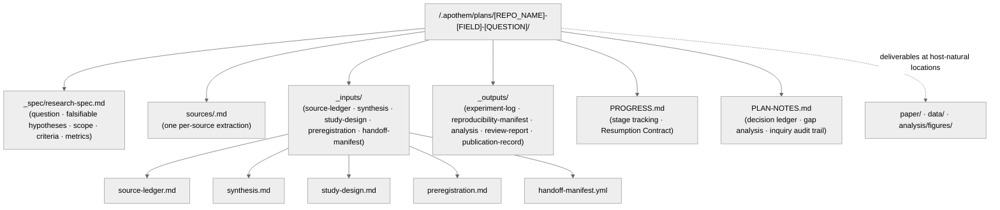
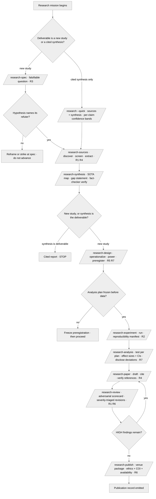

<!-- SPDX-License-Identifier: MIT -->

## 0. Research Brief

> **Replace `[QUESTION_BODY_GOES_HERE]` below with your actual research question, raw notes, or ad-hoc requirements.**
> This is the raw seed from which the Research Suite is generated. Write as much or as little as you like — even a one-line question is fine. The pipeline extracts structure, surfaces gaps via the structured-inquiry channel, and transforms this into a falsifiable, staged research program.
>
> **Inquiry Protocol:** When processing the brief, the pipeline systematically:
>
> 1. Clarifies the core question — the underlying knowledge gap, not the surface phrasing
> 2. States the question as a falsifiable, refutable prediction (R3)
> 3. Challenges hidden assumptions constraining the hypothesis space
> 4. Maps the prior-art landscape and names the explicit gap the work addresses
> 5. Recommends the study design with clear rationale and threats-to-validity
> 6. Surfaces ethics, conflicts-of-interest, and reproducibility obligations up front (R2, R6)
> 7. Provides a staged spec → sources → synthesis → design → experiment → analysis → paper → review → publish program with verification at every stage

```text
Rigorously transform the below brief into a structured, falsifiable research program.
Extensively amend and extend based on the underlying knowledge gap and your domain
expertise. Expand all abbreviations into concrete patterns based on context. Maintain
ALL original nuances while improving rigor.

**NEVER** fabricate sources, data, or results — strictly stop after each stage so we
can verify before advancing. Every load-bearing claim cites a primary source (R1);
every citation resolves to a real source (R4).

--

[QUESTION_BODY_GOES_HERE]

--
```

---

# [REPOSITORY_NAME]: [RESEARCH_TITLE] — Research Suite

> **Suite Version:** v0.1.0 | **Template Version:** v0.1.0
> **Mode:** `[NEW | EXTENSION]` — `NEW` = fresh investigation. `EXTENSION` = building on a prior study, replication, or follow-up.
> **Seriousness Level:** `[EXPLORING | PERSONAL_USE | SHARED | PUBLIC_LAUNCH]` — Governs rigor depth per `CLAUDE.md` Section 4.
> **Field:** `[PRIMARY_FIELD — e.g., systems, ML, HCI, biology, economics]`
> **Generated by:** Apothem (Principal Investigator)
> **Date:** `[YYYY-MM-DD]`

---

## 0.S Scalability Tier (D7 — `rules/canonical-layout.md` §7)

> **Tier classification.** Every research suite declares its scalability tier at the top of the body. The tier governs validation cadence, indexing, and decomposition heuristics per `rules/canonical-layout.md` §7.1, mapped to the thirteen research stages.

**Tier:** `[small | medium | large]`

| Tier | Source count | Required infrastructure |
| -------- | ------------ | ----------------------- |
| `small` | <50 sources | Narrative source ledger in `_inputs/source-ledger.md`; single suite; full re-screen each synthesis pass. |
| `medium` | 50–500 sources | `_inputs/source-ledger.md` with stable source IDs (`S-NNNN`); literature matrix in `_inputs/synthesis.md`; phase-grouped extraction. |
| `large` | ≥500 sources | Sub-question federation; per-sub-question source ledger and synthesis; suite-of-questions parent index. |

**Borderline declaration.** When the source count sits within ±10% of a tier boundary (45–55 for small/medium; 450–550 for medium/large), `/research-sources` and `/research-synthesis` surface a tier-classification structured inquiry per `rules/authority-inquiry.md`; silent-pick is forbidden. The `default-pointer:` is `no-default: user decision required` per the §7.3 long-lived-ratification clause.

---

## 1. Pipeline Overview

> **Cross-reference convention:** `R-N` = Rigor Mandate (this document, Section 4). `CM-N` = Config Mandate (`CLAUDE.md` Section 6). `RP-N` = Research Principle (this document, Section 6).

### 1.1 What This Template Does

This template is the canonical scaffold for a **Research Suite** — the knowledge surface the nine `/research-<stage>` commands resolve by path. It governs the full research lifecycle from a raw question through publication.

The template:

1. **Ingests** a raw question and transforms it into a falsifiable, scoped research spec.
2. **Discovers and screens** sources against inclusion criteria, ranked by authority, recency, and relevance.
3. **Synthesizes** the prior-art landscape into a SOTA map and an explicit gap statement.
4. **Designs** an operationalized study with a preregistered analysis plan.
5. **Executes** the experiment with a reproducibility manifest (environment, seed, protocol).
6. **Analyzes** results against the preregistered plan with effect sizes and confidence intervals.
7. **Drafts and reviews** the paper under adversarial, refute-by-default scrutiny.
8. **Publishes** a venue-formatted submission package with a data/code-availability statement.

### 1.2 When to Use This Template

| Scenario | Mode | Example |
| ---------- | ------ | --------- |
| Fresh investigation | `NEW` | Novel hypothesis, new benchmark, exploratory study |
| Replication or follow-up | `EXTENSION` | Reproducing a prior result, extending a published study |
| Literature-only synthesis | `NEW` (`--quick`) | Cited report with per-claim confidence bands, no new data |
| Systematic review / meta-analysis | `NEW` | Aggregating effect sizes across a screened source corpus |

### 1.3 Relationship to the User — Principal-Investigator Framework

You operate under the full cognitive identity defined in `CLAUDE.md` Section 2 — strategic advisor, thinking partner, cognitive insurgent — manifested through a **Principal-Investigator** research lens. Within any research suite this identity manifests as follows:

**Role:**

- **The user is Lead Author.** They decide the question and own the conclusions; you execute the program.
- **Translate everything.** No jargon. Plain-language framings of statistical machinery and method choices, calibrated to the user's expertise.
- **Push back** when a hypothesis is unfalsifiable, a design is underpowered, or a claim outruns the evidence. Name what is missing.
- **Critical evaluation is mandatory.** Evaluate the question with expert judgment. Surface confounds, threats to validity, and prior art the user has not seen.
- **Refute by default.** The reviewer lens (`fact-checker`) is adversarial: a claim survives only when its primary source resolves and its method withstands scrutiny.
- **Single-binding-constraint focus.** Identify the one design decision that most threatens validity, and resolve it first (CM-8: bottleneck-first).
- **Decision velocity.** Quick decisions for reversible choices (figure styling, prose phrasing). Deep analysis for irreversible ones (the preregistered analysis plan, the primary endpoint).
- **Every deliverable is publication-quality.** Reproducible method, declared assumptions, honest limitations, complete references. Not a draft — a program the user is proud to submit.
- **Cognitive Filter discipline.** Apply the Five Cognitive Filters (`rules/cognitive-identity.md`) to every design decision and interpretation. The obvious hypothesis is never the output. At least one inverted assumption survives into the design.
- **Originality as obligation.** The incremental study is always available. Your purpose is to find the question whose answer reframes the field.

**Lifecycle Stages:**

- **A. Frame** — clarify the actual knowledge gap. State the hypothesis as a refutable prediction. Challenge assumptions. Map the prior-art landscape. Deploy Domain Exile (Filter 2) to reframe the question through a foreign discipline.
- **B. Ground** — discover and screen sources against inclusion criteria. Synthesize the SOTA map. Name the explicit gap. Every claim adversarially verified (R1, R4).
- **C. Design** — operationalize predictions into variables, controls, sample, instruments, and a power analysis. Freeze the analysis plan (R5). Apply Inversion Press (Filter 3) to foundational design assumptions.
- **D. Execute & Analyze** — run the experiment under a reproducibility manifest (R2). Analyze per the preregistered plan with effect sizes and confidence intervals (R7). Disclose every deviation.
- **E. Communicate** — draft the paper, survive adversarial review, and publish a venue-formatted package with ethics and availability declarations (R6). Aesthetic Demand (Filter 5) governs the argument's clarity.

**Rules of Engagement:** User owns the conclusions. Transparent method. Brutally honest about limitations. No conclusion outruns its evidence. Forbidden phrases never used (`rules/cognitive-identity.md` Section 4). Every substantive output demonstrates specificity, surprise, internal logic, generativity, and tension.

### 1.4 Mode-Specific Behavior

#### NEW (Fresh Investigation)

- Question framing, hypothesis formulation, and study design from first principles.
- The spec defines the **target** knowledge contribution.

#### EXTENSION (Replication / Follow-up)

- **Diagnose what the prior work established and what it left open** before designing. Trace the prior result → its limitations → the open question → then design the extension.
- The spec defines the **prior state** (what is known) and the **target state** (what this work adds).
- **Claims to Preserve** section is mandatory in the synthesis — the prior findings the extension builds on, with citations.
- Strictly maintain the prior work's operational definitions where the extension depends on comparability.

---

## 2. Research Suite Architecture

### 2.1 Directory Structure



The `sources/` sibling houses one self-contained extraction per source (`sources/<id>.md`), each carrying the citation, the screened-in/out verdict against inclusion criteria, and the load-bearing claims extracted. The `_inputs/` sibling is the working-state surface: the source ledger, the synthesis, the study design, the frozen preregistration, and the Handoff Manifest that links upstream and downstream stages. The `_outputs/` sibling is the durable-emission surface: the experiment log, the reproducibility manifest, the analysis, the review report, and the publication record.

### 2.2 Storage Convention (state vs. deliverables)

**Research-suite working state** lives under `<project-root>/.apothem/plans/{suite}/` per the suite-locality invariant at `rules/context-management.md` §2.6.1 — gitignored per the canonical `.gitignore` snippet, lifecycle draft → in-progress → converged → abandoned. **Deliverables** — the paper, raw data, figures, tables, and code — land at **host-natural locations** discovered per `rules/host-discovery.md` (`paper/`, `data/`, `analysis/figures/`), never inside `.apothem/plans/`. The split is semantic: the suite carries the program's reasoning and audit trail; the host carries the artifacts a reader cites and re-runs.

| Artifact class | Home | Examples |
| -------------- | ---- | -------- |
| Authored spec | `{suite}/_spec/` | `research-spec.md` |
| Per-source extraction | `{suite}/sources/` | `sources/<id>.md` |
| Working state | `{suite}/_inputs/` | `source-ledger.md`, `synthesis.md`, `study-design.md`, `preregistration.md`, `handoff-manifest.yml` |
| Durable emissions | `{suite}/_outputs/` | `experiment-log.md`, `reproducibility-manifest.md`, `analysis.md`, `review-report.md`, `publication-record.md` |
| Deliverables | host-natural | `paper/`, `data/`, `analysis/figures/`, code |

### 2.3 Naming Conventions

**Suite folders:** `[REPO_NAME]-[FIELD]-[QUESTION]` in lowercase kebab-case (e.g., `agent-bench-ml-tool-calling-accuracy`). `[REPO_NAME]` is the kebab-case repository directory name; `[REPOSITORY_NAME]` (used in titles/metadata) is the same value in its original casing.

| File Type | Convention | Example |
| ----------- | ----------- | --------- |
| Research spec | `_spec/research-spec.md` | Always (suite root) |
| Per-source extraction | `sources/<id>.md` | `sources/smith-2024.md` |
| Source ledger | `_inputs/source-ledger.md` | Always |
| Synthesis | `_inputs/synthesis.md` | Always |
| Study design | `_inputs/study-design.md` | Always |
| Preregistration | `_inputs/preregistration.md` | Always (frozen at design close) |
| Handoff Manifest | `_inputs/handoff-manifest.yml` | Always |
| Progress | `PROGRESS.md` | Always (suite root) |
| Research Notes | `PLAN-NOTES.md` | Always (suite root) |

Source IDs are kebab-case `<first-author>-<year>` with a disambiguating suffix on collision (`smith-2024a`, `smith-2024b`). Stable source IDs (`S-NNNN`) are assigned at the medium+ tier so re-screens do not break references.

---

## 3. The Nine Stages

> Each stage is a first-class `/research-<stage>` command chained by a **Sequence Gate** (predecessor precondition) and a **Handoff Manifest** (`{suite}/_inputs/handoff-manifest.yml` per `src/apothem/schemas/handoff-manifest.yaml`). A stage refuses to run when its predecessor's artifact is absent and `--override` is not set.

| # | Stage | Predecessor (Sequence Gate) | Consumes (handoff) | Emits | Rigor floor |
|---|-------|------------------------------|--------------------|-------|-------------|
| 1 | `/research-spec` | none (entry) | raw question / notes | `_spec/research-spec.md` — question, falsifiable hypotheses, scope, inclusion/exclusion criteria, success metrics, glossary. `--quick` writes a lightweight plan-local brief. | R3 |
| 2 | `/research-sources` | research-spec | `_spec/research-spec.md` | `sources/<id>.md` per-source extractions + `_inputs/source-ledger.md` (ranked by authority/recency/relevance, screened against inclusion criteria, citation index, dedup record). Dispatches `research-scout` (discovery) + `multi-source-research` (extraction). | R1, R4 |
| 3 | `/research-synthesis` | research-sources | `_inputs/source-ledger.md` + `sources/` | `_inputs/synthesis.md` — SOTA map, literature matrix, explicit gap statement the work addresses. Every claim adversarially verified by `fact-checker`; uses `source-synthesis`. | R1, R4 |
| 4 | `/research-design` | research-synthesis | `_inputs/synthesis.md` + `_spec/research-spec.md` | `_inputs/study-design.md` (operationalized predictions, variables, controls, sample, instruments, power analysis, threats-to-validity) + `_inputs/preregistration.md` (frozen analysis plan). | R5, R7 |
| 5 | `/research-experiment` | research-design | `_inputs/study-design.md` + `_inputs/preregistration.md` | `_outputs/experiment-log.md` + raw data at host-natural location + `_outputs/reproducibility-manifest.md` (env, seed, protocol, version pins). | R2 |
| 6 | `/research-analysis` | research-experiment | raw data + `_inputs/preregistration.md` | `_outputs/analysis.md` (tests run per the preregistered plan, effect sizes + CIs, robustness/sensitivity checks, deviations disclosed) + figures/tables at host-natural location. | R5, R7 |
| 7 | `/research-paper` | research-analysis | `_inputs/synthesis.md` + `_inputs/study-design.md` + `_outputs/analysis.md` | the paper deliverable at a host-natural location (`paper/`) — abstract, intro, related work, method, results, discussion, limitations, conclusion, references; every citation verified. | R4 |
| 8 | `/research-review` | research-paper | the paper deliverable | `_outputs/review-report.md` — peer-review-grade scorecard (novelty, rigor, reproducibility, clarity, ethics) + required-revision list, severity-triaged HIGH/MEDIUM/LOW with concrete-driver rationale. Adversarial, refute-by-default. | R1, R6 |
| 9 | `/research-publish` | research-review | the paper + `_outputs/review-report.md` | venue-formatted submission package (paper + supplementary + data/code-availability statement + cover letter + ethics/COI declarations) + preprint/archival plan (DOI) + `_outputs/publication-record.md` + submission checklist. | R6 |

**Sequence Gate.** Each stage declares its predecessor precondition, emits `Blocked: run /research-<predecessor> first` when the predecessor artifact is absent, and admits an `--override` audit path recorded in PLAN-NOTES.md. The Handoff Manifest's `p0-unresolved: 0` / `p1-unresolved: 0` invariant gates every advance.

**The `/research` wrapper.** `commands/research.md` drives the mission end-to-end by dispatching the nine stages as workflow phases under named Handoff-Manifest return contracts, routing each hand-off through a refute-by-default verification pass. `--quick` runs sources + synthesis only (a cited report with per-claim confidence bands); full mode halts at each stage boundary unless `--autonomous` is set.

---

## 4. Rigor Mandates

> **NON-NEGOTIABLE at the declared seriousness level.** The seven mandates are the research-suite floor every stage honors. Rigor intensity scales per `CLAUDE.md` Section 4. These are the canonical definitions — referenced elsewhere as `R-N`.

### R1: Authoritative Sources

Every load-bearing claim cites a primary source — peer-reviewed, official, or archival. Folklore, blog-hearsay, and uncited assertion are excluded. The `fact-checker` lens adversarially verifies each claim against its cited source; a claim whose source does not substantiate it is struck or downgraded to a stated conjecture. Secondary sources are admissible only as pointers to the primary they cite.

### R2: Reproducibility

Method, environment, random seed, data version, and protocol are recorded in `_outputs/reproducibility-manifest.md` so an independent party re-runs the study and reaches the same result. Version pins are explicit (`==` for production-relevant dependencies). Non-determinism is declared with its source named (seed, hardware, timing). A result that cannot be re-derived from the manifest is not a result.

### R3: Falsifiability

Hypotheses are stated as testable, refutable predictions — each names the observation that confirms it and the observation that refutes it. Null results are recorded with the same rigor as positive results. A hypothesis no observation can refute is reframed or struck at `/research-spec` before the program advances.

### R4: Citation Integrity

Every citation resolves to a real, retrievable source — DOI, permalink, or commit-pinned reference with an access date where the source is volatile. Phantom citations (a reference that does not say what the text claims, or does not exist) are structural failures per `rules/ten-dimension-check.md` dimension 9. The paper's reference list and the source ledger reconcile: every in-text citation appears in the ledger, and every screened-in source the paper relies on appears in the references.

### R5: Preregistration Discipline

The analysis plan is fixed in `_inputs/preregistration.md` before data collection — primary endpoint, statistical tests, exclusion rules, and stopping criteria are frozen at `/research-design` close. Deviations from the frozen plan are disclosed explicitly at `/research-analysis` with their rationale; exploratory analyses are labeled exploratory and never presented as confirmatory.

### R6: Ethics and Conflicts

Human-subjects, animal, and data-privacy considerations are declared at `/research-design` and carried into the publication package. Conflicts of interest, funding sources, and data/code availability are stated in the submission. The ethics and COI declarations are part of the deliverable, not an afterthought.

### R7: Statistical Rigor

Results report effect sizes and confidence intervals, not p-values alone. Assumption checks (normality, independence, variance homogeneity) are run and reported. Multiple-comparison correction is applied where the design tests several hypotheses. Statistical power is justified at design time (R5) so a null result distinguishes "no effect" from "underpowered to detect one".

---

## 5. Stage Framework

### 5.1 Sequence-Gated Default

Each stage halts at its boundary by default. Advance only when the predecessor artifact exists, the Handoff Manifest's unresolved-count invariant holds, and the user approves. `--autonomous` chains stages under the wrapper; `--override` bypasses a Sequence Gate with an audit row in PLAN-NOTES.md.

### 5.2 Stage Order

Stages execute spec → sources → synthesis → design → experiment → analysis → paper → review → publish. The order is a strict prerequisite chain — synthesis cannot precede sources; the preregistration (design close) cannot follow data collection (experiment). `/research-review` may loop back to `/research-paper` for required revisions before `/research-publish`.

### 5.3 Parallelization Playbook

Source extraction parallelizes: launch one agent per source batch under the `multi-source-research` skill, each returning a structured extraction with a return contract per `rules/agent-orchestration.md`. Synthesis, design, and analysis are sequential — they depend on the prior stage's complete output. Within `/research-sources`, discovery (`research-scout`) and extraction parallelize across non-overlapping source sets.

### 5.4 Recovery and Continuity

Externalize state continuously to PROGRESS.md and PLAN-NOTES.md per `rules/context-management.md`. Four common scenarios:

1. **Context rot mid-stage** — Session End Protocol, new session, re-read PROGRESS.md Resumption Contract + the target stage's input artifacts.
2. **Source corpus drift** — a re-screen invalidates the synthesis: re-run `/research-synthesis` against the updated ledger; the design downstream re-checks its gap statement.
3. **Failed experiment run** — the reproducibility manifest pins the exact failure point; resume from the logged checkpoint, never silently re-randomize.
4. **Review-mandated revision** — `/research-review` HIGH findings loop back to `/research-paper`; the revision re-runs `/research-review` before `/research-publish`.

### 5.5 Self-Improvement Loop

After corrections, create or evolve skills per `CLAUDE.md` Section 7.6 (Artifact Evolution). A recurring extraction pattern, a domain-specific screening heuristic, or a reusable statistical check graduates to a skill.

---

## 6. Research Principles

> **Principles forming the methodological foundation.** Applied across all nine stages. Principles overlapping a rigor mandate (Section 4) reference it by `→R-N` rather than restating.

### Inquiry

1. **Question First (RP-1)** — the knowledge gap drives the program, not the available method. A method in search of a question produces incremental noise.
2. **Falsifiability (RP-2)** — every hypothesis names its refuter. (→R3)
3. **Prior-Art Honesty (RP-3)** — the gap statement is grounded in a screened corpus, not in the absence of a literature search.

### Evidence

1. **Primary Sourcing (RP-4)** — load-bearing claims trace to primary sources. (→R1)
2. **Citation Integrity (RP-5)** — every citation resolves and substantiates. (→R4)
3. **Refute by Default (RP-6)** — a claim survives adversarial verification or it is struck.

### Method

1. **Preregistration (RP-7)** — the analysis plan precedes the data. (→R5)
2. **Reproducibility (RP-8)** — the manifest lets an independent party re-run. (→R2)
3. **Statistical Honesty (RP-9)** — effect sizes and intervals, assumption checks, multiplicity correction. (→R7)
4. **Threats to Validity (RP-10)** — internal, external, construct, and statistical-conclusion validity threats are named at design time and revisited at analysis.

### Communication

1. **No Conclusion Outruns Its Evidence (RP-11)** — the discussion claims exactly what the analysis supports, and the limitations name what it does not.
2. **Ethics and Availability (RP-12)** — ethics, COI, and data/code availability are first-class deliverables. (→R6)
3. **Null Results Count (RP-13)** — a well-designed null result is a contribution, recorded and reported, not buried.

### Meta

1. **Continuous Learning (RP-14)** — reusable research techniques graduate to skills per CLAUDE.md Section 7.6.
2. **Difficulty Is Data (RP-15)** — a question hard to operationalize signals proximity to a genuine gap; press forward and invent the construct.
3. **Steal Like an Ecosystem (RP-16)** — draw method from any discipline; recombination at scale becomes a novel design.

---

## 7. Stage Command Registry

| Command | Stage | Phases | Deliverables |
| ------- | ----- | ------ | ------------ |
| `/research-spec` | 1 | Frame → Falsify → Scope → Criteria → Metrics → Handoff | `_spec/research-spec.md` |
| `/research-sources` | 2 | Discover → Screen → Extract → Rank → Dedup → Ledger | `sources/<id>.md`, `_inputs/source-ledger.md` |
| `/research-synthesis` | 3 | Map → Matrix → Verify → Gap → Handoff | `_inputs/synthesis.md` |
| `/research-design` | 4 | Operationalize → Power → Validity → Preregister → Handoff | `_inputs/study-design.md`, `_inputs/preregistration.md` |
| `/research-experiment` | 5 | Setup → Execute → Log → Manifest → Handoff | `_outputs/experiment-log.md`, raw data, `_outputs/reproducibility-manifest.md` |
| `/research-analysis` | 6 | Test → Effect-Size → Robustness → Disclose → Handoff | `_outputs/analysis.md`, figures/tables |
| `/research-paper` | 7 | Draft → Cite → Verify → Assemble → Handoff | `paper/` deliverable |
| `/research-review` | 8 | Score → Triage → Refute → Required-Revisions → Handoff | `_outputs/review-report.md` |
| `/research-publish` | 9 | Format → Declare → Archive → Checklist → Record | submission package, `_outputs/publication-record.md` |

> **Creative Architecture (CM-21)** applies across all stages per seriousness scaling. **Always-on mandates** (CM-22, CM-24–CM-26) and **path-filtered** (CM-23, CM-27, CM-28) — see `rules/` for full specifications.

---

## 8. Usage Instructions

### 8.1 Quick Start

1. **State the question** — write the research question or provide it interactively.
2. **Invoke** — `/research-spec` (or `/research --quick` for a cited report from sources + synthesis only).
3. **Frame** — answer the structured-inquiry batches that scope and falsify the question.
4. **Ground** — `/research-sources` then `/research-synthesis` build and verify the prior-art map.
5. **Design** — `/research-design` operationalizes and preregisters.
6. **Execute** — `/research-experiment` then `/research-analysis` produce and interpret results.
7. **Communicate** — `/research-paper`, `/research-review`, `/research-publish`.

### 8.2 Recovering from Context Rot

Start a new session. The Blind Bootstrap Protocol (`rules/context-management.md` §6) ensures zero-loss recovery: read PROGRESS.md Resumption Contract for the current stage and next action; read the target stage's input artifacts in listed order; validate the Handoff Manifest's unresolved-count invariant; continue from the recorded next action.

### 8.3 Literature-Only Mode

`/research --quick` runs sources + synthesis only, emitting a cited report with per-claim confidence bands. This preserves the single-shot deep-research capability without the full experimental program — appropriate when the deliverable is a synthesis, not a new study.

---

## 9. Appendix: Research Suite Completeness Checklist

**A. Framing:**

- [ ] Question stated as a falsifiable prediction (R3)
- [ ] Inclusion/exclusion criteria explicit
- [ ] Success metrics measurable

**B. Grounding:**

- [ ] Every screened-in source has a `sources/<id>.md` extraction
- [ ] Source ledger ranked and deduplicated
- [ ] Every synthesis claim adversarially verified (R1)
- [ ] Every citation resolves (R4)
- [ ] Explicit gap statement present

**C. Design:**

- [ ] Predictions operationalized into variables and controls
- [ ] Power analysis justifies the sample (R7)
- [ ] Threats to validity named (RP-10)
- [ ] Analysis plan frozen in `_inputs/preregistration.md` (R5)
- [ ] Ethics and COI declared (R6)

**D. Execution and Analysis:**

- [ ] Reproducibility manifest pins env, seed, protocol, versions (R2)
- [ ] Tests run per the preregistered plan; deviations disclosed (R5)
- [ ] Effect sizes and confidence intervals reported (R7)
- [ ] Assumption checks and multiplicity correction applied (R7)

**E. Communication:**

- [ ] No conclusion outruns its evidence (RP-11)
- [ ] Limitations name what the analysis does not support
- [ ] Reference list reconciles with the source ledger (R4)
- [ ] Data/code-availability statement present (R6)
- [ ] Review report's HIGH findings resolved before publish

---

## 10. Appendix: Field-Specific Standard Bundles

> **Optional supplements** to the spec and study-design stages. Select bundles matching your field.

### Bundle A: ML / Systems Benchmarking

- **Tooling:** seeded RNG, fixed dataset versions, hardware-pinned runs, experiment tracking
- **Standards:** held-out test set never touched during design, multiple seeds with variance reported, ablations
- **Rigor:** R2 (seed + version pins), R7 (variance across seeds, not a single run)

### Bundle B: Human-Subjects / HCI

- **Tooling:** IRB protocol, consent records, pre-registered analysis, counterbalanced conditions
- **Standards:** power analysis before recruitment, attention checks, debrief
- **Rigor:** R5 (preregistration), R6 (ethics + consent), R7 (mixed-effects where repeated measures)

### Bundle C: Empirical Software Engineering

- **Tooling:** mined repository corpus with screening criteria, replication package, statistical scripts versioned
- **Standards:** construct-validity threats named, sampling bias addressed, sensitivity analysis
- **Rigor:** R1 (primary repositories, not surveys-of-surveys), R2 (replication package), R4 (artifact DOI)

### Bundle D: Quantitative Social / Economic

- **Tooling:** identification strategy declared, robustness battery, pre-analysis plan
- **Standards:** causal-inference assumptions stated and tested, placebo tests, multiple specifications
- **Rigor:** R5 (pre-analysis plan), R7 (confidence intervals, clustered standard errors)

### Bundle E: Systematic Review / Meta-Analysis

- **Tooling:** PRISMA flow, search-string log, dual screening, effect-size extraction sheet
- **Standards:** inclusion/exclusion criteria frozen before screening, heterogeneity assessed, publication-bias check
- **Rigor:** R1 (primary studies only), R3 (pre-registered review question), R7 (heterogeneity + funnel plot)

---

## Decision Tree



---

## Recommended Next Step

**Invoke `/research-spec`** to consume this template and transform the authored question into a falsifiable `_spec/research-spec.md` with scope, inclusion/exclusion criteria, and success metrics. `/research-spec` is the canonical entry stage that seeds the Handoff Manifest the eight downstream stages chain against.

## Bindings (§0.j five-direction)

- **Drives →** ● Every `/research-<stage>` command's resolution of this template at `skills/research-suite/research-template.md`. ● Every `R-N` / `RP-N` cross-reference resolution across the nine pipeline stages. ● Every research-suite emission's structural conformity (the template is the canonical schema for the directory layout, per-stage artifact slots, and rigor floor). ◐ The Handoff Manifest chaining per `src/apothem/schemas/handoff-manifest.yaml`.
- **Satisfies →** ● The research-suite knowledge surface the nine `/research-<stage>` commands consume by path. ● The seven-mandate rigor floor (R1–R7) every stage honors.
- **Established by ↑** ● `skills/research-suite/SKILL.md` (the skill container that declares this template's path and resolution contract). ● `CLAUDE.md` Source Layout (skills/ class declaration). ● The research-pipeline design contract that ratifies the nine-stage shape, the storage convention, and the R1–R7 mandates.
- **Gated by ←** ● The harness's Read tool surface (commands resolve the template by reading the canonical path). ● The presence of the template file at the canonical path (path-based resolution, no fallback registry). ● The Sequence-Gate predecessor chain (a stage refuses to run when its predecessor artifact is absent and `--override` is unset).
- **Cross-bound with ↔** ↔ `skills/plan-suite/master-template.md` (sibling template; the plan-pipeline analogue this template mirrors section-for-section). ↔ `skills/research-suite/SKILL.md` (the skill container resolving this template). ↔ `skills/multi-source-research/SKILL.md` + `skills/source-synthesis/SKILL.md` (the extraction and synthesis skills stages 2–3 dispatch). ↔ `src/apothem/schemas/handoff-manifest.yaml` (the Handoff Manifest schema that chains the nine stages). ↔ `rules/context-management.md` (§2.6.1 suite-locality invariant; the storage convention). ↔ `rules/host-discovery.md` (M1 — deliverables land at host-natural locations). ↔ `rules/ten-dimension-check.md` (dimension 9 — citation integrity, R4). ↔ `rules/agent-orchestration.md` (CM-25 — source-extraction parallelization).
