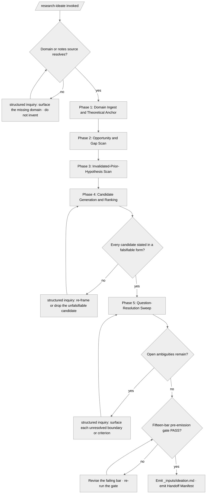

<!-- SPDX-License-Identifier: MIT -->

## Decision Tree

```mermaid
%%{ init: { "theme": "neutral" } }%%
%% verified: 2026-06-16 %%
%% provenance: commands/research-ideate.md §Workflow %%
%% cross-reference: commands/research-spec.md (successor), skills/research-suite/SKILL.md §Thirteen-Stage Research Lifecycle, rules/interactive-questions.md (canonical channel) %%
flowchart TD
    Start[/research-ideate invoked/] --> Source{Domain or notes source resolves?}
    Source -->|no| AskSrc[structured inquiry: surface the missing domain · do not invent]
    AskSrc --> Source
    Source -->|yes| P1[Phase 1: Domain Ingest and Theoretical Anchor]
    P1 --> P2[Phase 2: Opportunity and Gap Scan]
    P2 --> P3[Phase 3: Invalidated-Prior-Hypothesis Scan]
    P3 --> P4[Phase 4: Candidate Generation and Ranking]
    P4 --> Fals{Every candidate stated in a falsifiable form?}
    Fals -->|no| AskFals[structured inquiry: re-frame or drop the unfalsifiable candidate]
    AskFals --> P4
    Fals -->|yes| P5[Phase 5: Question-Resolution Sweep]
    P5 --> Open{Open ambiguities remain?}
    Open -->|yes| AskOpen[structured inquiry: surface each unresolved boundary or criterion]
    AskOpen --> P5
    Open -->|no| Gate{Fifteen-bar pre-emission gate PASS?}
    Gate -->|no| Revise[Revise the failing bar · re-run the gate]
    Revise --> Gate
    Gate -->|yes| Emit[Emit _inputs/ideation.md · emit Handoff Manifest]
```
