{/* SPDX-License-Identifier: MIT */}

هذه هي التعليمات بنطاق المستودع للهارنس
متعدّدة العاملين (منصّات التنسيق، والمُوزِّعات،
ومنصّات المساعدة المستقلّة) عند العمل في هذا المستودع.
وهي إلزامية وتُشحَن مع كل نسخة منشورة. وهي
متّسقة مع [`AGENTS.md`](https://github.com/ahmed-g-gad/apothem/blob/main/AGENTS.md)
و[`CLAUDE.md`](https://github.com/ahmed-g-gad/apothem/blob/main/CLAUDE.md)
ومع التعليمات بنطاق المشروع لأسطح الهارنس
المدعومة الأخرى؛ وحيث تتداخل الأسطح على انضباط مشترك (انضباط Plans،
وترويسات الملفات، ومعالجة الالتباس، والتسمية، والأنماط المضادّة،
والتدرّج الوصفي) فهي متكافئة دلاليًّا و<bdi>`AGENTS.md`</bdi> هو
صوت المشروع الكنسي.

## سياق المشروع

هذا المستودع هو منظومة أدوات للمطوّرين تستضيف
تهيئة وقت تشغيل مساعد برمجي: العاملون المُفوَّضون،
وأوامر-الشَّرطة المائلة، والمهارات، والخطّافات، وأنماط-الإخراج، وسطر-الحالة، وتكامل MCP،
والإعدادات، ومخطّطات JSON، وأدوات التحقّق، والاختبارات، والمستندات.
يُصان بمؤلِّف واحد. تخطيط القرص يعكس تخطيط وقت التشغيل
بدقّة. لا يخزّن العاملون المُفوَّضون في هذا المستودع أي حالة
خارج الشجرة المنشورة؛ فالشجرة المنشورة هي الأثر
الكنسي.

## اصطلاحات العاملين

يتّبع تشغيل متعدّد العاملين في هذا المستودع ثلاثة اصطلاحات:

- **الأدوار مُسمّاة.** يحمل كل عامل مُفوَّض في تشغيل متعدّد العاملين
  مُعرِّف دور (kebab-case، وصفيًّا:
  `codebase-explorer` و`convention-auditor` و`quality-gate`
  و`memory-auditor`). أسماء الأدوار العامّة (`worker` و`helper`) ممنوعة.
- **عقود الإرجاع صريحة.** يحدّد كل استدعاء عامل
  شكل الإرجاع المتوقَّع — ملخّص مُهيكَل، وميزانية الحدّ الأقصى للرموز،
  والحقول المطلوبة، وصياغة وضع-الفشل. يرفض المُوزِّع
  عمليات الإرجاع المُشوَّهة بدلًا من إعادة المطالبة صامتًا.
- **الحالة المشتركة هي نظام الملفّات.** لا يتشارك العاملون المُفوَّضون
  ذاكرة عبر حدّ التوزيع. الحالة التي يحتاجها عاملان
  تتدفّق عبر ملفّ مُسمّى تحت الشجرة المنشورة (أو دليل
  `.apothem/plans/` الخاصّ بالمشروع لحالة العمل الجارية وفق *انضباط
  Plans*؛ ويُرحَّل مسار `.plans/` القديم عبر `apothem migrate-workspace`).
{/* [Machine-seeded — pending review] */}

عندما تكون مهمّة العامل متعدّدة الخطوات، يُسجَّل أثر عمله
في `<project-root>/.apothem/plans/YYYY-MM-DD--<slug>.md` وفق *انضباط
Plans*؛ ويقرأ المُوزِّع الخطّة لتنسيق العاملين اللاحقين.
لا تُودَع الخطط أبدًا في git.

## ترويسات الملفّات

كل ملفّ جديد قابل للتطبيق يولّده المساعد **يجب** أن يبدأ
بترويسة ترخيص SPDX الكنسية أحادية-السطر وفق
[`site/content/docs/reference/authorship-header.mdx`](/docs/reference/authorship-header)، في النسخة
المطابقة لنوع الملفّ. أما تركيبة الترويسة الدقيقة بالبايت فموجودة في
[`src/apothem/schemas/authorship-header.txt`](https://github.com/ahmed-g-gad/apothem/blob/main/src/apothem/schemas/authorship-header.txt).

لإضافة الترويسة، يستدعي المساعد الحاقن الكنسي:

```bash
python scripts/inject-header.py --mode fix-in-place <path>
```

الحاقن مُتعادل القوّة (idempotent) ويكتشف النسخة من المسار. الترويسة
**مُعفاة** للأصناف المُعدَّدة في
[`src/apothem/schemas/header-exceptions.txt`](https://github.com/ahmed-g-gad/apothem/blob/main/src/apothem/schemas/header-exceptions.txt) —
LICENSE، وملفّات JSON، وملفّات القفل، والملفّات المُولَّدة، والمحتوى المُورَّد،
وزائلات `.audit/`، وزائلات `<project-root>/.apothem/plans/`، والعلامات الفارغة،
والثنائيّات.

## انضباط Plans

**يجب ألّا** يولّد المساعد شيفرة أو نصوصًا برمجية أو نثرًا يكتب
إلى دليل تهيئة إطار العمل أو أي موقع plans عالمي آخر.
آثار التخطيط — خطط تنسيق متعدّدة العاملين، واستراتيجيات
إعادة الهيكلة، ودفاتر تصحيح الأخطاء، وملاحظات الاستكشاف — تعيش
في `<project-root>/.apothem/plans/`
{/* [Machine-seeded — pending review] */}
(الموطن المعياري للخطط؛ ويُرحَّل مسار `<project-root>/.plans/` القديم عبر `apothem migrate-workspace`).

دليل `<project-root>/.apothem/plans/` (والمسار القديم `<project-root>/.plans/`) **مُتجاهَل في git** (gitignored) وفق
{/* [Machine-seeded — pending review] */}
مقتطف `.gitignore` الكنسي المُوثَّق في
[`site/content/docs/reference/plans-discipline.mdx`](/docs/reference/plans-discipline). **يجب
ألّا** تُودَع الخطط أبدًا في تاريخ git الخاصّ بالمشروع. تنتقل الخطط
عبر حالات دورة-الحياة **draft → in-progress → converged**
(الترقية إلى ADR) **→ abandoned / superseded**، المُسجَّلة في
حقل frontmatter `status:` لكل خطّة. تتّبع أسماء ملفّات الخطّة

```mermaid
%% provenance: hand-authored %%
%% verified: 2026-07-06 %%
%% cross-reference: the plan status: lifecycle described above; CLAUDE.md Plans Discipline %%
stateDiagram-v2
    accTitle: Apothem plan lifecycle states
    accDescr: A plan's frontmatter status field moves from draft to in-progress to converged, where a converged plan is promoted to an ADR. From draft or in-progress a plan may instead be abandoned; an in-progress or converged plan may be superseded. Abandoned and superseded are terminal.
    state "in-progress" as inprogress
    [*] --> draft
    draft --> inprogress
    inprogress --> converged
    converged --> [*]: promote to ADR
    draft --> abandoned
    inprogress --> abandoned
    inprogress --> superseded
    converged --> superseded
    abandoned --> [*]
    superseded --> [*]
```

`YYYY-MM-DD--<kebab-case-slug>.md`.



عندما يكون الإخراج الوسيط للمساعد تنسيقًا متعدّد الخطوات
(هياكل تفصيل-العمل، وإسناد الأدوار، وترتيب التوزيع)، يُوجَّه الإخراج
إلى ملفّ `<project-root>/.apothem/plans/YYYY-MM-DD--<slug>.md`
جديد بدلًا من نصّ محادثة أو رسالة إيداع.

## معالجة الالتباس

عندما يكون المساعد غير متيقّن من قيمة كان سيُضطرّ لولا ذلك
إلى اختلاقها، **يجب ألّا** يختلق صامتًا. تحمل استجابة المساعد
إمّا توزيعًا مُهيكَلًا لسؤال-المُشغِّل يعود إلى الإنسان
(حيث يدعمه وقت التشغيل) أو تعليقًا
`# TODO(clarify): ...` مُعلَّمًا بوضوح في الأثر المُولَّد. وكلاهما
نظير سطح متعدّد العاملين لقناة الاستفسار-المُهيكَل: سجلّ
قابل للمراجعة، غير صامت أبدًا، بأن افتراضًا قد أُجِّل إلى
الإنسان.

عند عدم اليقين، **يجب ألّا** يختلق المساعد أبدًا أصناف
البيانات التالية — الهوية، واتّجاه النطاق، والتفضيل (المُنسِّق /
المُدقِّق / إطار-الاختبار / مزوّد CI حيث لم يُصادِق المضيف
على واحد)، والأمان، والتسمية (اصطلاح جديد يُدخَل حيث لا يملك المضيف
أيًّا)، والبنية التحتية (نقاط النهاية، والمضيفات، والمنافذ، والمناطق، وأسماء الطوابير،
وأسماء الجداول)، وتثبيتات الإصدارات. في كلّ حالة من هذه، الاستجابة الصحيحة
هي سطح مكافئ-للاستفسار، وليست أبدًا عنصرًا نائبًا معقول-المظهر
يتجمّع بنجاح.

## الأنماط الممنوعة

ما يلي ممنوع في الشيفرة والنثر ورسائل الإيداع التي يولّدها المساعد:

- **الصفات التسويقية** — `powerful` و`seamless` و`robust`
  و`industry-leading` و`cutting-edge` و`world-class`. ممنوعة في
  الأثر المُوجَّه للمستخدم ما لم تُثبَت بشكل ملموس بقياس أو اقتباس
  مجاور مباشرةً.
- **الحَشو المُحفِّظ** — `basically` و`kind of` و`in some sense`
  و`more or less`. ممنوع في النصّ التوجيهي. وحيث يكون عدم اليقين
  حقيقيًّا، انصّ عليه بدقّة.
- **بقايا التصحيح** — `print()` و`console.log` و`eprintln!`
  و`fmt.Println` المتروكة في شيفرة مُودَعة كإخراج تصحيح أخطاء مُرتجَل.
- **مسارات منزل-المستخدم المُثبَّتة بالقيمة** — `/home/<user>/...`
  و`/Users/<user>/...` و`C:\Users\<user>\...`. استخدم `${HOME}` أو `~`
  أو `pathlib.Path.home()` أو الاستبدال وقت-التثبيت.
- **الأسرار في عمليات الإيداع** — أبدًا. تحظر خطّافات pre-commit ذلك؛
  ولا يحتال المساعد عليها.
- **الكتابات تحت `<project-root>/.apothem/plans/` التي تبلغ git** — أبدًا. الدليل
  مُتجاهَل في git.
- **معارضة `AGENTS.md`** — عندما يتداخل هذا الملفّ مع
  `AGENTS.md` على انضباط مشترك، فالاثنان متكافئان
  دلاليًّا. يتطلّب التجاوز الخاصّ-بالسطح علامة مُضمَّنة
  `<!-- coherence-override: <claim-id> -->` مقترنة بـ
  سِجِلّ قرار معماري (ADR) مُتتبَّع في سجلّ تصميم المشروع.
  سطح كتالوج ADR قادم؛ وإلى أن يحلّ،
  تستشهد التجاوزات بالعلامة المُضمَّنة إضافةً إلى الأساس المنطقي في frontmatter المساعد.

## التسمية

تستخدم الملفّات / المجلّدات **kebab-case**؛ مع استثناءات الأحرف-الكبيرة الكنسية لـ
`AGENTS.md` و`CLAUDE.md` و`README.md` و`LICENSE` و`CHANGELOG.md` و`SECURITY.md`
و`CODE_OF_CONDUCT.md` و`CONTRIBUTING.md` والملفّات القليلة عالية-المستوى
ذات الأحرف-الكبيرة-بالكامل التي تتطلّبها اصطلاحاتها.

تتّبع عمليات الإيداع **Conventional Commits**: `type(scope): subject` بصيغة
الأمر وموضوع دون 72 محرفًا. تتّبع وسوم الإصدار
**Semantic Versioning**: `vMAJOR.MINOR.PATCH`. وتتّبع الفروع
`type/short-description`.

## التدرّج الوصفي

يستخدم النثر التوجيهي تدرّج **RFC 2119** الوصفي: `MUST`
و`MUST NOT` و`SHOULD` و`SHOULD NOT` و`MAY`. تحمل عقود الإرجاع
التدرّج نفسه عند التعبير عن المتطلّبات (مثلًا، حقل إرجاع
ينصّ على "هذا الحقل MUST أن يكون سلسلة غير فارغة").

## صيغة الإخراج

تحمل الشيفرة التي يولّدها المساعد:

- سطحًا عامًّا مُوثَّقًا — لكل دالّة / صنف / وحدة عامّة
  سلسلة-توثيق أو تعليق ترويسة ينصّ على الشروط المُسبقة،
  والشروط اللاحقة، وأوضاع الفشل.
- أنواعًا حيث تدعمها اللغة (تلميحات أنواع Python؛ وأنواع TypeScript
  على كل تصدير؛ وأنواع إرجاع Go؛ وأنواع Rust في كل مكان).
- اختبارات حيث يوجد هيكل اختبار.
- ترويسة ترخيص SPDX الكنسية أحادية-السطر في رأس الملفّ.
- لا شيفرة مُعلَّقة-خارجًا.

تتّبع رسائل الإيداع التي يولّدها المساعد Conventional Commits مع
متن يشرح *لماذا* أُجرِي التغيير. وأسطر الموضوع
بصيغة الأمر وتبقى دون 72 محرفًا.

## قائمة المراجعة

قبل قبول مخرجات توزيع متعدّد العاملين للدمج —
سواءٌ أكان المراجِع إنسانًا أم عامل مراجعة لاحقًا — تحقّق من
كلّ من:

- ترويسة ترخيص SPDX الكنسية أحادية-السطر موجودة في رأس كل
  ملفّ جديد قابل للتطبيق.
- جميع أسماء الملفّات بصيغة kebab-case (مع استثناءات الأحرف-الكبيرة الكنسية).
- لا ملفّ تحت `<project-root>/.apothem/plans/` مُجهَّز للإيداع؛ ولا مسار
  يشير إلى دليل تهيئة إطار العمل كهدف كتابة.
- لا ادّعاء في الفرق (diff) يعارض `AGENTS.md`.
- أدوات التحقّق المحلّية تعمل خضراء.
- كلّ تعليق `TODO(clarify): ...` أُدخِل إمّا حُلَّ أو
  أُجِّل صراحةً مع أساس منطقي.
- لا صفات تسويقية، ولا حشو مُحفِّظ، ولا بقايا تصحيح، ولا
  مسارات منزل-المستخدم مُثبَّتة بالقيمة، ولا أسرار في الفرق.
- رسائل الإيداع هي Conventional Commits بمواضيع بصيغة الأمر
  دون 72 محرفًا.

## مؤشّرات

- [`AGENTS.md`](https://github.com/ahmed-g-gad/apothem/blob/main/AGENTS.md) —
  صوت المشروع الكنسي؛ كل ادّعاء مشترك في هذا الملفّ يعكس ادّعاءً
  هناك.
- [`CLAUDE.md`](https://github.com/ahmed-g-gad/apothem/blob/main/CLAUDE.md) —
  مرآة Claude Code.
- [`site/content/docs/reference/plans-discipline.mdx`](/docs/reference/plans-discipline) — مرجع
  انضباط Plans الكامل.
- [`site/content/docs/reference/authorship-header.mdx`](/docs/reference/authorship-header) — مرجع
  authorship-header الكامل.
- [`tests/fixtures/multi-surface-claims.yaml`](https://github.com/ahmed-g-gad/apothem/blob/main/tests/fixtures/multi-surface-claims.yaml) —
  قائمة الادّعاءات التي يُتحقَّق من هذا الملفّ في مقابلها بواسطة
  مُحقِّق `multi-surface-coherence`.
