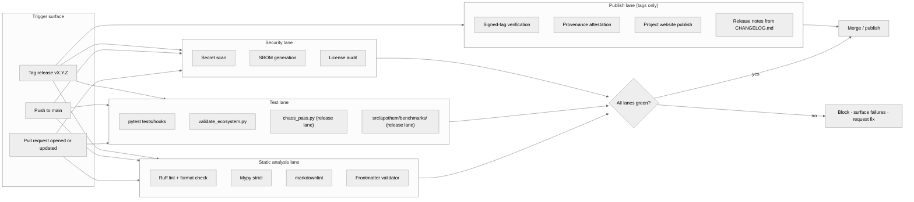

{/* SPDX-License-Identifier: MIT */}

**الخريطة البنيوية لسير عمل البناء · التحقّق · النشر الذي يُبوِّب كلّ تغيير في
منظومة <bdi>Apothem</bdi>.** يُثبِّت هذا المستند سطح التصوير؛ أمّا ملفّات سير
العمل الفعلية لـ<bdi>GitHub Actions</bdi> وأدوات الإصدار فتُوضَع لاحقًا ضمن تثبيت
الجاهزية للإنتاج.

## شكل خط الأنابيب

## أدوار المسارات

- **مسار التحليل الساكن** — تغذية راجعة سريعة. يغطّي <bdi>Ruff</bdi> أسلوب
  <bdi>Python</bdi> ومجموعة قواعد منتقاة؛ ويفرض <bdi>mypy</bdi> انضباط الأنواع
  عند <bdi>strict</bdi>؛ ويضبط <bdi>markdownlint</bdi> سطح التوثيق؛ ويُبوِّب
  مُتحقِّق الـ<bdi>frontmatter</bdi> امتثال مخطّط القِطَع للقواعد والمهارات
  والعاملين المُفوَّضين والأوامر.
- **مسار الاختبار** — يُشغِّل <bdi>`pytest tests/hooks`</bdi> بيئة تشغيل الـ
  <bdi>hook</bdi> ضدّ مصفوفة الأحداث الكاملة؛ و<bdi>`validate_ecosystem.py`</bdi>
  هو البوّابة البنيوية الرئيسية للاتّساق عبر القِطَع؛ ويُفعَّل
  <bdi>`chaos_pass.py`</bdi> ومجموعة المقاييس المرجعية حسب الصنف تحت
  <bdi>`src/apothem/benchmarks/`</bdi> على مسار الإصدار لالتقاط التدهور تحت
  المدخلات المتدهورة وانحدارات ميزانية وقت التشغيل.
- **مسار الأمن** — يلتقط فحص الأسرار الاعتمادات المُودَعة بالخطأ؛ ويُبوِّب توليد
  <bdi>SBOM</bdi> وعمليات تدقيق الترخيص سطح سلسلة التوريد لأيّ تثبيت جاهزية
  للإنتاج.
- **مسار النشر** — لا يعمل إلّا على الإصدارات الموسومة. يؤكّد التحقّق من الوسم
  المُوقَّع منشأ فرع الإصدار؛ ويُنشَر موقع المشروع من
  <bdi>`site/dist/`</bdi> إلى هدف <bdi>GitHub Pages</bdi>؛ وتُشتَقّ ملاحظات
  الإصدار من تنسيق <bdi>Keep-A-Changelog</bdi> في <bdi>`CHANGELOG.md`</bdi>.

## التهيئة الملموسة

تُثبَّت ملفّات سير العمل الفعلية (<bdi>`.github/workflows/ci.yml`</bdi>،
<bdi>`.github/workflows/release.yml`</bdi>، وغيرها) أثناء بناء منظومة الجاهزية
للإنتاج. يُعرِّف هذا المخطّط الشكل المعياري الذي تعكسه كلّ تهيئة مستقبلية.

## مراجع متقاطعة موثوقة

- <bdi>`pyproject.toml`</bdi> — مصدر الحقيقة لتهيئة <bdi>Ruff</bdi> / <bdi>mypy</bdi> / <bdi>pytest</bdi>.
- <bdi>`scripts/dev/validate_ecosystem.py`</bdi> — البوّابة الرئيسية عبر القِطَع.
- <bdi>`scripts/dev/validate_hooks.py`</bdi> — التحقّق البنيوي الخاصّ بالـ<bdi>hook</bdi>.
- <bdi>`scripts/dev/chaos_pass.py`</bdi> — مسح خصومي لكلّ <bdi>hook</bdi> مُهيَّأ.
- <bdi>`src/apothem/benchmarks/`</bdi> — مُتحقِّقو ميزانية وقت التشغيل حسب الصنف.
- <bdi>`site/content/docs/developer-guide.mdx`</bdi> — سير عمل المُساهِم الموجَّه للمُشغِّل.
- <bdi>`CHANGELOG.md`</bdi> — مصدر ملاحظات الإصدار.
