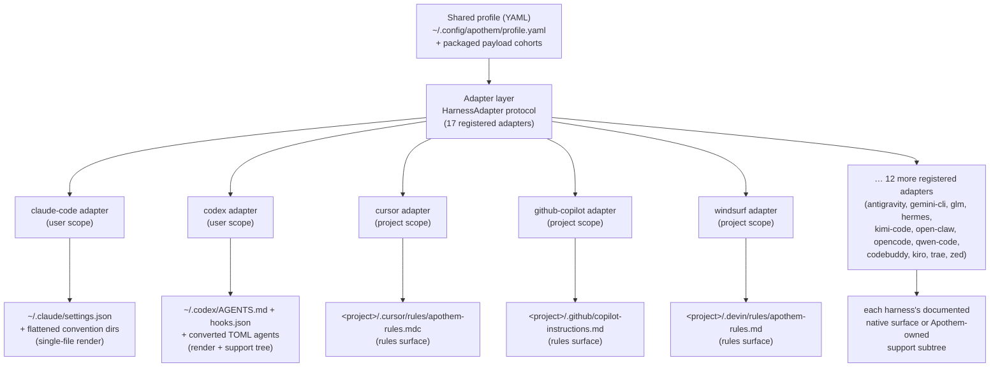

{/* SPDX-License-Identifier: MIT */}

يستخدم <bdi>Apothem</bdi> ملف تعريف <bdi>YAML</bdi> واحدًا مُتحقَّقًا منه عبر
المخطّط بوصفه المصدر الدلالي للحقيقة، ويشتقّ كل سطح تثبيت خاصّ بإطار العمل من خلال
أصناف محوِّلة تُنفِّذ بروتوكول <bdi>`HarnessAdapter`</bdi>. يكتب كل محوِّل إلى
موقع المستخدم أو المشروع الموثَّق لدى إطار العمل، ولا يستخدم مسارات الدعم المملوكة
لـ <bdi>Apothem</bdi> إلّا حين لا يملك إطار العمل بدائيّة أصليّة مطابِقة.

## لماذا تجريد المحوِّل

يتحدّث كل إطار عمل بلهجة تهيئة مختلفة: واحد يريد ملفّ إعدادات <bdi>JSON</bdi>،
وآخر دليلًا من ملفّات قواعد <bdi>`.mdc`</bdi>، وثالث ملفّ تعليمات <bdi>Markdown</bdi>
واحدًا. لو رمّز <bdi>Apothem</bdi> تلك المعرفة بقيمة ثابتة داخل <bdi>CLI</bdi>،
لتسرّب كل إطار عمل افتراضاته إلى النواة، ولأصبحت إضافة إطار عمل تعني لمس منطق
التثبيت والتحديث وإلغاء التثبيت والتحقّق في تناغم واحد.

يعكس نمط المحوِّل ذلك. لا تعرف النواة سوى بروتوكول <bdi>`HarnessAdapter`</bdi> —
عقدٍ صغير من توابع دورة-الحياة. تعيش لهجة كل إطار عمل داخل حزمة فرعية واحدة
مكتفية-بذاتها تُنفِّذ العقد. تطلب النواة من محوِّل أن *يُثبِّت* دون أن تعرف ما إذا
كان ذلك يعني إخراج ملفّ <bdi>JSON</bdi>، أم كتابة دليل قواعد، أم بسط شجرة دعم.
تنضمّ أطر العمل الجديدة بتلبية البروتوكول وتسجيل نقطة دخول؛ ولا يتغيّر شيء في
النواة. هذا هو السبب البنيوي وراء بقاء <bdi>Apothem</bdi> محايدًا للمضيف — فالتجريد
هو الحدّ الذي يمنع المعرفة الخاصّة بإطار العمل من الانتشار.

## شكل المحوِّل

تنقسم المحوِّلات إلى شكلين من أشكال التجسيد، وكلاهما ظاهر في السجلّ:

- **عارِضات الملفّ-الواحد** تترجم حقول ملف التعريف إلى ملفّ تهيئة واحد أصليّ لإطار
  العمل. محوِّل <bdi>Claude Code</bdi> مثلًا يكتب دومًا <bdi>`~/.claude/settings.json`</bdi>
  من ملف التعريف المشترك، ويُسطِّح أدلّة اصطلاحات <bdi>Apothem</bdi>
  (<bdi>`agents/`</bdi> و<bdi>`rules/`</bdi> و<bdi>`skills/`</bdi> …) بجانبه.
- **محوِّلات سطح-القواعد وشجرة-الدعم** تنشر cohort الحمولة الخاصّة بـ
  <bdi>Apothem</bdi> إلى موقع القواعد الموثَّق لدى إطار العمل، مُحوِّلةً الـ cohort
  إلى الصيغة الأصليّة حيث توجد واحدة، ومُركِنةً البقيّة تحت شجرة دعم فرعية مملوكة لـ
  <bdi>Apothem</bdi> مُشار إليها من المرساة الأصليّة. يكتب محوِّل <bdi>Cursor</bdi>
  ملفًّا واحدًا <bdi>`.cursor/rules/apothem-rules.mdc`</bdi> في جذر المشروع المُزوَّد،
  ويُسلِّم سطح القواعد فقط.

أي محوِّل بعينه إمّا أن يكون **بنطاق المستخدم** (يكتب تحت الدليل المنزلي) أو
**بنطاق المشروع** (يتطلّب <bdi>`--project <path>`</bdi> ويكتب داخل تلك الشجرة)؛
ويُسجِّل السجلّ أيّهما.

## طوبولوجيا المحوِّلات الحاليّة



التوزيع المروحيّ من المركز إلى الحافّة هو البنية التي يُرمِّزها اسم المشروع: ملف
تعريف واحد في القلب، وكل إطار عمل على مسافة متساوية على امتداد محوِّله الخاصّ.

## تعريف البروتوكول

```python
from pathlib import Path
from typing import Protocol

class HarnessAdapter(Protocol):
    name: str
    output_path: Path

    def install(self, profile: dict[str, object]) -> object:
        ...

    def update(self, profile: dict[str, object]) -> object:
        ...

    def uninstall(self) -> None:
        ...

    def is_installed(self) -> bool:
        ...

    def verify(self) -> bool:
        ...
```

يجوز لمحوِّلات نطاق-المشروع أن تقبل إضافةً <bdi>`project: Path | None`</bdi> على
توابع دورة-الحياة وأن تكشف <bdi>`resolve_output_path(project)`</bdi>. لا تمرّر
<bdi>CLI</bdi> الوسيط <bdi>`--project PATH`</bdi> إلّا للمحوِّلات التي يقبله توقيع
توابعها.

## تسجيل نقطة الدخول

تُسجَّل المحوِّلات عبر مجموعة نقاط دخول <bdi>setuptools</bdi> الموسومة
<bdi>`apothem.harnesses`</bdi>:

```toml
[project.entry-points."apothem.harnesses"]
cursor = "apothem.harnesses.cursor:CursorAdapter"
```

يُسجِّل السجلّ المركزي في <bdi>`src/apothem/lib/harness_registry.py`</bdi> المعرّفات
العامّة السبعة عشر بالضبط، ونقاط الدخول، ومسارات المستندات، ومسارات الهدف،
ومتطلّبات بيانات-الحزمة، وحالات القدرة، ومسارات تثبيت الاصطلاح المعياري. تُحمِّل
<bdi>CLI</bdi> المحوِّلات عبر ذلك السجلّ بدلًا من إعادة اكتشاف حقائق المنتج في كل
أمر.

## التعيين من ملف التعريف إلى الأصليّ

يُنفِّذ كل محوِّل منطق الترجمة الملائم لإطار عمله:

```
YAML profile + payload cohort    Harness-native surface
-----------------------------    ----------------------
identity / preferences       --> native config fields or rendered instruction context
commands/*.md                --> native commands or SKILL.md folders
rules/*.md                   --> native rules where supported, otherwise support trees
hooks/messages/*.md          --> native hooks where supported, otherwise support trees
agents/*.md                  --> native agent formats where supported
skills/*/SKILL.md            --> native skill folders where supported
```

تصير خلايا القدرة غير المدعومة والمنتظِرة للاكتشاف تحذيرات مُهيكَلة قبل عمليّات
الكتابة. ولا تُسقَط صامتةً على أسطح مورِّدين مُختلَقة.

## إضافة محوِّل جديد

انظر [كتابة محوِّل إطار عمل](/docs/examples/authoring-a-harness-adapter)
للحصول على دليل خطوة بخطوة.
