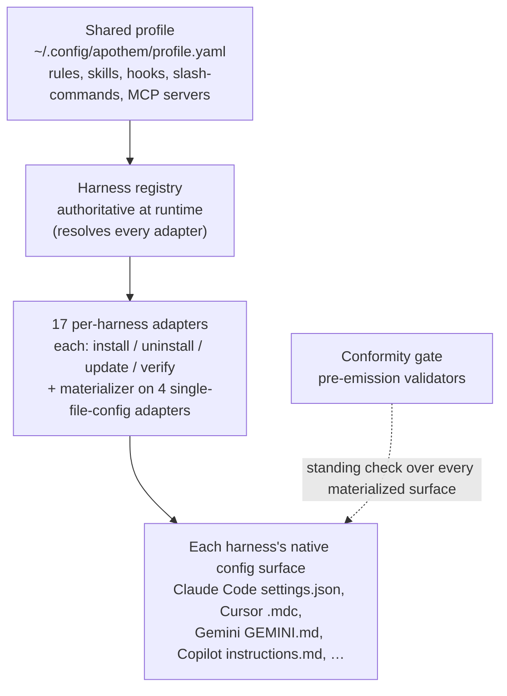

{/* SPDX-License-Identifier: MIT */}

بُني <bdi>Apothem</bdi> حول فكرة واحدة: ملف تعريف حوكمة مشترك واحد، يُمثَّل في صيغة
الإعداد الأصلية لكل <bdi>harness</bdi> عبر محوِّل خاص بكل <bdi>harness</bdi>.
يشرح هذا القسم القطع البنيوية — بروتوكول المحوِّل، ومخطّط ملف التعريف، وتخطيط شجرة
المصدر، وسير عمل التثبيت الذي يربطها معًا.

## نظرة عامة على النظام

بنظرة سريعة، <bdi>Apothem</bdi> هو خط أنابيب واحد: ملف تعريف مشترك واحد يغذّي
سجلّ الـ<bdi>harness</bdi>، الذي يحلّ كل محوِّل خاص بكل <bdi>harness</bdi>؛
ويُمثِّل كل محوِّل سطح الإعداد الأصلي الخاص بإطاره، وتفحص بوّابة مطابقة دائمة كل
سطح مُمثَّل.

## الصفحات

| الصفحة | الوصف |
|------|-------------|
| [تجريد محوِّل الـ<bdi>harness</bdi>](/docs/architecture/harness-adapter-abstraction) | بروتوكول <bdi>`HarnessAdapter`</bdi> — كيف تترجم المحوِّلات ملف التعريف المشترك إلى إعداد أصلي للمنصّة. |
| [مخطّط ملف التعريف المشترك](/docs/architecture/shared-profile-schema) | ملف تعريف <bdi>YAML</bdi> المدعوم بمخطّط في <bdi>`~/.config/apothem/profile.yaml`</bdi> أو <bdi>`--profile PATH`</bdi>. |
| [تخطيط المصدر](/docs/architecture/source-layout) | لماذا يستخدم <bdi>Apothem</bdi> تخطيط <bdi>`src/`</bdi> وكيف تُنظَّم الشجرة. |
| [سير عمل التثبيت](/docs/architecture/installation-workflow) | كيف تعمل <bdi>`apothem install`</bdi> و<bdi>`update`</bdi> و<bdi>`uninstall`</bdi> من البداية إلى النهاية. |
| [العمّال المُفوَّضون](/docs/architecture/agents) | تعليمات بنطاق المستودع لبيئات تشغيل متعدّدة العمّال تعمل داخل هذا المستودع. |
