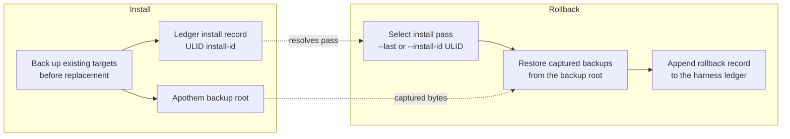

{/* SPDX-License-Identifier: MIT */}

## تدفُّق التثبيت

```mermaid
flowchart TD
    accTitle: Apothem install workflow
    accDescr: Top-down flowchart of the apothem install command from CLI invocation through adapter lookup, profile load, adapter install call, native config write, and final apothem verify check.
    A[apothem install --harness X] --> B[Resolve adapter through registry]
    B --> C[Load and validate profile YAML<br/>before writes]
    C --> D[Adapter.install(profile, project)]
    D --> E[Write native config and support cohorts]
    E --> F[apothem verify --harness X]
    F --> G{All checks pass?}
    G -- yes --> H[Done]
    G -- no --> I[Report failures]
```

## تدفُّق التحديث

عند <bdi>`apothem update --harness X`</bdi>:

1. يُحمِّل ويتحقَّق من <bdi>`~/.config/apothem/profile.yaml`</bdi> أو <bdi>`--profile PATH`</bdi>.
2. يحلّ الـ <bdi>harness</bdi> المُحدَّد أو <bdi>`all`</bdi> عبر السجلّ المركزي.
3. يتحقَّق من خطّة التحويل الكاملة قبل أول عملية كتابة.
4. يستدعي <bdi>`Adapter.update(profile, project=...)`</bdi>.
5. يُبلِغ عن النتائج: مُنشأ، ومُحدَّث، وبلا تغيير، ومُتخطّى، وتحذير، وخطأ.

## تدفُّق إلغاء التثبيت

عند <bdi>`apothem uninstall --harness X`</bdi>:

1. يستدعي <bdi>`Adapter.uninstall()`</bdi>.
2. يزيل المُحوِّل الملفّات التي كتبها فقط؛ ويبقى ملفّ التعريف المشترك بصيغة
   <bdi>YAML</bdi> والملفّات غير المتعلِّقة التي كتبها المُشغِّل دون مساس.

## حلّ النطاق

يكتب كل مُحوِّل إلى جذر تثبيته الثابت الخاص به: المنزل الشخصي للمستخدم
لمُحوِّلات نطاق المستخدم، والمسار المحلّي للمشروع لمُحوِّلات نطاق المشروع. لا
تكشف واجهة <bdi>CLI</bdi> عن راية <bdi>`--scope`</bdi>؛ وتتطلّب مُحوِّلات نطاق
المشروع <bdi>`--project <path>`</bdi>. كل وجهة مُوثَّقة في
<bdi>`site/content/docs/harnesses/<harness>.mdx`</bdi>.

## معالجة الأخطاء

تتحقَّق عمليّات التثبيت/التحديث قبل الكتابة، وتُنشئ نسخة احتياطية من الأهداف
المُطابِقة الموجودة قبل الاستبدال، وتدمج فقط الإدخالات الفرعية التي يديرها
<bdi>Apothem</bdi> في أدلّة الاكتشاف المشتركة. ينفِّذ <bdi>`--dry-run`</bdi>
التحقُّق نفسه ويعيد نتائج مُتخطّاة أو بلا تغيير دون إنشاء أيّ أدلّة أو ملفّات.

## Reversibility (backup and rollback)

Every install pass is reversible. Replaced bytes are captured into the Apothem
backup root and the pass is recorded in the harness ledger under a ULID
install id; [`apothem rollback`](/docs/cli-reference/rollback) selects a
recorded pass and restores those captured backups.


