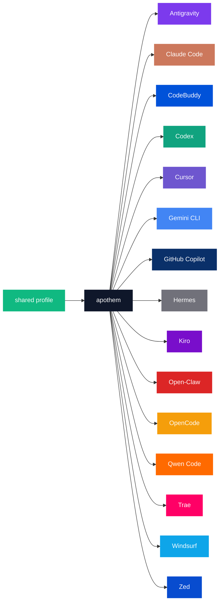

{/* SPDX-License-Identifier: MIT */}

التعدادات القانونية لاسم-العلامة × رمز-اللون أدناه مُحاطة بسياج <bdi>`text`</bdi> للحفاظ على المُعرّفات الحرفية لكل إطار عمل التي يتطلبها الغرض الفهرسي للوحة.

## نواة Apothem

| الرمز | فاتح | داكن | الاستخدام |
|---|---|---|---|
| <bdi>`apothem-hub`</bdi> | <bdi>`#0F172A`</bdi> | <bdi>`#F1F5F9`</bdi> | عُقدة التوزيع المركزية ("apothem") في كل مخطط معماري، والمحور المركزي لعلامة Apothem. |
| <bdi>`shared-profile`</bdi> | <bdi>`#10B981`</bdi> | <bdi>`#34D399`</bdi> | ملف التعريف مصدر-الحقيقة الذي يُغذّي نواة apothem. |

## لوحة أُطُر العمل

خمسة عشر من أُطُر العمل السبعة عشر مُلوَّنة لتطابق هوية علامتها الأساسية.
أما الاثنان المتبقّيان — <bdi>`glm`</bdi> و<bdi>`kimi-code`</bdi> — فليس لهما بعدُ لون علامة
محدَّد؛ ويُضاف صفّاهما بمجرّد ضبط لون العلامة أعلى السلسلة، وفق خطوة الانتشار المذكورة
تحت [التحديثات](#updates).

```text
| Token             | Light     | Dark      | Source                                                                                                                                              |
|-------------------|-----------|-----------|-----------------------------------------------------------------------------------------------------------------------------------------------------|
| `antigravity`     | `#7C3AED` | `#9F67FF` | Google Antigravity deep-purple.                                                                                                                     |
| `claude-code`     | `#CC785C` | `#E89378` | Anthropic terracotta-orange.                                                                                                                        |
| `codebuddy`       | `#0052D9` | `#5E8EF7` | Tencent CodeBuddy blue.                                                                                                                             |
| `codex`           | `#10A37F` | `#19C796` | OpenAI signature teal.                                                                                                                              |
| `cursor`          | `#6E56CF` | `#9B85E3` | Cursor brand purple.                                                                                                                                |
| `gemini-cli`      | `#4285F4` | `#6BA4F7` | Google blue (primary); the Apothem mark renders the node with all four Google brand hues `#4285F4` / `#34A853` / `#FBBC04` / `#EA4335`.             |
| `github-copilot`  | `#0A3069` | `#5B8FE3` | GitHub Mona deep-blue.                                                                                                                              |
| `hermes`          | `#71717A` | `#A1A1AA` | Community silver-grey.                                                                                                                              |
| `kiro`            | `#790ECB` | `#A862DD` | Kiro violet.                                                                                                                                        |
| `open-claw`       | `#DC2626` | `#F87171` | Community red-orange.                                                                                                                               |
| `opencode`        | `#F59E0B` | `#FBBF24` | Community amber.                                                                                                                                    |
| `qwen-code`       | `#FF6A00` | `#FF8C40` | Alibaba Qwen orange.                                                                                                                                |
| `trae`            | `#FF0066` | `#FF599C` | ByteDance Trae magenta.                                                                                                                             |
| `windsurf`        | `#0EA5E9` | `#38BDF8` | Windsurf sky-blue.                                                                                                                                  |
| `zed`             | `#084CCF` | `#5E8BE0` | Zed Industries blue.                                                                                                                                |
```

## مبرّر التسمية

- **<bdi>`apothem-hub`</bdi>** — المركز الهندسي الذي يستحضره الاسم (دبّوس المضلّع المنتظم — <bdi>apothem</bdi> — يشير إلى الداخل نحو نواته).
- **<bdi>`shared-profile`</bdi>** — المصدر الأعلى في السلسلة، متميّز عن لون أي إطار عمل مفرد بحيث يُقرأ بوصفه سهم "الإدخال" في كل مخطط.
- **رموز كل-إطار-عمل** تعكس <bdi>slug</bdi> إطار العمل المُستخدَم في كامل قاعدة الشيفرة (<bdi>`harnesses/<slug>/`</bdi>، ومفتاح نقطة الدخول، ووسيطة الـ CLI <bdi>`--harness <slug>`</bdi>). كلمة واحدة لكل مفهوم؛ السلسلة نفسها في كل مكان.

## استخدام Mermaid



## إمكانية الوصول

كل رمز في الوضع الفاتح يحقّق تباين <bdi>WCAG 2.2 AA</bdi> مقابل النص الأبيض (<bdi>≥4.5 : 1</bdi>) حيثما يسمح التباين بذلك دون تشويه لون العلامة. وحين ينخفض لون العلامة الأصلي لإطار عملٍ ما عن عتبة الـ <bdi>AA</bdi> مقابل النص الأبيض بمفرده (لا سيّما عائلة الكهرماني / البرتقالي وعائلة الأزرق-السماوي / الفيروزي من الرموز المُعدّدة أعلاه)، فإن المخططات التي تحتاج إلى تباين <bdi>WCAG AA</bdi> للنص-على-اللون تستخدم **متغيّر الوضع الداكن** (التدرّج المرفوع) لتعبئة المخطط لكي يُقرأ النص الأبيض بوضوح. عمود الوضع الداكن مُعايَر لهذا الغرض: كل رمز في الوضع الداكن يتجاوز الـ <bdi>AA</bdi> مقابل النص الأبيض.

## التحديثات

تُحدَّث اللوحة فقط حين يُصادق إطار عملٍ على تغيير في علامته أعلى السلسلة. تنتشر تغييرات العلامة لكل إطار عمل انتشارًا ذرّيًا عبر <bdi>`site/app/global.css`</bdi> وهذه الصفحة وكل ملف <bdi>SVG</bdi> رئيسي متأثّر تحت <bdi>`assets/src/`</bdi>.
