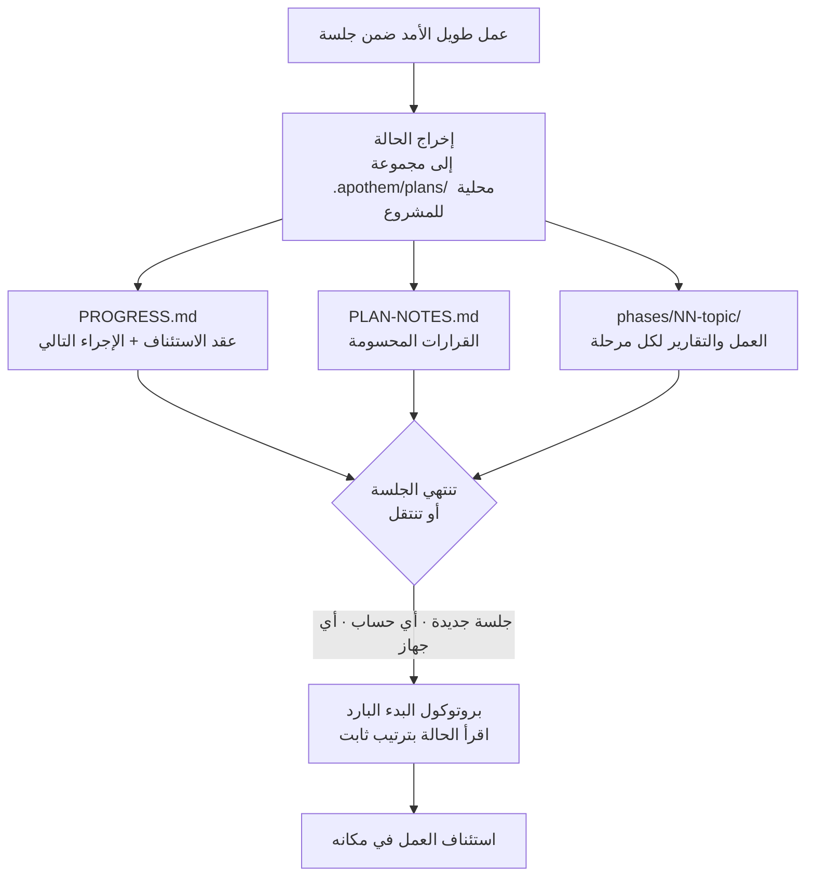

{/* SPDX-License-Identifier: MIT */}

يعيش معظم العمل المدعوم ويموت داخل محادثة واحدة. تُغلِق الدردشة، أو تنتقل
إلى جهاز آخر، أو تسجّل الدخول بحساب مختلف، فيضيع خيط ما كنت تفعله — تبدأ الجلسة
التالية باردةً، دون ذاكرة للقرارات التي اتخذتها بالفعل.

يقلب Apothem ذلك. فمن أجل العمل الطويل الأمد المتعدّد الخطوات، يُخرِج **حالة عمله
الكاملة** إلى مجموعة `.apothem/plans/` محلية للمشروع (مع الإبقاء على `.plans/` بديلًا متوافقًا مع الإصدارات السابقة) — ملفات تقع في مستودعك، لا داخل أي سجلّ
دردشة سحابية. الحالة هي الأثر الدائم؛ أمّا الجلسة فقابلة للاستغناء.

## الفكرة الجوهرية

تحمل مجموعة التخطيط في `<project-root>/.apothem/plans/{suite}/` شيئين يجعلان الجلسة قابلة
للاستبدال:

- **عقد الاستئناف.** يسجّل `PROGRESS.md` المرحلة الحالية وحالة المهام، والإجراء
  التالي الدقيق، والأعراف السارية، والقرارات التي حُسِمت بالفعل، والملفات المحدّدة التي
  يجب على الجلسة التالية قراءتها.
- **بروتوكول البدء البارد.** تقرأ الجلسة الجديدة تلك الملفات بترتيب ثابت وتُعيد بناء
  الصورة الكاملة قبل أداء أي عمل — دون الحاجة إلى سجلّ المحادثة.

ولأن تلك الحالة موجودة في ملفات مشروعك، فإن جلسة جديدة على **أي حساب أو جهاز** موجَّهة
إلى المشروع نفسه تستأنف العمل في مكانه. ولا شيء محبوس داخل نسخة دردشة واحدة. هذه هي
الخاصية التي تجعل العمل المنظَّم الواسع النطاق الممتد لأيام — مدوّنات كبيرة، عمليات
ترحيل طويلة، تمريرات مراجعة كبيرة — يصمد عبر حدود كانت لولاها لتُنهيه.

## ما هو، بدقّة

مُصاغ بدقّة كي يكون الضمان واضحًا:

- **هو** حالة مُخرَجة إلى ملفات، إضافةً إلى بروتوكول استئناف من البدء البارد. يُستأنف
  العمل لأن الحالة تعيش في ملفات مشروعك، مستقلّةً عن أي جلسة أو حساب أو جهاز.
- **ليس** خدمة مزامنة تلقائية عبر الحسابات. فـ Apothem لا يدفع حالة خططك بين الحسابات
  من تلقاء نفسه — تنتقل الملفات بالطريقة نفسها التي تنتقل بها ملفات مشروعك أصلًا (التحكم
  في الإصدارات، نسخة عمل مشتركة، دليل متزامن). ما يضمنه Apothem هو أنه أينما حطّت ملفات
  المشروع، تستطيع جلسة جديدة الاستئناف منها.

## لماذا يهمّ هذا

كلما طال العمل وكبر، صارت المحادثة الواحدة عبئًا أثقل. فإعادة هيكلة ممتدة لأيام، أو
تمريرة تمسح قاعدة شيفرة كبيرة، ستعمّر أطول من أي جلسة منفردة — تُضغَط نوافذ السياق،
وتنتهي مهلة الجلسات، وتتبدّل الأجهزة. وبمعاملته ملفات المشروع نفسها بوصفها مصدر الحقيقة
للعمل الجاري، يجعل Apothem العمل صامدًا أمام الحدود الثلاثة جميعًا: الجلسة والحساب
والجهاز.

## أين تعيش الحالة

| الأثر | الموضع | يحوي |
|----------|----------|-------|
| مجموعة التخطيط | `<project-root>/.apothem/plans/{suite}/` | وحدة مكتفية ذاتيًا من العمل الجاري |
| عقد الاستئناف | `<suite>/PROGRESS.md` | حالة المرحلة/المهمة، والإجراء التالي، والأعراف، وبيان الملفات الحرجة |
| سجلّ القرارات | `<suite>/PLAN-NOTES.md` | القرارات المحسومة، لا يُعاد السؤال عنها أبدًا |
| العمل لكل مرحلة | `<suite>/phases/NN-topic/` | مهام المرحلة وتقريرها |

تُستبعَد شجرة الخطط من التحكم في الإصدارات عبر مقتطف `.gitignore` المعياري الخاص بـ
Apothem، فتبقى حالة الخطط محليةً افتراضيًا. ولنقل العمل الجاري بين الأجهزة أو الحسابات
عن قصد، انقل مجموعة `.apothem/plans/` بالطريقة نفسها التي تنقل بها أي ملف آخر من ملفات
المشروع.

## ذو صلة

- **[مستويات الجدّية](/docs/concepts/seriousness-tiers)** — كيف تتوسّع الحوكمة
  وانضباط إخراج الحالة بحسب المشاركة.
- **[خط أنابيب الأوامر](/docs/pipeline)** — مراحل `/plan` التي تُنشئ مجموعة تخطيط
  وتدفعها قُدُمًا.

## Recommended Next Step

**اقرأ [مستويات الجدّية](/docs/concepts/seriousness-tiers)** لترى كيف يتوسّع انضباط
الإخراج من تجربة سريعة إلى جهد ممتد لأيام يعبر الحدود.
