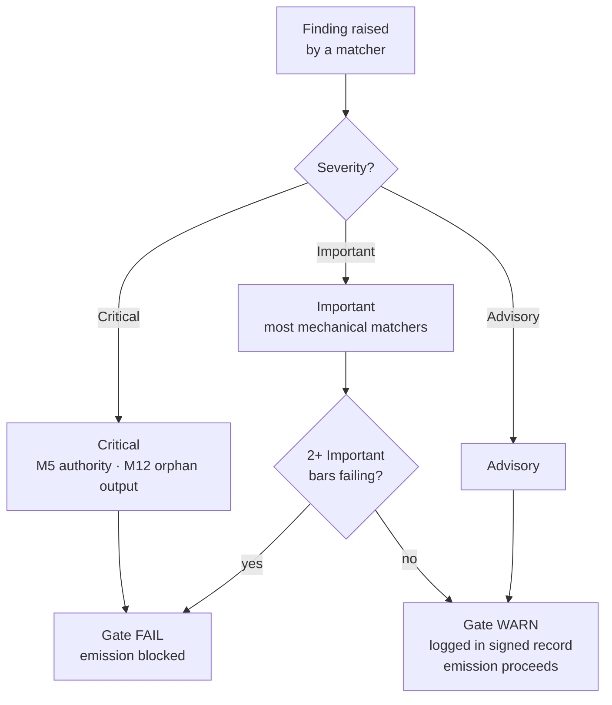

{/* SPDX-License-Identifier: MIT */}

## الحواجز الخمسة عشر

| الحاجز | المُعرِّف | التفويض | صنف الفحص | الإخفاق ← الإجراء |
|---|---|---|---|---|
| 1 | <bdi>M1</bdi> | لاأدريّة المشروع المُضيف | استدلالي | راجِع لمطابقة اصطلاحات المُضيف |
| 2 | <bdi>M2</bdi> | الانضباط التحريري (سجلّ الإفصاح) | آلي | أضِف علامات الإفصاح |
| 3 | <bdi>M3</bdi> | أبعاد الجودة العشرة | استدلالي | راجِع على الأبعاد المُخفِقة |
| 4 | <bdi>M4</bdi> | التطبيق الذاتي (كتلة السجلّ الموقَّعة حاضرة) | آلي | سجّل كتلة السجلّ الموقَّعة |
| 5 | <bdi>M5</bdi> | مبدأ السلطة (لا هوية / نقطة-نهاية / سرّ مُلفَّق) | آلي | وجِّه إلى الاستفسار |
| 6 | <bdi>M6</bdi> | دمج الخبرة (الثغرات المُبرَزة) | استدلالي | أبرِز الثغرات؛ استشهِد بالصقل |
| 7 | <bdi>M7</bdi> | وصم الخيارات (علامة موصًى به + مبرّر الدافع) | آلي | صِم مجموعات الخيارات |
| 8 | <bdi>M8</bdi> | القطعية (لا تحوّط في النثر المُلزِم) | آلي | رقِّ التحوّطات إلى شروط |
| 9 | <bdi>M9</bdi> | الرافعة البصرية (المواد البنيوية تحمل مخطّطات) | استدلالي | أنشِئ / حدِّث المخطّط |
| 10 | <bdi>M10</bdi> | الربط ثنائي الاتّجاه (المؤشّرات الخلفية المتبادلة مُغلَقة) | آلي | أغلِق أنصاف-الحواف |
| 11 | <bdi>M11</bdi> | السباقات الرشيقة (الهدف / قائمة الأعمال / <bdi>DoR</bdi> / <bdi>DoD</bdi> / المراجعة / الاسترجاع) | استدلالي | أعِد البِنية بوصفها سباقات |
| 12 | <bdi>M12</bdi> | تقارير الأطوار والتخطيط الكانوني | آلي | أنشِئ التجميع؛ أعِد التموضع إلى التخطيط الكانوني |
| 13 | <bdi>M13</bdi> | إتقان الشيفرة (<bdi>lint</bdi> / <bdi>format</bdi> / <bdi>type-check</bdi>؛ العدد السحري؛ <bdi>bare-except</bdi>) | آلي | راجِع وفق قواعد إتقان الشيفرة لكلّ لغة |
| 14 | <bdi>M14</bdi> | النَظْميّة (تُعلِن المنبع / المصبّ / الأقران / المُنفِّذين) | استدلالي | أعلِن؛ افهرِس في السجلّات |
| 15 | <bdi>M15</bdi> | الجاهزية للإنتاج (اختبارات + وثائق + <bdi>CHANGELOG</bdi> + commit مطابِق + <bdi>CI</bdi> خضراء + استقرار <bdi>semver</bdi>) | آلي | أضِف الأسطح الناقصة |

## سُلّم الخطورة

| الخطورة | الأثر على البوّابة |
|---|---|
| **حرِجة** | البوّابة <bdi>FAIL</bdi> — الإصدار محظور بلا قيد |
| **مهمّة** | البوّابة <bdi>FAIL</bdi> حين يُخفِق حاجزان مهمّان أو أكثر في آنٍ معًا |
| **استشارية** | البوّابة <bdi>WARN</bdi> — تُسجَّل في السجلّ الموقَّع؛ لا تحظر الإصدار |

تتخذ معظم مُطابِقات الجزء الآلي قيمة **مهمّة** افتراضيًّا. أمّا <bdi>M5</bdi> (السلطة — الأسرار، نقاط النهاية المُلفَّقة) و<bdi>M12</bdi> (المخرجات اليتيمة) فهما **حرِجان**.



## مُطابِقات الجزء الآلي

يعيش الجزء الآلي في [<bdi>`src/apothem/conformity/*_grep.py`</bdi>](https://github.com/ahmed-g-gad/apothem/tree/main/src/apothem/conformity)، بتنسيق من [<bdi>`src/apothem/conformity/gate.py`</bdi>](https://github.com/ahmed-g-gad/apothem/blob/main/src/apothem/conformity/gate.py).

| المُطابِق | الحاجز | الوظيفة |
|---|---|---|
| <bdi>`hedging_grep.py`</bdi> | <bdi>M8</bdi> | يكشف مفردات التحوّط في النثر المُلزِم |
| <bdi>`option_annotation_grep.py`</bdi> | <bdi>M7</bdi> | يتحقّق من علامة <bdi>`**Recommended**`</bdi> + مبرّر الدافع على مجموعات الخيارات |
| <bdi>`user_confirm_grep.py`</bdi> | <bdi>M5</bdi> | يحظر نواقل <bdi>`<USER-CONFIRM:…>`</bdi> من الإصدار |
| <bdi>`binding_reciprocity_grep.py`</bdi> | <bdi>M10</bdi> | يكشف أنصاف-الحواف في <bdi>`## Bindings (§0.j five-direction)`</bdi> |
| <bdi>`orphan_output_grep.py`</bdi> | <bdi>M12</bdi> | يَسِم الآثار التي لا مُستهلِك لها / لا مدخل فهرسة / لا إسناد مُنتِج |
| <bdi>`bare_except_grep.py`</bdi> | <bdi>M13</bdi> | يكشف <bdi>`except:`</bdi> / <bdi>`except Exception:`</bdi> دون تعليق مُبرِّر |
| <bdi>`magic_number_grep.py`</bdi> | <bdi>M13</bdi> | يكشف الحرفيات العددية في منطق الأعمال |
| <bdi>`commented_out_code_grep.py`</bdi> | <bdi>M13</bdi> | يكشف كتل الشيفرة المُعلَّق عليها |
| <bdi>`file_header_grep.py`</bdi> | <bdi>M13</bdi> | يتحقّق من وجود ترويسة رخصة <bdi>SPDX</bdi> أحادية السطر |
| <bdi>`frontmatter_grep.py`</bdi> | <bdi>M14</bdi> | يتحقّق من حقول الـ frontmatter المطلوبة على دلائل التوجيه الكانونية الأربعة المُدرَجة أدناه |
| <bdi>`semver_stability_grep.py`</bdi> | <bdi>M15</bdi> | يكشف تغييرات <bdi>API</bdi> العام الكاسرة دون رفع نسخة <bdi>MAJOR</bdi> |
| <bdi>`production_ready_pr_grep.py`</bdi> | <bdi>M15</bdi> | يتحقّق من انضباط مجموعة-التغيير نفسها (اختبارات + وثائق + <bdi>CHANGELOG</bdi>) |
| <bdi>`secret_leak_grep.py`</bdi> | <bdi>M15</bdi> | يكشف الأسرار / بيانات الاعتماد المُضمَّنة بالصلب |
| <bdi>`unpinned_action_grep.py`</bdi> | <bdi>M15</bdi> | يتحقّق من تثبيت <bdi>GitHub Actions</bdi> على <bdi>commit SHA</bdi> |
| <bdi>`always_on_budget_grep.py`</bdi> | سقف الميزانية | يُقيِّد متن القاعدة دائمة-التشغيل عند 500 <bdi>token</bdi> جوهري |

## تشغيل البوّابة

على harness مُثبَّت، تعمل البوّابة تلقائيًّا: يُوصِّل <bdi>`settings.json`</bdi>
الخاص بـ Claude Code البوّابةَ بوصفها خطّاف <bdi>`PreToolUse`</bdi> يستدعي النسخة
المُجسَّدة في <bdi>`~/.claude/.apothem/support/conformity/gate.py`</bdi> قبل كل
<bdi>Write/Edit</bdi>. ومن استخراج المصدر، تُشغِّل صيغة الوحدة الشيفرةَ نفسها:

```shell
# توزيع ملفّ واحد (يحاكي خطّاف PreToolUse):
echo '{"tool_input": {"file_path": "path/to/file", "content": "..."}}' \
    | python -m apothem.conformity.gate --hook

# مسح مُركَّب عبر المستودع:
python -m apothem.conformity.gate --sweep src/ site/content/docs/ rules/
```

راجِع [تشغيل بوّابة المطابقة](/docs/usage/conformity-gate) للإجراء الكامل.

## مرجع

- [سجلّ بوّابة ما-قبل-الإصدار](/docs/governance/pre-emission-gate-registry) — تعريفات الحواجز الكانونية
- [سجلّ المطابقة الخارجية](/docs/governance/outward-conformity-registry) — دلالات <bdi>M1-M15</bdi> التفصيلية
- [التفويضات المتقاطعة](/docs/governance/cross-cutting-mandates) — مصدر الحقيقة للتفويضات
- [انضباط الأداء](https://github.com/ahmed-g-gad/apothem/blob/main/src/apothem/rules/performance-discipline.md) — ميزانيات زمن التشغيل لكلّ صنف
