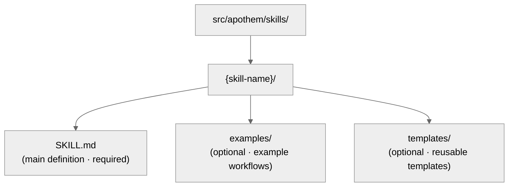

{/* SPDX-License-Identifier: MIT */}

يساعد هذا الدليل المطوّرين على صون منظومة Apothem وتوسيعها وفق معايير جودة
SOTA.

## مرجع سريع: أنواع القطع

تحتوي منظومة Apothem على خمسة أنواع من القطع، لكلٍّ منها أغراض محدّدة
ومتطلّبات للواجهة الأمامية.

| القطعة | المسار | الغرض | متى تُنشأ |
| -------- | ---- | ------- | -------------- |
| **قاعدة** | `src/apothem/rules/*.md` | تكليف سلوكي أو توجيه تشغيلي | عند إرساء مبدأ أو سياسة أو تكليف حوكمة جديد |
| **أمر** | `src/apothem/commands/*.md` | أمر مائل (`/command-name`) لسير العمل المعقّد | سير عمل مستخدم جديد متعدّد الخطوات |
| **مساعِد** | دليل المساعدات (`*.md` لكل ملف) | تعريف عامل مفوَّض دائم للمهام المتوازية | مهمة متخصّصة متكرّرة جديدة (تدقيق، استكشاف، فحص جودة) |
| **مهارة** | `src/apothem/skills/{name}/SKILL.md` | تقنية قابلة لإعادة الاستخدام بإشارة كشف | نمط تقنية جديد قابل للكشف وإعادة الاستخدام |
| **خطّاف** | `src/apothem/hooks/` + `settings.json` | تحقق أو إدارة حالة مُفعَّلان بحدث | حدث دورة حياة جديد أو حاجة تحقق |

## عقد محوّل البيئة

تعيش حقائق هوية البيئة وقدرتها في
`src/apothem/lib/harness_registry.py`. لا يكتمل تغيير البيئة إلا عندما
تتوافق هذه الأسطح:

| السطح | التحديث المطلوب |
| --- | --- |
| صف السجلّ | المُعرّف العام، مفتاح الحزمة، نقطة الدخول، النطاق، صيغة المُخرَج، المسارات الهدف، مسارات التوثيق، ملف القدرة، التثبيت المعياري، اختبارات التثبيتات، مفتاح بيانات الحزمة، مصادر القوالب، وحالات القدرة. |
| حزمة المحوّل | `__init__.py`، `install.py`، `update.py`، `uninstall.py`، `verify.py`؛ أضف `materializer.py` فقط عندما تُجسِّد البيئة ملف تهيئة أصلي. |
| بيان الانتشار | مسارات القوالب والحزم للمحوّلات المدعومة بالبيان. |
| القدرات | `src/apothem/harnesses/<package>/capabilities.yml` مع كل قدرة مطلوبة ومبرّر للحالات غير المدعومة أو قيد الاكتشاف. |
| تثبيت الاصطلاح | `STANDARD-CONVENTION-PIN.md` مع رابط المورّد، تاريخ اللقطة، اسم الملف/المخطط المعياري، مرجع الدليل، ومبرّر القدرة غير المدعومة. |
| الاختبارات | تكافؤ السجلّ، اختبار تثبيت المحوّل، صف خطة التثبيت الذهبية، سلوك المحاكاة/عدم الكتابة، الجدوائية، وتغطية بيانات الحزمة. |
| التوثيق | صفحة مرجع البيئة، صفحة المقارنة، ملاحظات القدرة/MCP، وأمثلة تستخدم عناصر نائبة مزيّفة. |

يجب على المحوّلات بنطاق المشروع ضبط `requires_project = True`، وقبول
`project: Path | None` في طرق دورة الحياة، ورفض جذور المشاريع المفقودة أو
غير الآمنة قبل الكتابة. ويجب على المحوّلات بنطاق المستخدم إبقاء المسارات تحت
جذر تهيئة المستخدم الموثّق للبيئة.

## سياسة التثبيت الذهبي

يسجّل `tests/fixtures/harness-golden-plans.json` شكل خطة التثبيت العامة
لبيئات السجلّ السبع عشرة جميعها: المُعرّف العام، وضع التجسيد، مسار
الحزمة/القالب المصدر، والمسار الهدف المُطبَّع تحت `<ROOT>`. عندما يتغيّر سلوك
السجلّ أو البيان أو هدف القالب عمدًا، حدّث التثبيت الذهبي في الإيداع ذاته
لتغيير المصدر لكي يُظهر الفرق دلتا السلوك.

## التحقق قبل الكتابة

يتحقّق مشغّل التثبيت المشترك من كل مصدر وهدف قبل أول
كتابة. يرفض مصادر البيان المفقودة، واجتياز الهدف، والمسارات الهدف
خارج الجذر المختار، وتجاوزات الروابط الرمزية. تنفّذ المحاكاة التحقق ذاته
وتُرجع نتائج `skipped` أو `unchanged` منظَّمة دون
إنشاء ملفات.

## التنقيح وبيانات الأمثلة

تنقّح تشخيصات الملف التعريفي حقول الرمز والسرّ وكلمة المرور والاعتماد ومفتاح
واجهة برمجة التطبيقات والمفتاح الخاص والتفويض والمصادقة والحقول ذات الشكل
الترويسي. ويستخدم التوثيق والتثبيتات والأمثلة ومقتطفات JSON
`example.invalid` و`Example User` و`example-user` وعناصر نائبة واضحة بدلًا من
أسرار أو حسابات شخصية تبدو حقيقية.

## قبل الكتابة: المخطط المعياري

**يجب على كل القطع اتّباع المخطط في `site/content/docs/reference/artifact-schema.mdx`.** هذا
غير قابل للتفاوض.

- اقرأ `site/content/docs/reference/artifact-schema.mdx` § "Schema" لنوع قطعتك
- انسخ الحقول المطلوبة
- املأ القيم الإلزامية
- أضف الحقول الاختيارية حسب الحاجة

## فحص سريع للواجهة الأمامية

يجب أن تجتاز الواجهة الأمامية لكل قطعة هذه الفحوص:

```yaml
✓ Valid YAML syntax (use tools: `yamllint` or PowerShell `ConvertFrom-Yaml` where available)
✓ All mandatory fields present (per schema for artifact type)
✓ name: uses kebab-case
✓ version: semantic MAJOR.MINOR.PATCH
✓ updated: ISO 8601 date (YYYY-MM-DD)
✓ description: single-line, non-empty
✓ scope: valid enum (always-on|path-filtered|other)
✓ portability: valid enum (`universal` | `universal-with-windows-caveats` | `unix-only` | `windows-only`)
✓ No typos in field names — must match canonical schema exactly
✓ Optional fields use correct enum values
```

## اصطلاحات التسمية

### أسماء القطع (kebab-case)

- **القواعد:** `operational-mandates`، `clean-room-generation`، `context-management`
- **الأوامر:** `plan-execute`، `plan-spec`، `plan-generate`
- **المساعدات:** `codebase-explorer`، `convention-auditor`، `quality-gate`
- **المهارات:** `plan-suite`، `ecosystem-audit`

النمط: حروف صغيرة، شرطات بين الكلمات، بلا مسافات أو شرطات سفلية.

### تسمية الملفات

- **القواعد:** `{name}.md`
- **الأوامر:** `{name}.md`
- **المساعدات:** `{name}.md`
- **المهارات:** داخل مجلّد `src/apothem/skills/{name}/SKILL.md` (الحالة الدقيقة: `SKILL.md`)
- **الخطافات:** داخل مجلّد `src/apothem/hooks/`. كل معالِجات الأحداث بلغة Python. ويستخدم كل
  أمر خطّاف في `settings.json` صيغة exec (`python` بالإضافة إلى `args`) لاستدعاء
  `-m apothem.hooks.dispatch <event> [<message-name>]` أو
  `-m apothem.conformity.gate --hook`. يوجّه `dispatch.py` حدث `SessionStart` إلى
  `session_start_bootstrap.main()` و
  كل حدث آخر مُدرَج في القائمة البيضاء إلى `emit_hook_context.main()`. رقائق الصدفة
  الوحيدة المسموح بها تحت `src/apothem/hooks/` أو `scripts/` هي ملفات المحدّد + التهيئة
  الأربعة (`find-python.{ps1,sh}`، `bootstrap.{ps1,sh}`)؛ وأيّ ملف آخر `.ps1` /
  `.sh` يفشل في فحص النظافة `scripts/dev/validate_hooks.py`.

### الإحالات المتبادلة

عند الإحالة إلى قطع أخرى، استخدم الأسماء الدقيقة:

- القواعد: `"operational-mandates"` (قيمة حقل الاسم)
- الأوامر: `/plan-execute` (بشرطة مائلة لتوثيق البشر؛ دونها في الشيفرة)
- المساعدات: `codebase-explorer` (قيمة حقل الاسم)
- المهارات: `plan-suite` (قيمة حقل الاسم)

لا تستخدم مسارات الملفات أو الأسماء المبتورة في النثر أبدًا.

## القابلية للنقل: Windows مقابل Unix

يجب على كل قطعة إعلان حالة قابليتها للنقل صراحةً.

### عالمي (الافتراضي)

- يعمل بشكل متطابق على Windows وmacOS وLinux
- بلا افتراضات صدفة
- المسارات تستخدم شرطات مائلة أمامية (`/`)
- بلا مسارات مطلقة مثبّتة
- بلا صيغة PowerShell خاصة بـ Windows

```yaml
portability: "universal"
```

### عالمي مع تحفّظات على Windows

- عالمي عبر مضيفات POSIX؛ ينطبق التحفّظ المسمّى على نوع منصّة Windows المُعلَن في المحتوى
- وثّق التحفّظ صراحةً في المحتوى
- مثال: "الروابط الرمزية غير مدعومة على Windows قبل Win 10"

```yaml
portability: "universal-with-windows-caveats"
```

وثّق التحفّظ في ملاحظة فور العنوان مباشرة.

### Unix فقط / Windows فقط

- مُقيَّد صراحةً بمنصّة واحدة
- نادر في Apothem — معظمها ينبغي أن يكون عالميًا
- استخدمه فقط إذا كانت الميزات الخاصة بالمنصّة جوهرية

```yaml
portability: "unix-only"
```

وثّق السبب في القسم الأول للقاعدة.

## النطاق: فعّال دائمًا مقابل مُرشَّح بالمسار

### فعّال دائمًا

تنطبق القاعدة في كل مكان.

```yaml
scope: "always-on"
```

### مُرشَّح بالمسار

تنطبق القاعدة شرطيًا بناءً على مسار الملف.

```yaml
scope: "path-filtered"
pathFilter: "**/*.py, **/*.toml"
```

يستخدم `pathFilter` أنماط glob (بنفس صيغة `.gitignore`). عندما يطابق ملفٌ
المرشّح، تُفعَّل القاعدة.

## دلالات الإصدار

تحمل كل قطعة إصدارها الدلالي الخاص (`MAJOR.MINOR.PATCH`):

- **PATCH** — إصلاحات الأخطاء المطبعية، التنسيق، تحديث الروابط، تحريرات التعليقات فقط. السلوك دون تغيير.
- **MINOR** — تغييرات إضافية غير كاسرة: أقسام اختيارية جديدة، أنماط مضادة إضافية، حقول واجهة أمامية اختيارية جديدة، أمثلة جديدة. يواصل المستهلكون الحاليون العمل دون تغيير.
- **MAJOR** — تغييرات كاسرة في المخطط أو العقد: أقسام محذوفة، حقول مُعاد تسميتها، سلوك مُعدَّل لتوجيه قائم، تغييرات تتطلّب تكيّف القطع التابعة.

أمثلة:

- `vX.Y.Z` → `vX.Y.(Z+1)` (PATCH: إصلاح خطأ مطبعي)
- `vX.Y.Z` → `vX.(Y+1).0` (MINOR: إضافة مدخل أنماط مضادة جديد)
- `vX.Y.Z` → `v(X+1).0.0` (MAJOR: إعلان استقرار العقد)
- `vX.Y.Z` → `v(X+1).0.0` (MAJOR: حذف حقل واجهة أمامية إلزامي)

ارفع `version` و`updated` معًا في كل تحرير يغيّر السلوك. وألحق صفًا مطابقًا
بـ `CHANGELOG.md` على مستوى المنظومة للإصدارات التي تحزم تغييرات القطع.

## متى تُحرّر قطعة

### القواعد

- عامِل بنية الإلزامي/الاختياري كحاملة — إعادة هيكلتها تتموّج عبر كل قطعة تابعة
  (يلزم رفع MAJOR).
- نقّح الأنماط المضادة وأمثلة تدرّج الجدّية والاستشهادات كلما تعمّق الفهم
  (رفع MINOR).
- التقط مبرّر أيّ تغيير بنيوي في ملف موضوع الذاكرة المعني.

### الأوامر

- شكل الوسيطة جزء من العقد العام — اكسره فقط بنية صريحة وانشر التغيير إلى كل
  مستدعٍ (رفع MAJOR).
- أبقِ خطوات سير العمل وعقود الإرجاع محكمة وحديثة.
- وثّق تسلسل الخطوات غير البديهي ضمنيًا.

### المساعدات

- أبقِ `disallowedTools` أدنى-لكن-كافيًا؛ وثّق المبرّر عند
  تغيّره.
- نقّح مبادئ التشغيل وعقود الإرجاع كلما نضج دور المساعِد
  (رفع MINOR).
- تتبّع تحوّلات القدرة ضمنيًا لكي يتمكّن المستدعون من إعادة معايرة التوقّعات.

### المهارات

- أبقِ خطوات الإجراء والأمثلة متزامنة مع الواقع.
- يجب أن تعكس إشارات الكشف صياغة المستخدم الفعلية في الاستخدام الحالي.
- قسّم مهارة بمجرّد تجاوزها ~150 سطرًا (انظر
  `auto-memory.md` § Topic File Management).

## خطوة بخطوة: إضافة قاعدة جديدة

### 1. قيّم التعامد

هل تتداخل هذه القاعدة مع قواعد قائمة؟ ابحث في `src/apothem/rules/` عن محتوى ذي صلة.

إذا كان التداخل >50%، ففكّر في توسيع قاعدة قائمة بدلًا من ذلك. انظر
`persistent-conventions-vigilance.md` § Artifact Evolution.

### 2. اكتب المحتوى

اتّبع البنية:

- العنوان: `# Rule: {Title}`
- قسم الغرض
- الالتزامات / التوجيهات الأساسية (مرقّمة، مربوطة)
- جدول تدرّج الجدّية (مطلوب دائمًا)
- قسم الأنماط المضادة
- قسم الإنفاذ

### 3. أنشئ الواجهة الأمامية

استخدم المخطط من `site/content/docs/reference/artifact-schema.mdx` § Schema: Rules. عيّن:

- `name:` مُعرّف kebab-case
- `version:` `"X.Y.Z"` (مبدئي)
- `updated:` تاريخ اليوم بصيغة ISO 8601
- `scope:` `always-on` أو `path-filtered`
- `portability:` `universal` (أو مع تحفّظات إن لزم)
- `implements:` اسرد تكليفات CM/TM/CP التي تغطّيها هذه القاعدة

مثال:

```yaml
---
name: "my-new-rule"
description: "Brief one-liner"
pathFilter: ""
alwaysApply: true
---
```

### 4. حدّث CLAUDE.md

أضف مدخلًا إلى جدول سجلّ `§7.2 Rules`:

```markdown
| My New Rule | `src/apothem/rules/my-new-rule.md` | Always-on | CM-5/CM-21 |
```

حافظ على الترتيب الأبجدي داخل الجدول.

### 5. ألحِق بـ CHANGELOG.md

أضف صفًا تحت قسم `### Added` للإصدار التالي يصف القاعدة الجديدة.

### 6. شغّل التحقق

استدعِ مهارة `ecosystem-audit` للتحقق من القاعدة الجديدة، مع التركيز على منطقة القواعد:

```text
Invoke the ecosystem-audit skill with --focus rules --fix
```

تحقّق من عدم الإبلاغ عن أخطاء لقاعدتك الجديدة.

## خطوة بخطوة: إضافة أمر جديد

الأوامر هي أوامر مائلة مثل `/plan-spec`، `/plan-execute`، `/security-audit`، إلخ.

### 1. حدّد الدور

الأوامر **ليست** مقصودة أبدًا لاستدعائها من زمن تشغيل <bdi>harness</bdi> بمعزل. إنها
سيرورات عمل يُفعّلها المستخدم. اسأل:

- هل هذا سير عمل يكتب فيه المستخدم `/command-name`؟
- هل ينسّق خطوات متعددة؟
- هل يمكن أن تنتهي مهلته أو يتطلّب إدخال مستخدم في منتصف التنفيذ؟

إذا كان الجواب "لا" لأيٍّ منها، فهو على الأرجح مهارة، لا أمر.

### 2. أنشئ الملف

المسار: `src/apothem/commands/{name}.md`

الواجهة الأمامية (من `site/content/docs/reference/artifact-schema.mdx` § Schema: Commands):

```yaml
---
name: "my-command"
version: "X.Y.Z"
updated: "2026-04-20"
description: "What this command does"
argument-hint: "[path/to/input] [--flag VALUE]"
disable-model-invocation: true
portability: "universal"
allowed-tools: "Read, Glob, Grep"
---
```

عيّن دائمًا `disable-model-invocation: true` للأوامر.

### 3. اكتب المحتوى

البنية:

- العنوان: `# /{name} — Human-Readable Title`
- قسم الدور (مَن ينفّذ هذا)
- تعليمات عالية المستوى
- قسم سير العمل مع الخطوات
- عقد الإرجاع / صيغة المُخرَج

### 4. حدّث CLAUDE.md وCHANGELOG.md

صف السجلّ في `§7.1 Commands`؛ صف CHANGELOG تحت قسم `### Added` للإصدار التالي.

### 5. تحقّق

استدعِ مهارة `ecosystem-audit`، مع التركيز على الأوامر:

```text
Invoke the ecosystem-audit skill with --focus commands --fix
```

## خطوة بخطوة: إضافة مساعِد جديد

المساعدات هي تعريفات عامل مفوَّض دائمة للعمل المتوازي.

### 1. حدّد النمط

هل يتناسب هذا المساعِد مع أحد أنماط الفريق المُدرَجة أدناه؟

- فريق البحث: للقراءة فقط، جمع المعلومات
- فريق التدقيق: التحقق، فحوص الاتساق
- فريق التنفيذ: تغييرات الشيفرة المتوازية
- فريق الجودة: الفحص اللغوي، الاختبار، فحص الأنواع، الأمن
- فريق التوثيق: تحديثات التوثيق
- أخرى: مهمة متخصّصة

### 2. أنشئ الملف

المسار:

```text
src/apothem/agents/{name}.md
```

الواجهة الأمامية:

```yaml
---
name: "my-helper"
version: "X.Y.Z"
updated: "2026-04-20"
description: "What this helper specializes in"
tools: "Read, Glob, Grep, Bash"
disallowedTools: "Write, Edit"
maxTurns: 15
portability: "universal"
---
```

### 3. اكتب المحتوى

الأقسام:

- مبادئ التشغيل (للقراءة فقط، قائمة على الأدلة، أحكام ثنائية، شاملة)
- سير العمل (خطوات مرقّمة)
- عقد الإرجاع (أقصى رموز، البنية، الحقول المطلوبة)

### 4. حدّث CLAUDE.md وCHANGELOG.md

صف السجلّ في `§7.3 Helpers`؛ صف CHANGELOG تحت قسم `### Added` للإصدار التالي.

### 5. اختبر

انشر المساعِد في سيناريو حقيقي وتحقّق من أنه يعمل كما هو موثّق.

## خطوة بخطوة: إضافة مهارة جديدة

المهارات تقنيات قابلة لإعادة الاستخدام وللكشف.

### 1. حدّد قابلية إعادة الاستخدام

قبل كتابة مهارة:

- هل رأيت هذه المشكلة/التقنية 3+ مرات؟
- هل هي قابلة للكشف؟ (هل يشير نمط طلب مستخدم إليها؟)
- هل يمكنك تدوينها بشكل قابل للتكرار؟

إذا كان الجواب نعم على الثلاثة، فاكتب مهارة.

### 2. أنشئ البنية



### 3. اكتب SKILL.md

الواجهة الأمامية:

```yaml
---
name: "skill-name"
version: "X.Y.Z"
updated: "2026-04-20"
description: "What this skill teaches"
archetype: "workflow-template"
userInvocable: true | false
disable-model-invocation: true | false
allowed-tools: "Read, Glob, Grep"
argument-hint: "[args]"               # optional; if userInvocable
---
```

بنية المحتوى:

- الغرض
- متى تُستخدم هذه المهارة
- المتطلّبات المسبقة
- الإجراء خطوة بخطوة
- الأخطاء الشائعة
- الأمثلة

### 4. حدّث CLAUDE.md وCHANGELOG.md

صف السجلّ في `§7.5 Skills`؛ صف CHANGELOG تحت قسم `### Added` للإصدار التالي.

### 5. تحقّق

استدعِ مهارة `ecosystem-audit`، مع التركيز على المهارات:

```text
Invoke the ecosystem-audit skill with --focus skills --fix
```

## قائمة تحقق التحقق قبل الإيداع

- [ ] تجتاز الواجهة الأمامية فحص صيغة YAML
- [ ] كل الحقول الإلزامية موجودة حسب المخطط
- [ ] حقل `name` يستخدم kebab-case
- [ ] `version` دلالي (`MAJOR.MINOR.PATCH`) ورُفِع إذا تغيّر السلوك
- [ ] `updated` يطابق تاريخ اليوم لأيّ قطعة لمستها
- [ ] حقل `portability` مُعيَّن وصالح
- [ ] يحمل CHANGELOG.md التغيير في الفئة المناسبة تحت قسم الإصدار التالي
- [ ] بلا إحالات داخلية للخطّة (التوافق مع CM-7)
- [ ] الإحالات المتبادلة متسقة مع القطع الأخرى
- [ ] القطعة الجديدة مُسجَّلة في سجلّ CLAUDE.md
- [ ] القطعة مُختبَرة (إن انطبق)
- [ ] تعمل مهارة `ecosystem-audit` بلا أخطاء
- [ ] يتّبع المحتوى الاصطلاحات البنيوية (صيغة العنوان، الأقسام، إلخ)

## الإحالة إلى قطع أخرى

استخدم هذه الاصطلاحات الدقيقة:

### الإحالة إلى قاعدة

```markdown
See `src/apothem/rules/operational-mandates.md` or shorthand: the Operational Mandates rule.
In prose: ... per CM-1–10 (Operational Mandates rule) ...
```

### الإحالة إلى أمر

```markdown
See `/plan-execute` command. Or: Run `/plan-execute`.
In prose: The `/plan-execute` command handles phase execution.
```

### الإحالة إلى مساعِد

```markdown
Deploy the `codebase-explorer` delegated worker.
In prose: The codebase-explorer worker finds patterns.
```

### الإحالة إلى مهارة

```markdown
Use the `plan-suite` skill.
In prose: The plan-suite skill provides the Master Plan Suite template.
```

### الإحالة إلى أقسام CLAUDE.md

```markdown
See CLAUDE.md § 7.2 (Rules registry).
Or: Section 4 (Seriousness-Scaled Governance).
```

## الفحص اللغوي والتنسيق

تستخدم كل القطع:

- **Markdown:** GFM (GitHub Flavored Markdown)
- **YAML:** متوافق مع YAML 1.2
- **نهايات الأسطر:** LF (نمط Unix)
- **الترميز:** UTF-8
- **عرض السطر:** التفاف ناعم عند 100 حرف للمحتوى (بلا فواصل صارمة)

استخدم منسّق / مدقّق `Ruff` لملفات Python. وبالنسبة لـ Markdown، استخدم
`prettier` أو ما يعادله.

## تدقيق المنظومة: تشغيل التحقق

يغطّي سطحا تحقق متكاملان المنظومة:

**قابل للفحص آليًا (مدقّقات Python)** — شغّل قبل كل إيداع:

```bash
python scripts/dev/validate_hooks.py       # Hook structure + Python-only hygiene
python scripts/dev/validate_ecosystem.py   # Full tree + frontmatter + delegated hook checks
python scripts/dev/chaos_pass.py           # Adversarial sweep across configured hooks
pytest tests                                    # Unit tests for the hook runtime
```

**مدفوع بـ<bdi>harness</bdi>** — لتدقيقات الإحالات المتبادلة والسرد والاصطلاحات:

```bash
/ecosystem-audit --focus all --fix
```

يعمل هذا بالتوازي:

- **تدقيق البنية:** دقّة السجلّ، وجود الملفات، صلاحية الواجهة الأمامية
- **تدقيق القطع:** الإحالات المتبادلة، تغطية التكليفات، ترتيب خط الأنابيب
- **تدقيق الذاكرة:** ادّعاءات ملف الذاكرة مقابل حالة نظام الملفات

المُخرَج المتوقّع: `PASS` بصفر نتائج من كلا السطحين.

إذا أُبلِغ عن `FINDINGS`:

- راجع شدّة كل نتيجة (حرج / مهم / استشاري)
- عالِج العناصر الحرجة فورًا
- خطّط للعناصر المهمة للدورة التالية
- ضع في الاعتبار العناصر الاستشارية للتكرار التالي

---

## أسئلة؟

ارجع إلى:

- مخطط الواجهة الأمامية: `site/content/docs/reference/artifact-schema.mdx`
- دورة حياة القطعة: `src/apothem/rules/persistent-conventions-vigilance.md` § Artifact Evolution
- التكليفات التشغيلية: `src/apothem/rules/operational-mandates.md` CM-1–10
- مرجع حزمة الخطّة: `src/apothem/skills/plan-suite/master-template.md`
- ملاحظات الإصدار: `CHANGELOG.md`
