{/* SPDX-License-Identifier: MIT */}

These are the repository-scoped instructions for multi-worker
harnesses (orchestration platforms, dispatchers,
autonomous harness platforms) when operating in this repository.
They are mandatory and ship with every published checkout. They are
coherent with [`AGENTS.md`](https://github.com/ahmed-g-gad/apothem/blob/main/AGENTS.md),
[`CLAUDE.md`](https://github.com/ahmed-g-gad/apothem/blob/main/CLAUDE.md),
and the project-scoped instructions for other supported harness
surfaces; where the surfaces overlap on a shared discipline (Plans
Discipline, File Headers, ambiguity handling, naming, anti-patterns,
modal hierarchy), they are semantically equivalent and `AGENTS.md` is
the canonical project voice.

## Project Context

This repository is a developer-tooling ecosystem hosting the
configuration for a harness: delegated workers,
slash-commands, skills, hooks, output-styles, a status-line, MCP
integration, settings, JSON schemas, validators, tests, and docs. It is
single-author maintained. The on-disk layout mirrors the runtime layout
exactly. Delegated workers in this repository do not store state
outside the published tree; the published tree is the canonical
artifact.

## Worker Conventions

A multi-worker run in this repository follows three conventions:

- **Roles are named.** Every delegated worker in a multi-worker run
  carries a role identifier (kebab-case, descriptive:
  `codebase-explorer`, `convention-auditor`, `quality-gate`,
  `memory-auditor`). Generic role names (`worker`, `helper`) are
  forbidden.
- **Return contracts are explicit.** Every worker invocation specifies
  the expected return shape — structured summary, max-token budget,
  required fields, failure-mode wording. The dispatcher rejects
  malformed returns rather than silently re-prompting.
- **Shared state is the filesystem.** Delegated workers do not share
  memory across the dispatch boundary. State that two workers need
  flows through a named file under the published tree (or the project's
  `.apothem/plans/` directory — a legacy `.plans/` tree is upgraded via
  `apothem migrate-workspace` — for in-flight working state per *Plans
  Discipline*).

When a worker's task is multi-step, the worker's working trace is
recorded in `<project-root>/.apothem/plans/YYYY-MM-DD--<slug>.md` per *Plans
Discipline*; the dispatcher reads the plan to coordinate downstream
workers. Plans are never committed to git.

## File Headers

Every applicable new file the assistant generates **MUST** begin with
the canonical single-line SPDX license header per
[`site/content/docs/reference/authorship-header.mdx`](/docs/reference/authorship-header), in the variant
matching the filetype. The byte-exact header fixture is at
[`src/apothem/schemas/authorship-header.txt`](https://github.com/ahmed-g-gad/apothem/blob/main/src/apothem/schemas/authorship-header.txt).

To add the header, the assistant invokes the canonical injector:

```bash
python scripts/inject-header.py --mode fix-in-place <path>
```

The injector is idempotent and detects the variant from the path. The
header is **exempt** for the classes enumerated at
[`src/apothem/schemas/header-exceptions.txt`](https://github.com/ahmed-g-gad/apothem/blob/main/src/apothem/schemas/header-exceptions.txt) —
LICENSE, JSON files, lockfiles, generated files, vendored content,
`.audit/` ephemera, `<project-root>/.apothem/plans/` ephemera, empty markers,
binaries.

## Plans Discipline

The assistant **MUST NOT** generate code, scripts, or prose that write
to a harness configuration directory or any other global plans
location. Planning artifacts — multi-worker coordination plans,
refactor strategies, debugging journals, exploration notes — live
exclusively at `<project-root>/.apothem/plans/` (the canonical plans
home); a legacy `<project-root>/.plans/` tree is upgraded via
`apothem migrate-workspace`.

The `<project-root>/.apothem/plans/` directory (and the legacy
`<project-root>/.plans/`) is **gitignored** per the
canonical `.gitignore` snippet documented in
[`site/content/docs/reference/plans-discipline.mdx`](/docs/reference/plans-discipline). Plans **MUST
NEVER** be committed to a project's git history. Plans transition
through the lifecycle states **draft → in-progress → converged**
(promote to ADR) **→ abandoned / superseded**, recorded in each plan's
frontmatter `status:` field. Plan filenames follow

```mermaid
%% provenance: hand-authored %%
%% verified: 2026-07-06 %%
%% cross-reference: the plan status: lifecycle described above; CLAUDE.md Plans Discipline %%
stateDiagram-v2
    accTitle: Apothem plan lifecycle states
    accDescr: A plan's frontmatter status field moves from draft to in-progress to converged, where a converged plan is promoted to an ADR. From draft or in-progress a plan may instead be abandoned; an in-progress or converged plan may be superseded. Abandoned and superseded are terminal.
    state "in-progress" as inprogress
    [*] --> draft
    draft --> inprogress
    inprogress --> converged
    converged --> [*]: promote to ADR
    draft --> abandoned
    inprogress --> abandoned
    inprogress --> superseded
    converged --> superseded
    abandoned --> [*]
    superseded --> [*]
```

`YYYY-MM-DD--<kebab-case-slug>.md`.



When the assistant's intermediate output is multi-step coordination
(work-breakdown structures, role assignments, dispatch ordering), the
output routes to a fresh `<project-root>/.apothem/plans/YYYY-MM-DD--<slug>.md`
file rather than to a chat transcript or commit message.

## Ambiguity Handling

When the assistant is uncertain about a value it would otherwise have
to invent, it **MUST NOT** silently fabricate. The assistant's response
carries either a structured ask-the-operator dispatch back to the human
(where the runtime supports it) or a clearly-marked
`# TODO(clarify): ...` comment in the generated artifact. Both are the
multi-worker surface equivalent of the structured-inquiry channel: a
reviewable, never-silent record that an assumption was deferred to the
human.

When uncertain, the assistant **MUST NEVER** fabricate the following
data classes — identity, scope direction, preference (formatter /
linter / test-framework / CI provider where the host has not ratified
one), security, naming (a new convention introduced where the host has
none), infrastructure (endpoints, hosts, ports, regions, queue names,
table names), version pins. In every one of these cases, the correct
response is an inquiry-equivalent surface, never a plausible-looking
placeholder that compiles.

## Forbidden Patterns

The following are forbidden in assistant-generated code, prose, and
commit messages:

- **Marketing adjectives** — `powerful`, `seamless`, `robust`,
  `industry-leading`, `cutting-edge`, `world-class`. Forbidden in
  user-facing artifacts unless concretely substantiated by a
  measurement or citation immediately adjacent.
- **Hedging filler** — `basically`, `kind of`, `in some sense`,
  `more or less`. Forbidden in directive text. Where uncertainty is
  genuine, state it precisely.
- **Debug detritus** — `print()`, `console.log`, `eprintln!`,
  `fmt.Println` left in committed code as ad-hoc debugging output.
- **Hard-coded user-home paths** — `/home/<user>/...`,
  `/Users/<user>/...`, `C:\Users\<user>\...`. Use `${HOME}`, `~`,
  `pathlib.Path.home()`, or installer-time substitution.
- **Secrets in commits** — never. Pre-commit hooks block this; the
  assistant does not work around them.
- **Writes under `<project-root>/.apothem/plans/` reaching git** — never. The
  directory is gitignored.
- **Contradicting `AGENTS.md`** — when this file overlaps with
  `AGENTS.md` on a shared discipline, the two are semantically
  equivalent. A surface-specific override requires an inline
  `<!-- coherence-override: <claim-id> -->` marker paired with an
  Architecture Decision Record (ADR) tracked in the project's design
  registry. The ADR catalogue surface is forthcoming; until it lands,
  overrides cite the inline marker plus rationale in the assistant's
  frontmatter.

## Naming

Files / folders use **kebab-case**; canonical-uppercase exceptions for
`AGENTS.md`, `CLAUDE.md`, `README.md`, `LICENSE`, `CHANGELOG.md`, `SECURITY.md`,
`CODE_OF_CONDUCT.md`, `CONTRIBUTING.md`, and the few all-caps top-level
files their respective conventions require.

Commits follow **Conventional Commits**: `type(scope): subject` with
imperative mood and a subject under 72 characters. Release tags follow
**Semantic Versioning**: `vMAJOR.MINOR.PATCH`. Branches follow
`type/short-description`.

## Modal Hierarchy

Directive prose uses the **RFC 2119** modal hierarchy: `MUST`,
`MUST NOT`, `SHOULD`, `SHOULD NOT`, `MAY`. Return contracts carry the
same hierarchy when expressing requirements (e.g., a return field
stating "this field MUST be a non-empty string").

## Output Format

Assistant-generated code carries:

- A documented public surface — every public function / class / module
  has a docstring or header comment stating preconditions,
  postconditions, and failure modes.
- Types where the language supports them (Python type hints; TypeScript
  types on every export; Go return types; Rust types throughout).
- Tests where a test scaffolding exists.
- The canonical single-line SPDX license header at the file head.
- No commented-out code.

Assistant-generated commit messages follow Conventional Commits with a
body that explains *why* the change was made. Subject lines are
imperative-mood and stay under 72 characters.

## Review Checklist

Before a multi-worker dispatch's outputs are accepted for merge —
whether the reviewer is a human or a downstream review worker — verify
each:

- The canonical single-line SPDX license header is present at the head of every
  applicable new file.
- All filenames are kebab-case (with canonical-uppercase exceptions).
- No file under `<project-root>/.apothem/plans/` is staged for commit; no path
  references a harness configuration directory as a write target.
- No claim in the diff contradicts `AGENTS.md`.
- Local validators run green.
- Every `TODO(clarify): ...` comment introduced is either resolved or
  explicitly deferred with rationale.
- No marketing adjectives, no hedging filler, no debug detritus, no
  hard-coded user-home paths, no secrets in the diff.
- Commit messages are Conventional Commits with imperative-mood
  subjects under 72 characters.

## Pointers

- [`AGENTS.md`](https://github.com/ahmed-g-gad/apothem/blob/main/AGENTS.md) —
  the canonical project voice; every shared claim in this file mirrors a claim
  there.
- [`CLAUDE.md`](https://github.com/ahmed-g-gad/apothem/blob/main/CLAUDE.md) —
  the Claude Code mirror.
- [`site/content/docs/reference/plans-discipline.mdx`](/docs/reference/plans-discipline) — the full
  Plans Discipline reference.
- [`site/content/docs/reference/authorship-header.mdx`](/docs/reference/authorship-header) — the full
  authorship-header reference.
- [`tests/fixtures/multi-surface-claims.yaml`](https://github.com/ahmed-g-gad/apothem/blob/main/tests/fixtures/multi-surface-claims.yaml) —
  the claim list this file is validated against by the
  `multi-surface-coherence` validator.
