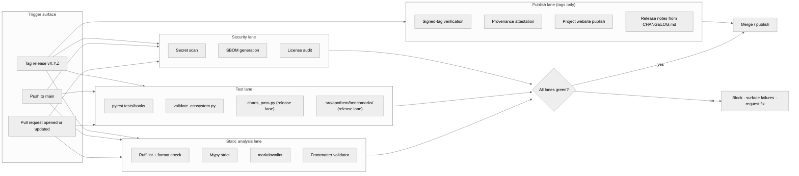

{/* SPDX-License-Identifier: MIT */}

**The structural map of the build · validate · publish workflow that gates
every change to the Apothem ecosystem.** This document installs the
visualization surface; the concrete GitHub Actions workflow files and the
release tooling land later under the production-readiness installation.

## Pipeline shape

## Lane roles

- **Static analysis lane** — fast feedback. Ruff covers Python style and a
  curated rule set; mypy enforces type discipline at strict; markdownlint
  policies the documentation surface; the frontmatter validator gates
  artifact-schema compliance for rules, skills, delegated workers, and commands.
- **Test lane** — `pytest tests/hooks` exercises the hook runtime against the
  full event matrix; `validate_ecosystem.py` is the primary structural gate
  for cross-artifact consistency; `chaos_pass.py` and the per-class benchmark
  suite under `src/apothem/benchmarks/` activate on the release lane to catch
  degradation under degraded inputs and runtime-budget regressions.
- **Security lane** — secret scanning catches accidental committed
  credentials; SBOM generation and license audits gate the supply-chain
  surface for any production-readiness install.
- **Publish lane** — runs only on tagged releases. Signed-tag verification
  confirms release-branch provenance; the project website publishes from
  `site/dist/` to the GitHub Pages target; release notes derive from
  `CHANGELOG.md` Keep-A-Changelog format.

## Concrete configuration

The actual workflow files (`.github/workflows/ci.yml`,
`.github/workflows/release.yml`, etc.) install during the production-readiness
ecosystem build-out. This diagram defines the canonical shape every future
configuration mirrors.

## Authoritative cross-references

- `pyproject.toml` — Ruff / mypy / pytest configuration source of truth.
- `scripts/dev/validate_ecosystem.py` — the primary cross-artifact gate.
- `scripts/dev/validate_hooks.py` — hook-specific structural validation.
- `scripts/dev/chaos_pass.py` — adversarial sweep of every configured hook.
- `src/apothem/benchmarks/` — per-class runtime budget verifiers.
- `site/content/docs/developer-guide.mdx` — the operator-facing contributor workflow.
- `CHANGELOG.md` — release-note source.
