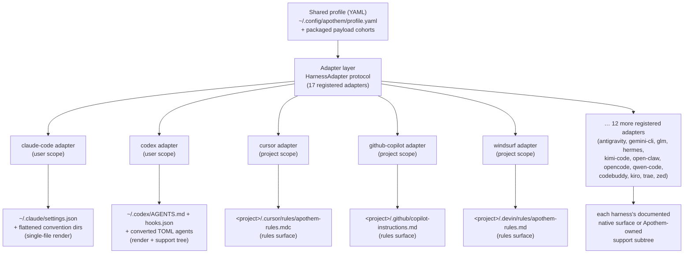

{/* SPDX-License-Identifier: MIT */}

Apothem uses one schema-validated YAML profile as the semantic source of truth
and derives every harness-specific install surface through adapter classes that
implement the `HarnessAdapter` protocol. Each adapter writes to the harness's
documented user or project location and uses Apothem-owned support paths only
when the harness has no matching native primitive.

## Why an adapter abstraction

Every harness speaks a different config dialect: one wants a JSON settings file,
another a directory of `.mdc` rule files, a third a single Markdown instructions
file. If Apothem hard-coded that knowledge into the CLI, every harness would
leak its assumptions into the core, and adding a harness would mean touching
install, update, uninstall, and verify logic in lockstep.

The adapter pattern inverts that. The core knows only the `HarnessAdapter`
protocol — a small contract of lifecycle methods. Each harness's dialect lives
inside one self-contained sub-package that implements the contract. The core
asks an adapter to *install* without knowing whether that means rendering a JSON
file, writing a rules directory, or laying down a support tree. New harnesses
join by satisfying the protocol and registering an entry point; nothing in the
core changes. This is the structural reason Apothem stays host-agnostic — the
abstraction is the boundary that keeps harness-specific knowledge from
spreading.

## The shape of an adapter

Adapters fall into two materialization shapes, both visible in the registry:

- **Single-file renderers** translate profile fields into one harness-native
  config file. The Claude Code adapter, for example, always writes
  `~/.claude/settings.json` from the shared profile and flattens the Apothem
  convention directories (`agents/`, `rules/`, `skills/`, …) beside it.
- **Rules-surface and support-tree adapters** propagate the Apothem payload
  cohort into the harness's documented rules location, converting cohorts into
  the native format where one exists and parking the rest under an
  Apothem-owned support subtree referenced from the native anchor. The Cursor
  adapter writes a single `.cursor/rules/apothem-rules.mdc` into the supplied
  project root and delivers only the rules surface.

A given adapter is **user-scope** (writes under the home directory) or
**project-scope** (requires `--project <path>` and writes inside that tree);
the registry records which.

## Current adapter topology



The center-to-edge fan-out is the architecture the project name encodes: one
profile at the core, every harness an equal distance out along its own adapter.

## Protocol definition

```python
from pathlib import Path
from typing import Protocol

class HarnessAdapter(Protocol):
    name: str
    output_path: Path

    def install(self, profile: dict[str, object]) -> object:
        ...

    def update(self, profile: dict[str, object]) -> object:
        ...

    def uninstall(self) -> None:
        ...

    def is_installed(self) -> bool:
        ...

    def verify(self) -> bool:
        ...
```

Project-scope adapters may additionally accept `project: Path | None` on
lifecycle methods and expose `resolve_output_path(project)`. The CLI passes
`--project PATH` only to adapters whose method signature accepts it.

## Entry-point registration

Adapters register via the `apothem.harnesses` setuptools entry-point group:

```toml
[project.entry-points."apothem.harnesses"]
cursor = "apothem.harnesses.cursor:CursorAdapter"
```

The central registry at `src/apothem/lib/harness_registry.py` records the exact
seventeen public IDs, entry points, docs paths, target paths, package-data
requirements, capability states, and standard convention pin paths. The CLI
loads adapters through that registry instead of rediscovering product facts in
each command.

## Profile-to-native mapping

Each adapter implements the translation logic appropriate to its harness:

```
YAML profile + payload cohort    Harness-native surface
-----------------------------    ----------------------
identity / preferences       --> native config fields or rendered instruction context
commands/*.md                --> native commands or SKILL.md folders
rules/*.md                   --> native rules where supported, otherwise support trees
hooks/messages/*.md          --> native hooks where supported, otherwise support trees
agents/*.md                  --> native agent formats where supported
skills/*/SKILL.md            --> native skill folders where supported
```

Unsupported and discovery-pending capability cells become structured warnings
before writes. They are not silently projected into invented vendor surfaces.

## Adding a new adapter

See [Authoring a harness adapter](/docs/examples/authoring-a-harness-adapter)
for a step-by-step guide.
