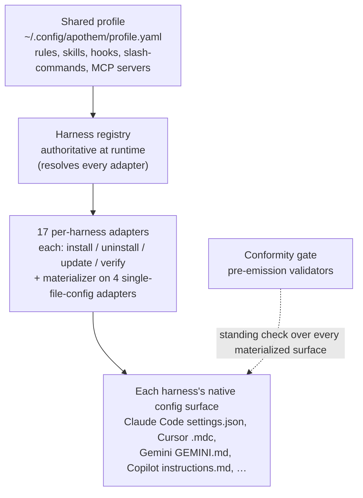

{/* SPDX-License-Identifier: MIT */}

Apothem is built around a single idea: one shared governance profile,
materialized into every harness's native configuration format by a
per-harness adapter. This section explains the structural pieces — the adapter
protocol, the profile schema, the source-tree layout, and the install workflow
that wires them together.

## System overview

At a glance, Apothem is one pipeline: a single shared profile feeds the harness
registry, which resolves every per-harness adapter; each adapter materializes
its harness's native configuration surface, and a standing conformity gate
checks every materialized surface.

## Pages

| Page | Description |
|------|-------------|
| [Harness adapter abstraction](/docs/architecture/harness-adapter-abstraction) | The `HarnessAdapter` protocol — how adapters translate the shared profile into platform-native config. |
| [Shared profile schema](/docs/architecture/shared-profile-schema) | The schema-backed YAML profile at `~/.config/apothem/profile.yaml` or `--profile PATH`. |
| [Source layout](/docs/architecture/source-layout) | Why Apothem uses a `src/` layout and how the tree is organized. |
| [Installation workflow](/docs/architecture/installation-workflow) | How `apothem install`, `update`, and `uninstall` work end-to-end. |
| [Delegated workers](/docs/architecture/agents) | Repository-scoped instructions for multi-worker runtimes operating in this repo. |
| [Self-contained runtime](/docs/architecture/self-contained-runtime) | How the engine runs from any checkout — vendored dependencies, the `PYTHONPATH=src` invocation model, and the plugin-tree bootstrap. |
| [Dependency vendoring strategy](/docs/architecture/vendoring-strategy) | Which third-party packages Apothem vendors under `src/apothem/_vendor/`, which stay system prerequisites, and how vendored copies are refreshed. |
| [Cohort packaging contract](/docs/architecture/cohort-packaging-contract) | The downstream-consumable contract that enumerates cohorts and resolves their per-harness native targets without re-deriving the mapping. |
| [CI/CD pipeline diagram](/docs/architecture/cicd-pipeline) | A visual map of the build, test, lint, security, and publish workflow stages that gate every code change and release. |
