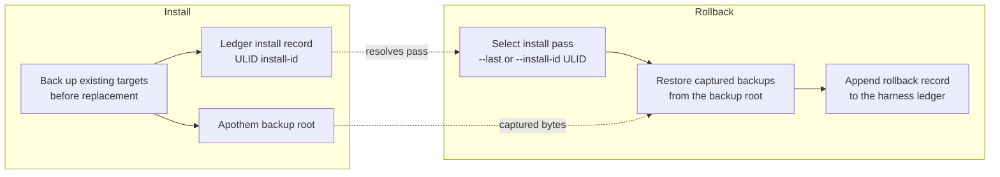

{/* SPDX-License-Identifier: MIT */}

## Install flow

```mermaid
flowchart TD
    accTitle: Apothem install workflow
    accDescr: Top-down flowchart of the apothem install command from CLI invocation through adapter lookup, profile load, adapter install call, native config write, and final apothem verify check.
    A[apothem install --harness X] --> B[Resolve adapter through registry]
    B --> C[Load and validate profile YAML<br/>before writes]
    C --> D[Adapter.install(profile, project)]
    D --> E[Write native config and support cohorts]
    E --> F[apothem verify --harness X]
    F --> G{All checks pass?}
    G -- yes --> H[Done]
    G -- no --> I[Report failures]
```

## Update flow

On `apothem update --harness X`:

1. Load and validate `~/.config/apothem/profile.yaml` or `--profile PATH`.
2. Resolve the selected harness or `all` through the central registry.
3. Validate the full materialization plan before the first write.
4. Call `Adapter.update(profile, project=...)`.
5. Report created, updated, unchanged, skipped, warning, and error outcomes.

## Uninstall flow

On `apothem uninstall --harness X`:

1. Call `Adapter.uninstall()`.
2. The adapter removes only the files it wrote; the shared profile YAML and
   unrelated operator-authored files are untouched.

## Scope resolution

Each adapter writes to its own fixed install root: user-home for user-scope
adapters and project-local for project-scope adapters. The CLI does not expose
a `--scope` flag; project-scope adapters require `--project <path>`. Each
destination is documented at
`site/content/docs/harnesses/<harness>.mdx`.

## Error handling

Install/update operations validate before writing, back up existing matching
targets before replacement, and merge only Apothem-managed child entries in
shared discovery directories. `--dry-run` executes the same validation and
returns skipped or unchanged outcomes without creating directories or files.

## Reversibility (backup and rollback)

Every install pass is reversible. Replaced bytes are captured into the Apothem
backup root and the pass is recorded in the harness ledger under a ULID
install id; [`apothem rollback`](/docs/cli-reference/rollback) selects a
recorded pass and restores those captured backups.


