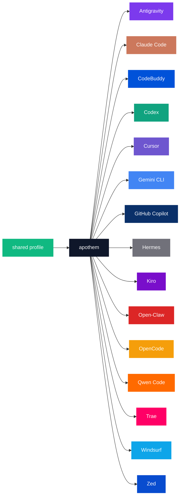

{/* SPDX-License-Identifier: MIT */}

The canonical brand-name × color-code enumerations below are wrapped in a `text` fence to preserve verbatim per-harness identifiers required by the palette's catalog purpose.

## Apothem core

| Token | Light | Dark | Use |
|---|---|---|---|
| `apothem-hub` | `#0F172A` | `#F1F5F9` | The central distribution node ("apothem") in every architectural diagram. |
| `shared-profile` | `#10B981` | `#34D399` | The source-of-truth profile feeding the apothem core. |

## Harness palette

Fifteen of the seventeen harnesses are colored to match their primary brand
identity, so a reader can tell the tools apart in a diagram. The Apothem mark
itself uses only the slate and emerald colors on the [palette](/docs/brand/palette)
page; it carries no harness color. The remaining two — `glm` and `kimi-code` — do not yet have a defined
brand color; their rows are added once the upstream brand color is set, per the
propagation step under [Updates](#updates).

```text
| Token             | Light     | Dark      | Source                                                                                                                                              |
|-------------------|-----------|-----------|-----------------------------------------------------------------------------------------------------------------------------------------------------|
| `antigravity`     | `#7C3AED` | `#9F67FF` | Google Antigravity deep-purple.                                                                                                                     |
| `claude-code`     | `#CC785C` | `#E89378` | Anthropic terracotta-orange.                                                                                                                        |
| `codebuddy`       | `#0052D9` | `#5E8EF7` | Tencent CodeBuddy blue.                                                                                                                             |
| `codex`           | `#10A37F` | `#19C796` | OpenAI signature teal.                                                                                                                              |
| `cursor`          | `#6E56CF` | `#9B85E3` | Cursor brand purple.                                                                                                                                |
| `gemini-cli`      | `#4285F4` | `#6BA4F7` | Google blue.                                                                                                                                        |
| `github-copilot`  | `#0A3069` | `#5B8FE3` | GitHub Mona deep-blue.                                                                                                                              |
| `hermes`          | `#71717A` | `#A1A1AA` | Community silver-grey.                                                                                                                              |
| `kiro`            | `#790ECB` | `#A862DD` | Kiro violet.                                                                                                                                        |
| `open-claw`       | `#DC2626` | `#F87171` | Community red-orange.                                                                                                                               |
| `opencode`        | `#F59E0B` | `#FBBF24` | Community amber.                                                                                                                                    |
| `qwen-code`       | `#FF6A00` | `#FF8C40` | Alibaba Qwen orange.                                                                                                                                |
| `trae`            | `#FF0066` | `#FF599C` | ByteDance Trae magenta.                                                                                                                             |
| `windsurf`        | `#0EA5E9` | `#38BDF8` | Windsurf sky-blue.                                                                                                                                  |
| `zed`             | `#084CCF` | `#5E8BE0` | Zed Industries blue.                                                                                                                                |
```

## Trademarks

The harness names, product names and brand colors on this page and across the
site belong to their owners and are trademarks of their respective owners.
Apothem names a tool only to say which one it configures, and uses a tool's
color only to tell it apart in a diagram. Apothem is an independent project; it
is not affiliated with, sponsored by or endorsed by any of these companies or
projects, and it ships none of their logos.

## Naming rationale

- **`apothem-hub`** — the geometric center the name evokes (the apothem of a regular polygon points inward to its core).
- **`shared-profile`** — the upstream source, distinct from any single harness color so it reads as the "input" arrow in every diagram.
- **Per-harness tokens** mirror the harness slug used throughout the codebase (`harnesses/<slug>/`, the entry-point key, the CLI `--harness <slug>` argument). One word per concept; the same string everywhere.

## Mermaid usage



## Accessibility

Every light-mode token meets WCAG 2.2 AA contrast against white text (≥4.5 : 1) where the contrast permits without distorting the brand color. Where a harness's native brand color falls below the AA threshold against white text on its own (notably the amber / orange family and the sky-blue / teal family of tokens enumerated above), diagrams that need WCAG AA text-on-color contrast use the **dark-mode variant** (the lifted hue) as the diagram fill so the white text reads cleanly. The dark-mode column is calibrated for this purpose: every dark-mode token clears AA against white text.

## Updates

The palette updates only when a harness ratifies a brand change upstream. Per-harness brand changes propagate atomically across `site/app/global.css`, this page, and every affected SVG master under `assets/src/`.
