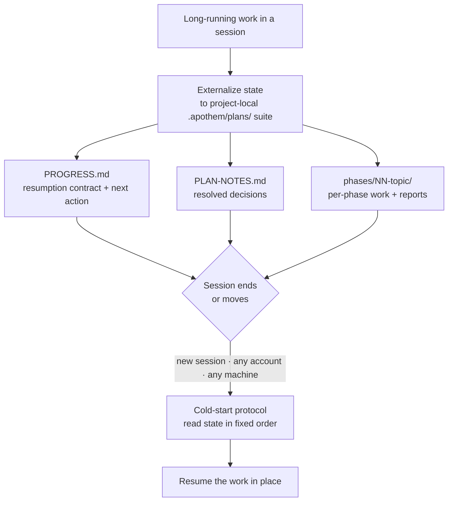

{/* SPDX-License-Identifier: MIT */}

Most assisted work lives and dies inside one conversation. Close the
chat, switch machines, or sign in on another account, and the thread of what
you were doing is gone — the next session starts cold, with no memory of the
decisions you already made.

Apothem inverts that. For long-running, multi-step work it externalizes its
**full working state** to a project-local `.apothem/plans/` suite — files that
sit in your repository, not inside any one cloud chat history. The state is the
durable artifact; the session is disposable.

## The core idea

A plan suite at `<project-root>/.apothem/plans/{suite}/` carries two things that
make a session replaceable:

- **A resumption contract.** `PROGRESS.md` records the current phase and task
  status, the precise next action, the conventions in force, the decisions
  already resolved, and the exact files the next session must read.
- **A cold-start protocol.** A fresh session reads those files in a fixed order
  and re-establishes the full picture before doing any work — no conversation
  history required.

Because that state is in your project's files, a fresh session on **any account
or machine** pointed at the same project picks the work back up in place. Nothing
is locked inside one chat transcript. This is the property that makes
multi-day, at-scale, structured work — large corpora, long migrations, big
review passes — survive boundaries that would otherwise end it.

## What it is, precisely

Stated accurately so the guarantee is clear:

- **It is** file-externalized state plus a cold-start resumption protocol. The
  work resumes because the state lives in your project's files, independent of
  any session, account, or machine.
- **It is not** an automatic cross-account sync service. Apothem does not push
  your plan state between accounts on its own — the files travel the way your
  project's files already travel (version control, a shared checkout, a synced
  directory). What Apothem guarantees is that wherever the project files land, a
  fresh session can resume from them.

## Why this matters

The longer and larger the work, the more a single conversation becomes a
liability. A multi-day overhaul or a sweep across a large codebase will outlast
any one session — context windows compact, sessions time out, machines change.
By treating the project's own files as the source of truth for in-flight work,
Apothem makes the work resilient to all three boundaries: session, account, and
machine.

## Where the state lives

| Artifact | Location | Holds |
|----------|----------|-------|
| Plan suite | `<project-root>/.apothem/plans/{suite}/` | One self-contained unit of in-flight work |
| Resumption contract | `<suite>/PROGRESS.md` | Phase/task status, next action, conventions, critical-files manifest |
| Decision ledger | `<suite>/PLAN-NOTES.md` | Resolved decisions, never re-asked |
| Per-phase work | `<suite>/phases/NN-topic/` | The phase's tasks and its report |

The plans tree is gitignored by Apothem's canonical `.gitignore` snippet, so
plan state stays local by default. To carry in-flight work across machines or
accounts deliberately, move the `.apothem/plans/` suite the same way you move
any other project files.

## Related

- **[Seriousness tiers](/docs/concepts/seriousness-tiers)** — how governance and
  state-externalization discipline scale to the engagement.
- **[The command pipeline](/docs/pipeline)** — the `/plan` stages that author and
  advance a plan suite.

## Recommended Next Step

**Read [Seriousness tiers](/docs/concepts/seriousness-tiers)** to see how the
externalization discipline scales from a quick experiment to a multi-day,
boundary-crossing effort.
