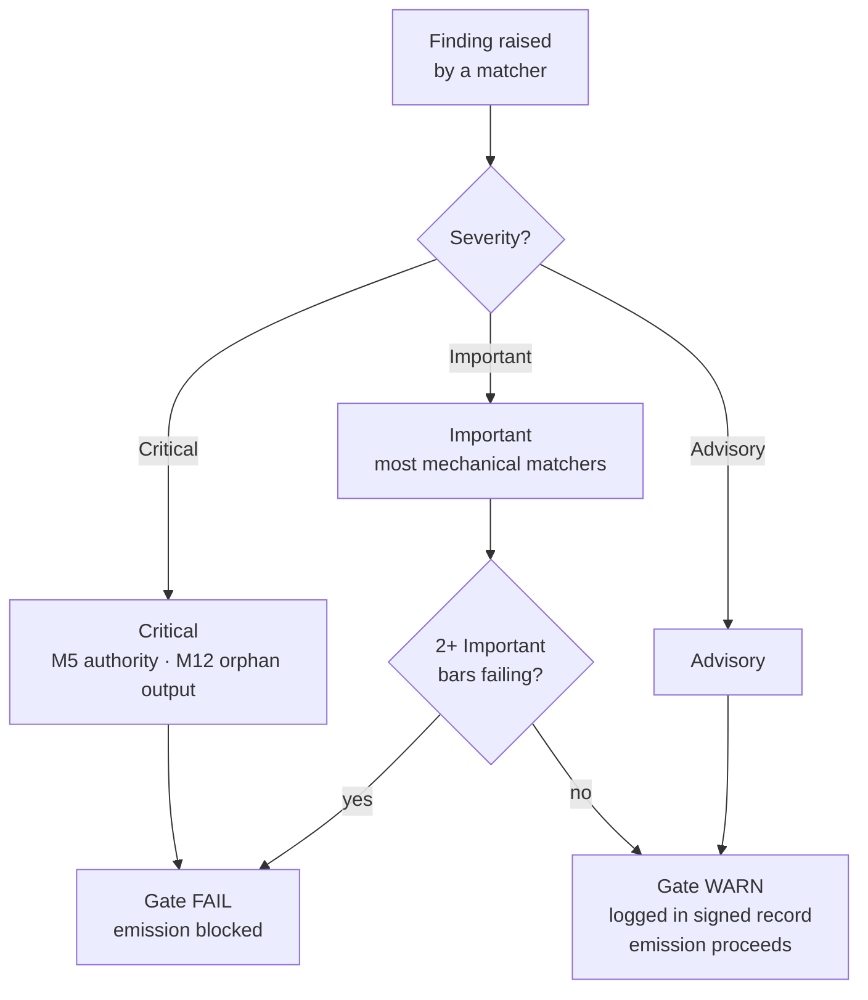

{/* SPDX-License-Identifier: MIT */}

## The fifteen bars

| Bar | ID | Mandate | Check class | Failure → action |
|---|---|---|---|---|
| 1 | M1 | Host-Project Agnosticism | Reasoned | Revise to match host conventions |
| 2 | M2 | Editorial Discipline (disclosure ledger) | Mechanical | Add disclosure markers |
| 3 | M3 | Ten Quality Dimensions | Reasoned | Revise on failing dimensions |
| 4 | M4 | Self-Application (gate signed record present) | Mechanical | Record signed-record block |
| 5 | M5 | Authority Principle (no fabricated identity / endpoint / secret) | Mechanical | Route to inquiry |
| 6 | M6 | Expertise Incorporation (surfaced gaps) | Reasoned | Surface gaps; cite refinements |
| 7 | M7 | Option Annotation (Recommended marker + driver rationale) | Mechanical | Annotate option sets |
| 8 | M8 | Definitiveness (no hedging in prescriptive prose) | Mechanical | Promote hedges to conditionals |
| 9 | M9 | Visual Leverage (structural subjects carry diagrams) | Reasoned | Author / refresh diagram |
| 10 | M10 | Bidirectional Binding (reciprocal back-pointers closed) | Mechanical | Close half-edges |
| 11 | M11 | Agile Sprints (Goal / Backlog / DoR / DoD / Review / Retrospective) | Reasoned | Restructure as sprints |
| 12 | M12 | Phase Reporting & Canonical Layout | Mechanical | Author rollup; relocate to canonical layout |
| 13 | M13 | Code Craft (lint / format / type-check; magic-number; bare-except) | Mechanical | Apply per-language code-craft rules |
| 14 | M14 | Systemicity (declares upstream / downstream / peers / enforcers) | Reasoned | Declare; index in registries |
| 15 | M15 | Production-Ready (tests + docs + CHANGELOG + conformant commit + CI green + semver-stability) | Mechanical | Add missing surfaces |

## Severity ladder

| Severity | Effect on gate |
|---|---|
| **Critical** | Gate FAIL — emission blocked unconditionally |
| **Important** | Gate FAIL when 2+ Important bars fail simultaneously |
| **Advisory** | Gate WARN — logged in the signed record; does not block emission |

Most mechanical-fraction matchers default to **Important**. M5 (authority — secrets, fabricated endpoints) and M12 (orphan outputs) are **Critical**.



## Mechanical-fraction matchers

The mechanical fraction lives at [`src/apothem/conformity/*_grep.py`](https://github.com/ahmed-g-gad/apothem/tree/main/src/apothem/conformity), orchestrated by [`src/apothem/conformity/gate.py`](https://github.com/ahmed-g-gad/apothem/blob/main/src/apothem/conformity/gate.py).

| Matcher | Bar | Function |
|---|---|---|
| `hedging_grep.py` | M8 | Detects hedging vocabulary in prescriptive prose |
| `option_annotation_grep.py` | M7 | Verifies `**Recommended**` marker + driver rationale on option sets |
| `user_confirm_grep.py` | M5 | Blocks `<USER-CONFIRM:…>` placeholders from emission |
| `binding_reciprocity_grep.py` | M10 | Detects half-edges in `## Bindings (§0.j five-direction)` |
| `orphan_output_grep.py` | M12 | Flags artifacts with no consumer / no index entry / no producer attribution |
| `bare_except_grep.py` | M13 | Detects `except:` / `except Exception:` without justifying comment |
| `magic_number_grep.py` | M13 | Detects numeric literals in business logic |
| `commented_out_code_grep.py` | M13 | Detects commented-out code blocks |
| `file_header_grep.py` | M13 | Verifies single-line SPDX license-header presence |
| `frontmatter_grep.py` | M14 | Verifies required frontmatter fields on the four canonical directive directories listed below |
| `semver_stability_grep.py` | M15 | Detects breaking public-API changes without a MAJOR version bump |
| `production_ready_pr_grep.py` | M15 | Verifies same-change-set discipline (tests + docs + CHANGELOG) |
| `secret_leak_grep.py` | M15 | Detects hardcoded secrets / credentials |
| `unpinned_action_grep.py` | M15 | Verifies GitHub Actions pinning to commit SHA |
| `always_on_budget_grep.py` | budget cap | Caps always-on rule body at 500 substantive tokens |

## Running the gate

On an installed harness the gate runs automatically: Claude Code's
`settings.json` wires it as a `PreToolUse` hook that invokes the
materialized copy at `~/.claude/.apothem/support/conformity/gate.py` before every
Write/Edit. From a source checkout, the module form drives the same code:

```shell
# Single-file dispatch (mimics the PreToolUse hook):
echo '{"tool_input": {"file_path": "path/to/file", "content": "..."}}' \
    | python -m apothem.conformity.gate --hook

# Composite sweep across the repo:
python -m apothem.conformity.gate --sweep src/ site/content/docs/ rules/
```

See [Running the conformity gate](/docs/usage/conformity-gate) for the full procedure.

## Reference

- [Pre-emission gate registry](/docs/governance/pre-emission-gate-registry) — canonical bar definitions
- [Outward conformity registry](/docs/governance/outward-conformity-registry) — M1-M15 detailed semantics
- [Cross-cutting mandates](/docs/governance/cross-cutting-mandates) — mandate source of truth
- [Performance discipline](https://github.com/ahmed-g-gad/apothem/blob/main/src/apothem/rules/performance-discipline.md) — per-class runtime budgets
