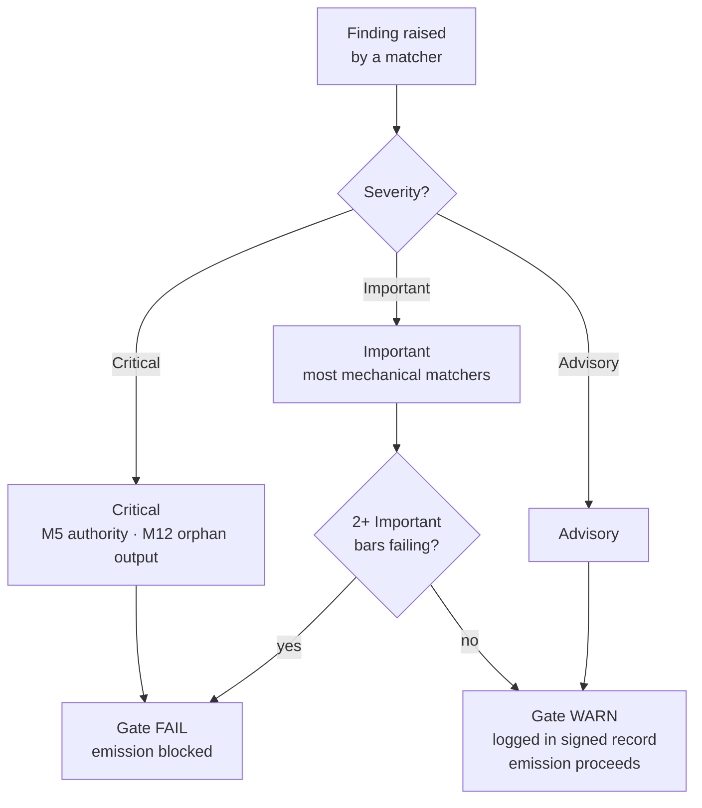

{/* SPDX-License-Identifier: MIT */}

## The fifteen bars

| Bar | ID | Mandate | Check class | Failure → action |
|---|---|---|---|---|
| 1 | M1 | Host-Project Agnosticism | Reasoned | Revise to match host conventions |
| 2 | M2 | Editorial Discipline (disclosure ledger) | Mechanical | Add disclosure markers |
| 3 | M3 | Ten Quality Dimensions | Reasoned | Revise on failing dimensions |
| 4 | M4 | Self-Application (gate signed record present) | Mechanical | Record signed-record block |
| 5 | M5 | Authority Principle (no fabricated identity / endpoint / secret) | Mechanical | Route to inquiry |
| 6 | M6 | Expertise Incorporation (surfaced gaps) | Reasoned | Surface gaps; cite refinements |
| 7 | M7 | Option Annotation (Recommended marker + driver rationale) | Mechanical | Annotate option sets |
| 8 | M8 | Definitiveness (no hedging in prescriptive prose) | Mechanical | Promote hedges to conditionals |
| 9 | M9 | Visual Leverage (structural subjects carry diagrams) | Reasoned | Author / refresh diagram |
| 10 | M10 | Bidirectional Binding (reciprocal back-pointers closed) | Mechanical | Close half-edges |
| 11 | M11 | Agile Sprints (Goal / Backlog / DoR / DoD / Review / Retrospective) | Reasoned | Restructure as sprints |
| 12 | M12 | Phase Reporting & Canonical Layout | Mechanical | Author rollup; relocate to canonical layout |
| 13 | M13 | Code Craft (lint / format / type-check; magic-number; bare-except) | Mechanical | Apply per-language code-craft rules |
| 14 | M14 | Systemicity (declares upstream / downstream / peers / enforcers) | Reasoned | Declare; index in registries |
| 15 | M15 | Production-Ready (tests + docs + CHANGELOG + conformant commit + CI green + semver-stability) | Mechanical | Add missing surfaces |

## Severity ladder

| Severity | Effect on gate |
|---|---|
| **Critical** | Gate FAIL — emission blocked unconditionally |
| **Important** | Gate FAIL when 2+ Important bars fail simultaneously |
| **Advisory** | Gate WARN — logged in the signed record; does not block emission |

Most mechanical-fraction matchers default to **Important**. M5 (authority — secrets, fabricated endpoints) and M12 (orphan outputs) are **Critical**.



## Validators

The mechanical fraction lives at [`src/apothem/conformity/`](https://github.com/ahmed-g-gad/apothem/tree/main/src/apothem/conformity), orchestrated by [`src/apothem/conformity/gate.py`](https://github.com/ahmed-g-gad/apothem/blob/main/src/apothem/conformity/gate.py).
The gate runs each validator in one of three ways:

- **per-write**: on every pending write (`--hook`), or on every tracked file with `--all-perwrite`.
- **standalone**: across the whole repository with `--all`, or one at a time with `--check <name>`.
- **change-set**: against a staged diff, outside the gate's sweeps.

The table below is generated from the validator modules.

{/* apothem:generated-reference:start */}

The gate registers 53 validators: 22 per-write, 30 standalone and 1 change-set.

| Validator | Runs | Rule anchor | What it checks |
| --- | --- | --- | --- |
| `agent-capability-grep` | standalone | agent-capability-discipline (per-harness capability matrix) | Verify every harness declares its agentic-capability matrix. |
| `agents-md-coverage-grep` | standalone | rules/agents-md-convention.md | Flag stale agent-companion files under the root-only AGENTS.md convention. |
| `agnosticism-grep` | standalone | rules/agnostic-posture.md §3 (harness neutrality) + §1 (default-off) | Flag harness bias and re-introduced enforcement presets in shipped surfaces. |
| `always-on-budget-grep` | per-write | D1 token-budget-discipline §Always-on body budget | Body-budget conformity matcher for always-on rules. |
| `bare-except-grep` | per-write | M13.3 error handling | Flag bare except clauses without typed exceptions or re-raise. |
| `binding-five-direction-grep` | standalone | M10 bidirectional-binding §1 (five-direction Bindings section) | Require the five-direction Bindings section on every rule, command, agent, and skill. |
| `binding-reciprocity-corpus-grep` | standalone | M10 bidirectional-binding §2 (↔ self-reciprocal) | Cross-file binding-reciprocity corpus walk — the ↔-symmetric half-edge check. |
| `binding-reciprocity-grep` | per-write | M10 bidirectional-binding §Notation | Flag binding declarations using non-canonical arrow notation. |
| `brand-mark-grep` | per-write | rules/plain-language.md (brand-mark display/identifier casing) | Flag brand-mark display/identifier form drift on brand-touched surfaces. |
| `commented-out-code-grep` | per-write | M13.1 why-not-what comments | Flag substantial commented-out code blocks left in source. |
| `completion-claim-grep` | per-write | rules/session-closure.md (verifiable-close output honesty) | Flag unsupported completion / guarantee claims in cohort prose. |
| `conventional-commit-grep` | standalone | CLAUDE.md Coding Conventions — Conventional Commits | Flag HEAD commit messages that drift from the Conventional-Commits grammar. |
| `copilot-instructions-presence-grep` | per-write | — | GitHub Copilot surface presence check. |
| `cross-platform-matrix-grep` | standalone | cross-platform OS x Python CI matrix | Verify CI declares a cross-platform OS x Python matrix. |
| `determinism-grep` | standalone | rules/determinism.md | Prove every command and skill surface has a deterministic output shape. |
| `diagram-staleness-grep` | per-write | M9 visual-leverage §Fidelity | Flag diagrams whose verification date is missing or stale. |
| `dynamism-grep` | standalone | rules/dynamism.md (static-version embeds) | Flag static-string version embeds in dynamism-required surfaces. |
| `editorconfig-presence-grep` | standalone | supply-chain SOTA-rigor §editorconfig | Verify a canonical .editorconfig is present at the project root. |
| `file-header-grep` | per-write | — | Authorship-header presence and canonical-form check. |
| `freshness-token-grep` | standalone | rules/freshness-facade.md | Flag freshness-narrative phrases on shipped public surfaces. |
| `frontmatter-grep` | per-write | the per-class frontmatter JSON Schemas (src/apothem/schemas/) | Validate per-artifact-class YAML frontmatter against required-key sets. |
| `frontmatter-value-grep` | standalone | per-class JSON Schema enum/pattern value constraints | Validate frontmatter VALUES against the per-class JSON Schema enum/pattern constraints. |
| `gitattributes-presence-grep` | standalone | supply-chain .gitattributes contract | Verify the repo-root ``.gitattributes`` carries the canonical contract. |
| `harden-runner-grep` | standalone | harden-runner egress baseline | Verify every workflow job opens with a conformant harden-runner step. |
| `hedging-grep` | per-write | M8 definitiveness §Hedging | Flag hedging vocabulary in prescriptive contexts. |
| `license-author-consistency-grep` | per-write | — | LICENSE author-identity presence check. |
| `link-check` | per-write | rules/code-craft-markdown.md §6 Link Discipline | Validate Markdown internal links against the on-disk reference graph. |
| `magic-number-grep` | per-write | M13.10 magic numbers | Flag magic numbers in source code. |
| `multi-surface-coherence-grep` | per-write | — | Shared-claim coherence across AI-conventions surfaces. |
| `naming-grep` | standalone | CLAUDE.md Coding Conventions (kebab-case naming) | Validate filesystem paths against the canonical naming convention. |
| `no-global-plans-grep` | standalone | CLAUDE.md Plans Discipline (no global plans) | Walk the git index for tracked plans paths; fail when found. |
| `no-toplevel-docs-grep` | standalone | single-source-of-truth (docs live in site/, not root docs/) | Fail when a top-level ``docs/`` directory exists at the repository root. |
| `oidc-trusted-publishing-grep` | standalone | OIDC trusted publishing | Verify release workflows use OIDC trusted publishing. |
| `option-annotation-grep` | per-write | M7 option-annotation (H6 per-option bind) | Enforce the per-option Recommended label-to-body bind (H6). |
| `orphan-output-grep` | per-write | M12 canonical-layout + M14 systemicity | Flag artifacts emitted to non-canonical locations or without provenance. |
| `permissions-minimum-scope-grep` | standalone | minimum-scope workflow permissions | Verify every GitHub Actions workflow declares a minimum-scope ``permissions:`` block. |
| `plain-language-grep` | standalone | rules/plain-language.md — user-facing prose | Flag mechanistic / harness-internal vocabulary in user-facing prose. |
| `plan-next-step-consistency-grep` | standalone | rules/recommend-next-step.md | Advisory: flag plan-suite infra files whose Recommended-Next-Step footer drifts from the suite's recorded next pipeline stage. |
| `plan-suite-structure-grep` | standalone | context-management-scratch 2 (suite-locality + closed vocab) + canonical-layout-reporting-tiers 2.1 (numeric-prefix discipline) | Validate plan-suite structure: suite-locality, closed vocab, numeric prefix. |
| `plans-discipline-language-grep` | standalone | CLAUDE.md Plans Discipline (multi-surface language) | Verify the canonical Plans Discipline language reaches every required surface. |
| `production-ready-pr-grep` | per-write | M15 production-ready §Same-change-set | Flag commits whose change-set lacks the production-ready four-class shape. |
| `recommend-next-step-grep` | standalone | rules/recommend-next-step.md | Verify every command file carries a `## Recommended Next Step` block. |
| `redundancy-grep` | standalone | rules/operational-mandates.md §CM-7 coherent-product non-redundancy | Flag substantively-duplicated paragraphs across the governed corpus. |
| `reference-token-grep` | standalone | rules/own-voice-reimplementation.md | Flag leaked reference-platform branding tokens on authored surfaces. |
| `registry-capability-consistency-grep` | standalone | rules/agent-capability-discipline.md — registry capability cells backed by evidence | Flag registry capability cells not backed by install / materializer / projection evidence. |
| `secret-leak-grep` | per-write | M13.8 security + M15 production-ready | Block emission of artifacts containing hardcoded credentials. |
| `semver-stability-grep` | change-set | M15 semver-stability | Semver stability matcher (M15 mechanical fraction). |
| `smoke-install-grep` | standalone | production-ready section 8.1 paired install scripts | Smoke-test the paired install scripts at the repository root. |
| `static-version-grep` | standalone | rules/dynamism.md §static-version-resolution | Verify version-bearing sites resolve dynamically, not as static literals. |
| `token-efficiency-grep` | per-write | clean-room-generation §5 + token-efficiency-rewrite | Flag filler phrases, throat-clearing openers, and content-free qualifiers. |
| `unpinned-action-grep` | per-write | M15 production-ready §Supply-chain | Flag GitHub Actions workflows that pin actions to mutable refs. |
| `user-confirm-grep` | per-write | M5 authority-inquiry §10 | Block emission of artifacts containing unresolved authority placeholders. |
| `workflow-concurrency-grep` | standalone | workflow concurrency + per-job timeouts | Enforce concurrency + per-job timeout discipline on GitHub workflows. |

{/* apothem:generated-reference:end */}

## Running the gate

On an installed harness the gate runs automatically: Claude Code's
`settings.json` wires it as a `PreToolUse` hook that invokes the
materialized copy at `~/.claude/.apothem/support/conformity/gate.py` before every
Write/Edit. From a source checkout, the module form drives the same code. The
gate is advisory by default: it reports findings and exits `0`. Add `--strict`
to exit `2` on a blocking finding. An unknown validator name exits `3`.

```shell
# Every standalone validator across the repository:
python -m apothem.conformity.gate --all .

# The same sweep, failing on a blocking finding (the CI form):
python -m apothem.conformity.gate --all --strict .

# Every per-write validator against every tracked file:
python -m apothem.conformity.gate --all-perwrite .

# One validator by name (names come from --list):
python -m apothem.conformity.gate --check naming-grep .

# List every registered validator as JSON:
python -m apothem.conformity.gate --list

# Single-file dispatch (mimics the PreToolUse hook):
echo '{"tool_input": {"file_path": "path/to/file", "content": "..."}}' \
    | python -m apothem.conformity.gate --hook
```

`python -m apothem.conformity.gate --help` prints the usage summary.
See [Running the conformity gate](/docs/usage/conformity-gate) for the full procedure.

## Reference

- [Pre-emission gate registry](/docs/governance/pre-emission-gate-registry) — canonical bar definitions
- [Outward conformity registry](/docs/governance/outward-conformity-registry) — M1-M15 detailed semantics
- [Cross-cutting mandates](/docs/governance/cross-cutting-mandates) — mandate source of truth
- [Performance discipline](https://github.com/ahmed-g-gad/apothem/blob/main/src/apothem/rules/performance-discipline.md) — per-class runtime budgets
