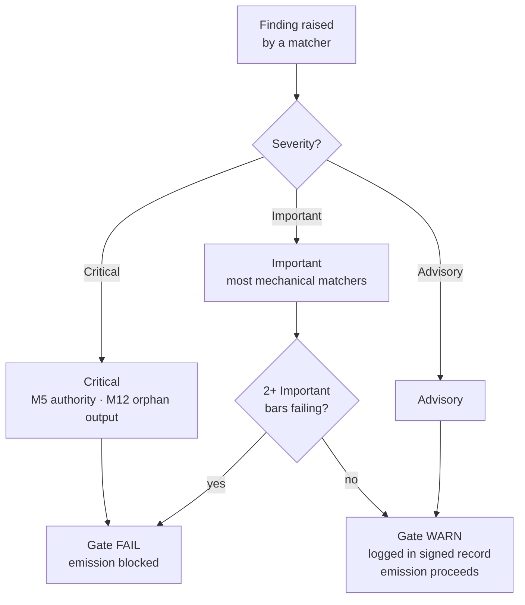

{/* SPDX-License-Identifier: MIT */}

## The fifteen bars

| Bar | ID | Mandate | Check class | Failure → action |
|---|---|---|---|---|
| 1 | M1 | Host-Project Agnosticism | Reasoned | Revise to match host conventions |
| 2 | M2 | Editorial Discipline (disclosure ledger) | Mechanical | Add disclosure markers |
| 3 | M3 | Ten Quality Dimensions | Reasoned | Revise on failing dimensions |
| 4 | M4 | Self-Application (gate signed record present) | Mechanical | Record signed-record block |
| 5 | M5 | Authority Principle (no fabricated identity / endpoint / secret) | Mechanical | Route to inquiry |
| 6 | M6 | Expertise Incorporation (surfaced gaps) | Reasoned | Surface gaps; cite refinements |
| 7 | M7 | Option Annotation (Recommended marker + driver rationale) | Mechanical | Annotate option sets |
| 8 | M8 | Definitiveness (no hedging in prescriptive prose) | Mechanical | Promote hedges to conditionals |
| 9 | M9 | Visual Leverage (structural subjects carry diagrams) | Reasoned | Author / refresh diagram |
| 10 | M10 | Bidirectional Binding (reciprocal back-pointers closed) | Mechanical | Close half-edges |
| 11 | M11 | Agile Sprints (Goal / Backlog / DoR / DoD / Review / Retrospective) | Reasoned | Restructure as sprints |
| 12 | M12 | Phase Reporting & Canonical Layout | Mechanical | Author rollup; relocate to canonical layout |
| 13 | M13 | Code Craft (lint / format / type-check; magic-number; bare-except) | Mechanical | Apply per-language code-craft rules |
| 14 | M14 | Systemicity (declares upstream / downstream / peers / enforcers) | Reasoned | Declare; index in registries |
| 15 | M15 | Production-Ready (tests + docs + CHANGELOG + conformant commit + CI green + semver-stability) | Mechanical | Add missing surfaces |

## Severity ladder

| Severity | Effect on gate |
|---|---|
| **Critical** | Gate FAIL — emission blocked unconditionally |
| **Important** | Gate FAIL when 2+ Important bars fail simultaneously |
| **Advisory** | Gate WARN — logged in the signed record; does not block emission |

Most mechanical-fraction matchers default to **Important**. M5 (authority — secrets, fabricated endpoints) and M12 (orphan outputs) are **Critical**.



## Validators

The mechanical fraction lives at [`src/apothem/conformity/`](https://github.com/ahmed-g-gad/apothem/tree/main/src/apothem/conformity), orchestrated by [`src/apothem/conformity/gate.py`](https://github.com/ahmed-g-gad/apothem/blob/main/src/apothem/conformity/gate.py).
The gate runs each validator in one of three ways:

- **per-write**: on every pending write (`--hook`), or on every tracked file with `--all-perwrite`.
- **standalone**: across the whole repository with `--all`, or one at a time with `--check <name>`.
- **change-set**: against a staged diff, outside the gate's sweeps.

The table below is generated from the validator modules.

{/* apothem:generated-reference:start */}

{/* apothem:generated-reference:end */}

## Running the gate

On an installed harness the gate runs automatically: Claude Code's
`settings.json` wires it as a `PreToolUse` hook that invokes the
materialized copy at `~/.claude/.apothem/support/conformity/gate.py` before every
Write/Edit. From a source checkout, the module form drives the same code. The
gate is advisory by default: it reports findings and exits `0`. Add `--strict`
to exit `2` on a blocking finding. An unknown validator name exits `3`.

```shell
# Every standalone validator across the repository:
python -m apothem.conformity.gate --all .

# The same sweep, failing on a blocking finding (the CI form):
python -m apothem.conformity.gate --all --strict .

# Every per-write validator against every tracked file:
python -m apothem.conformity.gate --all-perwrite .

# One validator by name (names come from --list):
python -m apothem.conformity.gate --check naming-grep .

# List every registered validator as JSON:
python -m apothem.conformity.gate --list

# Single-file dispatch (mimics the PreToolUse hook):
echo '{"tool_input": {"file_path": "path/to/file", "content": "..."}}' \
    | python -m apothem.conformity.gate --hook
```

`python -m apothem.conformity.gate --help` prints the usage summary.
See [Running the conformity gate](/docs/usage/conformity-gate) for the full procedure.

## Reference

- [Pre-emission gate registry](/docs/governance/pre-emission-gate-registry) — canonical bar definitions
- [Outward conformity registry](/docs/governance/outward-conformity-registry) — M1-M15 detailed semantics
- [Cross-cutting mandates](/docs/governance/cross-cutting-mandates) — mandate source of truth
- [Performance discipline](https://github.com/ahmed-g-gad/apothem/blob/main/src/apothem/rules/performance-discipline.md) — per-class runtime budgets
