{/* SPDX-License-Identifier: MIT */}

Dies sind die repository-bezogenen Anweisungen für Harnesses
mit mehreren Workern (Orchestrierungsplattformen, Dispatcher, autonome
Plattformen), wenn sie in diesem Repository arbeiten. Sie sind
verbindlich und werden mit jedem veröffentlichten Checkout ausgeliefert. Sie sind
kohärent mit
[`AGENTS.md`](https://github.com/ahmed-g-gad/apothem/blob/main/AGENTS.md),
[`CLAUDE.md`](https://github.com/ahmed-g-gad/apothem/blob/main/CLAUDE.md)
und den projektbezogenen Anweisungen für andere unterstützte
Harness-Oberflächen; wo die Oberflächen sich bei einer geteilten
Disziplin überschneiden (Plans-Disziplin, Datei-Header, Umgang mit Mehrdeutigkeit,
Benennung, Anti-Patterns, Modal-Hierarchie), sind sie semantisch äquivalent und
`AGENTS.md` ist die kanonische Projektstimme.

## Projektkontext

Dieses Repository ist ein Entwickler-Tooling-Ökosystem, das die Konfiguration
eines Harness beherbergt: delegierte Worker,
Slash-Befehle, Skills, Hooks, Output-Styles, eine Statuszeile, MCP-Integration,
Einstellungen, JSON-Schemata, Validatoren, Tests und Dokumentation. Es wird von
einem einzelnen Autor gepflegt. Das Layout auf der Festplatte spiegelt das
Laufzeit-Layout exakt wider. Delegierte Arbeiter in diesem Repository speichern
keinen Zustand außerhalb des veröffentlichten Baums; der veröffentlichte Baum ist
das kanonische Artefakt.

## Worker-Konventionen

Ein Lauf mit mehreren Workern in diesem Repository folgt drei Konventionen:

- **Rollen sind benannt.** Jeder delegierte Arbeiter in einem Lauf mit mehreren
  Workern trägt einen Rollen-Identifikator (kebab-case, beschreibend:
  `codebase-explorer`, `convention-auditor`, `quality-gate`,
  `memory-auditor`). Generische Rollennamen (`worker`, `helper`) sind verboten.
- **Rückgabeverträge sind explizit.** Jeder Worker-Aufruf gibt die erwartete
  Rückgabeform an — strukturierte Zusammenfassung, maximales Token-Budget,
  erforderliche Felder, Formulierung des Fehlermodus. Der Dispatcher lehnt
  fehlerhafte Rückgaben ab, anstatt stillschweigend erneut anzufordern.
- **Geteilter Zustand ist das Dateisystem.** Delegierte Arbeiter teilen keinen
  Speicher über die Dispatch-Grenze hinweg. Zustand, den zwei Worker benötigen,
  fließt durch eine benannte Datei unter dem veröffentlichten Baum (oder das
  `.apothem/plans/`-Verzeichnis des Projekts für den laufenden Arbeitszustand
  gemäß *Plans-Disziplin*; ein veralteter `.plans/`-Baum wird per
  `apothem migrate-workspace` migriert).
{/* [Machine-seeded — pending review] */}

Wenn die Aufgabe eines Workers mehrstufig ist, wird die Arbeitsspur des Workers in
`<project-root>/.apothem/plans/YYYY-MM-DD--<slug>.md` gemäß *Plans-Disziplin*
aufgezeichnet; der Dispatcher liest den Plan, um nachgelagerte Worker zu
koordinieren. Pläne werden niemals in git committet.

## Datei-Header

Jede zutreffende neue Datei, die der Assistent generiert, **MUSS** mit dem
kanonischen einzeiligen SPDX-Lizenz-Header gemäß
[`site/content/docs/reference/authorship-header.mdx`](/docs/reference/authorship-header)
beginnen, in der zum Dateityp passenden Variante. Der byte-exakte Header-Fixture
befindet sich unter
[`src/apothem/schemas/authorship-header.txt`](https://github.com/ahmed-g-gad/apothem/blob/main/src/apothem/schemas/authorship-header.txt).

Um den Header hinzuzufügen, ruft der Assistent den kanonischen Injector auf:

```bash
python scripts/inject-header.py --mode fix-in-place <path>
```

Der Injector ist idempotent und erkennt die Variante aus dem Pfad. Der Header ist
für die unter
[`src/apothem/schemas/header-exceptions.txt`](https://github.com/ahmed-g-gad/apothem/blob/main/src/apothem/schemas/header-exceptions.txt)
aufgezählten Klassen **ausgenommen** — LICENSE, JSON-Dateien, Lockfiles,
generierte Dateien, vendored Inhalte, `.audit/`-Flüchtige,
`<project-root>/.apothem/plans/`-Flüchtige, leere Marker, Binärdateien.

## Plans-Disziplin

Der Assistent **DARF KEINEN** Code, keine Skripte und keine Prosa generieren, die
in ein Harness-Konfigurationsverzeichnis oder einen anderen globalen
Plans-Speicherort schreiben. Planungsartefakte — Multi-Worker-Koordinationspläne,
Refactoring-Strategien, Debugging-Journale, Erkundungsnotizen — leben
ausschließlich unter `<project-root>/.apothem/plans/` (das kanonische
Plans-Verzeichnis; ein veralteter `<project-root>/.plans/`-Baum wird per
`apothem migrate-workspace` migriert).
{/* [Machine-seeded — pending review] */}

Das Verzeichnis `<project-root>/.apothem/plans/` (und das veraltete
`<project-root>/.plans/`) ist gemäß dem in
[`site/content/docs/reference/plans-discipline.mdx`](/docs/reference/plans-discipline)
dokumentierten kanonischen `.gitignore`-Ausschnitt **gitignoriert**. Pläne
{/* [Machine-seeded — pending review] */}
**DÜRFEN NIEMALS** in die git-Historie eines Projekts committet werden. Pläne
durchlaufen die Lebenszyklus-Zustände **draft → in-progress → converged**
(zu ADR befördern) **→ abandoned / superseded**, festgehalten im Feld `status:`
des Frontmatters jedes Plans. Plan-Dateinamen folgen

```mermaid
%% provenance: hand-authored %%
%% verified: 2026-07-06 %%
%% cross-reference: the plan status: lifecycle described above; CLAUDE.md Plans Discipline %%
stateDiagram-v2
    accTitle: Apothem plan lifecycle states
    accDescr: A plan's frontmatter status field moves from draft to in-progress to converged, where a converged plan is promoted to an ADR. From draft or in-progress a plan may instead be abandoned; an in-progress or converged plan may be superseded. Abandoned and superseded are terminal.
    state "in-progress" as inprogress
    [*] --> draft
    draft --> inprogress
    inprogress --> converged
    converged --> [*]: promote to ADR
    draft --> abandoned
    inprogress --> abandoned
    inprogress --> superseded
    converged --> superseded
    abandoned --> [*]
    superseded --> [*]
```

`YYYY-MM-DD--<kebab-case-slug>.md`.



Wenn die Zwischenausgabe des Assistenten eine mehrstufige Koordination ist
(Work-Breakdown-Strukturen, Rollenzuweisungen, Dispatch-Reihenfolge), wird die
Ausgabe in eine neue Datei
`<project-root>/.apothem/plans/YYYY-MM-DD--<slug>.md` geroutet statt in ein
Chat-Transkript oder eine Commit-Nachricht.

## Umgang mit Mehrdeutigkeit

Wenn der Assistent über einen Wert unsicher ist, den er andernfalls erfinden
müsste, **DARF ER** ihn **NICHT** stillschweigend fabrizieren. Die Antwort des
Assistenten trägt entweder einen strukturierten Frage-an-den-Operator-Dispatch
zurück an den Menschen (wo die Laufzeitumgebung dies unterstützt) oder einen klar
markierten `# TODO(clarify): ...`-Kommentar im generierten Artefakt. Beide sind
die Multi-Worker-Oberflächen-Entsprechung des strukturierten Abfragekanals: ein
überprüfbarer, niemals stiller Datensatz, dass eine Annahme an den Menschen
zurückgestellt wurde.

Bei Unsicherheit **DARF** der Assistent die folgenden Datenklassen **NIEMALS**
fabrizieren — Identität, Scope-Richtung, Präferenz (Formatter / Linter /
Test-Framework / CI-Anbieter, wenn der Host keinen ratifiziert hat), Sicherheit,
Benennung (eine neue Konvention, eingeführt, wo der Host keine hat),
Infrastruktur (Endpunkte, Hosts, Ports, Regionen, Queue-Namen, Tabellennamen),
Versions-Pins. In jedem dieser Fälle ist die korrekte Antwort eine
abfrageäquivalente Oberfläche, niemals ein plausibel aussehender Platzhalter, der
kompiliert.

## Verbotene Patterns

Folgendes ist in vom Assistenten generiertem Code, Prosa und Commit-Nachrichten
verboten:

- **Marketing-Adjektive** — `powerful`, `seamless`, `robust`,
  `industry-leading`, `cutting-edge`, `world-class`. In nutzerseitigen
  Artefakten verboten, sofern nicht durch eine unmittelbar angrenzende Messung
  oder Quellenangabe konkret belegt.
- **Verklausuliertes Füllmaterial** — `basically`, `kind of`, `in some sense`,
  `more or less`. In direktivem Text verboten. Wo die Unsicherheit echt ist,
  benenne sie präzise.
- **Debug-Überreste** — `print()`, `console.log`, `eprintln!`,
  `fmt.Println`, in committetem Code als Ad-hoc-Debugging-Ausgabe belassen.
- **Hartkodierte Benutzer-Home-Pfade** — `/home/<user>/...`,
  `/Users/<user>/...`, `C:\Users\<user>\...`. Verwende `${HOME}`, `~`,
  `pathlib.Path.home()` oder Substitution zur Installationszeit.
- **Secrets in Commits** — niemals. Pre-Commit-Hooks blockieren dies; der
  Assistent umgeht sie nicht.
- **Schreibvorgänge unter `<project-root>/.apothem/plans/`, die git erreichen** —
  niemals. Das Verzeichnis ist gitignoriert.
- **Widerspruch zu `AGENTS.md`** — wenn diese Datei sich bei einer geteilten
  Disziplin mit `AGENTS.md` überschneidet, sind die beiden semantisch
  äquivalent. Eine oberflächenspezifische Überschreibung erfordert einen
  Inline-Marker `<!-- coherence-override: <claim-id> -->`, gekoppelt mit einem
  Architecture Decision Record (ADR), das im Design-Register des Projekts
  nachverfolgt wird. Die ADR-Katalogoberfläche ist in Vorbereitung; bis sie
  vorliegt, zitieren Überschreibungen den Inline-Marker plus die Begründung im
  Frontmatter des Assistenten.

## Benennung

Dateien / Ordner verwenden **kebab-case**; kanonische Großbuchstaben-Ausnahmen
für `AGENTS.md`, `CLAUDE.md`, `README.md`, `LICENSE`, `CHANGELOG.md`,
`SECURITY.md`, `CODE_OF_CONDUCT.md`, `CONTRIBUTING.md` und die wenigen
durchgehend großgeschriebenen Top-Level-Dateien, die ihre jeweiligen
Konventionen erfordern.

Commits folgen **Conventional Commits**: `type(scope): subject` im Imperativ und
mit einem Betreff unter 72 Zeichen. Release-Tags folgen der
**Semantischen Versionierung**: `vMAJOR.MINOR.PATCH`. Branches folgen
`type/short-description`.

## Modal-Hierarchie

Direktive Prosa verwendet die Modal-Hierarchie der **RFC 2119**: `MUST`,
`MUST NOT`, `SHOULD`, `SHOULD NOT`, `MAY`. Rückgabeverträge tragen dieselbe
Hierarchie, wenn sie Anforderungen ausdrücken (z. B. ein Rückgabefeld, das
besagt „dieses Feld MUST eine nicht-leere Zeichenkette sein").

## Ausgabeformat

Vom Assistenten generierter Code trägt:

- Eine dokumentierte öffentliche Oberfläche — jede öffentliche Funktion / Klasse
  / jedes Modul hat einen Docstring oder Header-Kommentar, der Vorbedingungen,
  Nachbedingungen und Fehlermodi angibt.
- Typen, wo die Sprache sie unterstützt (Python Type Hints; TypeScript-Typen bei
  jedem Export; Go-Rückgabetypen; Rust-Typen durchgehend).
- Tests, wo ein Test-Gerüst existiert.
- Der kanonische einzeilige SPDX-Lizenz-Header am Dateianfang.
- Kein auskommentierter Code.

Vom Assistenten generierte Commit-Nachrichten folgen Conventional Commits mit
einem Body, der erklärt, *warum* die Änderung vorgenommen wurde. Betreffzeilen
sind im Imperativ und bleiben unter 72 Zeichen.

## Review-Checkliste

Bevor die Ausgaben eines Multi-Worker-Dispatches zum Merge akzeptiert werden —
ob der Reviewer ein Mensch oder ein nachgelagerter Review-Worker ist —
verifiziere jeden Punkt:

- Der kanonische einzeilige SPDX-Lizenz-Header ist am Anfang jeder zutreffenden
  neuen Datei vorhanden.
- Alle Dateinamen sind kebab-case (mit den kanonischen
  Großbuchstaben-Ausnahmen).
- Keine Datei unter `<project-root>/.apothem/plans/` ist zum Commit gestaged; kein Pfad
  referenziert ein Harness-Konfigurationsverzeichnis als Schreibziel.
- Keine Aussage im Diff widerspricht `AGENTS.md`.
- Lokale Validatoren laufen grün.
- Jeder eingeführte `TODO(clarify): ...`-Kommentar ist entweder aufgelöst oder
  explizit mit Begründung zurückgestellt.
- Keine Marketing-Adjektive, kein verklausuliertes Füllmaterial, keine
  Debug-Überreste, keine hartkodierten Benutzer-Home-Pfade, keine Secrets im
  Diff.
- Commit-Nachrichten sind Conventional Commits mit Betreffzeilen im Imperativ
  unter 72 Zeichen.

## Verweise

- [`AGENTS.md`](https://github.com/ahmed-g-gad/apothem/blob/main/AGENTS.md) —
  die kanonische Projektstimme; jede geteilte Aussage in dieser Datei spiegelt
  eine Aussage dort wider.
- [`CLAUDE.md`](https://github.com/ahmed-g-gad/apothem/blob/main/CLAUDE.md) —
  der Claude Code Spiegel.
- [`site/content/docs/reference/plans-discipline.mdx`](/docs/reference/plans-discipline) —
  die vollständige Referenz zur Plans-Disziplin.
- [`site/content/docs/reference/authorship-header.mdx`](/docs/reference/authorship-header) —
  die vollständige Referenz zum Authorship-Header.
- [`tests/fixtures/multi-surface-claims.yaml`](https://github.com/ahmed-g-gad/apothem/blob/main/tests/fixtures/multi-surface-claims.yaml) —
  die Aussagenliste, gegen die diese Datei vom Validator
  `multi-surface-coherence` validiert wird.
