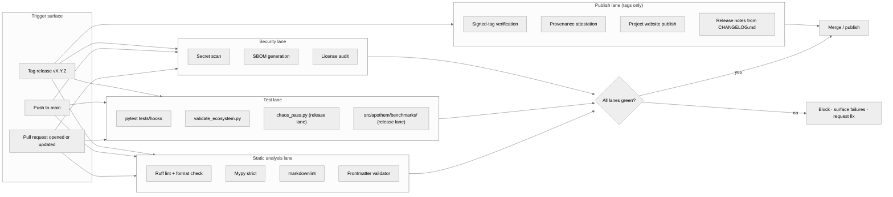

{/* SPDX-License-Identifier: MIT */}

**Die strukturelle Karte des Build- · Validierungs- · Veröffentlichungs-Workflows,
der jede Änderung am Apothem-Ökosystem kontrolliert.** Dieses Dokument
installiert die Visualisierungsoberfläche; die konkreten GitHub-Actions-Workflow-
Dateien und das Release-Werkzeug landen später unter der
Produktionsreife-Installation.

## Pipeline-Form

## Spurrollen

- **Spur für statische Analyse** — schnelles Feedback. Ruff deckt den Python-Stil
  und ein kuratiertes Regelwerk ab; mypy erzwingt Typdisziplin im Strict-Modus;
  markdownlint reguliert die Dokumentationsoberfläche; der Frontmatter-Validator
  kontrolliert die Artefakt-Schema-Konformität für Regeln, Skills, delegierte
  Worker und Befehle.
- **Test-Spur** — `pytest tests/hooks` übt die Hook-Laufzeit gegen die vollständige
  Ereignismatrix aus; `validate_ecosystem.py` ist das primäre strukturelle Gate
  für artefaktübergreifende Konsistenz; `chaos_pass.py` und die
  klassenbezogene Benchmark-Suite unter `src/apothem/benchmarks/` aktivieren sich
  auf der Release-Spur, um Verschlechterung bei verschlechterten Eingaben und
  Laufzeitbudget-Regressionen zu erkennen.
- **Sicherheits-Spur** — das Secret-Scanning erkennt versehentlich committete
  Anmeldedaten; die SBOM-Generierung und die Lizenzaudits kontrollieren die
  Lieferketten-Oberfläche für jede Produktionsreife-Installation.
- **Veröffentlichungs-Spur** — läuft nur bei getaggten Releases. Die
  Signed-Tag-Verifikation bestätigt die Herkunft des Release-Branches; die
  Projekt-Website wird von `site/dist/` zum GitHub-Pages-Ziel veröffentlicht; die
  Release-Notes leiten sich aus dem Keep-A-Changelog-Format von `CHANGELOG.md` ab.

## Konkrete Konfiguration

Die tatsächlichen Workflow-Dateien (`.github/workflows/ci.yml`,
`.github/workflows/release.yml` usw.) werden während des Aufbaus des
Produktionsreife-Ökosystems installiert. Dieses Diagramm definiert die kanonische
Form, die jede zukünftige Konfiguration widerspiegelt.

## Maßgebliche Querverweise

- `pyproject.toml` — Quelle der Wahrheit für die Ruff- / mypy- / pytest-Konfiguration.
- `scripts/dev/validate_ecosystem.py` — das primäre artefaktübergreifende Gate.
- `scripts/dev/validate_hooks.py` — hook-spezifische strukturelle Validierung.
- `scripts/dev/chaos_pass.py` — adversarialer Durchlauf jedes konfigurierten Hooks.
- `src/apothem/benchmarks/` — klassenbezogene Laufzeitbudget-Verifizierer.
- `site/content/docs/developer-guide.mdx` — der bedienerorientierte Contributor-Workflow.
- `CHANGELOG.md` — Quelle der Release-Notes.
