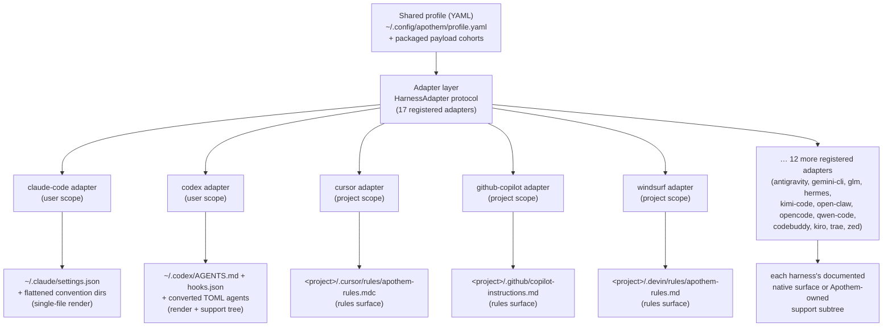

{/* SPDX-License-Identifier: MIT */}

Apothem verwendet ein einziges schema-validiertes YAML-Profil als semantische
Quelle der Wahrheit und leitet jede harness-spezifische Installationsoberfläche
über Adapterklassen ab, die das `HarnessAdapter`-Protokoll implementieren. Jeder
Adapter schreibt an den vom Harness dokumentierten Benutzer- oder Projektort und
verwendet Apothem-eigene Support-Pfade nur dann, wenn der Harness keine passende
native Primitive hat.

## Warum eine Adapter-Abstraktion

Jeder Harness spricht einen anderen Konfigurationsdialekt: einer will eine
JSON-Einstellungsdatei, ein anderer ein Verzeichnis von `.mdc`-Regeldateien, ein
dritter eine einzelne Markdown-Anweisungsdatei. Würde Apothem dieses Wissen fest
in die CLI codieren, würde jeder Harness seine Annahmen in den Kern auslecken, und
das Hinzufügen eines Harness würde bedeuten, die Logik für Installation,
Aktualisierung, Deinstallation und Verifizierung im Gleichschritt anzufassen.

Das Adapter-Muster kehrt das um. Der Kern kennt nur das
`HarnessAdapter`-Protokoll — einen kleinen Vertrag aus Lebenszyklusmethoden. Der
Dialekt jedes Harness lebt in einem in sich geschlossenen Unterpaket, das den
Vertrag implementiert. Der Kern bittet einen Adapter zu *installieren*, ohne zu
wissen, ob das bedeutet, eine JSON-Datei zu rendern, ein Regelverzeichnis zu
schreiben oder einen Support-Baum anzulegen. Neue Harnesses treten bei, indem sie
das Protokoll erfüllen und einen Einstiegspunkt registrieren; nichts im Kern
ändert sich. Dies ist der strukturelle Grund, warum Apothem host-agnostisch
bleibt — die Abstraktion ist die Grenze, die harness-spezifisches Wissen davon
abhält, sich auszubreiten.

## Die Form eines Adapters

Adapter teilen sich in zwei Materialisierungsformen auf, beide im Registry
sichtbar:

- **Einzeldatei-Renderer** übersetzen Profilfelder in eine harness-native
  Konfigurationsdatei. Der Adapter für Claude Code etwa schreibt stets
  `~/.claude/settings.json` aus dem gemeinsamen Profil und plättet die
  Apothem-Konventionsverzeichnisse (`agents/`, `rules/`, `skills/`, …) daneben.
- **Regeloberflächen- und Support-Baum-Adapter** propagieren die
  Apothem-Payload-Kohorte in den vom Harness dokumentierten Regelort, konvertieren
  Kohorten ins native Format, wo eines existiert, und parken den Rest unter einem
  Apothem-eigenen Support-Unterbaum, der vom nativen Anker referenziert wird. Der
  Cursor-Adapter schreibt ein einzelnes `.cursor/rules/apothem-rules.mdc` in die
  bereitgestellte Projektwurzel und liefert nur die Regeloberfläche.

Ein gegebener Adapter ist **benutzerbezogen** (schreibt unter dem
Home-Verzeichnis) oder **projektbezogen** (erfordert `--project <path>` und
schreibt innerhalb dieses Baums); das Registry hält fest, welcher.

## Aktuelle Adapter-Topologie



Das Ausfächern von der Mitte zum Rand ist die Architektur, die der Projektname
codiert: ein Profil im Kern, jeder Harness in gleichem Abstand entlang seines
eigenen Adapters.

## Protokolldefinition

```python
from pathlib import Path
from typing import Protocol

class HarnessAdapter(Protocol):
    name: str
    output_path: Path

    def install(self, profile: dict[str, object]) -> object:
        ...

    def update(self, profile: dict[str, object]) -> object:
        ...

    def uninstall(self) -> None:
        ...

    def is_installed(self) -> bool:
        ...

    def verify(self) -> bool:
        ...
```

Projektbezogene Adapter können zusätzlich `project: Path | None` auf
Lebenszyklusmethoden akzeptieren und `resolve_output_path(project)`
bereitstellen. Die CLI übergibt `--project PATH` nur an Adapter, deren
Methodensignatur es akzeptiert.

## Einstiegspunkt-Registrierung

Adapter registrieren sich über die setuptools-Einstiegspunktgruppe
`apothem.harnesses`:

```toml
[project.entry-points."apothem.harnesses"]
cursor = "apothem.harnesses.cursor:CursorAdapter"
```

Das zentrale Registry in `src/apothem/lib/harness_registry.py` hält die genauen
siebzehn öffentlichen IDs, Einstiegspunkte, Dokumentationspfade, Zielpfade,
Paketdaten-Anforderungen, Fähigkeitszustände und Standard-Konventions-Pin-Pfade
fest. Die CLI lädt Adapter über dieses Registry, statt Produktfakten in jedem
Befehl neu zu entdecken.

## Profil-zu-Nativ-Zuordnung

Jeder Adapter implementiert die für seinen Harness passende Übersetzungslogik:

```
YAML profile + payload cohort    Harness-native surface
-----------------------------    ----------------------
identity / preferences       --> native config fields or rendered instruction context
commands/*.md                --> native commands or SKILL.md folders
rules/*.md                   --> native rules where supported, otherwise support trees
hooks/messages/*.md          --> native hooks where supported, otherwise support trees
agents/*.md                  --> native agent formats where supported
skills/*/SKILL.md            --> native skill folders where supported
```

Nicht unterstützte und auf Entdeckung wartende Fähigkeitszellen werden vor
Schreibvorgängen zu strukturierten Warnungen. Sie werden nicht stillschweigend in
erfundene Anbieteroberflächen projiziert.

## Einen neuen Adapter hinzufügen

Siehe [Einen Harness-Adapter schreiben](/docs/examples/authoring-a-harness-adapter)
für eine Schritt-für-Schritt-Anleitung.
