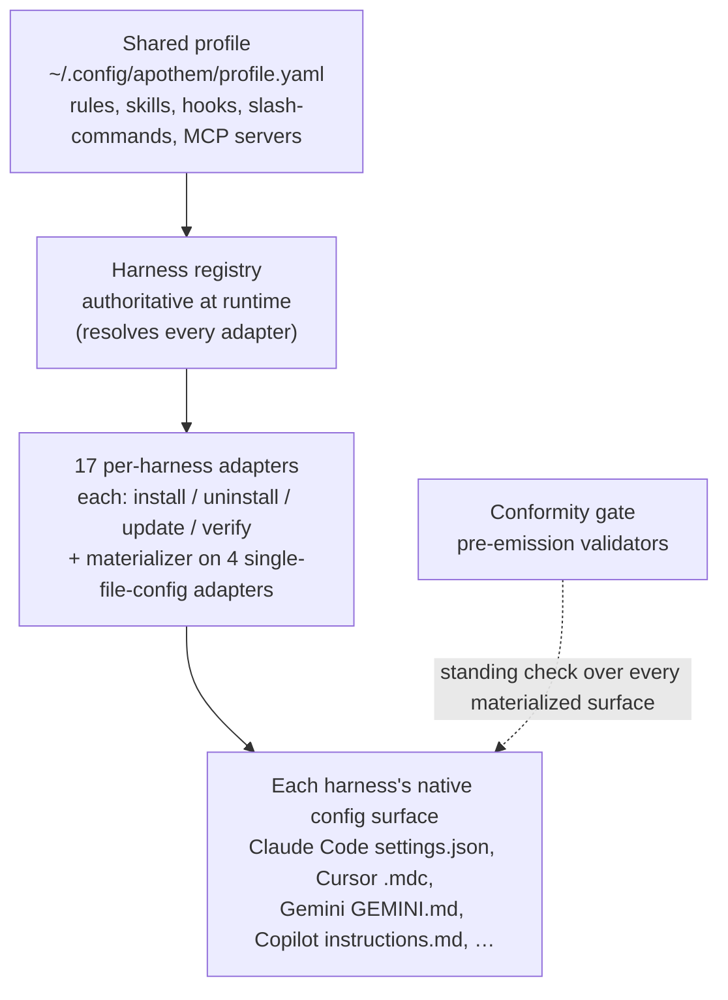

{/* SPDX-License-Identifier: MIT */}

Apothem ist um eine einzige Idee herum aufgebaut: ein gemeinsames
Governance-Profil, das von einem Adapter pro Harness in das native
Konfigurationsformat jeder Harness-Laufzeit materialisiert wird.
Dieser Abschnitt erläutert die strukturellen Bestandteile — das
Adapter-Protokoll, das Profilschema, das Layout des Quellbaums und den
Installations-Workflow, der sie verbindet.

## Systemüberblick

Auf einen Blick ist Apothem eine einzige Pipeline: ein einziges gemeinsames
Profil speist die Harness-Registry, die jeden Adapter pro Harness auflöst; jeder
Adapter materialisiert die native Konfigurationsoberfläche seines Harness, und
eine ständige Konformitätsprüfung prüft jede materialisierte Oberfläche.

## Seiten

| Seite | Beschreibung |
|------|-------------|
| [Harness-Adapter-Abstraktion](/docs/architecture/harness-adapter-abstraction) | Das `HarnessAdapter`-Protokoll — wie Adapter das gemeinsame Profil in plattformnative Konfiguration übersetzen. |
| [Schema des gemeinsamen Profils](/docs/architecture/shared-profile-schema) | Das schemagestützte YAML-Profil unter `~/.config/apothem/profile.yaml` oder `--profile PATH`. |
| [Quell-Layout](/docs/architecture/source-layout) | Warum Apothem ein `src/`-Layout verwendet und wie der Baum organisiert ist. |
| [Installations-Workflow](/docs/architecture/installation-workflow) | Wie `apothem install`, `update` und `uninstall` durchgängig funktionieren. |
| [Delegierte Arbeiter](/docs/architecture/agents) | Repository-bezogene Anweisungen für Multi-Worker-Laufzeiten, die in diesem Repository arbeiten. |
| [Eigenständige Laufzeitumgebung](/docs/architecture/self-contained-runtime) | Wie die Engine von Apothem aus jedem Checkout läuft — internalisierte Abhängigkeiten, das PYTHONPATH=src-Aufrufmodell und der Bootstrap des Plugin-Baums. |
| [Strategie zur Abhängigkeits-Internalisierung](/docs/architecture/vendoring-strategy) | Welche Drittanbieter-Pakete Apothem unter src/apothem/_vendor/ internalisiert, welche Systemvoraussetzungen bleiben und wie internalisierte Kopien aktualisiert werden. |
| [Cohort-Packaging-Vertrag](/docs/architecture/cohort-packaging-contract) | Der stabile, downstream-konsumierbare Vertrag für Cohort-Packaging und Plugin-Manifeste — Cohorts aufzählen und ihre harness-spezifischen nativen Ziele auflösen, ohne die Zuordnung neu abzuleiten. |
| [CI/CD-Pipeline-Diagramm](/docs/architecture/cicd-pipeline) | Visuelle Karte und Spuraufschlüsselung der Workflow-Phasen für Build, Test, Lint, Sicherheit und Veröffentlichung, die jede Codeänderung und jedes Release kontrollieren. |
