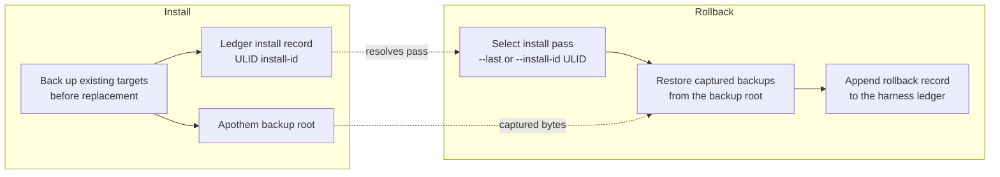

{/* SPDX-License-Identifier: MIT */}

## Installationsablauf

```mermaid
flowchart TD
    accTitle: Apothem install workflow
    accDescr: Top-down flowchart of the apothem install command from CLI invocation through adapter lookup, profile load, adapter install call, native config write, and final apothem verify check.
    A[apothem install --harness X] --> B[Resolve adapter through registry]
    B --> C[Load and validate profile YAML<br/>before writes]
    C --> D[Adapter.install(profile, project)]
    D --> E[Write native config and support cohorts]
    E --> F[apothem verify --harness X]
    F --> G{All checks pass?}
    G -- yes --> H[Done]
    G -- no --> I[Report failures]
```

## Aktualisierungsablauf

Bei `apothem update --harness X`:

1. Lädt und validiert `~/.config/apothem/profile.yaml` oder `--profile PATH`.
2. Löst den ausgewählten Harness oder `all` über das zentrale Register auf.
3. Validiert den vollständigen Materialisierungsplan vor dem ersten Schreibvorgang.
4. Ruft `Adapter.update(profile, project=...)` auf.
5. Meldet die Ergebnisse erstellt, aktualisiert, unverändert, übersprungen, Warnung und Fehler.

## Deinstallationsablauf

Bei `apothem uninstall --harness X`:

1. Ruft `Adapter.uninstall()` auf.
2. Der Adapter entfernt nur die von ihm geschriebenen Dateien; das gemeinsame
   Profil-YAML und nicht zugehörige, vom Operator verfasste Dateien bleiben
   unberührt.

## Geltungsbereich-Auflösung

Jeder Adapter schreibt in seine eigene feste Installationswurzel: das
Benutzer-Home für Adapter mit Benutzergeltungsbereich und der projektlokale Pfad
für Adapter mit Projektgeltungsbereich. Die CLI stellt kein `--scope`-Flag bereit;
Adapter mit Projektgeltungsbereich erfordern `--project <path>`. Jedes Ziel ist
unter `site/content/docs/harnesses/<harness>.mdx` dokumentiert.

## Fehlerbehandlung

Installations-/Aktualisierungsvorgänge validieren vor dem Schreiben, sichern
vorhandene übereinstimmende Ziele vor dem Ersetzen und führen in gemeinsamen
Discovery-Verzeichnissen nur von Apothem verwaltete Untereinträge zusammen.
`--dry-run` führt dieselbe Validierung aus und gibt übersprungene oder unveränderte
Ergebnisse zurück, ohne Verzeichnisse oder Dateien zu erstellen.

## Reversibility (backup and rollback)

Every install pass is reversible. Replaced bytes are captured into the Apothem
backup root and the pass is recorded in the harness ledger under a ULID
install id; [`apothem rollback`](/docs/cli-reference/rollback) selects a
recorded pass and restores those captured backups.


