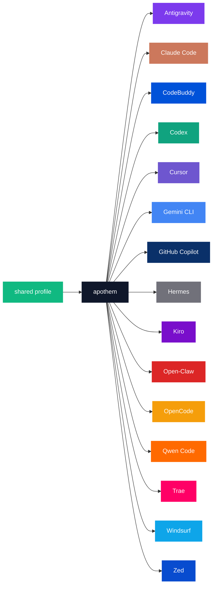

{/* SPDX-License-Identifier: MIT */}

Die kanonischen Markenname-×-Farbcode-Aufzählungen unten sind in einen `text`-Zaun gehüllt, um die wortgetreuen Bezeichner je Harness zu bewahren, die der Katalogzweck der Palette erfordert.

## Apothem-Kern

| Token | Hell | Dunkel | Verwendung |
|---|---|---|---|
| `apothem-hub` | `#0F172A` | `#F1F5F9` | Der zentrale Verteilungsknoten („apothem") in jedem Architekturdiagramm und der zentrale Hub der Apothem-Bildmarke. |
| `shared-profile` | `#10B981` | `#34D399` | Das Quelle-der-Wahrheit-Profil, das den apothem-Kern speist. |

## Harness-Palette

Fünfzehn der siebzehn Harnesses sind so eingefärbt, dass sie zu ihrer primären
Markenidentität passen. Die verbleibenden zwei — `glm` und `kimi-code` — haben noch
keine definierte Markenfarbe; ihre Zeilen werden hinzugefügt, sobald die vorgelagerte
Markenfarbe festgelegt ist, gemäß dem Propagierungsschritt unter [Aktualisierungen](#aktualisierungen).

```text
| Token             | Light     | Dark      | Source                                                                                                                                              |
|-------------------|-----------|-----------|-----------------------------------------------------------------------------------------------------------------------------------------------------|
| `antigravity`     | `#7C3AED` | `#9F67FF` | Google Antigravity deep-purple.                                                                                                                     |
| `claude-code`     | `#CC785C` | `#E89378` | Anthropic terracotta-orange.                                                                                                                        |
| `codebuddy`       | `#0052D9` | `#5E8EF7` | Tencent CodeBuddy blue.                                                                                                                             |
| `codex`           | `#10A37F` | `#19C796` | OpenAI signature teal.                                                                                                                              |
| `cursor`          | `#6E56CF` | `#9B85E3` | Cursor brand purple.                                                                                                                                |
| `gemini-cli`      | `#4285F4` | `#6BA4F7` | Google blue (primary); the Apothem mark renders the node with all four Google brand hues `#4285F4` / `#34A853` / `#FBBC04` / `#EA4335`.             |
| `github-copilot`  | `#0A3069` | `#5B8FE3` | GitHub Mona deep-blue.                                                                                                                              |
| `hermes`          | `#71717A` | `#A1A1AA` | Community silver-grey.                                                                                                                              |
| `kiro`            | `#790ECB` | `#A862DD` | Kiro violet.                                                                                                                                        |
| `open-claw`       | `#DC2626` | `#F87171` | Community red-orange.                                                                                                                               |
| `opencode`        | `#F59E0B` | `#FBBF24` | Community amber.                                                                                                                                    |
| `qwen-code`       | `#FF6A00` | `#FF8C40` | Alibaba Qwen orange.                                                                                                                                |
| `trae`            | `#FF0066` | `#FF599C` | ByteDance Trae magenta.                                                                                                                             |
| `windsurf`        | `#0EA5E9` | `#38BDF8` | Windsurf sky-blue.                                                                                                                                  |
| `zed`             | `#084CCF` | `#5E8BE0` | Zed Industries blue.                                                                                                                                |
```

## Namensbegründung

- **`apothem-hub`** — das geometrische Zentrum, das der Name heraufbeschwört (die Apothema eines regelmäßigen Vielecks weist nach innen zu seinem Kern).
- **`shared-profile`** — die vorgelagerte Quelle, abgesetzt von der Farbe eines einzelnen Harness, damit sie sich in jedem Diagramm als „Eingabe"-Pfeil liest.
- **Tokens je Harness** spiegeln den Harness-Slug wider, der überall in der Codebasis verwendet wird (`harnesses/<slug>/`, der Einstiegspunkt-Schlüssel, das CLI-Argument `--harness <slug>`). Ein Wort je Konzept; dieselbe Zeichenfolge überall.

## Mermaid-Verwendung



## Barrierefreiheit

Jedes Hell-Modus-Token erfüllt den WCAG-2.2-AA-Kontrast gegenüber weißem Text (≥4,5 : 1), wo der Kontrast es zulässt, ohne die Markenfarbe zu verzerren. Wenn die native Markenfarbe eines Harness für sich allein unter den AA-Schwellenwert gegenüber weißem Text fällt (insbesondere die Bernstein-/Orange-Familie und die Himmelblau-/Türkis-Familie der oben aufgeführten Tokens), verwenden Diagramme, die WCAG-AA-Kontrast von Text-auf-Farbe benötigen, die **Dunkel-Modus-Variante** (den angehobenen Farbton) als Diagrammfüllung, damit der weiße Text sauber lesbar bleibt. Die Dunkel-Modus-Spalte ist genau dafür kalibriert: Jedes Dunkel-Modus-Token überschreitet das AA gegenüber weißem Text.

## Aktualisierungen

Die Palette wird nur aktualisiert, wenn ein Harness vorgelagert eine Markenänderung ratifiziert. Markenänderungen je Harness verbreiten sich atomar über `site/app/global.css`, diese Seite und jeden betroffenen SVG-Master unter `assets/src/`.
