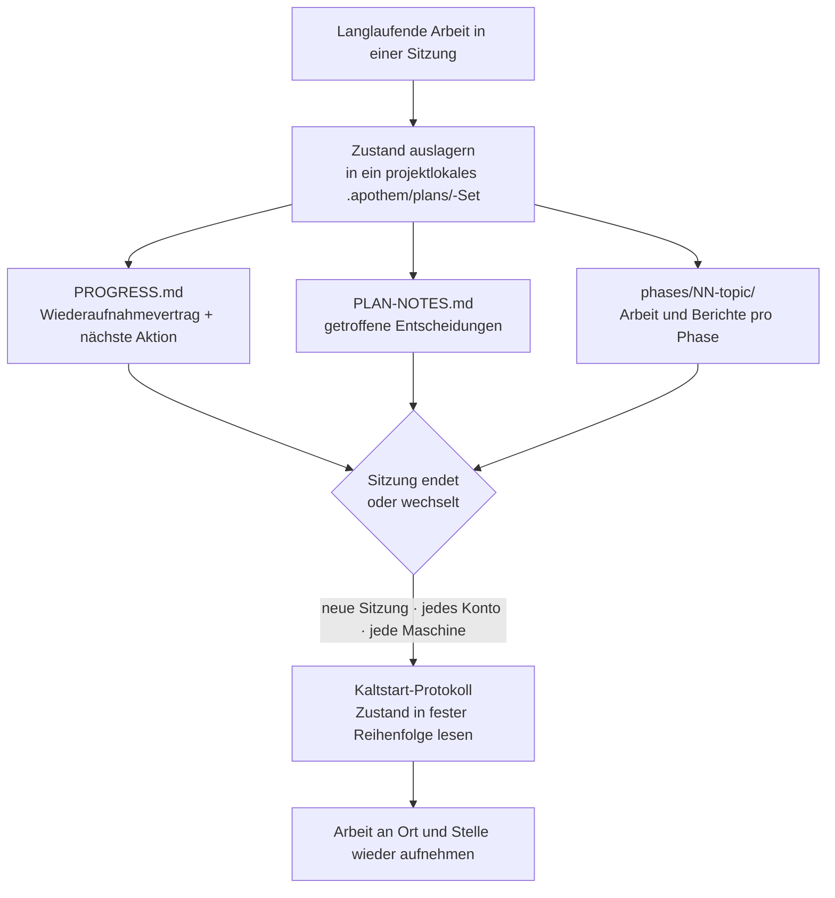

{/* SPDX-License-Identifier: MIT */}

Der größte Teil unterstützter Programmierarbeit lebt und stirbt innerhalb einer
einzigen Unterhaltung. Du schließt den Chat, wechselst die Maschine oder meldest
dich mit einem anderen Konto an, und der Faden dessen, was du getan hast, ist
weg — die nächste Sitzung beginnt kalt, ohne Erinnerung an die Entscheidungen,
die du bereits getroffen hast.

Apothem kehrt das um. Für langlaufende, mehrstufige Arbeit lagert es seinen
**vollständigen Arbeitszustand** in ein projektlokales `.apothem/plans/`-Set aus (wobei `.plans/` als unterstützter Abwärtskompatibilitäts-Fallback erhalten bleibt) —
Dateien, die in deinem Repository liegen, nicht im Verlauf irgendeines
Cloud-Chats. Der Zustand ist das dauerhafte Artefakt; die Sitzung ist
entbehrlich.

## Die Kernidee

Ein Plan-Set unter `<project-root>/.apothem/plans/{suite}/` trägt zwei Dinge, die eine
Sitzung ersetzbar machen:

- **Ein Wiederaufnahmevertrag.** `PROGRESS.md` hält die aktuelle Phase und den
  Aufgabenstatus fest, die präzise nächste Aktion, die geltenden Konventionen,
  die bereits getroffenen Entscheidungen und die genauen Dateien, die die nächste
  Sitzung lesen muss.
- **Ein Kaltstart-Protokoll.** Eine frische Sitzung liest diese Dateien in einer
  festen Reihenfolge und stellt das vollständige Bild wieder her, bevor sie
  irgendeine Arbeit verrichtet — ohne Unterhaltungsverlauf.

Weil dieser Zustand in den Dateien deines Projekts liegt, nimmt eine frische
Sitzung auf **jedem Konto oder jeder Maschine**, die auf dasselbe Projekt zeigt,
die Arbeit an Ort und Stelle wieder auf. Nichts ist in einem einzigen
Chat-Transkript eingeschlossen. Das ist die Eigenschaft, die strukturierte,
großskalige Arbeit über mehrere Tage — große Korpora, lange Migrationen, große
Review-Durchläufe — Grenzen überstehen lässt, die sie sonst beenden würden.

## Was es genau ist

Genau formuliert, damit die Garantie klar ist:

- **Es ist** in Dateien ausgelagerter Zustand plus ein Kaltstart-Wiederaufnahme-
  Protokoll. Die Arbeit wird wieder aufgenommen, weil der Zustand in den Dateien
  deines Projekts liegt, unabhängig von jeder Sitzung, jedem Konto und jeder
  Maschine.
- **Es ist kein** automatischer konto-übergreifender Synchronisationsdienst.
  Apothem schiebt deinen Planzustand nicht von sich aus zwischen Konten — die
  Dateien reisen so, wie die Dateien deines Projekts ohnehin reisen
  (Versionskontrolle, ein geteilter Checkout, ein synchronisiertes Verzeichnis).
  Was Apothem garantiert, ist, dass eine frische Sitzung dort, wo die
  Projektdateien landen, aus ihnen fortsetzen kann.

## Warum das wichtig ist

Je länger und größer die Arbeit, desto mehr wird eine einzige Unterhaltung zur
Belastung. Eine mehrtägige Überarbeitung oder ein Durchlauf durch eine große
Codebasis überdauert jede einzelne Sitzung: Kontextfenster werden verdichtet,
Sitzungen laufen ab, Maschinen wechseln. Indem Apothem die Projektdateien selbst
als Quelle der Wahrheit für laufende Arbeit behandelt, macht es die Arbeit
widerstandsfähig gegenüber allen drei Grenzen: Sitzung, Konto und Maschine.

## Wo der Zustand liegt

| Artefakt | Ort | Enthält |
|----------|----------|-------|
| Plan-Set | `<project-root>/.apothem/plans/{suite}/` | Eine in sich geschlossene Einheit laufender Arbeit |
| Wiederaufnahmevertrag | `<suite>/PROGRESS.md` | Phasen-/Aufgabenstatus, nächste Aktion, Konventionen, Manifest kritischer Dateien |
| Entscheidungsregister | `<suite>/PLAN-NOTES.md` | Getroffene Entscheidungen, nie erneut gefragt |
| Arbeit pro Phase | `<suite>/phases/NN-topic/` | Die Aufgaben der Phase und ihr Bericht |

Der Plan-Baum wird durch Apothems kanonisches `.gitignore`-Snippet von der
Versionskontrolle ausgeschlossen, sodass der Planzustand standardmäßig lokal
bleibt. Um laufende Arbeit bewusst zwischen Maschinen oder Konten zu tragen,
verschiebe das `.apothem/plans/`-Set genauso, wie du jede andere Projektdatei
verschiebst.

## Verwandt

- **[Ernsthaftigkeitsstufen](/docs/concepts/seriousness-tiers)** — wie Governance
  und die Disziplin der Zustandsauslagerung am Engagement skalieren.
- **[Die Befehlspipeline](/docs/pipeline)** — die `/plan`-Stufen, die ein Plan-Set
  erstellen und voranbringen.

## Recommended Next Step

**Lies [Ernsthaftigkeitsstufen](/docs/concepts/seriousness-tiers)**, um zu sehen,
wie die Auslagerungsdisziplin von einem schnellen Experiment bis zu einer
mehrtägigen, grenzüberschreitenden Anstrengung skaliert.
