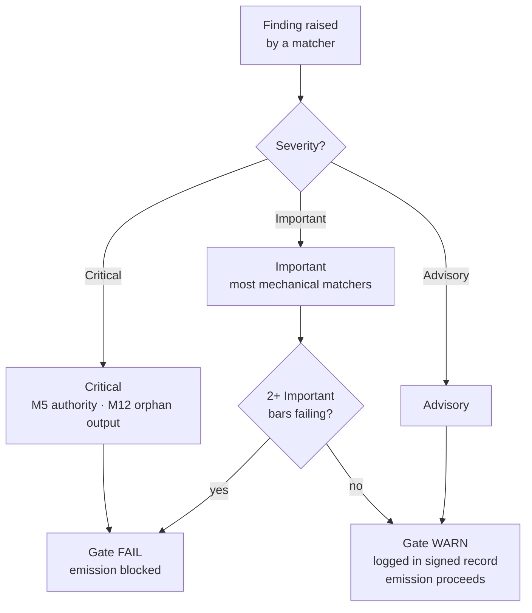

{/* SPDX-License-Identifier: MIT */}

## Die fünfzehn Punkte

| Punkt | ID | Mandat | Prüfklasse | Fehler → Maßnahme |
|---|---|---|---|---|
| 1 | M1 | Host-Projekt-Agnostizismus | Begründet | Überarbeiten, um den Host-Konventionen zu entsprechen |
| 2 | M2 | Redaktionelle Disziplin (Offenlegungsregister) | Mechanisch | Offenlegungsmarkierungen hinzufügen |
| 3 | M3 | Zehn Qualitätsdimensionen | Begründet | An den fehlschlagenden Dimensionen überarbeiten |
| 4 | M4 | Selbstanwendung (signierter Gate-Eintrag vorhanden) | Mechanisch | Signierten Eintragsblock protokollieren |
| 5 | M5 | Autoritätsprinzip (keine erfundene Identität / kein erfundener Endpunkt / kein erfundenes Geheimnis) | Mechanisch | An die Anfrage weiterleiten |
| 6 | M6 | Expertise-Einbindung (offengelegte Lücken) | Begründet | Lücken offenlegen; Verfeinerungen zitieren |
| 7 | M7 | Optionsannotation (Empfehlungsmarkierung + Begründung) | Mechanisch | Optionsmengen annotieren |
| 8 | M8 | Endgültigkeit (kein Zaudern in vorschreibender Prosa) | Mechanisch | Zaudern zu Bedingungen erheben |
| 9 | M9 | Visuelle Hebelwirkung (strukturelle Themen tragen Diagramme) | Begründet | Diagramm erstellen / aktualisieren |
| 10 | M10 | Bidirektionale Bindung (reziproke Rückzeiger geschlossen) | Mechanisch | Halbkanten schließen |
| 11 | M11 | Agile Sprints (Ziel / Backlog / DoR / DoD / Review / Retrospektive) | Begründet | Als Sprints umstrukturieren |
| 12 | M12 | Phasenberichte und kanonisches Layout | Mechanisch | Zusammenfassung erstellen; ins kanonische Layout verschieben |
| 13 | M13 | Code-Handwerk (Linter / Formatter / Typprüfer; magische Zahl; bare-except) | Mechanisch | Gemäß den sprachspezifischen Code-Handwerk-Regeln überarbeiten |
| 14 | M14 | Systemizität (deklariert Vorgänger / Nachfolger / Geschwister / Durchsetzer) | Begründet | Deklarieren; in Registern indexieren |
| 15 | M15 | Produktionsreif (Tests + Doku + CHANGELOG + konformer Commit + grünes CI + Semver-Stabilität) | Mechanisch | Fehlende Oberflächen hinzufügen |

## Schweregrad-Leiter

| Schweregrad | Wirkung auf das Gate |
|---|---|
| **Kritisch** | Gate FAIL — Emission bedingungslos blockiert |
| **Wichtig** | Gate FAIL, wenn 2+ wichtige Punkte gleichzeitig fehlschlagen |
| **Beratend** | Gate WARN — im signierten Eintrag protokolliert; blockiert die Emission nicht |

Die meisten Matcher des mechanischen Anteils sind standardmäßig **Wichtig**. M5 (Autorität — Geheimnisse, erfundene Endpunkte) und M12 (verwaiste Ausgaben) sind **Kritisch**.



## Matcher des mechanischen Anteils

Der mechanische Anteil lebt in [`src/apothem/conformity/*_grep.py`](https://github.com/ahmed-g-gad/apothem/tree/main/src/apothem/conformity), orchestriert durch [`src/apothem/conformity/gate.py`](https://github.com/ahmed-g-gad/apothem/blob/main/src/apothem/conformity/gate.py).

| Matcher | Punkt | Funktion |
|---|---|---|
| `hedging_grep.py` | M8 | Erkennt zauderndes Vokabular in vorschreibender Prosa |
| `option_annotation_grep.py` | M7 | Verifiziert die `**Recommended**`-Markierung + Begründung an Optionsmengen |
| `user_confirm_grep.py` | M5 | Blockiert `<USER-CONFIRM:…>`-Platzhalter bei der Emission |
| `binding_reciprocity_grep.py` | M10 | Erkennt Halbkanten in `## Bindings (§0.j five-direction)` |
| `orphan_output_grep.py` | M12 | Markiert Artefakte ohne Konsument / ohne Indexeintrag / ohne Produzentenzuordnung |
| `bare_except_grep.py` | M13 | Erkennt `except:` / `except Exception:` ohne begründenden Kommentar |
| `magic_number_grep.py` | M13 | Erkennt numerische Literale in der Geschäftslogik |
| `commented_out_code_grep.py` | M13 | Erkennt auskommentierte Codeblöcke |
| `file_header_grep.py` | M13 | Verifiziert das Vorhandensein des einzeiligen SPDX-Lizenzheaders |
| `frontmatter_grep.py` | M14 | Verifiziert die erforderlichen Frontmatter-Felder an den vier unten aufgeführten kanonischen Direktiven-Verzeichnissen |
| `semver_stability_grep.py` | M15 | Erkennt brechende öffentliche API-Änderungen ohne MAJOR-Versionserhöhung |
| `production_ready_pr_grep.py` | M15 | Verifiziert die Disziplin desselben Änderungssatzes (Tests + Doku + CHANGELOG) |
| `secret_leak_grep.py` | M15 | Erkennt hartkodierte Geheimnisse / Anmeldedaten |
| `unpinned_action_grep.py` | M15 | Verifiziert das Anpinnen von GitHub Actions an einen Commit-SHA |
| `always_on_budget_grep.py` | Budget-Obergrenze | Begrenzt den Körper von Always-on-Regeln auf 500 substanzielle Tokens |

## Das Gate ausführen

Auf einem installierten Harness läuft das Gate automatisch: Claude Codes
`settings.json` verdrahtet es als `PreToolUse`-Hook, der die
materialisierte Kopie unter `~/.claude/.apothem/support/conformity/gate.py` vor jedem
Write/Edit aufruft. Aus einem Quell-Checkout treibt die Modulform denselben
Code an:

```shell
# Einzeldatei-Dispatch (imitiert den PreToolUse-Hook):
echo '{"tool_input": {"file_path": "path/to/file", "content": "..."}}' \
    | python -m apothem.conformity.gate --hook

# Zusammengesetzter Durchlauf über das Repository:
python -m apothem.conformity.gate --sweep src/ site/content/docs/ rules/
```

Siehe [Das Konformitäts-Gate ausführen](/docs/usage/conformity-gate) für das vollständige Verfahren.

## Referenz

- [Vor-Emissions-Gate-Register](/docs/governance/pre-emission-gate-registry) — kanonische Punktdefinitionen
- [Register der externen Konformität](/docs/governance/outward-conformity-registry) — detaillierte Semantik von M1-M15
- [Querschnittsmandate](/docs/governance/cross-cutting-mandates) — Mandats-Quelle der Wahrheit
- [Leistungsdisziplin](https://github.com/ahmed-g-gad/apothem/blob/main/src/apothem/rules/performance-discipline.md) — Laufzeitbudgets pro Klasse
