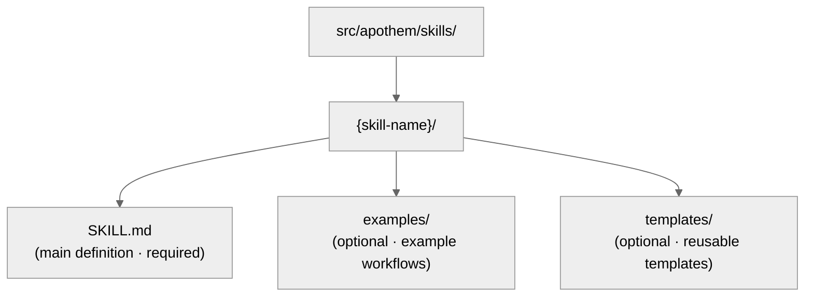

{/* SPDX-License-Identifier: MIT */}

Dieses Handbuch hilft Entwicklern, das Apothem-Ökosystem mit
SOTA-Qualitätsstandards zu pflegen und zu erweitern.

## Schnellreferenz: Artefakttypen

Das Apothem-Ökosystem enthält fünf Artefakttypen, jeder mit spezifischen Zwecken
und Frontmatter-Anforderungen.

| Artefakt | Pfad | Zweck | Wann zu erstellen |
| -------- | ---- | ------- | -------------- |
| **Rule** | `src/apothem/rules/*.md` | Verhaltensmandat oder operative Direktive | Neues Prinzip, neue Richtlinie oder neues Governance-Mandat etabliert |
| **Command** | `src/apothem/commands/*.md` | Slash-Befehl (`/command-name`) für komplexe Workflows | Neuer mehrstufiger Benutzer-Workflow |
| **Helper** | Helfer-Verzeichnis (`*.md` je Datei) | Persistente Definition eines delegierten Workers für parallele Aufgaben | Neue wiederkehrende Spezialaufgabe (Audit, Erkundung, Qualitätsprüfung) |
| **Skill** | `src/apothem/skills/{name}/SKILL.md` | Wiederverwendbare Technik mit Erkennungssignal | Neues erkennbares, wiederverwendbares Technikmuster |
| **Hook** | `src/apothem/hooks/` + `settings.json` | Ereignisgesteuerte Validierung oder Zustandsverwaltung | Neues Lebenszyklus-Ereignis oder Validierungsbedarf |

## Harness-Adapter-Vertrag

Identität und Fähigkeitsfakten eines Harness liegen in
`src/apothem/lib/harness_registry.py`. Eine Harness-Änderung ist erst
vollständig, wenn diese Oberflächen übereinstimmen:

| Oberfläche | Erforderliche Aktualisierung |
| --- | --- |
| Registry-Zeile | Öffentliche ID, Paket-Schlüssel, Entry Point, Geltungsbereich, Ausgabeformat, Zielpfade, Doku-Pfade, Fähigkeitsdatei, Standard-Pin, Fixture-Tests, Package-Data-Schlüssel, Template-Quellen und Fähigkeitsstatus. |
| Adapter-Paket | `__init__.py`, `install.py`, `update.py`, `uninstall.py`, `verify.py`; füge `materializer.py` nur hinzu, wenn der Harness eine native Konfigurationsdatei rendert. |
| Propagation-Manifest | Template- und Kohortenpfade für manifestgestützte Adapter. |
| Fähigkeiten | `src/apothem/harnesses/<package>/capabilities.yml` mit jeder erforderlichen Fähigkeit und Begründung für nicht unterstützte oder discovery-pending-Zustände. |
| Konventions-Pin | `STANDARD-CONVENTION-PIN.md` mit Vendor-URL, Snapshot-Datum, kanonischem Dateinamen/Schema, Beleg-Referenz und Begründung für nicht unterstützte Fähigkeiten. |
| Tests | Registry-Parität, Adapter-Fixture-Test, Golden-Install-Plan-Zeile, Dry-Run-/No-Write-Verhalten, Idempotenz und Package-Data-Abdeckung. |
| Doku | Harness-Referenzseite, Vergleichsseite, Fähigkeits-/MCP-Anmerkungen und Beispiele, die Fake-Platzhalter verwenden. |

Adapter im Projekt-Geltungsbereich müssen `requires_project = True` setzen,
`project: Path | None` bei Lebenszyklusmethoden akzeptieren und fehlende oder
unsichere Projektstämme vor Schreibvorgängen ablehnen. Adapter im
Benutzer-Geltungsbereich müssen Pfade unter dem dokumentierten
Benutzer-Konfigurationsstamm des Harness halten.

## Golden-Fixture-Richtlinie

`tests/fixtures/harness-golden-plans.json` zeichnet die öffentliche
Install-Plan-Form für alle siebzehn Registry-Harnesses auf: öffentliche ID,
Materialisierungsmodus, Quell-Kohorten-/Template-Pfad und normalisierten Zielpfad
unter `<ROOT>`. Wenn sich das Registry-, Manifest- oder Template-Zielverhalten
absichtlich ändert, aktualisiere die Golden-Fixture im selben Commit wie die
Quelländerung, damit das Diff das Verhaltensdelta zeigt.

## Validierung vor dem Schreiben

Der gemeinsame Install-Treiber validiert jede Quelle und jedes Ziel vor dem
ersten Schreibvorgang. Er lehnt fehlende Manifest-Quellen, Ziel-Traversierung,
Zielpfade außerhalb des gewählten Stamms und Symlink-Überquerungen ab. Dry-Runs
führen dieselbe Validierung aus und geben strukturierte `skipped`- oder
`unchanged`-Ergebnisse zurück, ohne Dateien zu erstellen.

## Redaktion und Beispieldaten

Profildiagnosen redigieren token-, secret-, password-, credential-,
API-Key-, private-key-, authorization-, auth- und header-förmige Felder.
Dokumentation, Fixtures, Beispiele und JSON-Snippets verwenden `example.invalid`,
`Example User`, `example-user` und offensichtliche Platzhalter statt
echt aussehender Geheimnisse oder persönlicher Konten.

## Bevor du schreibst: Das kanonische Schema

**Alle Artefakte müssen dem Schema in `site/content/docs/reference/artifact-schema.mdx` folgen.**
Das ist nicht verhandelbar.

- Lies `site/content/docs/reference/artifact-schema.mdx` § „Schema" für deinen Artefakttyp
- Kopiere die erforderlichen Felder
- Trage die verpflichtenden Werte ein
- Füge optionale Felder nach Bedarf hinzu

## Frontmatter-Schnellprüfung

Jedes Artefakt-Frontmatter muss diese Prüfungen bestehen:

```yaml
✓ Valid YAML syntax (use tools: `yamllint` or PowerShell `ConvertFrom-Yaml` where available)
✓ All mandatory fields present (per schema for artifact type)
✓ name: uses kebab-case
✓ version: semantic MAJOR.MINOR.PATCH
✓ updated: ISO 8601 date (YYYY-MM-DD)
✓ description: single-line, non-empty
✓ scope: valid enum (always-on|path-filtered|other)
✓ portability: valid enum (`universal` | `universal-with-windows-caveats` | `unix-only` | `windows-only`)
✓ No typos in field names — must match canonical schema exactly
✓ Optional fields use correct enum values
```

## Namenskonventionen

### Artefaktnamen (kebab-case)

- **Rules:** `operational-mandates`, `clean-room-generation`, `context-management`
- **Commands:** `plan-execute`, `plan-spec`, `plan-generate`
- **Helpers:** `codebase-explorer`, `convention-auditor`, `quality-gate`
- **Skills:** `plan-suite`, `ecosystem-audit`

Muster: Kleinbuchstaben, Bindestriche zwischen Wörtern, keine Leerzeichen oder
Unterstriche.

### Dateibenennung

- **Rules:** `{name}.md`
- **Commands:** `{name}.md`
- **Helpers:** `{name}.md`
- **Skills:** Im Ordner `src/apothem/skills/{name}/SKILL.md` (exakte Schreibung: `SKILL.md`)
- **Hooks:** Im Ordner `src/apothem/hooks/`. Alle Event-Handler sind Python. Jeder
  `settings.json`-Hook-Befehl verwendet die Exec-Form (`python` plus `args`), um
  `-m apothem.hooks.dispatch <event> [<message-name>]` oder
  `-m apothem.conformity.gate --hook` aufzurufen. `dispatch.py` leitet
  `SessionStart` an `session_start_bootstrap.main()` weiter und
  jedes andere zugelassene Ereignis an `emit_hook_context.main()`. Die einzigen
  Shell-Stubs, die unter `src/apothem/hooks/` oder `scripts/` erlaubt sind, sind
  die vier Locator- + Bootstrap-Dateien (`find-python.{ps1,sh}`,
  `bootstrap.{ps1,sh}`); jede andere `.ps1`- /
  `.sh`-Datei besteht die Hygieneprüfung von `scripts/dev/validate_hooks.py` nicht.

### Querverweise

Beim Verweis auf andere Artefakte verwende exakte Namen:

- Rules: `"operational-mandates"` (Wert des name-Felds)
- Commands: `/plan-execute` (mit Slash für menschliche Doku; ohne im Code)
- Helpers: `codebase-explorer` (Wert des name-Felds)
- Skills: `plan-suite` (Wert des name-Felds)

Verwende in Prosa niemals Dateipfade oder gekürzte Namen.

## Portabilität: Windows vs. Unix

Jedes Artefakt muss seinen Portabilitätsstatus ausdrücklich deklarieren.

### Universal (Standard)

- Funktioniert identisch auf Windows, macOS und Linux
- Keine Shell-Annahmen
- Pfade verwenden Schrägstriche (`/`)
- Keine fest codierten absoluten Pfade
- Keine Windows-spezifische PowerShell-Syntax

```yaml
portability: "universal"
```

### Universal mit Windows-Vorbehalten

- Universell über POSIX-Hosts hinweg; der genannte Vorbehalt gilt auf der im Inhalt deklarierten Windows-Plattformvariante
- Dokumentiere den Vorbehalt ausdrücklich im Inhalt
- Beispiel: „Symlinks vor Win 10 unter Windows nicht unterstützt"

```yaml
portability: "universal-with-windows-caveats"
```

Dokumentiere den Vorbehalt in einer Notiz unmittelbar nach dem Titel.

### Nur-Unix / Nur-Windows

- Ausdrücklich auf eine Plattform beschränkt
- Selten in Apothem — die meisten sollten universell sein
- Nur verwenden, wenn plattformspezifische Funktionen wesentlich sind

```yaml
portability: "unix-only"
```

Dokumentiere den Grund im ersten Abschnitt der Regel.

## Geltungsbereich: Always-On vs. Path-Filtered

### Always-On

Regel gilt überall.

```yaml
scope: "always-on"
```

### Path-Filtered

Regel gilt bedingt anhand des Dateipfads.

```yaml
scope: "path-filtered"
pathFilter: "**/*.py, **/*.toml"
```

Der `pathFilter` verwendet Glob-Muster (gleiches Format wie `.gitignore`). Wenn
eine Datei dem Filter entspricht, wird die Regel aktiviert.

## Versionssemantik

Jedes Artefakt trägt seine eigene semantische Version (`MAJOR.MINOR.PATCH`):

- **PATCH** — Tippfehlerkorrekturen, Formatierung, Link-Auffrischung, reine Kommentar-Edits. Verhalten unverändert.
- **MINOR** — additive, nicht-brechende Änderungen: neue optionale Abschnitte, zusätzliche Anti-Patterns, neue optionale Frontmatter-Felder, neue Beispiele. Bestehende Konsumenten funktionieren ohne Änderung weiter.
- **MAJOR** — brechende Schema- oder Vertragsänderungen: entfernte Abschnitte, umbenannte Felder, geändertes Verhalten einer bestehenden Direktive, Änderungen, die nachgelagerte Artefakte zur Anpassung zwingen.

Beispiele:

- `vX.Y.Z` → `vX.Y.(Z+1)` (PATCH: Tippfehlerkorrektur)
- `vX.Y.Z` → `vX.(Y+1).0` (MINOR: neuer Anti-Patterns-Eintrag hinzugefügt)
- `vX.Y.Z` → `v(X+1).0.0` (MAJOR: Vertrag als stabil deklariert)
- `vX.Y.Z` → `v(X+1).0.0` (MAJOR: verpflichtendes Frontmatter-Feld entfernt)

Erhöhe `version` und `updated` gemeinsam bei jedem verhaltensändernden Edit.
Hänge eine passende Zeile an die ökosystem-weite `CHANGELOG.md` für Releases an,
die Artefaktänderungen bündeln.

## Wann ein Artefakt zu bearbeiten ist

### Rules

- Behandle die Mandatory/Optional-Struktur als tragend — eine Umstrukturierung
  wirkt sich auf jedes abhängige Artefakt aus (MAJOR-Erhöhung erforderlich).
- Verfeinere Anti-Patterns, Beispiele zur Ernsthaftigkeits-Skalierung und Zitate,
  wenn sich das Verständnis vertieft (MINOR-Erhöhung).
- Halte die Begründung jeder strukturellen Änderung in der relevanten
  Memory-Topic-Datei fest.

### Commands

- Die Argumentform ist Teil des öffentlichen Vertrags — breche sie nur mit
  ausdrücklicher Absicht und propagiere die Änderung zu jedem Aufrufer
  (MAJOR-Erhöhung).
- Halte Workflow-Schritte und Rückgabeverträge knapp und aktuell.
- Dokumentiere nicht-offensichtliche Schrittabfolgen inline.

### Helpers

- Halte `disallowedTools` minimal-aber-ausreichend; dokumentiere die Begründung,
  wenn sie sich ändert.
- Verfeinere Operating Principles und Return Contracts, während die Rolle des
  Helfers reift (MINOR-Erhöhung).
- Verfolge Fähigkeitsverschiebungen inline, damit Aufrufer ihre Erwartungen
  neu kalibrieren können.

### Skills

- Halte Procedure-Schritte und Examples mit der Realität synchron.
- Erkennungssignale müssen die tatsächliche Benutzerformulierung im aktuellen
  Gebrauch widerspiegeln.
- Teile einen Skill auf, sobald er ~150 Zeilen überschreitet (siehe
  `auto-memory.md` § Topic File Management).

## Schritt für Schritt: Eine neue Regel hinzufügen

### 1. Orthogonalität bewerten

Überschneidet sich diese Regel mit bestehenden Regeln? Durchsuche
`src/apothem/rules/` nach verwandtem Inhalt.

Bei Überschneidung >50 % erwäge, eine bestehende Regel zu erweitern. Siehe
`persistent-conventions-vigilance.md` § Artifact Evolution.

### 2. Inhalt schreiben

Folge der Struktur:

- Titel: `# Rule: {Title}`
- Purpose-Abschnitt
- Obligations / Core directives (nummeriert, verlinkt)
- Seriousness-Scaling-Tabelle (immer erforderlich)
- Anti-Patterns-Abschnitt
- Enforcement-Abschnitt

### 3. Frontmatter erstellen

Verwende das Schema aus `site/content/docs/reference/artifact-schema.mdx` § Schema: Rules. Setze:

- `name:` kebab-case-Bezeichner
- `version:` `"X.Y.Z"` (initial)
- `updated:` heutiges Datum im ISO-8601-Format
- `scope:` `always-on` oder `path-filtered`
- `portability:` `universal` (oder mit Vorbehalten, falls nötig)
- `implements:` Liste der CM-/TM-/CP-Mandate, die diese Regel abdeckt

Beispiel:

```yaml
---
name: "my-new-rule"
description: "Brief one-liner"
pathFilter: ""
alwaysApply: true
---
```

### 4. CLAUDE.md aktualisieren

Füge einen Eintrag zur Registry-Tabelle `§7.2 Rules` hinzu:

```markdown
| My New Rule | `src/apothem/rules/my-new-rule.md` | Always-on | CM-5/CM-21 |
```

Halte die alphabetische Reihenfolge innerhalb der Tabelle ein.

### 5. An CHANGELOG.md anhängen

Füge eine Zeile unter dem Abschnitt `### Added` des nächsten Releases hinzu, die
die neue Regel beschreibt.

### 6. Validierung ausführen

Rufe den `ecosystem-audit`-Skill auf, um die neue Regel zu verifizieren, mit
Fokus auf den Regelbereich:

```text
Invoke the ecosystem-audit skill with --focus rules --fix
```

Verifiziere, dass für deine neue Regel keine Fehler gemeldet werden.

## Schritt für Schritt: Einen neuen Befehl hinzufügen

Befehle sind Slash-Befehle wie `/plan-spec`, `/plan-execute`, `/security-audit` usw.

### 1. Rolle bestimmen

Befehle sind **niemals** dafür gedacht, isoliert von der Laufzeit des
Harness aufgerufen zu werden. Sie sind benutzergetriggerte Workflows.
Frage:

- Ist dies ein Workflow, den der Benutzer per `/command-name` eingibt?
- Orchestriert er mehrere Schritte?
- Könnte er ein Timeout auslösen oder mitten in der Ausführung Benutzereingaben
  erfordern?

Wenn eine davon „nein" ist, handelt es sich wahrscheinlich um einen Skill, nicht
um einen Befehl.

### 2. Datei erstellen

Pfad: `src/apothem/commands/{name}.md`

Frontmatter (aus `site/content/docs/reference/artifact-schema.mdx` § Schema: Commands):

```yaml
---
name: "my-command"
version: "X.Y.Z"
updated: "2026-04-20"
description: "What this command does"
argument-hint: "[path/to/input] [--flag VALUE]"
disable-model-invocation: true
portability: "universal"
allowed-tools: "Read, Glob, Grep"
---
```

Setze für Befehle immer `disable-model-invocation: true`.

### 3. Inhalt schreiben

Struktur:

- Titel: `# /{name} — Human-Readable Title`
- Role-Abschnitt (wer dies ausführt)
- High-Level-Anweisungen
- Workflow-Abschnitt mit Schritten
- Return Contract / Ausgabeformat

### 4. CLAUDE.md und CHANGELOG.md aktualisieren

Registry-Zeile in `§7.1 Commands`; CHANGELOG-Zeile unter dem Abschnitt
`### Added` des nächsten Releases.

### 5. Validieren

Rufe den `ecosystem-audit`-Skill mit Fokus auf Befehle auf:

```text
Invoke the ecosystem-audit skill with --focus commands --fix
```

## Schritt für Schritt: Einen neuen Helfer hinzufügen

Helfer sind persistente Definitionen delegierter Worker für parallele Arbeit.

### 1. Muster identifizieren

Passt dieser Helfer zu einem der unten aufgeführten Team-Muster?

- Research Team: schreibgeschützt, Informationssammlung
- Audit Team: Verifikation, Konsistenzprüfungen
- Implementation Team: parallele Codeänderungen
- Quality Team: Lint, Test, Typprüfung, Sicherheit
- Documentation Team: Doku-Aktualisierungen
- Other: Spezialaufgabe

### 2. Datei erstellen

Pfad:

```text
src/apothem/agents/{name}.md
```

Frontmatter:

```yaml
---
name: "my-helper"
version: "X.Y.Z"
updated: "2026-04-20"
description: "What this helper specializes in"
tools: "Read, Glob, Grep, Bash"
disallowedTools: "Write, Edit"
maxTurns: 15
effort: "high"
permissionMode: "default"
memory: false
portability: "universal"
---
```

### 3. Inhalt schreiben

Abschnitte:

- Operating Principles (schreibgeschützt, evidenzbasiert, binäre Urteile, erschöpfend)
- Workflow (nummerierte Schritte)
- Return Contract (max. Tokens, Struktur, erforderliche Felder)

### 4. CLAUDE.md und CHANGELOG.md aktualisieren

Registry-Zeile in `§7.3 Helpers`; CHANGELOG-Zeile unter dem Abschnitt
`### Added` des nächsten Releases.

### 5. Testen

Setze den Helfer in einem realen Szenario ein und verifiziere, dass er wie
dokumentiert funktioniert.

## Schritt für Schritt: Einen neuen Skill hinzufügen

Skills sind wiederverwendbare, erkennbare Techniken.

### 1. Wiederverwendbarkeit identifizieren

Bevor du einen Skill schreibst:

- Hast du dieses Problem / diese Technik 3+ Mal gesehen?
- Ist es erkennbar? (Signalisiert ein Benutzeranfrage-Muster es?)
- Kannst du es reproduzierbar kodifizieren?

Wenn alle drei „ja" sind, schreibe einen Skill.

### 2. Struktur erstellen



### 3. SKILL.md schreiben

Frontmatter:

```yaml
---
name: "skill-name"
version: "X.Y.Z"
updated: "2026-04-20"
description: "What this skill teaches"
archetype: "workflow-template"
userInvocable: true | false
disable-model-invocation: true | false
allowed-tools: "Read, Glob, Grep"
argument-hint: "[args]"               # optional; if userInvocable
---
```

Inhaltsstruktur:

- Purpose
- When to Use This Skill
- Prerequisites
- Step-by-Step Procedure
- Common Mistakes
- Examples

### 4. CLAUDE.md und CHANGELOG.md aktualisieren

Registry-Zeile in `§7.5 Skills`; CHANGELOG-Zeile unter dem Abschnitt
`### Added` des nächsten Releases.

### 5. Validieren

Rufe den `ecosystem-audit`-Skill mit Fokus auf Skills auf:

```text
Invoke the ecosystem-audit skill with --focus skills --fix
```

## Validierungs-Checkliste vor dem Commit

- [ ] Frontmatter besteht die YAML-Syntaxprüfung
- [ ] Alle verpflichtenden Felder gemäß Schema vorhanden
- [ ] `name`-Feld verwendet kebab-case
- [ ] `version` ist semantisch (`MAJOR.MINOR.PATCH`) und wurde erhöht, falls sich das Verhalten geändert hat
- [ ] `updated` stimmt mit dem heutigen Datum für jedes angefasste Artefakt überein
- [ ] `portability`-Feld gesetzt und gültig
- [ ] CHANGELOG.md trägt die Änderung in der passenden Kategorie unter dem Abschnitt des nächsten Releases
- [ ] Keine plan-internen Verweise (CM-7-Konformität)
- [ ] Querverweise sind mit anderen Artefakten konsistent
- [ ] Neues Artefakt in der CLAUDE.md-Registry registriert
- [ ] Artefakt getestet (falls zutreffend)
- [ ] `ecosystem-audit`-Skill läuft ohne Fehler
- [ ] Inhalt folgt strukturellen Konventionen (Titelformat, Abschnitte usw.)

## Auf andere Artefakte verweisen

Verwende diese exakten Konventionen:

### Auf eine Regel verweisen

```markdown
See `src/apothem/rules/operational-mandates.md` or shorthand: the Operational Mandates rule.
In prose: ... per CM-1–10 (Operational Mandates rule) ...
```

### Auf einen Befehl verweisen

```markdown
See `/plan-execute` command. Or: Run `/plan-execute`.
In prose: The `/plan-execute` command handles phase execution.
```

### Auf einen Helfer verweisen

```markdown
Deploy the `codebase-explorer` delegated worker.
In prose: The codebase-explorer worker finds patterns.
```

### Auf einen Skill verweisen

```markdown
Use the `plan-suite` skill.
In prose: The plan-suite skill provides the Master Plan Suite template.
```

### Auf CLAUDE.md-Abschnitte verweisen

```markdown
See CLAUDE.md § 7.2 (Rules registry).
Or: Section 4 (Seriousness-Scaled Governance).
```

## Linting und Format

Alle Artefakte verwenden:

- **Markdown:** GFM (GitHub Flavored Markdown)
- **YAML:** YAML-1.2-konform
- **Zeilenenden:** LF (Unix-Stil)
- **Kodierung:** UTF-8
- **Zeilenbreite:** Soft Wrap bei 100 Zeichen für Inhalt (keine harten Umbrüche)

Verwende den `Ruff`-Formatter / -Linter für Python-Dateien. Für Markdown verwende
`prettier` oder Äquivalent.

## Ecosystem-Audit: Validierung ausführen

Zwei ergänzende Validierungsoberflächen decken das Ökosystem ab:

**Maschinell prüfbar (Python-Validatoren)** — vor jedem Commit ausführen:

```bash
python scripts/dev/validate_hooks.py       # Hook structure + Python-only hygiene
python scripts/dev/validate_ecosystem.py   # Full tree + frontmatter + delegated hook checks
python scripts/dev/chaos_pass.py           # Adversarial sweep across configured hooks
pytest tests                                    # Unit tests for the hook runtime
```

**Vom Harness getrieben** — für Querverweis-, Narrativ- und
Konventions-Audits:

```bash
/ecosystem-audit --focus all --fix
```

Dies läuft parallel:

- **Struktur-Audit:** Registry-Genauigkeit, Dateiexistenz, Frontmatter-Gültigkeit
- **Artefakt-Audit:** Querverweise, Mandatsabdeckung, Pipeline-Reihenfolge
- **Memory-Audit:** Memory-Dateibehauptungen vs. Dateisystemzustand

Erwartete Ausgabe: `PASS` mit null Befunden von beiden Oberflächen.

Wenn `FINDINGS` gemeldet werden:

- Prüfe den Schweregrad jedes Befunds (Critical / Important / Advisory)
- Behebe Critical-Punkte sofort
- Plane Important-Punkte für den nächsten Zyklus
- Erwäge Advisory-Punkte für die nächste Iteration

---

## Fragen?

Siehe:

- Frontmatter-Schema: `site/content/docs/reference/artifact-schema.mdx`
- Artefakt-Lebenszyklus: `src/apothem/rules/persistent-conventions-vigilance.md` § Artifact Evolution
- Operative Mandate: `src/apothem/rules/operational-mandates.md` CM-1–10
- Plan-Suite-Referenz: `src/apothem/skills/plan-suite/master-template.md`
- Release-Notizen: `CHANGELOG.md`
