{/* SPDX-License-Identifier: MIT */}

**Die kanonische Strukturkarte des Apothem-Quellbaums, gerendert als
Mermaid-Graph.** Jeder Per-Harness-Adapter unter
`src/apothem/harnesses/<harness>/` projiziert diesen Baum in das native
Konfigurationsverzeichnis des Harness (z. B. `~/.claude/` für Claude Code).
Jede in Abschnitt 7 von `CLAUDE.md` deklarierte Artefaktklasse hat hier ihr
Zuhause. Laufzeitzustands-Verzeichnisse (maschinenlokal, in gitignore) sind zur
Orientierung enthalten, enthalten aber niemals Ökosystem-Konfigurationsartefakte.

## Aufbau

```mermaid
%%{ init: { "theme": "neutral" } }%%
%% verified: 2026-06-16 %%
%% provenance: README.md (Quick Start · Location) %%
%% cross-reference: site/content/docs/architecture/source-layout.mdx (Directory Layout summary) %%
graph TD
    accTitle: Apothem repository layout tree
    accDescr: Top-down tree showing every top-level directory of the apothem repository with its purpose and key contents as a comprehensive navigation reference for contributors.
    ROOT["apothem source tree<br/>(materializes into the harness config<br/>directory — e.g. ~/.claude/ for Claude Code)"]
    ROOT --> CONFIG_FILES["Config files<br/>CLAUDE.md · README.md · CHANGELOG.md<br/>settings.json<br/>pyproject.toml · .gitignore · .markdownlint.json"]
    ROOT --> RULES["src/apothem/rules/<br/>(.md files)"]
    ROOT --> COMMANDS["commands/<br/>(slash-command bodies)"]
    ROOT --> SKILLS["src/apothem/skills/<br/>{skill}/SKILL.md"]
    ROOT --> AGENTS["src/apothem/agents/<br/>(flat *.md entry points)"]
    ROOT --> HOOKS["src/apothem/hooks/"]
    HOOKS --> HOOKS_LIB["lib/<br/>bootstrap.{ps1,sh}<br/>find-python.{ps1,sh}<br/>resolve_root.py"]
    HOOKS --> HOOKS_MSGS["messages/<br/>(static context per event)"]
    HOOKS --> HOOKS_PY["dispatch.py<br/>session_start_bootstrap.py<br/>emit_hook_context.py"]
    ROOT --> TOOLS["scripts/<br/>validate_hooks.py<br/>validate_ecosystem.py<br/>chaos_pass.py<br/>src/apothem/benchmarks/<br/>lib/"]
    ROOT --> TESTS["tests/hooks/<br/>(pytest coverage)"]
    ROOT --> DOCS["site/content/docs/<br/>reference/ · architecture/<br/>governance/ · harnesses/<br/>runbooks/ · developer-guide.mdx"]
    ROOT --> MEMORY["memory/<br/>MEMORY.md (index)<br/>promotion-ledger.md<br/>expertise-gap-log.md<br/>{topic}.md files"]
    ROOT --> PLANS["plans/<br/>(per-suite folders<br/>PREAMBLE · MASTER-PLAN<br/>per-phase directories<br/>_spec/ · _inputs/ scratch tiers)"]
    ROOT --> PROJECTS["projects/<br/>{hash}/<br/>memory/ · sessions/<br/>(per-project runtime state)"]
    ROOT --> RUNTIME["runtime-data/<br/>history.jsonl · backups/<br/>(machine-local · gitignored)"]
    classDef cfg fill:#fff5d6,stroke:#aa8800
    classDef runtime fill:#e8f0ff,stroke:#3366aa,stroke-dasharray: 4 2
    class CONFIG_FILES,RULES,COMMANDS,SKILLS,AGENTS,HOOKS,HOOKS_LIB,HOOKS_MSGS,HOOKS_PY,TOOLS,TESTS,DOCS,MEMORY cfg
    class PLANS,PROJECTS,RUNTIME runtime
```

## Das Diagramm lesen

- **Durchgezogene gelbe Knoten** sind Ökosystem-Konfiguration: versionskontrolliert,
  validiert, absichtlich verfasst.
- **Gestrichelte blaue Knoten** sind Laufzeitebenen: maschinenlokaler Zustand und
  Per-Suite-/Per-Project-Artefakte, die den Strukturkonventionen folgen, aber
  nicht Teil der ausgelieferten Konfiguration sind.
- Die Pfeilrichtung zeigt Einbettung, nicht Datenfluss. Jedes Kind ist ein
  direktes Unterverzeichnis seines Elternteils.

## Maßgebliche Querverweise

- `CLAUDE.md` Abschnitt 3 — vollständige Artefakt-Verzeichnistabelle.
- `CLAUDE.md` Abschnitt 7 — Register (Befehle, Regeln, delegierte Worker, Skills, Hooks).
- `site/content/docs/architecture/source-layout.mdx` — narrative Verzeichniszusammenfassung.
- `README.md` Quick Start — bedienerorientierter Überblick.
