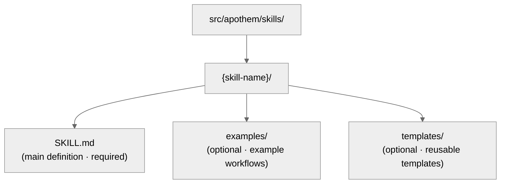

{/* SPDX-License-Identifier: MIT */}

This guide helps developers maintain and extend the Apothem ecosystem with
SOTA quality standards.

## Quick Reference: Artifact Types

The Apothem ecosystem contains five artifact types, each with specific
purposes and frontmatter requirements.

| Artifact | Path | Purpose | When to Create |
| -------- | ---- | ------- | -------------- |
| **Rule** | `src/apothem/rules/*.md` | Behavioral mandate or operational directive | New principle, policy, or governance mandate established |
| **Command** | `src/apothem/commands/*.md` | Slash command (`/command-name`) for complex workflows | New multi-step user workflow |
| **Helper** | `src/apothem/agents/*.md` | Persistent delegated-worker definition for parallel tasks | New recurring specialized task (audit, explore, quality-check) |
| **Skill** | `src/apothem/skills/{name}/SKILL.md` | Reusable technique with detection signal | New detectable, reusable technique pattern |
| **Hook** | `src/apothem/hooks/` + `settings.json` | Event-triggered validation or state management | New lifecycle event or validation need |

## Harness Adapter Contract

Harness identity and capability facts live in
`src/apothem/lib/harness_registry.py`. A harness change is complete only when
these surfaces agree:

| Surface | Required update |
| --- | --- |
| Registry row | Public ID, package key, entry point, scope, output format, target paths, docs paths, capability file, standard pin, fixture tests, package-data key, template sources, and capability statuses. |
| Adapter package | `__init__.py`, `install.py`, `update.py`, `uninstall.py`, `verify.py`; add `materializer.py` only when the harness renders a native config file. |
| Propagation manifest | Template and cohort paths for manifest-backed adapters. |
| Capabilities | `src/apothem/harnesses/<package>/capabilities.yml` with every required capability and rationale for unsupported or discovery-pending states, plus a `conversion_losses` map for each converted commands, agents, or rules cohort (see the [harness registry](/docs/reference/harness-registry)). |
| Convention pin | `STANDARD-CONVENTION-PIN.md` with vendor URL, snapshot date, canonical filename/schema, evidence reference, and unsupported capability rationale. |
| Tests | Registry parity, adapter fixture test, golden install-plan row, dry-run/no-write behavior, idempotence, and package-data coverage. |
| Docs | Harness reference page, comparison page, capability/MCP notes, and examples that use fake placeholders. |

Project-scope adapters must set `requires_project = True`, accept
`project: Path | None` on lifecycle methods, and reject missing or unsafe
project roots before writes. User-scope adapters must keep paths under the
harness's documented user configuration root.

## Golden Fixture Policy

`tests/fixtures/harness-golden-plans.json` records the public install-plan shape
for all seventeen registry harnesses: public ID, materialization mode, source
cohort/template path, and normalized target path under `<ROOT>`. When registry,
manifest, or template target behavior changes intentionally, update the golden
fixture in the same commit as the source change so the diff shows the behavior
delta.

## Validation Before Write

The shared install driver validates every source and target before the first
write. It rejects missing manifest sources, target traversal, target paths
outside the selected root, and symlink crossings. Dry-runs execute the same
validation and return structured `skipped` or `unchanged` results without
creating files.

## Redaction and Example Data

Profile diagnostics redact token, secret, password, credential, API key,
private key, authorization, auth, and header-shaped fields. Documentation,
fixtures, examples, and JSON snippets use `example.invalid`, `Example User`,
`example-user`, and obvious placeholders instead of real-looking secrets or
personal accounts.

## Before You Write: The Canonical Schema

**The machine-readable, gate-enforced contract is the per-class JSON Schemas
under `src/apothem/schemas/*.schema.json` — `additionalProperties` rejects
unknown keys, so the conformity gate is the final word.** Two human-readable
projections track them: `site/content/docs/reference/frontmatter-schema.mdx`
(the required-key index) and `site/content/docs/reference/artifact-schema.mdx`
(per-class templates and worked examples). Where a page disagrees with the JSON
Schemas, the schemas win.

- Read the JSON Schema for your artifact type under `src/apothem/schemas/`
- Read `site/content/docs/reference/artifact-schema.mdx` § "Schema" for the
  template and a worked example
- Copy the required fields, fill in mandatory values, add optional fields as needed

## Frontmatter Quick-Check

Every artifact frontmatter must pass these checks:

```yaml
✓ Valid YAML syntax (use tools: `yamllint` or PowerShell `ConvertFrom-Yaml` where available)
✓ All mandatory fields present (per schema for artifact type)
✓ name: uses kebab-case
✓ version: semantic MAJOR.MINOR.PATCH
✓ updated: ISO 8601 date (YYYY-MM-DD)
✓ description: single-line, non-empty
✓ scope fields valid per artifact type (rules: pathFilter + alwaysApply; CLAUDE.md root: scope)
✓ portability: valid enum (`universal` | `universal-with-windows-caveats` | `unix-only` | `windows-only`)
✓ No typos in field names — must match canonical schema exactly
✓ Optional fields use correct enum values
```

## Naming Conventions

### Artifact Names (kebab-case)

- **Rules:** `operational-mandates`, `clean-room-generation`, `context-management`
- **Commands:** `plan-execute`, `plan-spec`, `plan-generate`
- **Helpers:** `codebase-explorer`, `convention-auditor`, `quality-gate`
- **Skills:** `plan-suite`, `ecosystem-audit`

Pattern: lowercase, hyphens between words, no spaces or underscores.

### File Naming

- **Rules:** `{name}.md`
- **Commands:** `{name}.md`
- **Helpers:** `{name}.md`
- **Skills:** Inside folder `src/apothem/skills/{name}/SKILL.md` (exact case: `SKILL.md`)
- **Hooks:** Inside folder `src/apothem/hooks/`. All event handlers are Python. Every
  `settings.json` hook command uses exec form (`python` plus `args`) to invoke
  `-m apothem.hooks.dispatch <event> [<message-name>]` or
  `-m apothem.conformity.gate --hook`. `dispatch.py` routes `SessionStart` to
  `session_start_bootstrap.main()` and
  every other whitelisted event to `emit_hook_context.main()`. The only shell
  stubs permitted under `src/apothem/hooks/` or `scripts/` are the four locator + bootstrap
  files (`find-python.{ps1,sh}`, `bootstrap.{ps1,sh}`); any other `.ps1` /
  `.sh` file fails the `scripts/dev/validate_hooks.py` hygiene check.

### Cross-References

When referencing other artifacts, use exact names:

- Rules: `"operational-mandates"` (name field value)
- Commands: `/plan-execute` (with slash for human docs; without in code)
- Helpers: `codebase-explorer` (name field value)
- Skills: `plan-suite` (name field value)

Never use file paths or truncated names in prose.

## Portability: Windows vs. Unix

Every artifact must explicitly declare its portability status.

### Universal (Default)

- Works identically on Windows, macOS, and Linux
- No shell assumptions
- Paths use forward slashes (`/`)
- No hardcoded absolute paths
- No Windows-specific PowerShell syntax

```yaml
portability: "universal"
```

### Universal with Windows Caveats

- Universal across POSIX hosts; the named caveat applies on the Windows platform variant declared in the content
- Document the caveat explicitly in content
- Example: "Symlinks not supported on Windows before Win 10"

```yaml
portability: "universal-with-windows-caveats"
```

Document the caveat in a note immediately after the title.

### Unix-Only / Windows-Only

- Explicitly restricted to one platform
- Rare in Apothem — most should be universal
- Use only if platform-specific features are essential

```yaml
portability: "unix-only"
```

Document the reason in the rule's first section.

## Scope: Always-On vs. Path-Filtered

### Always-On

Rule applies everywhere.

```yaml
scope: "always-on"
```

### Path-Filtered

Rule applies conditionally based on file path.

```yaml
scope: "path-filtered"
pathFilter: "**/*.py, **/*.toml"
```

The `pathFilter` uses glob patterns (same format as `.gitignore`). When a file
matches the filter, the rule activates.

## Version Semantics

Every artifact carries its own semantic version (`MAJOR.MINOR.PATCH`):

- **PATCH** — typo fixes, formatting, link refresh, comment-only edits. Behavior unchanged.
- **MINOR** — additive non-breaking changes: new optional sections, additional anti-patterns, new optional frontmatter fields, new examples. Existing consumers continue to work without change.
- **MAJOR** — breaking schema or contract changes: removed sections, renamed fields, altered behavior of an existing directive, changes that require downstream artifacts to adapt.

Examples:

- `vX.Y.Z` → `vX.Y.(Z+1)` (PATCH: typo fix)
- `vX.Y.Z` → `vX.(Y+1).0` (MINOR: added new Anti-Patterns entry)
- `vX.Y.Z` → `v(X+1).0.0` (MAJOR: declared contract stable)
- `vX.Y.Z` → `v(X+1).0.0` (MAJOR: removed mandatory frontmatter field)

Bump `version` and `updated` together on every behavior-changing edit. Append a
matching row to the ecosystem-level `CHANGELOG.md` for releases that bundle
artifact changes.

## When to Edit an Artifact

### Rules

- Treat the Mandatory/Optional structure as load-bearing — restructuring it
  ripples through every dependent artifact (MAJOR bump required).
- Refine Anti-Patterns, Seriousness Scaling examples, and citations as
  understanding deepens (MINOR bump).
- Capture the rationale for any structural change in the relevant memory
  topic file.

### Commands

- Argument shape is part of the public contract — break it only with explicit
  intent and propagate the change to every caller (MAJOR bump).
- Keep workflow steps and return contracts tight and current.
- Document non-obvious step sequencing inline.

### Helpers

- Keep `disallowedTools` minimal-but-adequate; document the rationale when it
  changes.
- Refine Operating Principles and Return Contracts as the helper's role
  matures (MINOR bump).
- Track capability shifts inline so callers can recalibrate expectations.

### Skills

- Keep Procedure steps and Examples synchronized with reality.
- Detection signals must reflect actual user phrasing in current usage.
- Split a skill once it crosses ~150 lines (see
  `auto-memory.md` § Topic File Management).

## Step-by-Step: Adding a New Rule

### 1. Assess Orthogonality

Does this rule overlap with existing rules? Search `src/apothem/rules/` for related content.

If overlap >50%, consider extending an existing rule instead. See
`persistent-conventions-vigilance.md` § Artifact Evolution.

### 2. Write Content

Follow the structure:

- Title: `# Rule: {Title}`
- Purpose section
- Obligations / Core directives (numbered, linked)
- Seriousness Scaling table (always required)
- Anti-Patterns section
- Enforcement section

### 3. Create Frontmatter

Use the schema from `site/content/docs/reference/artifact-schema.mdx` § Schema: Rules. Set:

- `name:` kebab-case identifier
- `description:` one-line summary for registries
- `pathFilter:` glob list for path-filtered rules; the empty string (`""`) for always-on rules
- `alwaysApply:` `true` for always-on rules, `false` for path-filtered rules

Rules carry only these four fields — no `version` / `updated` / `scope` / `portability` / `implements`.

Example:

```yaml
---
name: "my-new-rule"
description: "Brief one-liner"
pathFilter: ""
alwaysApply: true
---
```

### 4. Update CLAUDE.md

Add entry to `§7.2 Rules` registry table:

```markdown
| My New Rule | `src/apothem/rules/my-new-rule.md` | Always-on | CM-5/CM-21 |
```

Maintain alphabetical order within the table.

### 5. Append to CHANGELOG.md

Add a row under the next release's `### Added` section describing the new rule.

### 6. Run Validation

Invoke the `ecosystem-audit` skill to verify the new rule, focusing on the rules area:

```text
Invoke the ecosystem-audit skill with --focus rules --fix
```

Verify no errors reported for your new rule.

## Step-by-Step: Adding a New Command

Commands are slash commands like `/plan-spec`, `/plan-execute`, `/security-audit`, etc.

### 1. Determine Role

Commands are **never** meant to be called by the harness in isolation. They are
user-triggered workflows. Ask:

- Is this a workflow the user types `/command-name`?
- Does it orchestrate multiple steps?
- Could it timeout or require user input mid-execution?

If "no" to any of these, it's probably a skill, not a command.

### 2. Create File

Path: `src/apothem/commands/{name}.md`

Frontmatter (from `site/content/docs/reference/artifact-schema.mdx` § Schema: Commands):

```yaml
---
name: "my-command"
version: "X.Y.Z"
updated: "2026-04-20"
description: "What this command does"
argument-hint: "[path/to/input] [--flag VALUE]"
disable-model-invocation: true
portability: "universal"
allowed-tools: "Read, Glob, Grep"
---
```

`disable-model-invocation: true` makes a command operator-invoked only; with
`false`, the model may run it when a request matches its description. Most
commands use `true`, but most plan and research pipeline stages use `false`.
The invocation table in `src/apothem/commands/README.md` lists every
command's setting; add a row for a new command. Keep
`allowed-tools` read-only: a harness that honors it runs those tools without
asking. Grant a side-effecting tool only as a scoped rule, such as
`Bash(git log *)`; the schema rejects `"*"` and bare `Bash`, `PowerShell`,
`Write`, `Edit`, `NotebookEdit`, and `WebFetch`.

### 3. Write Content

Structure:

- Title: `# /{name} — Human-Readable Title`
- Role section (who executes this)
- High-level instructions
- Workflow section with steps
- Return contract / output format

### 4. Update CLAUDE.md and CHANGELOG.md

Registry row in `§7.1 Commands`; CHANGELOG row under the next release's `### Added` section.

### 5. Validate

Invoke the `ecosystem-audit` skill, focusing on commands:

```text
Invoke the ecosystem-audit skill with --focus commands --fix
```

## Step-by-Step: Adding a New Helper

Helpers are persistent delegated-worker definitions for parallel work.

### 1. Identify Pattern

Does this helper fit one of the team patterns listed below?

- Research Team: read-only, information gathering
- Audit Team: verification, consistency checks
- Implementation Team: parallel code changes
- Quality Team: lint, test, type-check, security
- Documentation Team: doc updates
- Other: specialized task

### 2. Create File

Path:

```text
src/apothem/agents/{name}.md
```

Frontmatter:

```yaml
---
name: "my-helper"
version: "X.Y.Z"
updated: "2026-04-20"
description: "What this helper specializes in"
tools: "Read, Glob, Grep, Bash"
disallowedTools: "Write, Edit"
maxTurns: 15
portability: "universal"
---
```

Leave out `model`, `effort`, and `permissionMode` so the helper inherits the
session's choices (the agnostic posture), and leave out `memory` unless the
helper needs a persistent-memory scope (`user`, `project`, or `local`).

### 3. Write Content

Sections:

- Operating Principles (read-only, evidence-based, binary verdicts, exhaustive)
- Workflow (numbered steps)
- Return Contract (max tokens, structure, required fields)

### 4. Update CLAUDE.md and CHANGELOG.md

Registry row in `§7.3 Helpers`; CHANGELOG row under the next release's `### Added` section.

### 5. Test

Deploy the helper in a real scenario and verify it works as documented.

## Step-by-Step: Adding a New Skill

Skills are reusable, detectable techniques.

### 1. Identify Reusability

Before writing a skill:

- Have you seen this problem/technique 3+ times?
- Is it detectable? (Does a user request pattern signal it?)
- Can you codify it reproducibly?

If all three are yes, write a skill.

### 2. Create Structure



### 3. Write SKILL.md

Frontmatter:

```yaml
---
name: "skill-name"
version: "X.Y.Z"
updated: "2026-04-20"
description: "What this skill teaches"
archetype: "workflow-template"
userInvocable: true | false
disable-model-invocation: true | false
allowed-tools: "Read, Glob, Grep"
argument-hint: "[args]"               # optional; if userInvocable
---
```

Content structure:

- Purpose
- When to Use This Skill
- Prerequisites
- Step-by-Step Procedure
- Common Mistakes
- Examples

### 4. Update CLAUDE.md and CHANGELOG.md

Registry row in `§7.5 Skills`; CHANGELOG row under the next release's `### Added` section.

### 5. Validate

Invoke the `ecosystem-audit` skill, focusing on skills:

```text
Invoke the ecosystem-audit skill with --focus skills --fix
```

## Validation Checklist Before Committing

- [ ] Frontmatter passes YAML syntax check
- [ ] All mandatory fields present per schema
- [ ] `name` field uses kebab-case
- [ ] `version` is semantic (`MAJOR.MINOR.PATCH`) and was bumped if behavior changed
- [ ] `updated` matches today's date for any artifact you touched
- [ ] `portability` field set and valid
- [ ] CHANGELOG.md carries the change in the appropriate category under the next release's section
- [ ] No plan-internal references (CM-7 compliance)
- [ ] Cross-references are consistent with other artifacts
- [ ] New artifact registered in CLAUDE.md registry
- [ ] Artifact tested (if applicable)
- [ ] `ecosystem-audit` skill runs with no errors
- [ ] Content follows structural conventions (title format, sections, etc.)

## Referencing Other Artifacts

Use these exact conventions:

### Reference a Rule

```markdown
See `src/apothem/rules/operational-mandates.md` or shorthand: the Operational Mandates rule.
In prose: ... per CM-1–10 (Operational Mandates rule) ...
```

### Reference a Command

```markdown
See `/plan-execute` command. Or: Run `/plan-execute`.
In prose: The `/plan-execute` command handles phase execution.
```

### Reference a Helper

```markdown
Deploy the `codebase-explorer` delegated worker.
In prose: The codebase-explorer worker finds patterns.
```

### Reference a Skill

```markdown
Use the `plan-suite` skill.
In prose: The plan-suite skill provides the Master Plan Suite template.
```

### Reference CLAUDE.md Sections

```markdown
See CLAUDE.md § 7.2 (Rules registry).
Or: Section 4 (Seriousness-Scaled Governance).
```

## Linting and Format

All artifacts use:

- **Markdown:** GFM (GitHub Flavored Markdown)
- **YAML:** YAML 1.2 compliant
- **Line endings:** LF (Unix-style)
- **Encoding:** UTF-8
- **Line width:** Soft wrap at 100 characters for content (no hard breaks)

Use the `Ruff` formatter / linter for Python files. For Markdown, use
`prettier` or equivalent.

## Testing and Measurement

### Run the suite

```bash
python -m pytest                      # unit, integration, property, conformity, scripts
python -m pytest tests/property       # Hypothesis properties (profile loader, frontmatter, merge)
```

The suite is hermetic: it passes with the checkout under `$TMPDIR` and with a
`python` on `PATH` that lacks the CLI prerequisites, because the integration
tests run the interpreter that runs pytest and tokenize nested temp and source
paths longest-first.

### Coverage per package

CI measures three packages and holds each to its own floor. None of them is
folded into another.

| Package | Paths | Floor | Where the floor lives |
| --- | --- | --- | --- |
| engine | `cli`, `harnesses`, `lib`, `hooks`, `statuslines` | 80 | `[tool.coverage.report] fail_under` |
| conformity | `src/apothem/conformity` | 81 | `[tool.coverage.package-floors]` |
| audit | `src/apothem/audit` | 70 | `[tool.coverage.package-floors]` |

The figure is line plus branch coverage, the same percentage coverage.py
reports with `branch = true`; the metrics artifact also records the
statement-only figure under `coverage_lines`. Each package floor is the
measured line plus branch value rounded down. Raise a floor when coverage
rises; never lower one to make a change pass. To check locally:

```bash
python -m pytest --cov=src/apothem --cov-report=json:coverage.json
python scripts/dev/collect_metrics.py --coverage-json coverage.json --check-floors \
  --skip-hooks --skip-coldstart --harness zed
```

### The metrics artifact

The CI `metrics` job runs `scripts/dev/collect_metrics.py` on every push and
pull request and uploads `metrics.json` (`schema_version: 1`). Every value
that is `null` carries its reason under `nulls`.

| Key | What it measures |
| --- | --- |
| `coverage.engine`, `coverage.conformity`, `coverage.audit` | Line plus branch percent per package, with `coverage_floors`. |
| `always_on_bytes[harness]`, `always_on_files[harness]` | For each of the 17 harnesses, after `profile init` and `install --harness <id>` into a scratch `HOME` and project: bytes on disk of the instruction files that harness loads in full at launch. |
| `cli_coldstart_ms` | Median of `python -m apothem --version` (with `--help` under `cli_coldstart_detail_ms`). |
| `hook_e2e_ms[event]`, `hook_injected_chars[event]` | Per registered event and matcher (`PreToolUse:Write`, `Stop`, …): the median total time of the hook chain on a real payload, and the context characters it injects. |

Which files count as loaded at launch is a per-harness rule taken from each
vendor's documented instruction surfaces. Listings that carry only a
description (skills, commands, subagents) are not counted. The rule text is
also written into the artifact under `rules.always_on_bytes`:

```text
antigravity     ~/.gemini/{GEMINI,AGENTS}.md, ~/.gemini/config/{GEMINI,AGENTS}.md,
                ~/.gemini/config/rules/*.md with trigger: always_on, project
                GEMINI.md and AGENTS.md. The plugin rules/ folder is not a
                documented launch surface.
claude-code     ~/.claude/CLAUDE.md and ~/.claude/rules/**/*.md without paths:
                frontmatter, plus the project equivalents.
codebuddy       .codebuddy/rules/**/*.md (project and home) unless
                alwaysApply: false, plus CODEBUDDY.md.
codex           ~/.codex/AGENTS.md and the project AGENTS.md.
cursor          .cursor/rules/**/*.mdc with alwaysApply: true, and AGENTS.md.
gemini-cli      ~/.gemini/GEMINI.md and the project GEMINI.md.
github-copilot  .github/copilot-instructions.md and the project AGENTS.md.
hermes          ~/.hermes/SOUL.md, project .hermes.md, AGENTS.md, CLAUDE.md.
                The support tree and apothem/rules/ are not launch surfaces.
kimi-code       ~/.kimi-code/AGENTS.md, project AGENTS.md and .kimi-code/AGENTS.md.
kiro            .kiro/steering/**/*.md with inclusion: always or no inclusion
                key, and the project AGENTS.md.
open-claw       Workspace bootstrap files ~/.openclaw/workspace/*.md.
opencode        ~/.config/opencode/AGENTS.md, the project AGENTS.md, and every
                file the instructions globs in opencode.json match.
qwen-code       The context files named by context.fileName in
                ~/.qwen/settings.json (default QWEN.md), in ~/.qwen/ and the project.
trae            .trae/rules/**/*.md with alwaysApply: true, and
                ~/.trae/user_rules/*.md.
windsurf        .devin/rules/**/*.md and .windsurf/rules/**/*.md with
                trigger: always_on, the global global_rules.md, and AGENTS.md.
zed             The first of .rules, .cursorrules, .windsurfrules, .clinerules,
                .github/copilot-instructions.md, AGENT.md, AGENTS.md, CLAUDE.md,
                GEMINI.md in the project, plus ~/.config/zed/AGENTS.md.
glm             Nothing: GLM is a model backend and loads no instruction files.
```

### Behavioural evals

The suite under `evals/` measures behaviour rather than form: 64 trigger cases
(each model-invocable command and subagent fires on a request in its domain
and stays quiet on a near miss), 32 outcome cases (one per plan stage,
research stage and audit dimension) and 6 rule-effect pairs (an always-on
rule's text on and off). The cases are plain data validated for free by
`python -m pytest tests/unit/test_eval_suite.py`; running them is billed and
manual. See [Run the behavioural evals](/docs/how-to/evals) for the `Evals`
workflow, a local run and how to add a case. After editing an always-on rule
that has a pair, run `python scripts/dev/sync_eval_rule_cases.py`.

### Benchmarks

`make benchmarks` runs the per-class drivers under `src/apothem/benchmarks/`.
Each exits `0` pass, `1` over budget, `2` error (the measured run did not
execute), or `3` not measured.

- `bench_hooks.py` runs every `shell: bash` command that `hooks/hooks.json`
  registers, as written, on a real payload per event and matcher, and reports
  the median total time, the slowest command (checked against the event's
  budget) and the characters injected. A command that cannot run as registered
  (exit 126 when a script lacks its executable bit) is an error, not a pass.
- `bench_agents.py` reports `NOT MEASURED` (exit 3): a subagent spawn needs a
  host harness and a model call. `make benchmarks` does not run it.

The always-on budget check (`always-on-budget-grep`) counts whitespace-separated
words with the Bindings section and companion pointer lines excluded. Its JSON
report also carries `always-on-loaded`: the bytes, characters and words of the
frontmatter-stripped bodies a harness loads, summed over the always-on rules.

## Ecosystem Audit: Running Validation

Two complementary validation surfaces cover the ecosystem:

**Machine-checkable (Python validators)** — run before every commit:

```bash
python scripts/dev/validate_hooks.py       # Hook structure + Python-only hygiene
python scripts/dev/validate_ecosystem.py   # Full tree + frontmatter + delegated hook checks
python scripts/dev/chaos_pass.py           # Adversarial sweep across configured hooks
pytest tests                                    # Unit tests for the hook runtime
```

**Assistant-driven** — for cross-reference, narrative, and convention audits:

```bash
/ecosystem-audit --focus all --fix
```

This runs in parallel:

- **Structure audit:** Registry accuracy, file existence, frontmatter validity
- **Artifact audit:** Cross-references, mandate coverage, pipeline ordering
- **Memory audit:** Memory file claims vs. filesystem state

Expected output: `PASS` with zero findings from both surfaces.

If `FINDINGS` reported:

- Review each finding's severity (Critical / Important / Advisory)
- Address Critical items immediately
- Plan Important items for next cycle
- Consider Advisory items for next iteration

---

## Questions?

Refer to:

- Frontmatter schema: `site/content/docs/reference/artifact-schema.mdx`
- Artifact lifecycle: `src/apothem/rules/persistent-conventions-vigilance.md` § Artifact Evolution
- Operational mandates: `src/apothem/rules/operational-mandates.md` CM-1–10
- Plan suite reference: `src/apothem/skills/plan-suite/master-template.md`
- Release notes: `CHANGELOG.md`
