{/* SPDX-License-Identifier: MIT */}

Estas son las instrucciones con alcance de repositorio para los entornos de
ejecución de asistentes con múltiples trabajadores (plataformas
de orquestación, despachadores, plataformas autónomas de asistencia)
cuando operan en este repositorio. Son obligatorias y se publican
con cada checkout publicado. Son coherentes con
[`AGENTS.md`](https://github.com/ahmed-g-gad/apothem/blob/main/AGENTS.md),
[`CLAUDE.md`](https://github.com/ahmed-g-gad/apothem/blob/main/CLAUDE.md)
y las instrucciones con alcance de proyecto para otras superficies de asistente
admitidas; cuando las superficies se solapan en una disciplina
compartida (Disciplina de planes, Cabeceras de archivo, manejo de ambigüedad,
nomenclatura, antipatrones, jerarquía modal), son semánticamente equivalentes y
`AGENTS.md` es la voz canónica del proyecto.

## Contexto del proyecto

Este repositorio es un ecosistema de herramientas de desarrollo que aloja la
configuración de un entorno de ejecución de asistente:
trabajadores delegados, comandos de barra, habilidades, hooks, estilos de
salida, una línea de estado, integración de MCP, ajustes, esquemas JSON,
validadores, pruebas y documentación. Lo mantiene un único autor. La
disposición en disco refleja exactamente la disposición del entorno de
ejecución. Los trabajadores delegados de este repositorio no almacenan estado
fuera del árbol publicado; el árbol publicado es el artefacto canónico.

## Convenciones de trabajadores

Una ejecución con múltiples trabajadores en este repositorio sigue tres
convenciones:

- **Los roles están nombrados.** Cada trabajador delegado en una ejecución con
  múltiples trabajadores lleva un identificador de rol (kebab-case,
  descriptivo: `codebase-explorer`, `convention-auditor`, `quality-gate`,
  `memory-auditor`). Los nombres de rol genéricos (`worker`, `helper`) están
  prohibidos.
- **Los contratos de retorno son explícitos.** Cada invocación de un trabajador
  especifica la forma de retorno esperada —resumen estructurado, presupuesto
  máximo de tokens, campos requeridos, redacción del modo de fallo—. El
  despachador rechaza los retornos mal formados en lugar de volver a solicitar
  en silencio.
- **El estado compartido es el sistema de archivos.** Los trabajadores
  delegados no comparten memoria a través del límite de despacho. El estado que
  dos trabajadores necesitan fluye a través de un archivo con nombre bajo el
  árbol publicado (o el directorio `.apothem/plans/` del proyecto para el estado de
  trabajo en curso, según la *Disciplina de planes*).
  {/* [Machine-seeded — pending review] */}
  Un árbol `.plans/` heredado se migra mediante `apothem migrate-workspace`.

Cuando la tarea de un trabajador es de varios pasos, la traza de trabajo del
trabajador se registra en
`<project-root>/.apothem/plans/YYYY-MM-DD--<slug>.md` según la *Disciplina de planes*;
el despachador lee el plan para coordinar a los trabajadores posteriores. Los
planes nunca se confirman en git.

## Cabeceras de archivo

Cada archivo nuevo aplicable que genere el asistente **DEBE** comenzar con la
cabecera de licencia SPDX canónica de una sola línea según
[`site/content/docs/reference/authorship-header.mdx`](/docs/reference/authorship-header),
en la variante que coincida con el tipo de archivo. El fixture de cabecera
exacto a nivel de byte está en
[`src/apothem/schemas/authorship-header.txt`](https://github.com/ahmed-g-gad/apothem/blob/main/src/apothem/schemas/authorship-header.txt).

Para añadir la cabecera, el asistente invoca el inyector canónico:

```bash
python scripts/inject-header.py --mode fix-in-place <path>
```

El inyector es idempotente y detecta la variante a partir de la ruta. La
cabecera está **exenta** para las clases enumeradas en
[`src/apothem/schemas/header-exceptions.txt`](https://github.com/ahmed-g-gad/apothem/blob/main/src/apothem/schemas/header-exceptions.txt):
LICENSE, archivos JSON, archivos de bloqueo, archivos generados, contenido
vendido (vendored), efímeros de `.audit/`, efímeros de
`<project-root>/.apothem/plans/`, marcadores vacíos, binarios.

## Disciplina de planes

El asistente **NO DEBE** generar código, scripts ni prosa que escriba en un
directorio de configuración de entorno ni en cualquier otra ubicación global de
planes. Los artefactos de planificación —planes de coordinación entre múltiples
trabajadores, estrategias de refactorización, diarios de depuración, notas de
exploración— viven exclusivamente en `<project-root>/.apothem/plans/` (el
directorio canónico de planes; un árbol `<project-root>/.plans/` heredado se
migra mediante `apothem migrate-workspace`).
{/* [Machine-seeded — pending review] */}

El directorio `<project-root>/.apothem/plans/` está **gitignorado** (y el
`<project-root>/.plans/` heredado) según el fragmento
canónico de `.gitignore` documentado en
{/* [Machine-seeded — pending review] */}
[`site/content/docs/reference/plans-discipline.mdx`](/docs/reference/plans-discipline).
Los planes **NUNCA DEBEN** confirmarse en el historial de git de un proyecto.
Los planes transitan por los estados del ciclo de vida
**draft → in-progress → converged** (promover a ADR)
**→ abandoned / superseded**, registrados en el campo `status:` del frontmatter
de cada plan. Los nombres de archivo de los planes siguen

```mermaid
%% provenance: hand-authored %%
%% verified: 2026-07-06 %%
%% cross-reference: the plan status: lifecycle described above; CLAUDE.md Plans Discipline %%
stateDiagram-v2
    accTitle: Apothem plan lifecycle states
    accDescr: A plan's frontmatter status field moves from draft to in-progress to converged, where a converged plan is promoted to an ADR. From draft or in-progress a plan may instead be abandoned; an in-progress or converged plan may be superseded. Abandoned and superseded are terminal.
    state "in-progress" as inprogress
    [*] --> draft
    draft --> inprogress
    inprogress --> converged
    converged --> [*]: promote to ADR
    draft --> abandoned
    inprogress --> abandoned
    inprogress --> superseded
    converged --> superseded
    abandoned --> [*]
    superseded --> [*]
```

`YYYY-MM-DD--<kebab-case-slug>.md`.



Cuando la salida intermedia del asistente es coordinación de varios pasos
(estructuras de desglose del trabajo, asignaciones de rol, ordenación de
despacho), la salida se enruta a un archivo nuevo
`<project-root>/.apothem/plans/YYYY-MM-DD--<slug>.md` en lugar de a una transcripción de
chat o un mensaje de confirmación.

## Manejo de ambigüedad

Cuando el asistente no está seguro de un valor que de otro modo tendría que
inventar, **NO DEBE** fabricarlo en silencio. La respuesta del asistente lleva
o bien un despacho estructurado de consulta al operador de vuelta al humano
(donde el entorno de ejecución lo admita) o bien un comentario claramente
marcado `# TODO(clarify): ...` en el artefacto generado. Ambos son el
equivalente, en la superficie de múltiples trabajadores, del canal de consulta
estructurada: un registro revisable y nunca silencioso de que una suposición se
difirió al humano.

Ante la incertidumbre, el asistente **NUNCA DEBE** fabricar las siguientes
clases de datos: identidad, dirección del alcance, preferencia (formateador /
linter / framework de pruebas / proveedor de CI donde el host no haya ratificado
uno), seguridad, nomenclatura (una nueva convención introducida donde el host no
tiene ninguna), infraestructura (endpoints, hosts, puertos, regiones, nombres de
cola, nombres de tabla), fijaciones de versión. En cada uno de estos casos, la
respuesta correcta es una superficie equivalente a una consulta, nunca un
marcador de posición de aspecto plausible que compile.

## Patrones prohibidos

Lo siguiente está prohibido en el código, la prosa y los mensajes de
confirmación generados por el asistente:

- **Adjetivos de marketing** — `powerful`, `seamless`, `robust`,
  `industry-leading`, `cutting-edge`, `world-class`. Prohibidos en artefactos
  de cara al usuario salvo que estén concretamente sustentados por una medición
  o cita inmediatamente adyacente.
- **Relleno evasivo** — `basically`, `kind of`, `in some sense`,
  `more or less`. Prohibido en texto directivo. Donde la incertidumbre sea
  genuina, exprésala con precisión.
- **Detritos de depuración** — `print()`, `console.log`, `eprintln!`,
  `fmt.Println` dejados en código confirmado como salida de depuración
  improvisada.
- **Rutas codificadas del home del usuario** — `/home/<user>/...`,
  `/Users/<user>/...`, `C:\Users\<user>\...`. Usa `${HOME}`, `~`,
  `pathlib.Path.home()` o sustitución en tiempo de instalación.
- **Secretos en confirmaciones** — nunca. Los hooks de pre-commit lo bloquean;
  el asistente no los elude.
- **Escrituras bajo `<project-root>/.apothem/plans/` que lleguen a git** — nunca. El
  directorio está gitignorado.
- **Contradecir `AGENTS.md`** — cuando este archivo se solapa con `AGENTS.md`
  en una disciplina compartida, ambos son semánticamente equivalentes. Una
  anulación específica de una superficie requiere un marcador inline
  `<!-- coherence-override: <claim-id> -->` emparejado con un Registro de
  Decisión de Arquitectura (ADR) rastreado en el registro de diseño del
  proyecto. La superficie de catálogo de ADR está por llegar; hasta que aterrice,
  las anulaciones citan el marcador inline más la justificación en el
  frontmatter del asistente.

## Nomenclatura

Los archivos / carpetas usan **kebab-case**; excepciones canónicas en mayúsculas
para `AGENTS.md`, `CLAUDE.md`, `README.md`, `LICENSE`, `CHANGELOG.md`,
`SECURITY.md`, `CODE_OF_CONDUCT.md`, `CONTRIBUTING.md`, y los pocos archivos de
nivel superior en mayúsculas que requieren sus respectivas convenciones.

Las confirmaciones siguen **Conventional Commits**: `type(scope): subject` con
modo imperativo y un asunto de menos de 72 caracteres. Las etiquetas de
publicación siguen **Versionado semántico**: `vMAJOR.MINOR.PATCH`. Las ramas
siguen `type/short-description`.

## Jerarquía modal

La prosa directiva usa la jerarquía modal de **RFC 2119**: `MUST`, `MUST NOT`,
`SHOULD`, `SHOULD NOT`, `MAY`. Los contratos de retorno llevan la misma
jerarquía al expresar requisitos (p. ej., un campo de retorno que indica «este
campo MUST ser una cadena no vacía»).

## Formato de salida

El código generado por el asistente lleva:

- Una superficie pública documentada: cada función / clase / módulo público
  tiene un docstring o comentario de cabecera que indica precondiciones,
  postcondiciones y modos de fallo.
- Tipos donde el lenguaje los admite (sugerencias de tipo en Python; tipos de
  TypeScript en cada exportación; tipos de retorno en Go; tipos en Rust de
  principio a fin).
- Pruebas donde exista un andamiaje de pruebas.
- La cabecera de licencia SPDX canónica de una sola línea en la cabecera del
  archivo.
- Sin código comentado.

Los mensajes de confirmación generados por el asistente siguen Conventional
Commits con un cuerpo que explica *por qué* se realizó el cambio. Las líneas de
asunto están en modo imperativo y se mantienen por debajo de 72 caracteres.

## Lista de comprobación de revisión

Antes de que las salidas de un despacho con múltiples trabajadores se acepten
para fusión —ya sea el revisor un humano o un trabajador de revisión
posterior—, verifica cada punto:

- La cabecera de licencia SPDX canónica de una sola línea está presente en la
  cabecera de cada archivo nuevo aplicable.
- Todos los nombres de archivo son kebab-case (con las excepciones canónicas en
  mayúsculas).
- Ningún archivo bajo `<project-root>/.apothem/plans/` está preparado para confirmación;
  ninguna ruta referencia un directorio de configuración de entorno como
  destino de escritura.
- Ninguna afirmación en el diff contradice `AGENTS.md`.
- Los validadores locales se ejecutan en verde.
- Cada comentario `TODO(clarify): ...` introducido está resuelto o
  explícitamente diferido con justificación.
- Sin adjetivos de marketing, sin relleno evasivo, sin detritos de depuración,
  sin rutas codificadas del home del usuario, sin secretos en el diff.
- Los mensajes de confirmación son Conventional Commits con asuntos en modo
  imperativo por debajo de 72 caracteres.

## Punteros

- [`AGENTS.md`](https://github.com/ahmed-g-gad/apothem/blob/main/AGENTS.md) —
  la voz canónica del proyecto; cada afirmación compartida en este archivo
  refleja una afirmación allí.
- [`CLAUDE.md`](https://github.com/ahmed-g-gad/apothem/blob/main/CLAUDE.md) —
  el espejo de Claude Code.
- [`site/content/docs/reference/plans-discipline.mdx`](/docs/reference/plans-discipline) —
  la referencia completa de la Disciplina de planes.
- [`site/content/docs/reference/authorship-header.mdx`](/docs/reference/authorship-header) —
  la referencia completa de la cabecera de autoría.
- [`tests/fixtures/multi-surface-claims.yaml`](https://github.com/ahmed-g-gad/apothem/blob/main/tests/fixtures/multi-surface-claims.yaml) —
  la lista de afirmaciones contra la que el validador `multi-surface-coherence`
  valida este archivo.
