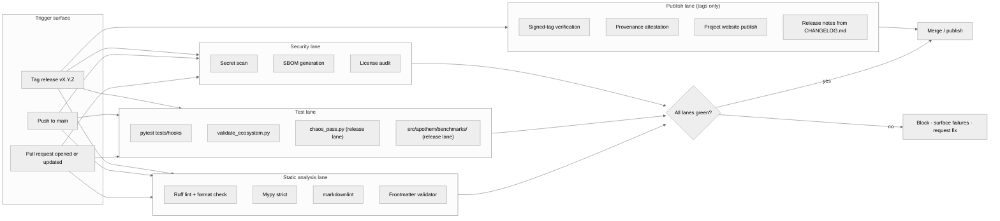

{/* SPDX-License-Identifier: MIT */}

**El mapa estructural del flujo de trabajo de compilación · validación ·
publicación que controla cada cambio en el ecosistema de Apothem.** Este
documento instala la superficie de visualización; los archivos concretos de
flujo de trabajo de GitHub Actions y el utillaje de lanzamiento llegan más tarde
bajo la instalación de preparación para producción.

## Forma del pipeline

## Roles de los carriles

- **Carril de análisis estático** — retroalimentación rápida. Ruff cubre el
  estilo de Python y un conjunto de reglas curado; mypy impone disciplina de
  tipos en modo strict; markdownlint controla la superficie de documentación; el
  validador de frontmatter controla el cumplimiento del esquema de artefactos
  para reglas, skills, trabajadores delegados y comandos.
- **Carril de pruebas** — `pytest tests/hooks` ejercita el runtime de hooks
  contra la matriz completa de eventos; `validate_ecosystem.py` es la principal
  compuerta estructural para la consistencia entre artefactos; `chaos_pass.py` y
  la suite de benchmarks por clase bajo `src/apothem/benchmarks/` se activan en
  el carril de lanzamiento para detectar degradación bajo entradas degradadas y
  regresiones del presupuesto de runtime.
- **Carril de seguridad** — el escaneo de secretos detecta credenciales
  confirmadas por accidente; la generación de SBOM y las auditorías de licencias
  controlan la superficie de cadena de suministro para cualquier instalación de
  preparación para producción.
- **Carril de publicación** — se ejecuta solo en lanzamientos etiquetados. La
  verificación de etiquetas firmadas confirma la procedencia de la rama de
  lanzamiento; el sitio web del proyecto se publica desde `site/dist/` al destino
  de GitHub Pages; las notas de lanzamiento derivan del formato Keep-A-Changelog
  de `CHANGELOG.md`.

## Configuración concreta

Los archivos de flujo de trabajo reales (`.github/workflows/ci.yml`,
`.github/workflows/release.yml`, etc.) se instalan durante la construcción del
ecosistema de preparación para producción. Este diagrama define la forma
canónica que reflejará toda configuración futura.

## Referencias cruzadas autoritativas

- `pyproject.toml` — fuente de verdad de la configuración de Ruff / mypy / pytest.
- `scripts/dev/validate_ecosystem.py` — la principal compuerta entre artefactos.
- `scripts/dev/validate_hooks.py` — validación estructural específica de hooks.
- `scripts/dev/chaos_pass.py` — barrido adversarial de cada hook configurado.
- `src/apothem/benchmarks/` — verificadores del presupuesto de runtime por clase.
- `site/content/docs/developer-guide.mdx` — el flujo de trabajo del contribuyente orientado al operador.
- `CHANGELOG.md` — fuente de las notas de lanzamiento.
