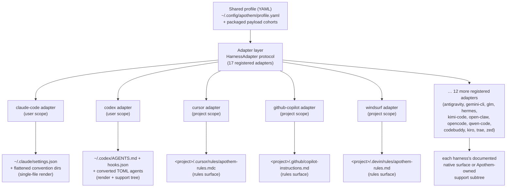

{/* SPDX-License-Identifier: MIT */}

Apothem usa un único perfil YAML validado por esquema como fuente semántica de
verdad y deriva cada superficie de instalación específica de cada entorno a
través de clases adaptadoras que implementan el protocolo `HarnessAdapter`. Cada
adaptador escribe en la ubicación de usuario o de proyecto documentada por el
entorno y usa rutas de soporte propias de Apothem solo cuando el entorno no tiene
una primitiva nativa equivalente.

## Por qué una abstracción de adaptador

Cada entorno habla un dialecto de configuración distinto: uno quiere un archivo
de ajustes JSON, otro un directorio de archivos de reglas `.mdc`, y un tercero un
único archivo de instrucciones Markdown. Si Apothem codificara ese conocimiento
de forma rígida en la CLI, cada entorno filtraría sus suposiciones al núcleo, y
añadir un entorno significaría tocar la lógica de instalación, actualización,
desinstalación y verificación al unísono.

El patrón adaptador invierte eso. El núcleo conoce solo el protocolo
`HarnessAdapter` — un pequeño contrato de métodos de ciclo de vida. El dialecto
de cada entorno vive dentro de un subpaquete autocontenido que implementa el
contrato. El núcleo le pide a un adaptador que *instale* sin saber si eso
significa renderizar un archivo JSON, escribir un directorio de reglas o asentar
un árbol de soporte. Los nuevos entornos se incorporan satisfaciendo el protocolo
y registrando un punto de entrada; nada en el núcleo cambia. Esta es la razón
estructural por la que Apothem permanece agnóstico al anfitrión — la abstracción
es la frontera que impide que el conocimiento específico de cada entorno se
propague.

## La forma de un adaptador

Los adaptadores se dividen en dos formas de materialización, ambas visibles en el
registro:

- **Los renderizadores de archivo único** traducen los campos del perfil en un
  archivo de configuración nativo del entorno. El adaptador de Claude Code, por
  ejemplo, siempre escribe `~/.claude/settings.json` a partir del perfil
  compartido y aplana los directorios de convención de Apothem (`agents/`,
  `rules/`, `skills/`, …) junto a él.
- **Los adaptadores de superficie de reglas y de árbol de soporte** propagan el
  cohorte de carga útil de Apothem a la ubicación de reglas documentada por el
  entorno, convirtiendo los cohortes al formato nativo donde existe uno y
  aparcando el resto bajo un subárbol de soporte propio de Apothem referenciado
  desde el ancla nativa. El adaptador de Cursor escribe un único
  `.cursor/rules/apothem-rules.mdc` en la raíz de proyecto suministrada y entrega
  solo la superficie de reglas.

Un adaptador dado es de **alcance de usuario** (escribe bajo el directorio de
inicio) o de **alcance de proyecto** (requiere `--project <path>` y escribe
dentro de ese árbol); el registro indica cuál.

## Topología actual de adaptadores



El despliegue del centro hacia los bordes es la arquitectura que codifica el
nombre del proyecto: un perfil en el núcleo, cada entorno a una distancia igual a
lo largo de su propio adaptador.

## Definición del protocolo

```python
from pathlib import Path
from typing import Protocol

class HarnessAdapter(Protocol):
    name: str
    output_path: Path

    def install(self, profile: dict[str, object]) -> object:
        ...

    def update(self, profile: dict[str, object]) -> object:
        ...

    def uninstall(self) -> None:
        ...

    def is_installed(self) -> bool:
        ...

    def verify(self) -> bool:
        ...
```

Los adaptadores de alcance de proyecto pueden además aceptar `project: Path |
None` en los métodos de ciclo de vida y exponer `resolve_output_path(project)`.
La CLI pasa `--project PATH` solo a los adaptadores cuya firma de método lo
acepta.

## Registro del punto de entrada

Los adaptadores se registran mediante el grupo de puntos de entrada de setuptools
`apothem.harnesses`:

```toml
[project.entry-points."apothem.harnesses"]
cursor = "apothem.harnesses.cursor:CursorAdapter"
```

El registro central en `src/apothem/lib/harness_registry.py` anota los diecisiete ID
públicos exactos, los puntos de entrada, las rutas de documentación, las rutas de
destino, los requisitos de datos de paquete, los estados de capacidad y las rutas
de fijación de convención estándar. La CLI carga los adaptadores a través de ese
registro en lugar de redescubrir hechos del producto en cada comando.

## Mapeo de perfil a nativo

Cada adaptador implementa la lógica de traducción apropiada para su entorno:

```
YAML profile + payload cohort    Harness-native surface
-----------------------------    ----------------------
identity / preferences       --> native config fields or rendered instruction context
commands/*.md                --> native commands or SKILL.md folders
rules/*.md                   --> native rules where supported, otherwise support trees
hooks/messages/*.md          --> native hooks where supported, otherwise support trees
agents/*.md                  --> native agent formats where supported
skills/*/SKILL.md            --> native skill folders where supported
```

Las celdas de capacidad no soportadas y pendientes de descubrimiento se
convierten en advertencias estructuradas antes de escribir. No se proyectan en
silencio sobre superficies de proveedor inventadas.

## Añadir un nuevo adaptador

Consulta [Escribir un adaptador de entorno](/docs/examples/authoring-a-harness-adapter)
para una guía paso a paso.
