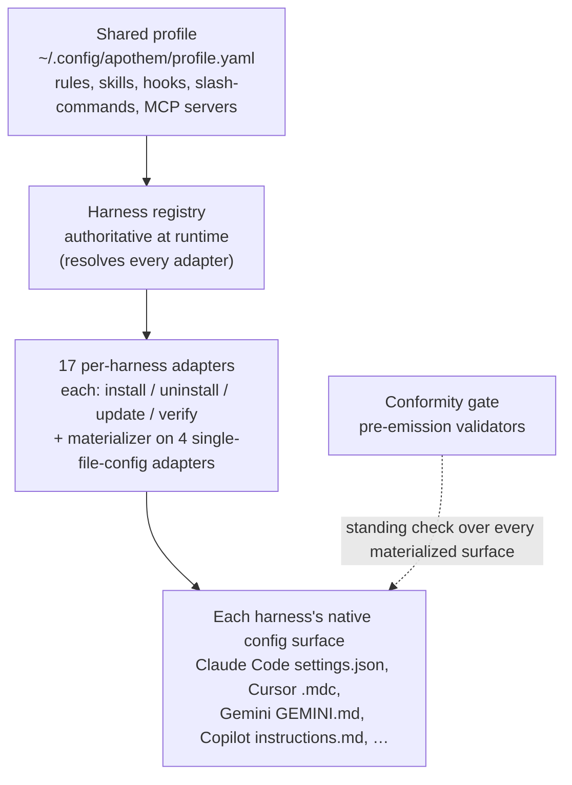

{/* SPDX-License-Identifier: MIT */}

Apothem se construye en torno a una sola idea: un perfil de gobernanza
compartido, materializado en el formato de configuración nativo de cada
entorno de ejecución de asistente mediante un adaptador por
harness. Esta sección explica las piezas estructurales: el protocolo del
adaptador, el esquema del perfil, la disposición del árbol de fuentes y el
flujo de instalación que los conecta.

## Visión general del sistema

De un vistazo, Apothem es una sola tubería: un único perfil compartido alimenta
el registro de harness, que resuelve cada adaptador por harness; cada adaptador
materializa la superficie de configuración nativa de su harness, y una
verificación de conformidad permanente comprueba cada superficie materializada.

## Páginas

| Página | Descripción |
|------|-------------|
| [Abstracción del adaptador de harness](/docs/architecture/harness-adapter-abstraction) | El protocolo `HarnessAdapter`: cómo los adaptadores traducen el perfil compartido a configuración nativa de la plataforma. |
| [Esquema del perfil compartido](/docs/architecture/shared-profile-schema) | El perfil YAML respaldado por esquema en `~/.config/apothem/profile.yaml` o `--profile PATH`. |
| [Disposición de fuentes](/docs/architecture/source-layout) | Por qué Apothem usa una disposición `src/` y cómo se organiza el árbol. |
| [Flujo de instalación](/docs/architecture/installation-workflow) | Cómo funcionan `apothem install`, `update` y `uninstall` de principio a fin. |
| [Trabajadores delegados](/docs/architecture/agents) | Instrucciones con alcance de repositorio para entornos de ejecución multi-trabajador que operan en este repositorio. |
| [Runtime autocontenido](/docs/architecture/self-contained-runtime) | Cómo el motor de Apothem se ejecuta desde cualquier checkout — dependencias internalizadas, el modelo de invocación PYTHONPATH=src y el bootstrap del árbol del plugin. |
| [Estrategia de internalización de dependencias](/docs/architecture/vendoring-strategy) | Qué paquetes de terceros internaliza Apothem bajo src/apothem/_vendor/, cuáles quedan como prerrequisitos del sistema y cómo se refrescan las copias internalizadas. |
| [Contrato de empaquetado de cohortes](/docs/architecture/cohort-packaging-contract) | El contrato estable y consumible aguas abajo para el empaquetado de cohortes y los manifiestos de complementos — enumera las cohortes y resuelve sus destinos nativos por entorno sin volver a derivar el mapeo. |
| [Diagrama del pipeline de CI/CD](/docs/architecture/cicd-pipeline) | Mapa visual y desglose por carriles de las etapas del flujo de trabajo de compilación, prueba, lint, seguridad y publicación que controlan cada cambio de código y cada lanzamiento. |
