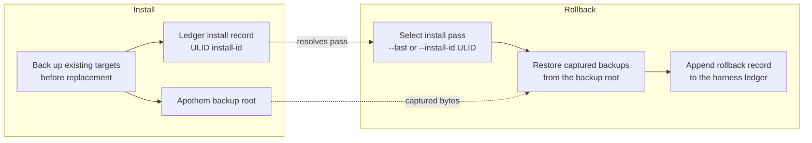

{/* SPDX-License-Identifier: MIT */}

## Flujo de instalación

```mermaid
flowchart TD
    accTitle: Apothem install workflow
    accDescr: Top-down flowchart of the apothem install command from CLI invocation through adapter lookup, profile load, adapter install call, native config write, and final apothem verify check.
    A[apothem install --harness X] --> B[Resolve adapter through registry]
    B --> C[Load and validate profile YAML<br/>before writes]
    C --> D[Adapter.install(profile, project)]
    D --> E[Write native config and support cohorts]
    E --> F[apothem verify --harness X]
    F --> G{All checks pass?}
    G -- yes --> H[Done]
    G -- no --> I[Report failures]
```

## Flujo de actualización

En `apothem update --harness X`:

1. Carga y valida `~/.config/apothem/profile.yaml` o `--profile PATH`.
2. Resuelve el harness seleccionado o `all` a través del registro central.
3. Valida el plan de materialización completo antes de la primera escritura.
4. Llama a `Adapter.update(profile, project=...)`.
5. Informa de los resultados creados, actualizados, sin cambios, omitidos, con advertencia y con error.

## Flujo de desinstalación

En `apothem uninstall --harness X`:

1. Llama a `Adapter.uninstall()`.
2. El adaptador elimina solo los archivos que escribió; el perfil compartido YAML
   y los archivos no relacionados escritos por el operador quedan intactos.

## Resolución de alcance

Cada adaptador escribe en su propia raíz de instalación fija: el directorio
personal del usuario para los adaptadores de alcance de usuario y la ruta local
del proyecto para los adaptadores de alcance de proyecto. La CLI no expone un
indicador `--scope`; los adaptadores de alcance de proyecto requieren
`--project <path>`. Cada destino se documenta en
`site/content/docs/harnesses/<harness>.mdx`.

## Manejo de errores

Las operaciones de instalación/actualización validan antes de escribir, hacen una
copia de seguridad de los destinos coincidentes existentes antes de reemplazarlos,
y fusionan solo las entradas hijas gestionadas por Apothem en los directorios de
descubrimiento compartidos. `--dry-run` ejecuta la misma validación y devuelve
resultados omitidos o sin cambios sin crear directorios ni archivos.

## Reversibility (backup and rollback)

Every install pass is reversible. Replaced bytes are captured into the Apothem
backup root and the pass is recorded in the harness ledger under a ULID
install id; [`apothem rollback`](/docs/cli-reference/rollback) selects a
recorded pass and restores those captured backups.


