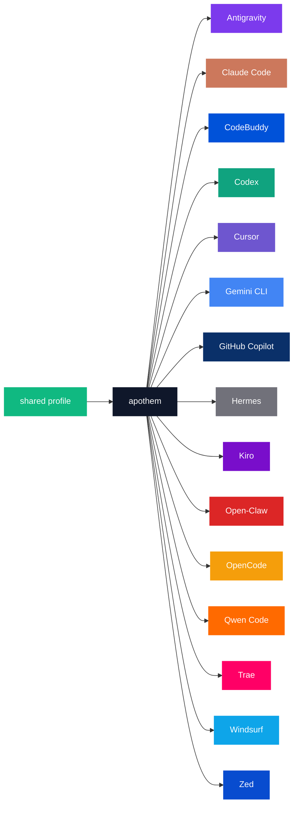

{/* SPDX-License-Identifier: MIT */}

Las enumeraciones canónicas de nombre-de-marca × código-de-color de abajo están envueltas en una valla `text` para preservar los identificadores literales por entorno que requiere el propósito de catálogo de la paleta.

## Núcleo de Apothem

| Token | Claro | Oscuro | Uso |
|---|---|---|---|
| `apothem-hub` | `#0F172A` | `#F1F5F9` | El nodo central de distribución ("apothem") en cada diagrama de arquitectura y el concentrador central del logotipo de Apothem. |
| `shared-profile` | `#10B981` | `#34D399` | El perfil fuente-de-verdad que alimenta el núcleo de apothem. |

## Paleta de entornos

Quince de los diecisiete entornos están coloreados para coincidir con su
identidad de marca principal. Los dos restantes — `glm` y `kimi-code` — aún no
tienen un color de marca definido; sus filas se añaden una vez que se fija el
color de marca aguas arriba, según el paso de propagación en
[Actualizaciones](#actualizaciones).

```text
| Token             | Light     | Dark      | Source                                                                                                                                              |
|-------------------|-----------|-----------|-----------------------------------------------------------------------------------------------------------------------------------------------------|
| `antigravity`     | `#7C3AED` | `#9F67FF` | Google Antigravity deep-purple.                                                                                                                     |
| `claude-code`     | `#CC785C` | `#E89378` | Anthropic terracotta-orange.                                                                                                                        |
| `codebuddy`       | `#0052D9` | `#5E8EF7` | Tencent CodeBuddy blue.                                                                                                                             |
| `codex`           | `#10A37F` | `#19C796` | OpenAI signature teal.                                                                                                                              |
| `cursor`          | `#6E56CF` | `#9B85E3` | Cursor brand purple.                                                                                                                                |
| `gemini-cli`      | `#4285F4` | `#6BA4F7` | Google blue (primary); the Apothem mark renders the node with all four Google brand hues `#4285F4` / `#34A853` / `#FBBC04` / `#EA4335`.             |
| `github-copilot`  | `#0A3069` | `#5B8FE3` | GitHub Mona deep-blue.                                                                                                                              |
| `hermes`          | `#71717A` | `#A1A1AA` | Community silver-grey.                                                                                                                              |
| `kiro`            | `#790ECB` | `#A862DD` | Kiro violet.                                                                                                                                        |
| `open-claw`       | `#DC2626` | `#F87171` | Community red-orange.                                                                                                                               |
| `opencode`        | `#F59E0B` | `#FBBF24` | Community amber.                                                                                                                                    |
| `qwen-code`       | `#FF6A00` | `#FF8C40` | Alibaba Qwen orange.                                                                                                                                |
| `trae`            | `#FF0066` | `#FF599C` | ByteDance Trae magenta.                                                                                                                             |
| `windsurf`        | `#0EA5E9` | `#38BDF8` | Windsurf sky-blue.                                                                                                                                  |
| `zed`             | `#084CCF` | `#5E8BE0` | Zed Industries blue.                                                                                                                                |
```

## Justificación de los nombres

- **`apothem-hub`**: el centro geométrico que evoca el nombre (el apotema de un polígono regular apunta hacia su núcleo).
- **`shared-profile`**: la fuente aguas arriba, distinta de cualquier color de un único entorno para que se lea como la flecha de "entrada" en cada diagrama.
- **Tokens por entorno** que reflejan el slug del entorno usado en toda la base de código (`harnesses/<slug>/`, la clave del punto de entrada, el argumento `--harness <slug>` de la CLI). Una palabra por concepto; la misma cadena en todas partes.

## Uso de Mermaid



## Accesibilidad

Cada token de modo claro cumple el contraste WCAG 2.2 AA frente a texto blanco (≥4,5 : 1) donde el contraste lo permite sin distorsionar el color de marca. Cuando el color de marca nativo de un entorno cae por debajo del umbral AA frente a texto blanco por sí solo (en especial la familia ámbar / naranja y la familia azul cielo / verde azulado de tokens enumerada arriba), los diagramas que necesitan contraste WCAG AA de texto-sobre-color usan la **variante de modo oscuro** (el tono elevado) como relleno del diagrama para que el texto blanco se lea con claridad. La columna de modo oscuro está calibrada para este fin: cada token de modo oscuro supera el AA frente a texto blanco.

## Actualizaciones

La paleta se actualiza solo cuando un entorno ratifica un cambio de marca aguas arriba. Los cambios de marca por entorno se propagan de forma atómica a través de `site/app/global.css`, esta página y cada máster SVG afectado bajo `assets/src/`.
