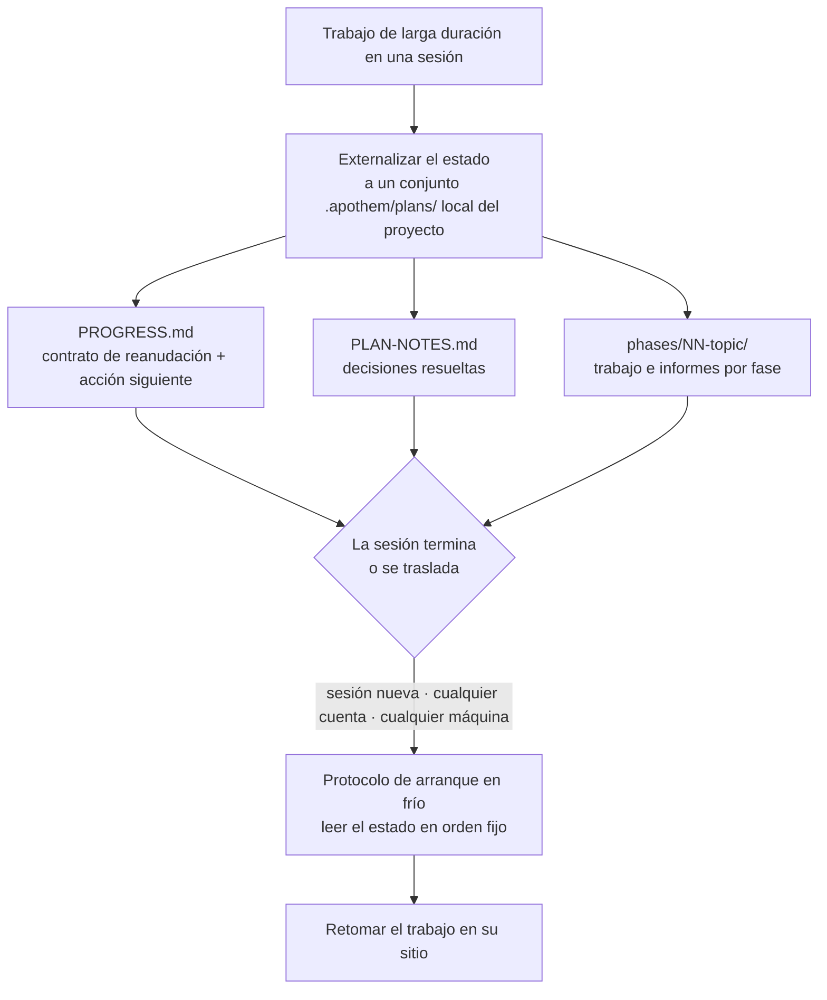

{/* SPDX-License-Identifier: MIT */}

La mayor parte del trabajo asistido vive y muere dentro de una
sola conversación. Cierras el chat, cambias de máquina o inicias sesión con otra
cuenta, y el hilo de lo que estabas haciendo desaparece: la siguiente sesión
empieza en frío, sin memoria de las decisiones que ya tomaste.

Apothem invierte eso. Para el trabajo de larga duración y en varios pasos
externaliza su **estado de trabajo completo** a un conjunto `.apothem/plans/` local del
proyecto (manteniendo `.plans/` como respaldo de retrocompatibilidad admitido): archivos que residen en tu repositorio, no dentro del historial de
ningún chat en la nube. El estado es el artefacto duradero; la sesión es
descartable.

## La idea central

Un conjunto de planes en `<project-root>/.apothem/plans/{suite}/` aporta dos cosas que
hacen reemplazable una sesión:

- **Un contrato de reanudación.** `PROGRESS.md` registra la fase y el estado de
  las tareas actuales, la acción siguiente precisa, las convenciones vigentes,
  las decisiones ya resueltas y los archivos exactos que la siguiente sesión debe
  leer.
- **Un protocolo de arranque en frío.** Una sesión nueva lee esos archivos en un
  orden fijo y reconstruye el panorama completo antes de hacer cualquier trabajo,
  sin necesidad de historial de conversación.

Como ese estado está en los archivos de tu proyecto, una sesión nueva en
**cualquier cuenta o máquina** apuntada al mismo proyecto retoma el trabajo en su
sitio. Nada queda encerrado en una sola transcripción de chat. Esta es la
propiedad que hace que el trabajo estructurado, a gran escala y de varios días
—grandes corpus, migraciones largas, grandes pasadas de revisión— sobreviva a
límites que de otro modo lo terminarían.

## Qué es, con precisión

Dicho con exactitud para que la garantía quede clara:

- **Es** estado externalizado a archivos más un protocolo de reanudación en frío.
  El trabajo se retoma porque el estado vive en los archivos de tu proyecto,
  independiente de cualquier sesión, cuenta o máquina.
- **No es** un servicio automático de sincronización entre cuentas. Apothem no
  empuja por su cuenta tu estado de planes entre cuentas: los archivos viajan tal
  como ya viajan los archivos de tu proyecto (control de versiones, un checkout
  compartido, un directorio sincronizado). Lo que Apothem garantiza es que
  dondequiera que aterricen los archivos del proyecto, una sesión nueva puede
  reanudar a partir de ellos.

## Por qué esto importa

Cuanto más largo y grande es el trabajo, más se convierte una sola conversación
en un lastre. Una reforma de varios días o un barrido a través de una base de
código grande sobrevivirá a cualquier sesión: las ventanas de contexto se
compactan, las sesiones expiran, las máquinas cambian. Al tratar los propios
archivos del proyecto como la fuente de verdad para el trabajo en curso, Apothem
hace que el trabajo sea resistente a los tres límites: sesión, cuenta y máquina.

## Dónde vive el estado

| Artefacto | Ubicación | Contiene |
|----------|----------|-------|
| Conjunto de planes | `<project-root>/.apothem/plans/{suite}/` | Una unidad autónoma de trabajo en curso |
| Contrato de reanudación | `<suite>/PROGRESS.md` | Estado de fase/tarea, acción siguiente, convenciones, manifiesto de archivos críticos |
| Registro de decisiones | `<suite>/PLAN-NOTES.md` | Decisiones resueltas, nunca vueltas a preguntar |
| Trabajo por fase | `<suite>/phases/NN-topic/` | Las tareas de la fase y su informe |

El árbol de planes está excluido del control de versiones por el fragmento
canónico de `.gitignore` de Apothem, de modo que el estado de los planes
permanece local de forma predeterminada. Para llevar el trabajo en curso entre
máquinas o cuentas de forma deliberada, mueve el conjunto `.apothem/plans/` igual que
mueves cualquier otro archivo del proyecto.

## Relacionado

- **[Niveles de seriedad](/docs/concepts/seriousness-tiers)** — cómo la
  gobernanza y la disciplina de externalización de estado se ajustan al
  compromiso.
- **[La canalización de comandos](/docs/pipeline)** — las etapas de `/plan` que
  crean y hacen avanzar un conjunto de planes.

## Recommended Next Step

**Lee [Niveles de seriedad](/docs/concepts/seriousness-tiers)** para ver cómo la
disciplina de externalización se ajusta desde un experimento rápido hasta un
esfuerzo de varios días que cruza límites.
