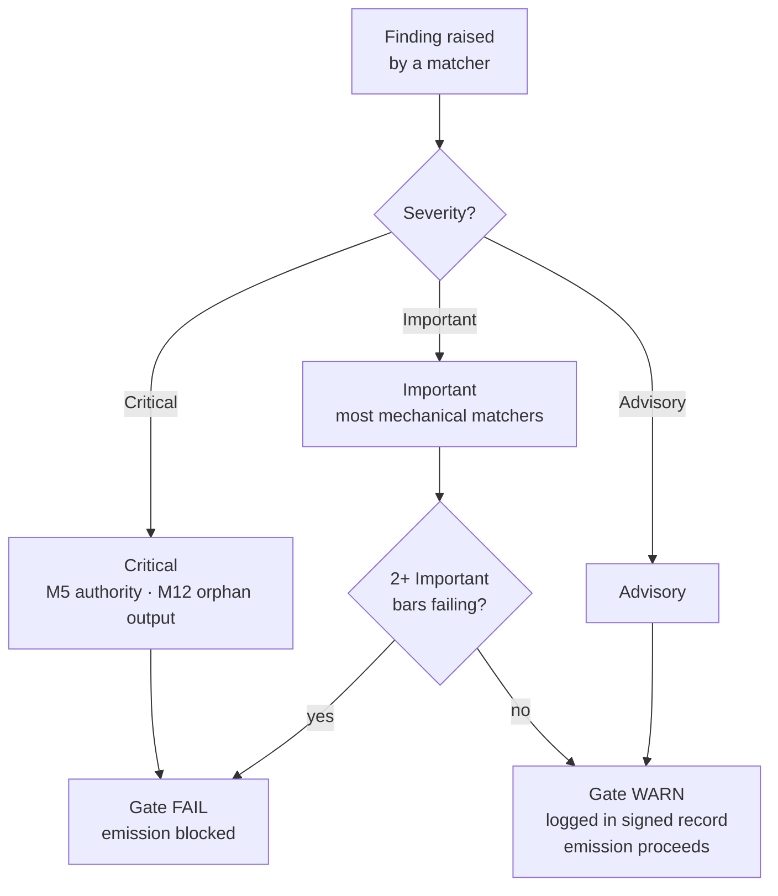

{/* SPDX-License-Identifier: MIT */}

## Los quince puntos

| Punto | ID | Mandato | Clase de verificación | Fallo → acción |
|---|---|---|---|---|
| 1 | M1 | Agnosticismo respecto al proyecto anfitrión | Razonada | Revisar para ajustarse a las convenciones del anfitrión |
| 2 | M2 | Disciplina editorial (registro de divulgación) | Mecánica | Añadir marcadores de divulgación |
| 3 | M3 | Diez dimensiones de calidad | Razonada | Revisar en las dimensiones que fallan |
| 4 | M4 | Autoaplicación (bloque de registro firmado presente) | Mecánica | Registrar el bloque de registro firmado |
| 5 | M5 | Principio de autoridad (sin identidad / endpoint / secreto fabricados) | Mecánica | Encauzar a consulta |
| 6 | M6 | Incorporación de pericia (brechas sacadas a la luz) | Razonada | Sacar a la luz las brechas; citar refinamientos |
| 7 | M7 | Anotación de opciones (marcador de recomendación + justificación) | Mecánica | Anotar los conjuntos de opciones |
| 8 | M8 | Definitividad (sin vacilaciones en prosa prescriptiva) | Mecánica | Promover las vacilaciones a condicionales |
| 9 | M9 | Aprovechamiento visual (los temas estructurales llevan diagramas) | Razonada | Crear / actualizar el diagrama |
| 10 | M10 | Vinculación bidireccional (punteros recíprocos cerrados) | Mecánica | Cerrar las medias aristas |
| 11 | M11 | Sprints ágiles (Objetivo / Backlog / DoR / DoD / Revisión / Retrospectiva) | Razonada | Reestructurar como sprints |
| 12 | M12 | Informes de fase y disposición canónica | Mecánica | Crear el resumen; reubicar en la disposición canónica |
| 13 | M13 | Oficio de código (linter / formateador / verificador de tipos; número mágico; bare-except) | Mecánica | Revisar según las reglas de oficio de código por lenguaje |
| 14 | M14 | Sistemicidad (declara ascendientes / descendientes / pares / aplicadores) | Razonada | Declarar; indexar en los registros |
| 15 | M15 | Lista para producción (pruebas + documentación + CHANGELOG + commit conforme + CI en verde + estabilidad semver) | Mecánica | Añadir las superficies que faltan |

## Escalera de severidad

| Severidad | Efecto sobre la compuerta |
|---|---|
| **Crítica** | Compuerta FAIL — emisión bloqueada incondicionalmente |
| **Importante** | Compuerta FAIL cuando fallan 2+ puntos Importantes simultáneamente |
| **Consultiva** | Compuerta WARN — registrada en el bloque firmado; no bloquea la emisión |

La mayoría de los emparejadores de la fracción mecánica tienen por defecto **Importante**. M5 (autoridad — secretos, endpoints fabricados) y M12 (salidas huérfanas) son **Críticos**.



## Emparejadores de la fracción mecánica

La fracción mecánica vive en [`src/apothem/conformity/*_grep.py`](https://github.com/ahmed-g-gad/apothem/tree/main/src/apothem/conformity), orquestada por [`src/apothem/conformity/gate.py`](https://github.com/ahmed-g-gad/apothem/blob/main/src/apothem/conformity/gate.py).

| Emparejador | Punto | Función |
|---|---|---|
| `hedging_grep.py` | M8 | Detecta vocabulario vacilante en la prosa prescriptiva |
| `option_annotation_grep.py` | M7 | Verifica el marcador `**Recommended**` + la justificación en los conjuntos de opciones |
| `user_confirm_grep.py` | M5 | Bloquea los marcadores de posición `<USER-CONFIRM:…>` de la emisión |
| `binding_reciprocity_grep.py` | M10 | Detecta medias aristas en `## Bindings (§0.j five-direction)` |
| `orphan_output_grep.py` | M12 | Señala artefactos sin consumidor / sin entrada de índice / sin atribución de productor |
| `bare_except_grep.py` | M13 | Detecta `except:` / `except Exception:` sin comentario justificativo |
| `magic_number_grep.py` | M13 | Detecta literales numéricos en la lógica de negocio |
| `commented_out_code_grep.py` | M13 | Detecta bloques de código comentados |
| `file_header_grep.py` | M13 | Verifica la presencia del encabezado de licencia SPDX de una sola línea |
| `frontmatter_grep.py` | M14 | Verifica los campos de frontmatter requeridos en los cuatro directorios de directivas canónicos listados abajo |
| `semver_stability_grep.py` | M15 | Detecta cambios disruptivos en la API pública sin un incremento de versión MAJOR |
| `production_ready_pr_grep.py` | M15 | Verifica la disciplina del mismo conjunto de cambios (pruebas + documentación + CHANGELOG) |
| `secret_leak_grep.py` | M15 | Detecta secretos / credenciales codificados de forma fija |
| `unpinned_action_grep.py` | M15 | Verifica que las GitHub Actions estén fijadas a un commit SHA |
| `always_on_budget_grep.py` | tope de presupuesto | Limita el cuerpo de las reglas siempre activas a 500 tokens sustantivos |

## Ejecutar la compuerta

En un harness instalado, la compuerta se ejecuta automáticamente: el
`settings.json` de Claude Code la conecta como un hook `PreToolUse` que
invoca la copia materializada en `~/.claude/.apothem/support/conformity/gate.py`
antes de cada Write/Edit. Desde un checkout de fuente, la forma de módulo
ejecuta el mismo código:

```shell
# Despacho de un solo archivo (imita el hook PreToolUse):
echo '{"tool_input": {"file_path": "path/to/file", "content": "..."}}' \
    | python -m apothem.conformity.gate --hook

# Barrido compuesto a través del repositorio:
python -m apothem.conformity.gate --sweep src/ site/content/docs/ rules/
```

Véase [Ejecutar la compuerta de conformidad](/docs/usage/conformity-gate) para el procedimiento completo.

## Referencia

- [Registro de la compuerta de preemisión](/docs/governance/pre-emission-gate-registry) — definiciones canónicas de los puntos
- [Registro de conformidad externa](/docs/governance/outward-conformity-registry) — semántica detallada de M1-M15
- [Mandatos transversales](/docs/governance/cross-cutting-mandates) — fuente de verdad de los mandatos
- [Disciplina de rendimiento](https://github.com/ahmed-g-gad/apothem/blob/main/src/apothem/rules/performance-discipline.md) — presupuestos de tiempo de ejecución por clase
