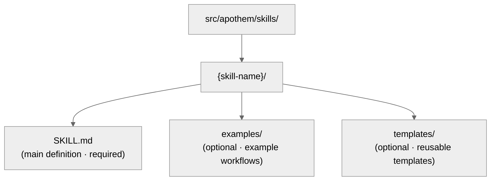

{/* SPDX-License-Identifier: MIT */}

Esta guía ayuda a los desarrolladores a mantener y extender el ecosistema de Apothem
con estándares de calidad SOTA.

## Referencia rápida: tipos de artefacto

El ecosistema de Apothem contiene cinco tipos de artefacto, cada uno con propósitos
específicos y requisitos de frontmatter.

| Artefacto | Ruta | Propósito | Cuándo crearlo |
| --------- | ---- | --------- | -------------- |
| **Regla** | `src/apothem/rules/*.md` | Mandato de comportamiento o directiva operativa | Se establece un nuevo principio, política o mandato de gobernanza |
| **Comando** | `src/apothem/commands/*.md` | Comando de barra (`/command-name`) para flujos de trabajo complejos | Nuevo flujo de trabajo de usuario de varios pasos |
| **Ayudante** | directorio de ayudantes (`*.md` por archivo) | Definición persistente de trabajador delegado para tareas en paralelo | Nueva tarea especializada recurrente (auditoría, exploración, control de calidad) |
| **Habilidad** | `src/apothem/skills/{name}/SKILL.md` | Técnica reutilizable con señal de detección | Nuevo patrón de técnica detectable y reutilizable |
| **Hook** | `src/apothem/hooks/` + `settings.json` | Validación o gestión de estado disparada por eventos | Nuevo evento de ciclo de vida o necesidad de validación |

## Contrato del adaptador de entorno

Los hechos de identidad y capacidad de cada entorno viven en
`src/apothem/lib/harness_registry.py`. Un cambio de entorno solo está completo cuando
estas superficies concuerdan:

| Superficie | Actualización requerida |
| --- | --- |
| Fila del registro | ID público, clave de paquete, punto de entrada, alcance, formato de salida, rutas de destino, rutas de documentación, archivo de capacidades, pin de estándar, pruebas de fixture, clave de package-data, fuentes de plantilla y estados de capacidad. |
| Paquete del adaptador | `__init__.py`, `install.py`, `update.py`, `uninstall.py`, `verify.py`; añade `materializer.py` solo cuando el entorno renderiza un archivo de configuración nativo. |
| Manifiesto de propagación | Rutas de plantilla y cohorte para los adaptadores respaldados por manifiesto. |
| Capacidades | `src/apothem/harnesses/<package>/capabilities.yml` con cada capacidad requerida y la justificación de los estados no soportados o pendientes de descubrimiento. |
| Pin de convención | `STANDARD-CONVENTION-PIN.md` con la URL del proveedor, fecha de la instantánea, nombre/esquema canónico del archivo, referencia de evidencia y justificación de capacidades no soportadas. |
| Pruebas | Paridad de registro, prueba de fixture del adaptador, fila golden del plan de instalación, comportamiento de dry-run/sin escritura, idempotencia y cobertura de package-data. |
| Documentación | Página de referencia del entorno, página de comparación, notas de capacidad/MCP y ejemplos que usan marcadores de posición ficticios. |

Los adaptadores de ámbito de proyecto deben establecer `requires_project = True`,
aceptar `project: Path | None` en los métodos de ciclo de vida y rechazar raíces de
proyecto faltantes o inseguras antes de escribir. Los adaptadores de ámbito de usuario
deben mantener las rutas bajo la raíz de configuración de usuario documentada del
entorno.

## Política de fixtures golden

`tests/fixtures/harness-golden-plans.json` registra la forma pública del plan de
instalación para los diecisiete entornos del registro: ID público, modo de
materialización, ruta de cohorte/plantilla de origen y ruta de destino normalizada
bajo `<ROOT>`. Cuando el comportamiento del registro, el manifiesto o el destino de la
plantilla cambia intencionadamente, actualiza el fixture golden en el mismo commit que
el cambio de origen para que el diff muestre el delta de comportamiento.

## Validación antes de escribir

El driver de instalación compartido valida cada origen y destino antes de la primera
escritura. Rechaza orígenes de manifiesto faltantes, recorrido de destino, rutas de
destino fuera de la raíz seleccionada y cruces de enlaces simbólicos. Los dry-runs
ejecutan la misma validación y devuelven resultados estructurados `skipped` o
`unchanged` sin crear archivos.

## Redacción y datos de ejemplo

Los diagnósticos del perfil redactan los campos con forma de token, secret, password,
credential, API key, private key, authorization, auth y header. La documentación, los
fixtures, los ejemplos y los fragmentos JSON usan `example.invalid`, `Example User`,
`example-user` y marcadores de posición obvios en lugar de secretos o cuentas
personales de aspecto real.

## Antes de escribir: el esquema canónico

**Todos los artefactos deben seguir el esquema en `site/content/docs/reference/artifact-schema.mdx`.** Esto
es innegociable.

- Lee `site/content/docs/reference/artifact-schema.mdx` § "Schema" para tu tipo de artefacto
- Copia los campos requeridos
- Rellena los valores obligatorios
- Añade campos opcionales según sea necesario

## Comprobación rápida del frontmatter

El frontmatter de cada artefacto debe pasar estas comprobaciones:

```yaml
✓ Sintaxis YAML válida (usa herramientas: `yamllint` o PowerShell `ConvertFrom-Yaml` donde estén disponibles)
✓ Todos los campos obligatorios presentes (según el esquema del tipo de artefacto)
✓ name: usa kebab-case
✓ version: semántica MAJOR.MINOR.PATCH
✓ updated: fecha ISO 8601 (YYYY-MM-DD)
✓ description: una sola línea, no vacía
✓ scope: enum válido (always-on|path-filtered|other)
✓ portability: enum válido (`universal` | `universal-with-windows-caveats` | `unix-only` | `windows-only`)
✓ Sin errores tipográficos en los nombres de campo — deben coincidir exactamente con el esquema canónico
✓ Los campos opcionales usan valores de enum correctos
```

## Convenciones de nomenclatura

### Nombres de artefacto (kebab-case)

- **Reglas:** `operational-mandates`, `clean-room-generation`, `context-management`
- **Comandos:** `plan-execute`, `plan-spec`, `plan-generate`
- **Ayudantes:** `codebase-explorer`, `convention-auditor`, `quality-gate`
- **Habilidades:** `plan-suite`, `ecosystem-audit`

Patrón: minúsculas, guiones entre palabras, sin espacios ni guiones bajos.

### Nomenclatura de archivos

- **Reglas:** `{name}.md`
- **Comandos:** `{name}.md`
- **Ayudantes:** `{name}.md`
- **Habilidades:** Dentro de la carpeta `src/apothem/skills/{name}/SKILL.md` (mayúsculas exactas: `SKILL.md`)
- **Hooks:** Dentro de la carpeta `src/apothem/hooks/`. Todos los manejadores de evento son
  Python. Cada comando de hook de `settings.json` usa la forma exec (`python` más `args`)
  para invocar `-m apothem.hooks.dispatch <event> [<message-name>]` o
  `-m apothem.conformity.gate --hook`. `dispatch.py` enruta `SessionStart` a
  `session_start_bootstrap.main()` y todos los demás eventos en lista blanca a
  `emit_hook_context.main()`. Los únicos stubs de shell permitidos bajo
  `src/apothem/hooks/` o `scripts/` son los cuatro archivos de localizador + bootstrap
  (`find-python.{ps1,sh}`, `bootstrap.{ps1,sh}`); cualquier otro archivo `.ps1` /
  `.sh` falla la comprobación de higiene de `scripts/dev/validate_hooks.py`.

### Referencias cruzadas

Al referenciar otros artefactos, usa los nombres exactos:

- Reglas: `"operational-mandates"` (valor del campo name)
- Comandos: `/plan-execute` (con barra para documentación humana; sin ella en código)
- Ayudantes: `codebase-explorer` (valor del campo name)
- Habilidades: `plan-suite` (valor del campo name)

Nunca uses rutas de archivo ni nombres truncados en la prosa.

## Portabilidad: Windows frente a Unix

Cada artefacto debe declarar explícitamente su estado de portabilidad.

### Universal (predeterminado)

- Funciona de forma idéntica en Windows, macOS y Linux
- Sin suposiciones de shell
- Las rutas usan barras hacia adelante (`/`)
- Sin rutas absolutas codificadas
- Sin sintaxis de PowerShell específica de Windows

```yaml
portability: "universal"
```

### Universal con salvedades de Windows

- Universal en todos los hosts POSIX; la salvedad nombrada se aplica en la variante de plataforma Windows declarada en el contenido
- Documenta la salvedad explícitamente en el contenido
- Ejemplo: "Los enlaces simbólicos no se soportan en Windows anterior a Win 10"

```yaml
portability: "universal-with-windows-caveats"
```

Documenta la salvedad en una nota inmediatamente después del título.

### Solo Unix / Solo Windows

- Restringido explícitamente a una plataforma
- Raro en Apothem — la mayoría debería ser universal
- Úsalo solo si las características específicas de la plataforma son esenciales

```yaml
portability: "unix-only"
```

Documenta la razón en la primera sección de la regla.

## Alcance: Always-On frente a Path-Filtered

### Always-On

La regla se aplica en todas partes.

```yaml
scope: "always-on"
```

### Path-Filtered

La regla se aplica condicionalmente según la ruta del archivo.

```yaml
scope: "path-filtered"
pathFilter: "**/*.py, **/*.toml"
```

El `pathFilter` usa patrones glob (mismo formato que `.gitignore`). Cuando un archivo
coincide con el filtro, la regla se activa.

## Semántica de versiones

Cada artefacto lleva su propia versión semántica (`MAJOR.MINOR.PATCH`):

- **PATCH** — corrección de erratas, formato, refresco de enlaces, ediciones solo de comentarios. Comportamiento sin cambios.
- **MINOR** — cambios aditivos no disruptivos: nuevas secciones opcionales, antipatrones adicionales, nuevos campos opcionales de frontmatter, nuevos ejemplos. Los consumidores existentes siguen funcionando sin cambios.
- **MAJOR** — cambios disruptivos de esquema o contrato: secciones eliminadas, campos renombrados, comportamiento alterado de una directiva existente, cambios que requieren que los artefactos descendentes se adapten.

Ejemplos:

- `vX.Y.Z` → `vX.Y.(Z+1)` (PATCH: corrección de errata)
- `vX.Y.Z` → `vX.(Y+1).0` (MINOR: añadida una nueva entrada de Antipatrones)
- `vX.Y.Z` → `v(X+1).0.0` (MAJOR: contrato declarado estable)
- `vX.Y.Z` → `v(X+1).0.0` (MAJOR: eliminado un campo obligatorio de frontmatter)

Incrementa `version` y `updated` juntos en cada edición que cambie el comportamiento.
Añade una fila correspondiente al `CHANGELOG.md` a nivel de ecosistema para los
lanzamientos que agrupen cambios de artefacto.

## Cuándo editar un artefacto

### Reglas

- Trata la estructura Obligatorio/Opcional como portante — reestructurarla repercute
  en cada artefacto dependiente (se requiere incremento MAJOR).
- Refina los Antipatrones, los ejemplos de Escalado por Seriedad y las citas a medida
  que la comprensión se profundiza (incremento MINOR).
- Captura la justificación de cualquier cambio estructural en el archivo de tema de
  memoria correspondiente.

### Comandos

- La forma de los argumentos es parte del contrato público — rómpela solo con
  intención explícita y propaga el cambio a cada invocador (incremento MAJOR).
- Mantén los pasos del flujo de trabajo y los contratos de retorno concisos y
  actuales.
- Documenta la secuenciación de pasos no obvia en línea.

### Ayudantes

- Mantén `disallowedTools` mínimo-pero-adecuado; documenta la justificación cuando
  cambie.
- Refina los Principios Operativos y los Contratos de Retorno a medida que el rol del
  ayudante madura (incremento MINOR).
- Rastrea los cambios de capacidad en línea para que los invocadores puedan
  recalibrar sus expectativas.

### Habilidades

- Mantén los pasos de Procedimiento y los Ejemplos sincronizados con la realidad.
- Las señales de detección deben reflejar la formulación real del usuario en el uso
  actual.
- Divide una habilidad una vez que supere las ~150 líneas (consulta
  `auto-memory.md` § Gestión de archivos de tema).

## Paso a paso: añadir una nueva regla

### 1. Evalúa la ortogonalidad

¿Esta regla se solapa con reglas existentes? Busca en `src/apothem/rules/` contenido relacionado.

Si el solapamiento es >50%, considera extender una regla existente en su lugar.
Consulta `persistent-conventions-vigilance.md` § Evolución de artefactos.

### 2. Escribe el contenido

Sigue la estructura:

- Título: `# Rule: {Title}`
- Sección de Propósito
- Obligaciones / Directivas centrales (numeradas, enlazadas)
- Tabla de Escalado por Seriedad (siempre requerida)
- Sección de Antipatrones
- Sección de Cumplimiento

### 3. Crea el frontmatter

Usa el esquema de `site/content/docs/reference/artifact-schema.mdx` § Schema: Rules. Establece:

- `name:` identificador kebab-case
- `version:` `"X.Y.Z"` (inicial)
- `updated:` la fecha de hoy en ISO 8601
- `scope:` `always-on` o `path-filtered`
- `portability:` `universal` (o con salvedades si es necesario)
- `implements:` Lista los mandatos CM/TM/CP que esta regla cubre

Ejemplo:

```yaml
---
name: "my-new-rule"
description: "Brief one-liner"
pathFilter: ""
alwaysApply: true
---
```

### 4. Actualiza CLAUDE.md

Añade una entrada a la tabla del registro `§7.2 Rules`:

```markdown
| My New Rule | `src/apothem/rules/my-new-rule.md` | Always-on | CM-5/CM-21 |
```

Mantén el orden alfabético dentro de la tabla.

### 5. Añade a CHANGELOG.md

Añade una fila bajo la sección `### Added` del próximo lanzamiento describiendo la
nueva regla.

### 6. Ejecuta la validación

Invoca la habilidad `ecosystem-audit` para verificar la nueva regla, centrándote en el
área de reglas:

```text
Invoke the ecosystem-audit skill with --focus rules --fix
```

Verifica que no se reporten errores para tu nueva regla.

## Paso a paso: añadir un nuevo comando

Los comandos son comandos de barra como `/plan-spec`, `/plan-execute`, `/security-audit`, etc.

### 1. Determina el rol

Los comandos **nunca** están destinados a ser llamados por el entorno de ejecución del
harness de forma aislada. Son flujos de trabajo disparados por el
usuario. Pregúntate:

- ¿Es este un flujo de trabajo que el usuario teclea `/command-name`?
- ¿Orquesta múltiples pasos?
- ¿Podría agotar el tiempo o requerir entrada del usuario a mitad de la ejecución?

Si la respuesta es "no" a cualquiera de estas, probablemente sea una habilidad, no un
comando.

### 2. Crea el archivo

Ruta: `src/apothem/commands/{name}.md`

Frontmatter (de `site/content/docs/reference/artifact-schema.mdx` § Schema: Commands):

```yaml
---
name: "my-command"
version: "X.Y.Z"
updated: "2026-04-20"
description: "What this command does"
argument-hint: "[path/to/input] [--flag VALUE]"
disable-model-invocation: true
portability: "universal"
allowed-tools: "Read, Glob, Grep"
---
```

Establece siempre `disable-model-invocation: true` para los comandos.

### 3. Escribe el contenido

Estructura:

- Título: `# /{name} — Human-Readable Title`
- Sección de Rol (quién ejecuta esto)
- Instrucciones de alto nivel
- Sección de Flujo de trabajo con pasos
- Contrato de retorno / formato de salida

### 4. Actualiza CLAUDE.md y CHANGELOG.md

Fila de registro en `§7.1 Commands`; fila de CHANGELOG bajo la sección `### Added` del
próximo lanzamiento.

### 5. Valida

Invoca la habilidad `ecosystem-audit`, centrándote en los comandos:

```text
Invoke the ecosystem-audit skill with --focus commands --fix
```

## Paso a paso: añadir un nuevo ayudante

Los ayudantes son definiciones persistentes de trabajador delegado para trabajo en
paralelo.

### 1. Identifica el patrón

¿Este ayudante encaja en uno de los patrones de equipo enumerados a continuación?

- Equipo de Investigación: solo lectura, recopilación de información
- Equipo de Auditoría: verificación, comprobaciones de consistencia
- Equipo de Implementación: cambios de código en paralelo
- Equipo de Calidad: lint, pruebas, verificación de tipos, seguridad
- Equipo de Documentación: actualizaciones de documentación
- Otro: tarea especializada

### 2. Crea el archivo

Ruta:

```text
src/apothem/agents/{name}.md
```

Frontmatter:

```yaml
---
name: "my-helper"
version: "X.Y.Z"
updated: "2026-04-20"
description: "What this helper specializes in"
tools: "Read, Glob, Grep, Bash"
disallowedTools: "Write, Edit"
maxTurns: 15
effort: "high"
permissionMode: "default"
memory: false
portability: "universal"
---
```

### 3. Escribe el contenido

Secciones:

- Principios Operativos (solo lectura, basados en evidencia, veredictos binarios, exhaustivos)
- Flujo de trabajo (pasos numerados)
- Contrato de Retorno (máximo de tokens, estructura, campos requeridos)

### 4. Actualiza CLAUDE.md y CHANGELOG.md

Fila de registro en `§7.3 Helpers`; fila de CHANGELOG bajo la sección `### Added` del
próximo lanzamiento.

### 5. Prueba

Despliega el ayudante en un escenario real y verifica que funciona como se documenta.

## Paso a paso: añadir una nueva habilidad

Las habilidades son técnicas reutilizables y detectables.

### 1. Identifica la reutilización

Antes de escribir una habilidad:

- ¿Has visto este problema/técnica 3+ veces?
- ¿Es detectable? (¿Una solicitud de patrón del usuario la señala?)
- ¿Puedes codificarla de forma reproducible?

Si las tres respuestas son sí, escribe una habilidad.

### 2. Crea la estructura



### 3. Escribe SKILL.md

Frontmatter:

```yaml
---
name: "skill-name"
version: "X.Y.Z"
updated: "2026-04-20"
description: "What this skill teaches"
archetype: "workflow-template"
userInvocable: true | false
disable-model-invocation: true | false
allowed-tools: "Read, Glob, Grep"
argument-hint: "[args]"               # optional; if userInvocable
---
```

Estructura del contenido:

- Propósito
- Cuándo usar esta habilidad
- Requisitos previos
- Procedimiento paso a paso
- Errores comunes
- Ejemplos

### 4. Actualiza CLAUDE.md y CHANGELOG.md

Fila de registro en `§7.5 Skills`; fila de CHANGELOG bajo la sección `### Added` del
próximo lanzamiento.

### 5. Valida

Invoca la habilidad `ecosystem-audit`, centrándote en las habilidades:

```text
Invoke the ecosystem-audit skill with --focus skills --fix
```

## Lista de verificación antes de hacer commit

- [ ] El frontmatter pasa la comprobación de sintaxis YAML
- [ ] Todos los campos obligatorios presentes según el esquema
- [ ] El campo `name` usa kebab-case
- [ ] `version` es semántica (`MAJOR.MINOR.PATCH`) y se incrementó si el comportamiento cambió
- [ ] `updated` coincide con la fecha de hoy para cualquier artefacto que tocaste
- [ ] El campo `portability` está establecido y es válido
- [ ] CHANGELOG.md lleva el cambio en la categoría apropiada bajo la sección del próximo lanzamiento
- [ ] Sin referencias internas de plan (cumplimiento de CM-7)
- [ ] Las referencias cruzadas son consistentes con otros artefactos
- [ ] El nuevo artefacto está registrado en el registro de CLAUDE.md
- [ ] El artefacto está probado (si aplica)
- [ ] La habilidad `ecosystem-audit` se ejecuta sin errores
- [ ] El contenido sigue las convenciones estructurales (formato de título, secciones, etc.)

## Referenciar otros artefactos

Usa estas convenciones exactas:

### Referenciar una regla

```markdown
See `src/apothem/rules/operational-mandates.md` or shorthand: the Operational Mandates rule.
In prose: ... per CM-1–10 (Operational Mandates rule) ...
```

### Referenciar un comando

```markdown
See `/plan-execute` command. Or: Run `/plan-execute`.
In prose: The `/plan-execute` command handles phase execution.
```

### Referenciar un ayudante

```markdown
Deploy the `codebase-explorer` delegated worker.
In prose: The codebase-explorer worker finds patterns.
```

### Referenciar una habilidad

```markdown
Use the `plan-suite` skill.
In prose: The plan-suite skill provides the Master Plan Suite template.
```

### Referenciar secciones de CLAUDE.md

```markdown
See CLAUDE.md § 7.2 (Rules registry).
Or: Section 4 (Seriousness-Scaled Governance).
```

## Linting y formato

Todos los artefactos usan:

- **Markdown:** GFM (GitHub Flavored Markdown)
- **YAML:** compatible con YAML 1.2
- **Finales de línea:** LF (estilo Unix)
- **Codificación:** UTF-8
- **Ancho de línea:** ajuste suave a 100 caracteres para el contenido (sin saltos forzados)

Usa el formateador / linter `Ruff` para los archivos Python. Para Markdown, usa
`prettier` o equivalente.

## Auditoría del ecosistema: ejecutar la validación

Dos superficies de validación complementarias cubren el ecosistema:

**Comprobable por máquina (validadores de Python)** — ejecuta antes de cada commit:

```bash
python scripts/dev/validate_hooks.py       # Hook structure + Python-only hygiene
python scripts/dev/validate_ecosystem.py   # Full tree + frontmatter + delegated hook checks
python scripts/dev/chaos_pass.py           # Adversarial sweep across configured hooks
pytest tests                                    # Unit tests for the hook runtime
```

**Dirigida por el harness** — para auditorías de referencias
cruzadas, narrativa y convenciones:

```bash
/ecosystem-audit --focus all --fix
```

Esto se ejecuta en paralelo:

- **Auditoría de estructura:** Precisión del registro, existencia de archivos, validez del frontmatter
- **Auditoría de artefactos:** Referencias cruzadas, cobertura de mandatos, ordenamiento de la canalización
- **Auditoría de memoria:** Afirmaciones de los archivos de memoria frente al estado del sistema de archivos

Salida esperada: `PASS` con cero hallazgos en ambas superficies.

Si se reportan `FINDINGS`:

- Revisa la severidad de cada hallazgo (Crítico / Importante / Consultivo)
- Aborda los elementos Críticos de inmediato
- Planifica los elementos Importantes para el próximo ciclo
- Considera los elementos Consultivos para la próxima iteración

---

## ¿Preguntas?

Consulta:

- Esquema de frontmatter: `site/content/docs/reference/artifact-schema.mdx`
- Ciclo de vida de artefactos: `src/apothem/rules/persistent-conventions-vigilance.md` § Evolución de artefactos
- Mandatos operativos: `src/apothem/rules/operational-mandates.md` CM-1–10
- Referencia de la suite de planes: `src/apothem/skills/plan-suite/master-template.md`
- Notas de lanzamiento: `CHANGELOG.md`
