{/* SPDX-License-Identifier: MIT */}

Ce sont les instructions à portée de dépôt destinées aux environnements
d'exécution d'assistants multi-travailleurs (plateformes
d'orchestration, répartiteurs, plateformes autonomes d'aide au codage) lorsqu'ils
opèrent dans ce dépôt. Elles sont obligatoires et accompagnent chaque checkout
publié. Elles sont cohérentes avec
[`AGENTS.md`](https://github.com/ahmed-g-gad/apothem/blob/main/AGENTS.md),
[`CLAUDE.md`](https://github.com/ahmed-g-gad/apothem/blob/main/CLAUDE.md)
et les instructions à portée de projet des autres surfaces d'assistant
prises en charge ; là où les surfaces se recoupent sur une discipline partagée
(Discipline des plans, En-têtes de fichier, gestion de l'ambiguïté, nommage,
anti-patterns, hiérarchie modale), elles sont sémantiquement équivalentes et
`AGENTS.md` est la voix canonique du projet.

## Contexte du projet

Ce dépôt est un écosystème d'outillage de développement hébergeant la
configuration d'un environnement d'exécution d'assistant : travailleurs
délégués, commandes slash, compétences, hooks, styles de sortie, une ligne
d'état, intégration MCP, paramètres, schémas JSON, validateurs, tests et
documentation. Il est maintenu par un auteur unique. La disposition sur disque
reflète exactement la disposition de l'environnement d'exécution. Les
travailleurs délégués de ce dépôt ne stockent pas d'état en dehors de
l'arborescence publiée ; l'arborescence publiée est l'artefact canonique.

## Conventions des travailleurs

Une exécution multi-travailleurs dans ce dépôt suit trois conventions :

- **Les rôles sont nommés.** Chaque travailleur délégué d'une exécution
  multi-travailleurs porte un identifiant de rôle (kebab-case, descriptif :
  `codebase-explorer`, `convention-auditor`, `quality-gate`,
  `memory-auditor`). Les noms de rôle génériques (`worker`, `helper`) sont
  interdits.
- **Les contrats de retour sont explicites.** Chaque invocation d'un travailleur
  spécifie la forme de retour attendue — résumé structuré, budget maximal de
  tokens, champs requis, formulation du mode d'échec. Le répartiteur rejette les
  retours mal formés plutôt que de relancer silencieusement.
- **L'état partagé est le système de fichiers.** Les travailleurs délégués ne
  partagent pas de mémoire à travers la frontière de répartition. L'état dont
  deux travailleurs ont besoin transite par un fichier nommé sous l'arborescence
  publiée (ou le répertoire `.apothem/plans/` du projet pour l'état de travail en
  cours, selon la *Discipline des plans* ; une arborescence `.plans/` héritée
  est migrée via `apothem migrate-workspace`).
  {/* [Machine-seeded — pending review] */}

Lorsque la tâche d'un travailleur comporte plusieurs étapes, la trace de travail
du travailleur est enregistrée dans
`<project-root>/.apothem/plans/YYYY-MM-DD--<slug>.md` selon la *Discipline des plans* ;
le répartiteur lit le plan pour coordonner les travailleurs en aval. Les plans
ne sont jamais validés dans git.

## En-têtes de fichier

Chaque nouveau fichier applicable que l'assistant génère **DOIT** commencer par
l'en-tête de licence SPDX canonique d'une seule ligne selon
[`site/content/docs/reference/authorship-header.mdx`](/docs/reference/authorship-header),
dans la variante correspondant au type de fichier. Le fixture d'en-tête exact à
l'octet près se trouve à
[`src/apothem/schemas/authorship-header.txt`](https://github.com/ahmed-g-gad/apothem/blob/main/src/apothem/schemas/authorship-header.txt).

Pour ajouter l'en-tête, l'assistant invoque l'injecteur canonique :

```bash
python scripts/inject-header.py --mode fix-in-place <path>
```

L'injecteur est idempotent et détecte la variante à partir du chemin. L'en-tête
est **exempté** pour les classes énumérées à
[`src/apothem/schemas/header-exceptions.txt`](https://github.com/ahmed-g-gad/apothem/blob/main/src/apothem/schemas/header-exceptions.txt) —
LICENSE, fichiers JSON, fichiers de verrouillage, fichiers générés, contenu
vendored, éphémères de `.audit/`, éphémères de
`<project-root>/.apothem/plans/`, marqueurs vides, binaires.

## Discipline des plans

L'assistant **NE DOIT PAS** générer de code, de scripts ou de prose qui écrivent
dans un répertoire de configuration d'environnement ou tout autre emplacement
global de plans. Les artefacts de planification — plans de coordination
multi-travailleurs, stratégies de refactorisation, journaux de débogage, notes
d'exploration — vivent exclusivement à `<project-root>/.apothem/plans/` (le
répertoire de plans canonique ; une arborescence `<project-root>/.plans/`
héritée est migrée via `apothem migrate-workspace`).
{/* [Machine-seeded — pending review] */}

Le répertoire `<project-root>/.apothem/plans/` (et l'ancien
`<project-root>/.plans/`) est **gitignoré** selon l'extrait
canonique de `.gitignore` documenté à
{/* [Machine-seeded — pending review] */}
[`site/content/docs/reference/plans-discipline.mdx`](/docs/reference/plans-discipline).
Les plans **NE DOIVENT JAMAIS** être validés dans l'historique git d'un projet.
Les plans transitent par les états du cycle de vie
**draft → in-progress → converged** (promouvoir en ADR)
**→ abandoned / superseded**, enregistrés dans le champ `status:` du frontmatter
de chaque plan. Les noms de fichier des plans suivent

```mermaid
%% provenance: hand-authored %%
%% verified: 2026-07-06 %%
%% cross-reference: the plan status: lifecycle described above; CLAUDE.md Plans Discipline %%
stateDiagram-v2
    accTitle: Apothem plan lifecycle states
    accDescr: A plan's frontmatter status field moves from draft to in-progress to converged, where a converged plan is promoted to an ADR. From draft or in-progress a plan may instead be abandoned; an in-progress or converged plan may be superseded. Abandoned and superseded are terminal.
    state "in-progress" as inprogress
    [*] --> draft
    draft --> inprogress
    inprogress --> converged
    converged --> [*]: promote to ADR
    draft --> abandoned
    inprogress --> abandoned
    inprogress --> superseded
    converged --> superseded
    abandoned --> [*]
    superseded --> [*]
```

`YYYY-MM-DD--<kebab-case-slug>.md`.



Lorsque la sortie intermédiaire de l'assistant est une coordination en plusieurs
étapes (structures de découpage du travail, attributions de rôle, ordonnancement
de répartition), la sortie est routée vers un nouveau fichier
`<project-root>/.apothem/plans/YYYY-MM-DD--<slug>.md` plutôt que vers une transcription
de discussion ou un message de validation.

## Gestion de l'ambiguïté

Lorsque l'assistant n'est pas sûr d'une valeur qu'il devrait sinon inventer, il
**NE DOIT PAS** la fabriquer silencieusement. La réponse de l'assistant porte
soit une répartition structurée de question à l'opérateur renvoyée à l'humain
(lorsque l'environnement d'exécution le prend en charge), soit un commentaire
clairement marqué `# TODO(clarify): ...` dans l'artefact généré. Les deux sont
l'équivalent, sur la surface multi-travailleurs, du canal de question
structurée : un enregistrement révisable et jamais silencieux indiquant qu'une
hypothèse a été différée à l'humain.

En cas d'incertitude, l'assistant **NE DOIT JAMAIS** fabriquer les classes de
données suivantes — identité, direction de portée, préférence (formateur /
linter / framework de test / fournisseur d'intégration continue lorsque l'hôte
n'en a ratifié aucun), sécurité, nommage (une nouvelle convention introduite là
où l'hôte n'en a aucune), infrastructure (endpoints, hôtes, ports, régions, noms
de file, noms de table), épinglages de version. Dans chacun de ces cas, la
réponse correcte est une surface équivalente à une question, jamais un espace
réservé d'apparence plausible qui compile.

## Patterns interdits

Les éléments suivants sont interdits dans le code, la prose et les messages de
validation générés par l'assistant :

- **Adjectifs marketing** — `powerful`, `seamless`, `robust`,
  `industry-leading`, `cutting-edge`, `world-class`. Interdits dans les
  artefacts orientés utilisateur sauf s'ils sont concrètement étayés par une
  mesure ou une citation immédiatement adjacente.
- **Remplissage évasif** — `basically`, `kind of`, `in some sense`,
  `more or less`. Interdit dans le texte directif. Là où l'incertitude est
  réelle, énoncez-la avec précision.
- **Détritus de débogage** — `print()`, `console.log`, `eprintln!`,
  `fmt.Println` laissés dans du code validé en tant que sortie de débogage
  improvisée.
- **Chemins du répertoire personnel codés en dur** — `/home/<user>/...`,
  `/Users/<user>/...`, `C:\Users\<user>\...`. Utilisez `${HOME}`, `~`,
  `pathlib.Path.home()` ou la substitution au moment de l'installation.
- **Secrets dans les validations** — jamais. Les hooks de pre-commit le
  bloquent ; l'assistant ne les contourne pas.
- **Écritures sous `<project-root>/.apothem/plans/` atteignant git** — jamais. Le
  répertoire est gitignoré.
- **Contredire `AGENTS.md`** — lorsque ce fichier recoupe `AGENTS.md` sur une
  discipline partagée, les deux sont sémantiquement équivalents. Une dérogation
  spécifique à une surface nécessite un marqueur inline
  `<!-- coherence-override: <claim-id> -->` associé à un Architecture Decision
  Record (ADR) suivi dans le registre de conception du projet. La surface de
  catalogue d'ADR est à venir ; jusqu'à son arrivée, les dérogations citent le
  marqueur inline plus la justification dans le frontmatter de l'assistant.

## Nommage

Les fichiers / dossiers utilisent **kebab-case** ; exceptions canoniques en
majuscules pour `AGENTS.md`, `CLAUDE.md`, `README.md`, `LICENSE`,
`CHANGELOG.md`, `SECURITY.md`, `CODE_OF_CONDUCT.md`, `CONTRIBUTING.md`, et les
quelques fichiers de premier niveau tout en majuscules que leurs conventions
respectives exigent.

Les validations suivent **Conventional Commits** : `type(scope): subject` à
l'impératif et avec un sujet de moins de 72 caractères. Les tags de version
suivent le **Versionnage sémantique** : `vMAJOR.MINOR.PATCH`. Les branches
suivent `type/short-description`.

## Hiérarchie modale

La prose directive utilise la hiérarchie modale de la **RFC 2119** : `MUST`,
`MUST NOT`, `SHOULD`, `SHOULD NOT`, `MAY`. Les contrats de retour portent la même
hiérarchie lorsqu'ils expriment des exigences (par exemple, un champ de retour
indiquant « ce champ MUST être une chaîne non vide »).

## Format de sortie

Le code généré par l'assistant porte :

- Une surface publique documentée — chaque fonction / classe / module public a
  une docstring ou un commentaire d'en-tête indiquant les préconditions, les
  postconditions et les modes d'échec.
- Des types là où le langage les prend en charge (annotations de type Python ;
  types TypeScript sur chaque export ; types de retour Go ; types Rust partout).
- Des tests là où un échafaudage de tests existe.
- L'en-tête de licence SPDX canonique d'une seule ligne en tête du fichier.
- Pas de code commenté.

Les messages de validation générés par l'assistant suivent Conventional Commits
avec un corps qui explique *pourquoi* le changement a été effectué. Les lignes de
sujet sont à l'impératif et restent en dessous de 72 caractères.

## Liste de vérification de revue

Avant que les sorties d'une répartition multi-travailleurs ne soient acceptées
pour la fusion — que le relecteur soit un humain ou un travailleur de revue en
aval —, vérifiez chacun :

- L'en-tête de licence SPDX canonique d'une seule ligne est présent en tête de
  chaque nouveau fichier applicable.
- Tous les noms de fichier sont en kebab-case (avec les exceptions canoniques en
  majuscules).
- Aucun fichier sous `<project-root>/.apothem/plans/` n'est indexé pour validation ;
  aucun chemin ne référence un répertoire de configuration d'environnement comme
  cible d'écriture.
- Aucune affirmation du diff ne contredit `AGENTS.md`.
- Les validateurs locaux passent au vert.
- Chaque commentaire `TODO(clarify): ...` introduit est soit résolu, soit
  explicitement différé avec justification.
- Pas d'adjectifs marketing, pas de remplissage évasif, pas de détritus de
  débogage, pas de chemins du répertoire personnel codés en dur, pas de secrets
  dans le diff.
- Les messages de validation sont des Conventional Commits avec des sujets à
  l'impératif en dessous de 72 caractères.

## Pointeurs

- [`AGENTS.md`](https://github.com/ahmed-g-gad/apothem/blob/main/AGENTS.md) —
  la voix canonique du projet ; chaque affirmation partagée dans ce fichier
  reflète une affirmation qui s'y trouve.
- [`CLAUDE.md`](https://github.com/ahmed-g-gad/apothem/blob/main/CLAUDE.md) —
  le miroir de Claude Code.
- [`site/content/docs/reference/plans-discipline.mdx`](/docs/reference/plans-discipline) —
  la référence complète de la Discipline des plans.
- [`site/content/docs/reference/authorship-header.mdx`](/docs/reference/authorship-header) —
  la référence complète de l'en-tête de paternité.
- [`tests/fixtures/multi-surface-claims.yaml`](https://github.com/ahmed-g-gad/apothem/blob/main/tests/fixtures/multi-surface-claims.yaml) —
  la liste d'affirmations par rapport à laquelle ce fichier est validé par le
  validateur `multi-surface-coherence`.
