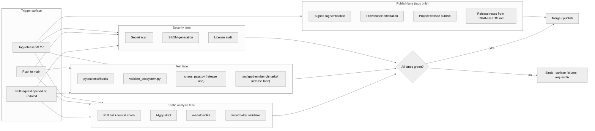

{/* SPDX-License-Identifier: MIT */}

**La carte structurelle du flux de travail build · validation · publication qui
contrôle chaque changement de l'écosystème d'Apothem.** Ce document installe la
surface de visualisation ; les fichiers de flux de travail GitHub Actions
concrets et l'outillage de release arrivent plus tard, sous l'installation de
préparation à la production.

## Forme du pipeline

## Rôles des couloirs

- **Couloir d'analyse statique** — retour rapide. Ruff couvre le style Python et
  un ensemble de règles soigneusement sélectionné ; mypy impose la discipline de
  typage en strict ; markdownlint régit la surface de documentation ; le
  validateur de frontmatter contrôle la conformité du schéma d'artefacts pour les
  règles, les skills, les travailleurs délégués et les commandes.
- **Couloir de tests** — `pytest tests/hooks` exerce le runtime des hooks contre
  la matrice complète d'événements ; `validate_ecosystem.py` est la principale
  porte structurelle pour la cohérence inter-artefacts ; `chaos_pass.py` et la
  suite de benchmarks par classe sous `src/apothem/benchmarks/` s'activent sur le
  couloir de release pour détecter la dégradation sous des entrées dégradées et
  les régressions du budget d'exécution.
- **Couloir de sécurité** — l'analyse de secrets repère les identifiants commités
  par accident ; la génération de SBOM et les audits de licence contrôlent la
  surface de chaîne d'approvisionnement pour toute installation de préparation à
  la production.
- **Couloir de publication** — ne s'exécute que sur les releases taguées. La
  vérification de tag signé confirme la provenance de la branche de release ; le
  site web du projet est publié depuis `site/dist/` vers la cible GitHub Pages ;
  les notes de release dérivent du format Keep-A-Changelog de `CHANGELOG.md`.

## Configuration concrète

Les fichiers de flux de travail réels (`.github/workflows/ci.yml`,
`.github/workflows/release.yml`, etc.) s'installent lors de la construction de
l'écosystème de préparation à la production. Ce diagramme définit la forme
canonique que toute configuration future reflète.

## Références croisées faisant autorité

- `pyproject.toml` — source de vérité de la configuration Ruff / mypy / pytest.
- `scripts/dev/validate_ecosystem.py` — la principale porte inter-artefacts.
- `scripts/dev/validate_hooks.py` — validation structurelle spécifique aux hooks.
- `scripts/dev/chaos_pass.py` — balayage adversarial de chaque hook configuré.
- `src/apothem/benchmarks/` — vérificateurs du budget d'exécution par classe.
- `site/content/docs/developer-guide.mdx` — le flux de travail du contributeur orienté opérateur.
- `CHANGELOG.md` — source des notes de release.
